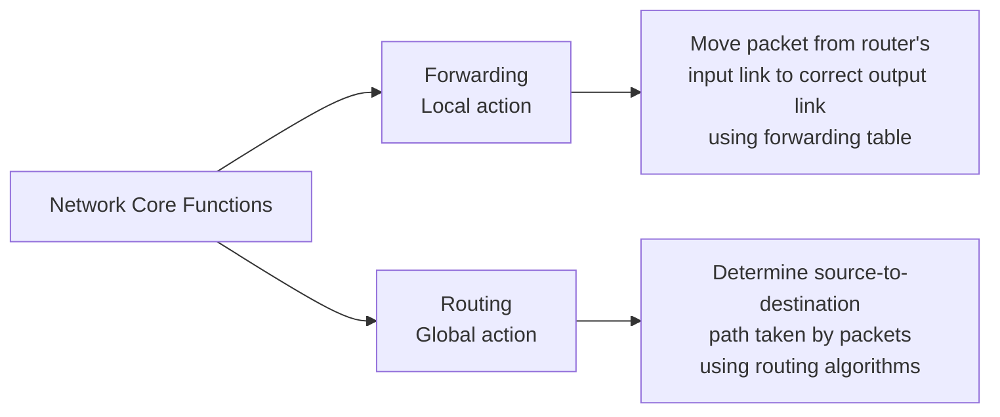
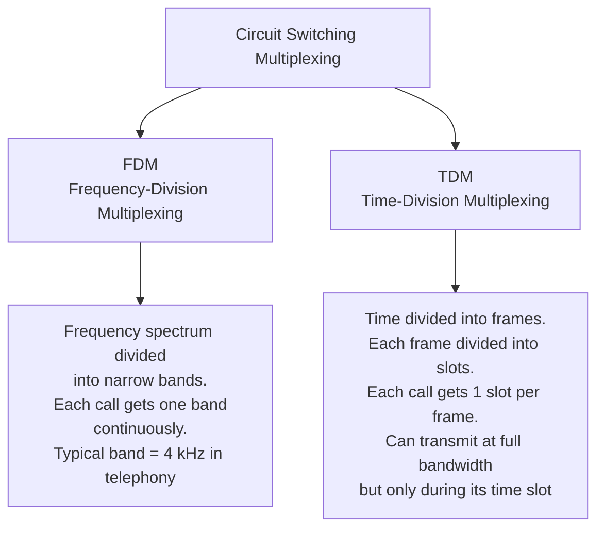
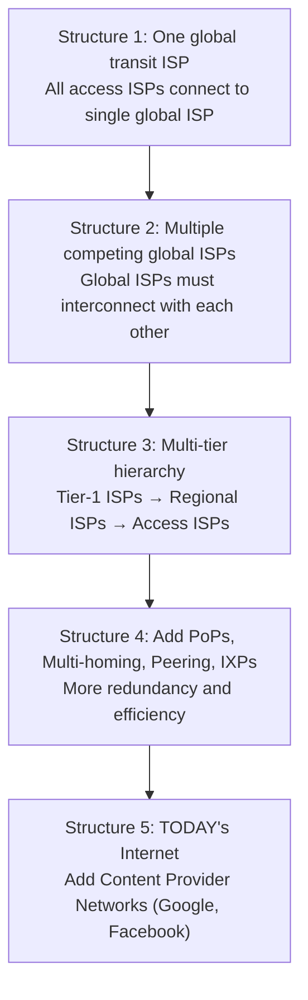
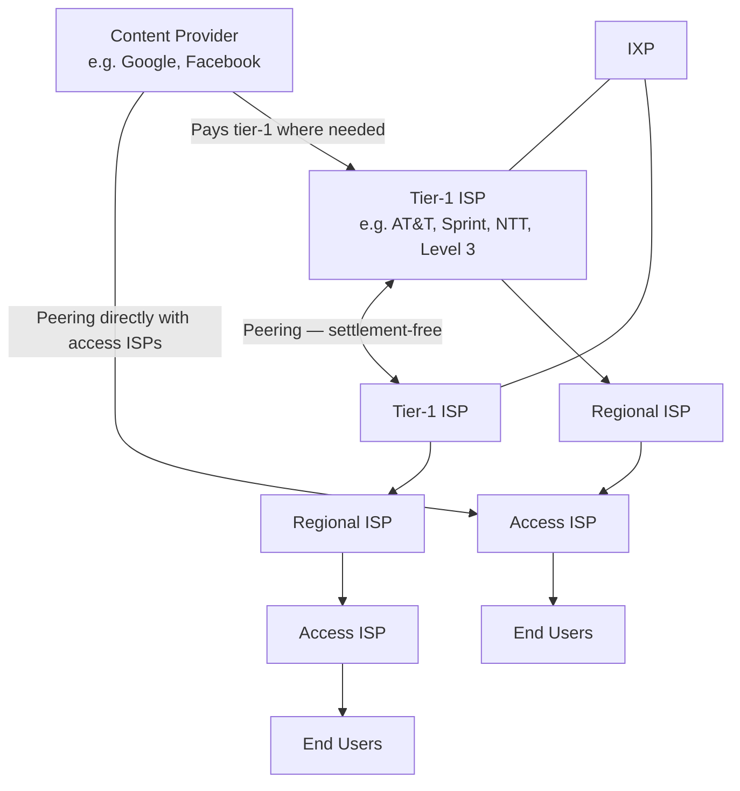
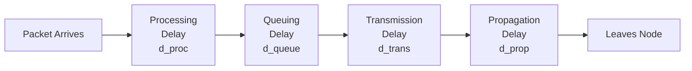
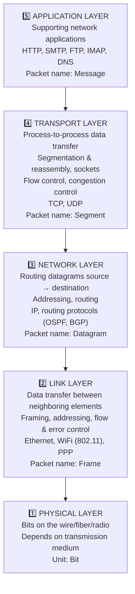
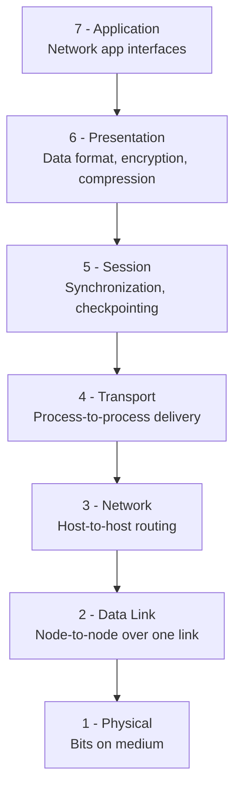
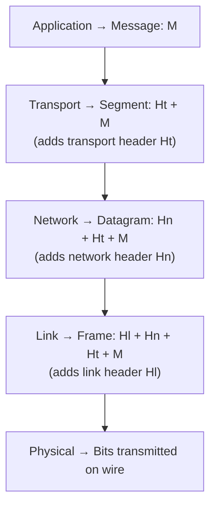
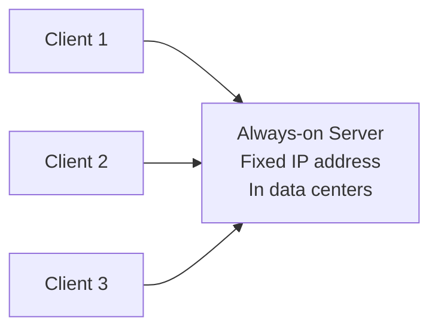
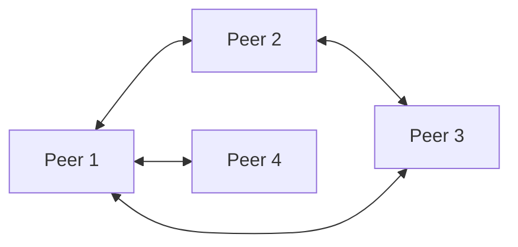

# 📡 Computer Networks — Complete Exam Notes
### Unit 1 | No Numericals | Everything from Syllabus + Slides

---

## 1. INTRODUCTION TO COMPUTER NETWORKS

**Definition:** Two or more devices connected together to communicate with each other, share data, or share resources.

**The Internet:** A massive network of networks — a computer network that interconnects **billions of computing devices** throughout the world.
- Traditional devices: PCs, workstations, servers
- Modern "Internet of Things" devices: laptops, TVs, gaming consoles, home appliances, watches, cars, traffic control systems
- All devices = **hosts** or **end systems**

---

## 2. WHAT IS THE INTERNET?

### Two Ways to Define It

**Way 1 — Nuts & Bolts (Hardware/Software):**
- Billions of connected devices (hosts/end systems)
- Connected via **communication links** (fiber, copper, radio, satellite) and **packet switches** (routers, link-layer switches)
- Governed by **protocols** (TCP, IP, HTTP, WiFi, 4G/5G, Ethernet…)
- Standards made by **IETF** → documents called **RFCs (Requests for Comments)**

**Way 2 — Services (Infrastructure):**
- A platform providing services to **distributed applications** (web, email, streaming, gaming, social media, e-commerce)
- Apps run on **end systems**, NOT on routers/switches in the network core
- Provides a **socket interface** — set of rules a sending program must follow to deliver data to a destination program

> **Protocol:** Defines the **format**, **order** of messages exchanged between network entities, and the **actions taken** on message transmission/receipt. All communication activity on the Internet is governed by protocols.

---

## 3. THE NETWORK EDGE

- **End systems** sit at the **edge** of the Internet
- They connect to the Internet via **Access Networks**

**Three parts of network structure:**
1. **Network Edge** — hosts (clients and servers); servers often in data centers
2. **Access Networks / Physical Media** — wired or wireless communication links connecting end systems to edge router
3. **Network Core** — interconnected routers; network of networks

---

## 4. ACCESS NETWORKS

**Key questions for any access network:**
- What is the transmission rate (bits per second)?
- Is it shared or dedicated among users?

### 4.1 Home Access Networks

**DSL (Digital Subscriber Line):**
- Uses existing **telephone line** to central office (CO)
- Data goes to Internet via DSLAM; voice goes to telephone network
- Three separate frequency channels using FDM:
  - Downstream (high-freq): 24–52 Mbps
  - Upstream (mid-freq): 3.5–16 Mbps
  - Telephone (0–4 kHz): standard voice
- **Asymmetric** — download faster than upload
- Dedicated line (not shared with neighbors)

**Cable Internet (HFC — Hybrid Fiber Coax):**
- Uses cable TV infrastructure (fiber + coaxial cable)
- Downstream: up to 40 Mbps–1.2 Gbps; Upstream: 30–100 Mbps
- **Shared broadcast medium** — all homes on a segment share bandwidth
- Uses **FDM** — different channels on different frequency bands
- Needs a distributed multiple access protocol (upstream is shared)

**FTTH (Fiber to the Home):**
- Optical fiber directly to home
- Speeds in Gbps range
- Uses PON (Passive Optical Network) or AON (Active Optical Network)

**Dial-up:** Uses phone line; 56 kbps — very slow, mostly obsolete

**Satellite:** Geostationary satellite; >1 Mbps but **280 ms end-to-end delay** — high latency

### 4.2 Enterprise Access Networks

**Ethernet:**
- Twisted-pair copper wire connects end systems to Ethernet switch
- 100 Mbps, 1 Gbps, 10 Gbps options
- Wired; used in companies and universities

**WiFi (Wireless LAN):**
- IEEE 802.11 standard
- End systems connect wirelessly to access point
- 11 Mbps (802.11b), 54 Mbps (802.11g), up to 450+ Mbps (802.11n)
- Shared medium; typically within or around building (~100 ft range)

### 4.3 Mobile/Wide-Area Wireless

**Cellular (3G/4G/5G):**
- Provided by mobile network operators
- Wide-area coverage (tens of km per base station)
- 4G: tens of Mbps; 5G: much faster

---

## 5. PHYSICAL MEDIA

**Guided Media** — signal travels along a solid medium (wire/fiber)
**Unguided Media** — signal propagates freely through atmosphere/space

| Medium | Type | Key Facts |
|--------|------|-----------|
| **Twisted-pair copper** | Guided | Two insulated copper wires; Cat5: 100 Mbps–1 Gbps; Cat6: 10 Gbps; cheapest and most common |
| **Coaxial cable** | Guided | Two concentric copper conductors; bidirectional; broadband (multiple channels); 100s Mbps per channel |
| **Fiber optic** | Guided | Glass fiber, carries light pulses; 10s–100s Gbps; immune to electromagnetic noise; low error rate; long distances |
| **Terrestrial radio** | Unguided | No wire; 3 types: short-range (<2m e.g. Bluetooth), local (WiFi, ~100m), wide-area (cellular, ~kms) |
| **Satellite radio** | Unguided | Geostationary (36,000 km, 280 ms delay) or LEO (lower orbit, less delay) |

---

## 6. THE NETWORK CORE

The **mesh of interconnected routers** connecting all end systems.

Two fundamental approaches to moving data through a network:

---

### 6.1 PACKET SWITCHING

**How it works:**
- Source breaks messages into **packets**
- Each packet travels **independently** through the network
- Routers use **store-and-forward**: entire packet must be received before it can be forwarded to the next link
- Each packet is transmitted at full link capacity

**Output buffer / Queue:**
- Each router has an output buffer (queue) for each outgoing link
- If link is busy → packet waits → **queuing delay**
- If buffer is completely full → arriving packet is **dropped** = **packet loss**

**Two Key Functions in Network Core:**



**Forwarding Table:**
- Every end system has an **IP address**
- Each router has a forwarding table mapping destination addresses → outbound links
- Routing protocols (e.g. shortest-path) automatically set these tables — not manually configured

---

### 6.2 CIRCUIT SWITCHING

**How it works:**
- Resources (bandwidth) **reserved** for the entire duration of communication between source and destination
- No sharing — dedicated resources, circuit-like (guaranteed) performance
- Circuit segment **idle if not used** by call (no sharing) — wasteful
- Used in **traditional telephone networks**
- Connection setup required before data transfer

**Two types of multiplexing in circuit switching:**



---

### 6.3 PACKET SWITCHING vs CIRCUIT SWITCHING

| Feature | Packet Switching | Circuit Switching |
|---------|-----------------|-------------------|
| Connection type | Connectionless | Connection-oriented |
| Resource reservation | None — on-demand | Reserved upfront |
| Delay type | Variable (queuing delay) | Constant (guaranteed) |
| Efficiency | High — bandwidth saved (dynamic sharing) | Low — bandwidth wasted (fixed allocation, idle circuits) |
| Data order | Out of order; assembled at destination | Message received in same order |
| Mechanism | Store & Forward, Network layer | FDM & TDM, Physical layer |
| Call setup | No | Yes — call setup delay |
| Congestion handling | Possible packet loss | Not applicable once circuit established |
| Designed for | Bursty data (Internet) | Continuous streams (voice calls) |
| Scalability | Supports many more users | Fixed, limited users |

**Why packet switching is more efficient:**
- 1 Gbps link; each user active 10% of time, uses 100 Mbps when active
- Circuit switching: only **10 users** supported
- Packet switching with 35 users: probability >10 active at once ≈ **0.0004** — nearly the same performance with 3.5× more users

**Is packet switching always better?**
- Great for bursty data — resource sharing, simpler, no call setup
- Problems: excessive congestion possible; packet delay and loss from buffer overflow
- Needs protocols for reliable data transfer and congestion control
- NOT ideal for real-time audio/video without bandwidth guarantees

---

### 6.4 INTERNET STRUCTURE: NETWORK OF NETWORKS

End systems connect to Internet via **Access ISPs**. Access ISPs must be interconnected so any two hosts can communicate.

**Evolution from simple to complex (Network Structure 1 → 5):**



**Final Internet Structure:**



**Key Terms:**

| Term | Definition |
|------|-----------|
| **Access ISP** | Connects end users (homes, companies, universities) to Internet |
| **Regional ISP** | Connects multiple access ISPs in a geographic region |
| **Tier-1 ISP** | National/international coverage; at the top — pays nobody; peers with other Tier-1s settlement-free. ~dozen worldwide (AT&T, Sprint, NTT, Level 3) |
| **PoP (Point of Presence)** | Group of one or more routers in provider's network where customer ISPs connect. Exists at all levels except access ISP level |
| **Multi-homing** | ISP connects to 2+ provider ISPs for redundancy — can survive one provider failure |
| **Peering** | Two ISPs at the same level of hierarchy connect their networks directly; traffic passes over direct connection; typically **settlement-free** (no payment) |
| **IXP (Internet Exchange Point)** | Physical location/building where multiple ISPs peer together; ~400+ worldwide |
| **Content Provider Networks** | e.g. Google runs its own private TCP/IP network spanning the globe; peers directly with lower-tier ISPs to bypass upper tiers and reduce costs; connects to Tier-1 where needed |

---

## 7. DELAY, LOSS & THROUGHPUT

---

### 7.1 FOUR TYPES OF NODAL DELAY

**Total nodal delay = d_proc + d_queue + d_trans + d_prop**



| Delay | Definition | Depends On | Formula | Typical Range |
|-------|-----------|------------|---------|---------------|
| **Processing (d_proc)** | Time to examine header, check for bit errors, determine outbound link | Router hardware speed | — | < 1 millisecond |
| **Queuing (d_queue)** | Time waiting in output buffer for link to become free | Number of packets ahead, traffic intensity | Varies | Microseconds to milliseconds |
| **Transmission (d_trans)** | Time to push ALL bits of packet onto the link | Packet length L, Link rate R | **L/R** | Microseconds to milliseconds |
| **Propagation (d_prop)** | Time for a bit to travel physically from one router to the next | Distance d, Propagation speed s | **d/s** | Milliseconds (wide-area) |

**Propagation speed (s):** approximately 2×10⁸ m/s (close to speed of light)

**Transmission vs Propagation — Critical Difference:**

| | Transmission Delay | Propagation Delay |
|--|-------------------|------------------|
| **Definition** | Time to push packet OUT of router onto the link | Time for bit to TRAVEL from one router to next |
| **Depends on** | Packet length (L) and link rate (R) | Distance between routers (d) |
| **Independent of** | Distance between routers | Packet length and link rate |
| **Formula** | d_trans = L/R | d_prop = d/s |

**Caravan Analogy:** Cars = bits; caravan = packet; tollbooth = router
- Time to push entire caravan through tollbooth = **transmission delay**
- Time for cars to drive between tollbooths = **propagation delay**

---

### 7.2 QUEUING DELAY & TRAFFIC INTENSITY

**Traffic Intensity = La/R**
- L = packet length (bits)
- a = average packet arrival rate (packets/sec)
- R = link transmission rate (bits/sec)

| Traffic Intensity (La/R) | Effect |
|--------------------------|--------|
| ≈ 0 | Near-zero queuing delay |
| < 1 (close to 0) | Small queuing delay |
| → 1 (approaching 1) | Delay grows rapidly and exponentially |
| > 1 | Bits arrive faster than they can leave → queue grows without bound → **infinite delay** → **packet loss** |

> **Golden Rule of Traffic Engineering:** Design your system so that traffic intensity is **no greater than 1**.

**Why queuing delay varies:** Unlike other delays, queuing delay varies from packet to packet — depends on congestion level at that instant. Characterized by average, variance, and probability of exceeding a value.

---

### 7.3 PACKET LOSS

- Real router buffers have **finite capacity** (limited memory)
- When queue/buffer is full → arriving packet is **dropped** (lost)
- **Lost packet may be:**
  - Retransmitted by the previous node
  - Retransmitted by the source end system (e.g., TCP handles this)
  - Not retransmitted at all
- Performance measured by: delay + **probability of packet loss**
- Fraction of lost packets increases as traffic intensity increases

---

### 7.4 END-TO-END DELAY

For N-1 routers between source and destination (N links), assuming no congestion:

**d_end-end = N × (d_proc + d_trans + d_prop)**

*(Each link contributes processing + transmission + propagation; queuing assumed negligible)*

---

### 7.5 TRACEROUTE

**What it is:** A program that measures end-to-end delay and discovers the network path from source to destination.

**How it works:**
- Source sends N special packets toward destination, marked 1 through N
- When the nth router receives the nth packet, it sends back a short message with its **name and IP address**
- Source records the **round-trip time** for each hop
- Repeats the experiment **3 times** per hop (3 probes per router)
- Output shows: router number, router name, router address, 3 RTT measurements
- `*` = no response (probe lost or router not replying)

---

### 7.6 THROUGHPUT

**Throughput** = rate (bits/sec) at which destination receives data

- **Instantaneous throughput** = rate at a given instant in time
- **Average throughput** = F/T (F = file size in bits, T = total transfer time)

**Bottleneck link** = the link on the end-to-end path that **constrains** end-to-end throughput — the link with the minimum transmission rate along the path

**Throughput = min{R1, R2, ..., Rn}** (minimum across all links on path)

**In today's Internet:**
- Core links are very fast (over-provisioned with high-speed links, little congestion)
- Bottleneck is almost always the **access network** (home/office connection)
- Exception: when many flows share a common core link, that link becomes the bottleneck
- Per-connection throughput with shared link: min(Rc, Rs, R/N) where N = number of connections sharing link R

---

## 8. PROTOCOL LAYERS

---

### 8.1 WHY LAYERING?

The Internet is enormously complex — hosts, routers, different link media, applications, protocols, hardware, software.

**Layering gives us structure:**
- **Explicit structure** allows identification and relationship of complex system's pieces
- **Modularity** — change one layer's implementation without affecting the rest of the system
  - As long as a layer provides the same service to the layer above and uses the same services from the layer below, the rest is unaffected
- Each layer provides service to the layer above by: (1) performing actions within that layer, and (2) using services of the layer directly below

**Potential drawbacks of layering:**
- One layer may duplicate lower-layer functionality (e.g., error recovery at multiple layers)
- Functionality at one layer may need information from another layer (violates separation)

---

### 8.2 INTERNET PROTOCOL STACK (TCP/IP) — 5 LAYERS



| Layer | Role | Protocols | Packet Name |
|-------|------|-----------|-------------|
| **Application** | Network applications exchange messages | HTTP, SMTP, FTP, DNS, IMAP | Message |
| **Transport** | Process-to-process delivery; segmentation; flow & error control | TCP, UDP | Segment |
| **Network** | Host-to-host routing; IP addressing | IP, OSPF, BGP | Datagram |
| **Link** | Node-to-node transfer over one single link | Ethernet, WiFi, PPP | Frame |
| **Physical** | Bit-by-bit transmission on the physical medium | Depends on wire/fiber/radio | Bits |

**Which layers are implemented in which devices:**

| Device | Layers Implemented | Can read IP? |
|--------|--------------------|-------------|
| **End hosts (PCs, phones)** | All 5 layers | Yes |
| **Routers** | Layers 1–3 (Physical, Link, Network) | Yes — runs IP |
| **Link-layer switches** | Layers 1–2 (Physical, Link) | No — only reads MAC addresses |

---

### 8.3 OSI REFERENCE MODEL — 7 LAYERS

Introduced in **late 1970s** by **ISO (International Organization for Standardization)**. Predates the Internet protocols.



**Two extra layers compared to TCP/IP:**

| OSI Layer | Function | Internet Equivalent |
|-----------|----------|---------------------|
| **Presentation (6)** | Allow applications to interpret meaning of data: data compression, encryption, machine-specific format conversion | **Not a separate layer — app developer handles this if needed** |
| **Session (5)** | Delimiting and synchronization of data exchange; checkpointing and recovery scheme | **Not a separate layer — app developer handles this if needed** |

**Internet stack "missing" these layers:**
- If these services are needed, it is up to the **application developer** to implement them
- Question of whether they are even needed is left to the application developer

---

### 8.4 TCP/IP vs OSI: GROUPED VIEW

| OSI Layers | TCP/IP Layers |
|-----------|--------------|
| Application (7) + Presentation (6) + Session (5) | Application |
| Transport (4) | Transport |
| Network (3) | Internet (Network) |
| Data Link (2) | Link |
| Physical (1) | Physical |

**OSI model groups:** Network support layers (Physical, Data Link, Network) + Heart (Transport) + User support layers (Session, Presentation, Application)

---

### 8.5 ENCAPSULATION

As data travels **down** the sending host's stack, each layer **adds its own header** (encapsulation). At the receiving end, each layer **strips its header** (de-encapsulation).



**At each layer:** packet has two types of fields:
- **Header fields** — added by that layer (contains control info)
- **Payload field** — packet from the layer above

**Analogy:** Memo (message) → interoffice envelope with Bob's name (segment) → postal envelope with postal address (datagram) → postal bag (frame)

**Link-layer switches implement only layers 1–2; routers implement layers 1–3.** This means routers can read IP addresses but switches can only read MAC addresses.

---

## 9. INTRODUCTION TO PHYSICAL LAYER NETWORK DEVICES

These devices operate at specific layers of the protocol stack:

---

### 9.1 REPEATER — Physical Layer (Layer 1)
- **Purpose:** Regenerates the signal to extend transmission distance before signal becomes too weak or corrupted
- **Works at:** Physical Layer
- **Process:** Signal Reception → Signal Amplification (strengthens weakened signal) → Signal Regeneration (reconstructs signal) → Signal Transmission

---

### 9.2 HUB — Physical Layer (Layer 1)
- **Purpose:** Basic device connecting multiple devices on a local network
- **Works at:** Physical Layer
- **Key features:**
  - **Always broadcasts** data to ALL connected devices regardless of intended recipient
  - **Half-duplex** — only one device can transmit at a time
  - **Cannot store MAC addresses** — no intelligence
  - **No data filtering** — sends all data to all devices
  - Creates a **single collision domain**
  - **Shared bandwidth** among all devices

---

### 9.3 MODEM — Physical Layer (Layer 1)
- **Purpose:** Connects a computer to the Internet by converting between digital and analog signals
- **Works at:** Physical Layer
- **Process:**
  - **Modulation:** Converts digital data → analog signal for transmission
  - **Transmission:** Sends analog signal over communication line
  - **Demodulation:** Receiving modem converts analog signal → digital data
  - **Decoding:** Digital data sent to computer

---

### 9.4 BRIDGE — Data Link Layer (Layer 2)
- **Purpose:** Joins two or more network segments; routes data between them according to **MAC addresses**
- **Works at:** Data Link Layer (2-port device)
- **Functions:**
  - **Segmentation:** Divides large network into smaller segments to reduce congestion
  - **Filtering:** Uses MAC addresses to selectively forward packets
  - **Learning:** Tracks MAC addresses and port mappings
  - **Forwarding:** Directs packets between segments

---

### 9.5 SWITCH — Data Link Layer (Layer 2)
- **Purpose:** Intelligent multiport bridge; uses MAC addresses to forward data to the correct destination port only
- **Works at:** Data Link Layer
- **Key features:**
  - Uses packet switching to receive and route data
  - Can perform error checking before forwarding
  - Operates in **full-duplex** mode (simultaneous send and receive)
  - **Stores MAC addresses** of connected devices
  - Creates **multiple collision domains** (one per port)
  - **Dedicated bandwidth** per device
  - Reduces collisions, eliminates unnecessary broadcasts
  - More intelligent, suitable for **larger networks**

---

### 9.6 NIC (Network Interface Card) — Data Link Layer (Layer 2)
- **Purpose:** Physical card/chip with MAC address; identifies the device on the network
- **Used at:** Data Link Layer
- **Functions:** Connectivity (links device to network), Data Transmission, Data Conversion, Error Handling, Traffic Management, Security (encryption/authentication)

---

### 9.7 ROUTER — Network Layer (Layer 3)
- **Purpose:** Routes/forwards packets based on **IP addresses**; has a dynamically updating routing table
- **Works at:** Network Layer
- **Functions:**
  - **Forwarding:** Receives packets, checks IP headers, forwards to appropriate output port
  - **Routing:** Determines best path using routing table built with routing algorithms
  - **NAT (Network Address Translation):** Translates between private and public IP addresses, enabling devices on a private network to access the Internet
- Creates **separate broadcast domains**
- Used to connect LANs to the Internet or other LANs

---

### 9.8 GATEWAY — Can operate at ANY layer
- **Purpose:** Connects two networks with **different configurations/protocols**
- Acts as a **protocol converter** — allows applications using different protocols to share data
- **Types:**
  - **Unidirectional Gateway:** Data flows only one direction (source → destination)
  - **Bidirectional Gateway:** Data flows both directions (used for synchronization)

---

### 9.9 FIREWALL — Transport or Application Layer
- **Purpose:** Network security device that monitors incoming and outgoing traffic; allows or blocks traffic based on defined security rules
- Can be used at **Transport Layer or Application Layer**

---

### 9.10 DEVICE COMPARISON TABLES

**Hub vs Switch:**

| Feature | Hub | Switch |
|---------|-----|--------|
| Layer | Physical (Layer 1) | Data Link (Layer 2) |
| Data handling | Broadcasts to ALL devices | Forwards only to intended device (using MAC) |
| Collision domain | Single | Multiple (one per port) |
| Bandwidth | Shared | Dedicated per device |
| Intelligence | None | Stores MAC addresses, makes decisions |
| Data filtering | None | Filters by MAC address |
| Usage | Small networks | Larger, more complex networks |
| Performance | Lower (collisions) | Higher (reduced collisions) |

**Switch vs Router:**

| Feature | Switch | Router |
|---------|--------|--------|
| Definition | Connects devices within same network | Connects multiple networks |
| Data transmission | Uses MAC addresses | Uses IP addresses |
| Layer | Data Link (2) | Network (3) |
| Broadcast domain | Operates within single broadcast domain | Breaks up broadcast domains |
| Usage | Expand LAN capacity | Connect LAN to Internet or other LANs |
| Speed | High-speed within network | Slower (complex routing) |

---

## 10. APPLICATION LAYER PRINCIPLES

---

### 10.1 NETWORK APPLICATION ARCHITECTURES

Two main paradigms:

#### Client-Server Architecture



**Server characteristics:**
- Always-on host
- Permanent/fixed IP address
- Often in data centers for scaling (Google: 50–100 data centers, each up to 100,000+ servers)

**Client characteristics:**
- Contacts and communicates with server
- May be intermittently connected
- May have dynamic IP address
- Do **NOT** communicate directly with each other

**Examples:** HTTP (Web), IMAP (email), FTP, Telnet

#### Peer-to-Peer (P2P) Architecture



**Characteristics:**
- No always-on server
- Arbitrary end systems communicate directly
- Each peer requests service from AND provides service to other peers
- **Self-scalable** — new peers bring new service capacity AND new service demand
- Peers are intermittently connected and change IP addresses → complex management
- Cost-effective (no dedicated server infrastructure)
- Challenges: security, performance, reliability

**Examples:** BitTorrent (file sharing), P2P file sharing, Skype (originally)

**Hybrid architectures:** Some apps combine both (e.g., instant messaging — server tracks IP addresses of users, but user-to-user messages go peer-to-peer)

---

### 10.2 PROCESSES COMMUNICATING

**Process:** A program running within an end system (host)

- Processes on **same host** communicate using inter-process communication (defined by the OS)
- Processes on **different hosts** communicate by exchanging **messages** across the network

**Client vs Server Process:**
- **Client process:** The process that **initiates** the communication (contacts the other process first)
- **Server process:** The process that **waits to be contacted** to begin the session

Note: In P2P, a process can be both client and server — it depends on who initiates in a given session.

---

### 10.3 SOCKETS

**Socket:** The interface (door) between the application layer and the transport layer within a host

- Process sends/receives messages to/from its socket
- Analogy: process = house; socket = door. Sending process shoves message out the door; transport infrastructure delivers it to the door of the destination
- Also called the **API (Application Programming Interface)** between the application and the network

**Two sockets involved** in any communication — one on each side (sender and receiver)

**Control division:**
- Application developer controls the **application-layer side** of the socket
- The **transport-layer side** is controlled by the OS; developer only chooses: (1) transport protocol, (2) possibly buffer sizes and segment sizes

---

### 10.4 ADDRESSING PROCESSES

To send data to a specific process on a specific host, need **two pieces of information:**

1. **IP address** — identifies the host (32-bit number; uniquely identifies the host)
2. **Port number** — identifies the specific process/application on that host
   - IP address alone is NOT sufficient — many processes can be running on the same host

**Well-known port numbers:**
- Web server (HTTP): **port 80**
- Mail server (SMTP): **port 25**
- Example: to send HTTP message to `gaia.cs.umass.edu` → IP: 128.119.245.12, Port: 80

---

### 10.5 WHAT TRANSPORT SERVICES DO APPS NEED?

Applications need transport services across **4 dimensions:**

| Dimension | Description | Examples |
|-----------|-------------|---------|
| **Reliable Data Transfer** | Guarantee all data arrives correctly and completely | File transfer, email, web, banking — no loss tolerated |
| **Throughput** | Guarantee minimum bandwidth (bits/sec) delivery rate | Multimedia apps need minimum rate to be effective |
| **Timing** | Guarantee data arrives within a time limit (e.g. 100ms) | Internet telephony, interactive games, video conferencing |
| **Security** | Encryption, data integrity, end-point authentication | Any sensitive communication |

**App categories by requirement:**

| Category | Description | Examples |
|----------|-------------|---------|
| **Loss-tolerant apps** | Can handle some lost data | Audio/video streaming — small glitch acceptable |
| **Bandwidth-sensitive apps** | Require minimum throughput to function | Internet telephony (needs 32 kbps minimum) |
| **Elastic apps** | Use whatever throughput is available | Email, file transfer, web documents |
| **Time-sensitive apps** | Require low delay to be effective | VoIP, interactive games, video conferencing |

**Transport service requirements for common apps:**

| Application | Data Loss | Throughput | Time Sensitive? |
|-------------|-----------|-----------|-----------------|
| File transfer/download | No loss | Elastic | No |
| Email | No loss | Elastic | No |
| Web documents | No loss | Elastic | No |
| Real-time audio/video | Loss-tolerant | Audio: 5Kbps–1Mbps; Video: 10Kbps–5Mbps | Yes (10s msec) |
| Streaming audio/video | Loss-tolerant | Same as above | Yes (few secs) |
| Interactive games | Loss-tolerant | Kbps+ | Yes (10s msec) |
| Text messaging | No loss | Elastic | Yes and no |

---

### 10.6 TCP vs UDP

**Internet provides two transport protocols: TCP and UDP**

#### TCP (Transmission Control Protocol)

| Feature | Detail |
|---------|--------|
| **Connection-oriented** | Handshaking (3-way handshake) required before data flows |
| **Reliable data transfer** | All data delivered in order, without errors, no missing bytes |
| **Flow control** | Sender won't overwhelm receiver (speed matching) |
| **Congestion control** | Throttles sender when network is congested; limits each connection to fair share of bandwidth |
| **Full-duplex** | Both sides can send simultaneously |
| **Does NOT provide** | Timing guarantees, minimum throughput guarantees, security |

#### UDP (User Datagram Protocol)

| Feature | Detail |
|---------|--------|
| **Connectionless** | No handshaking — no setup required |
| **Unreliable data transfer** | No guarantee of delivery, ordering, or error-free |
| **No flow control** | Sender can transmit at any rate |
| **No congestion control** | Can flood the network; does not throttle |
| **Lightweight** | Minimal overhead, faster |
| **Does NOT provide** | Reliability, flow control, congestion control, timing, throughput guarantee, security, connection setup |

**Neither TCP nor UDP provides:** timing guarantees or throughput guarantees.

**Which protocol for which app:**

| Application | Protocol | Transport |
|-------------|----------|-----------|
| File transfer (FTP) | FTP | TCP |
| Email (SMTP) | SMTP | TCP |
| Web browsing | HTTP 1.1 | TCP |
| Internet telephony | SIP, RTP, or proprietary | TCP or **UDP** |
| Streaming audio/video | DASH | TCP |
| Interactive games | WOW, FPS (proprietary) | UDP or TCP |
| DNS | DNS | **UDP** |

**Why VoIP prefers UDP:**
- Can tolerate some packet loss (small audio glitch)
- Cannot tolerate delay (congestion control causes unacceptable delays)
- TCP's retransmission and congestion control make it unsuitable for real-time audio
- Fallback: if firewalls block UDP → uses TCP as backup

---

### 10.7 APPLICATION-LAYER PROTOCOLS

**An application-layer protocol defines:**
- **Types of messages** exchanged (e.g., request messages and response messages)
- **Syntax** of messages — what fields exist and how fields are delineated
- **Semantics** — the meaning of information in each field
- **Rules** for when and how processes send messages and respond

**Public protocols:** Defined in RFCs — anyone can access. Allows interoperability. Examples: HTTP (RFC 2616/7320), SMTP (RFC 5321)

**Proprietary protocols:** Not publicly available. Example: Skype (original)

> **Important distinction:** A **network application** ≠ an **application-layer protocol**. The protocol is just one component of the application. Example: The Web = HTML + browsers + web servers + HTTP (protocol)

---

## 11. THE WEB AND HTTP

---

### 11.1 HTTP BASICS

- **HTTP** = HyperText Transfer Protocol — the Web's application-layer protocol
- Defined in RFC 1945 and RFC 2616
- Uses **TCP** as transport protocol (port 80)
- **Stateless** — server maintains NO information about past client requests
  - Makes server design simpler and enables high-performance servers
  - Cookies are used to add state on top of stateless HTTP

**Web page** = base HTML file + referenced objects (images, applets, audio, etc.)
- Each object addressable by a **URL**
- **URL** = hostname + path name
  - e.g. `www.someSchool.edu/someDept/pic.gif` → hostname: `www.someSchool.edu`, path: `/someDept/pic.gif`

---

### 11.2 NON-PERSISTENT vs PERSISTENT CONNECTIONS

#### Non-Persistent HTTP

**Steps:**
1. Client initiates TCP connection to server (port 80)
2. Server accepts TCP connection
3. Client sends HTTP request message into TCP socket
4. Server receives request, sends HTTP response with requested object, closes TCP connection
5. Client receives response, TCP connection terminates
6. Steps 1–5 repeated for **each** referenced object

**Key characteristic:** Each TCP connection carries exactly **one request/response pair**

**Response time per object = 2 RTTs + file transmission time**
- 1 RTT for TCP connection setup (SYN + SYN-ACK)
- 1 RTT for HTTP request and first bytes of response
- File transmission time

**Problems with non-persistent:**
- 2 RTTs per object → high delay for pages with many objects
- OS overhead for each TCP connection (buffers and variables allocated)
- Solution: browsers often open 5–10 **parallel** TCP connections

#### Persistent HTTP (HTTP/1.1 — Default)

- Server leaves TCP connection **open** after sending response
- Multiple objects can be sent over a **single** TCP connection
- Client sends requests as soon as it encounters a referenced object (**pipelining**)
- As little as **1 RTT for all referenced objects** (after initial connection)
- **HTTP/2:** Multiple requests and replies interleaved in same connection; mechanism for prioritizing requests

**RTT (Round-Trip Time):** Time for a small packet to travel from client to server and back (includes propagation delays, queuing delays, processing delays)

---

### 11.3 HTTP MESSAGE FORMAT

#### HTTP Request Message

```
GET /index.html HTTP/1.1\r\n         ← Request line: method + URL + version
Host: www-net.cs.umass.edu\r\n       ← Header line
User-Agent: Firefox/3.6.10\r\n       ← Header line
Accept: text/html,...\r\n            ← Header line
Connection: keep-alive\r\n           ← Header line
\r\n                                 ← Blank line (marks end of headers)
[entity body — empty for GET]
```

**HTTP Methods:**

| Method | Purpose |
|--------|---------|
| **GET** | Request an object (most common); entity body empty; data can be included in URL after '?' |
| **POST** | Submit form data — user input sent in entity body |
| **HEAD** | Like GET but server returns only headers, not the object (used for debugging) |
| **PUT** | Upload a new file (object) to server at specified URL |
| **DELETE** | Delete an object on the server |

#### HTTP Response Message

```
HTTP/1.1 200 OK\r\n                  ← Status line: version + code + phrase
Date: Sun, 26 Sep 2010...\r\n        ← Header line
Server: Apache/2.0.52\r\n            ← Header line
Last-Modified: Tue, 30 Oct...\r\n    ← Header line
Content-Length: 2652\r\n             ← Header line
Content-Type: text/html\r\n          ← Header line
\r\n                                 ← Blank line
data data data data data...          ← Entity body (the actual object)
```

**Common HTTP Status Codes:**

| Code | Phrase | Meaning |
|------|--------|---------|
| **200** | OK | Request succeeded; object included in response |
| **301** | Moved Permanently | Object moved; new URL specified in Location header |
| **400** | Bad Request | Request message not understood by server |
| **404** | Not Found | Requested document not found on server |
| **505** | HTTP Version Not Supported | Server doesn't support that HTTP version |

---

### 11.4 HTTP vs HTTPS

| Feature | HTTP | HTTPS |
|---------|------|-------|
| Encryption | No | Yes — all communications encrypted |
| Port | 80 | 443 |
| Security | Unencrypted — data visible on wire | Encrypted with TLS/SSL |
| Certificate | Not required | Requires SSL certificate from CA |
| Full form | HyperText Transfer Protocol | HTTP Secure (HTTP + TLS/SSL) |

**HTTPS = HTTP + TLS (Transport Layer Security) / SSL (Secure Sockets Layer)**
- 'S' = Secure
- Encrypts HTTP requests and responses bidirectionally
- Attackers cannot read data crossing the wire
- Ensures you are talking to the server you intend to talk to

**How SSL works:**
1. Browser requests HTTPS page
2. Server sends its **public key** with SSL certificate (digitally signed by a trusted third-party CA)
3. Browser verifies the certificate (shown as green padlock)
4. Browser creates a **symmetric key** (shared secret), encrypts it using server's public key, sends it
5. Server decrypts using its **private key** → both sides now have the shared symmetric key
6. All further communication encrypted using the **symmetric key**

**Key cryptography concepts:**
- **Asymmetric key algorithm** — used to verify identity and establish trust (public/private key pair)
- **Symmetric key algorithm** — used to encrypt/decrypt the actual data after connection is established (faster)
- Public key = for encryption; Private key = for decryption
- SSL certificate issued by a third-party CA (Certificate Authority)

**Benefits of HTTPS:**
- Improved security (encryption prevents eavesdropping)
- Data integrity (can't be modified in transit)
- Authentication (you know you're talking to the right server)
- Better Google search ranking
- Builds customer trust

---

### 11.5 COOKIES

**Problem:** HTTP is stateless, but websites often need to identify and track users.

**Solution:** Cookies

**4 Components of Cookie Technology:**
1. `Set-cookie:` header line in the **HTTP response message** (server → client)
2. `Cookie:` header line in subsequent **HTTP request messages** (client → server)
3. **Cookie file** stored on the user's host, managed by the browser
4. **Back-end database** at the web site

**How cookies work (example — Susan visits Amazon):**
1. Susan visits Amazon for the first time → Amazon creates unique ID (cookie 1678) and entry in its database
2. Amazon's HTTP response includes: `Set-cookie: 1678`
3. Susan's browser stores cookie 1678 for Amazon in her cookie file
4. Every subsequent request to Amazon includes: `Cookie: 1678`
5. Amazon uses this to identify Susan, track her activity, personalize her experience

**Uses of cookies:**
- Track user's browsing history
- Remembering login details
- Shopping carts
- Recommendations
- Track visitor count
- Save coupon codes

**Privacy concern:**
- Third-party persistent (tracking) cookies allow the same cookie value to be tracked across **multiple websites**
- Cookies permit sites to learn a lot about you
- Sites can sell this data to third parties

---

### 11.6 WEB CACHING (PROXY SERVERS)

**Goal:** Satisfy client HTTP requests **without involving the origin server**

**What it is:** A network entity with its own disk storage that stores copies of recently requested objects

**How it works:**
1. User configures browser to point to a Web cache
2. Browser sends all HTTP requests to the cache
3. If object **in cache** (cache hit) → cache returns object to client immediately
4. If object **not in cache** (cache miss) → cache requests from origin server, stores a copy, returns to client

**Cache is both client and server simultaneously:**
- Acts as **server** to the requesting browser
- Acts as **client** to the origin server

**Why use web caching:**
1. **Reduces response time** — cache is closer to client (especially useful if bottleneck is between client and origin server)
2. **Reduces traffic on access link** — institution doesn't need to upgrade bandwidth as quickly
3. **Enables poor content providers** to more effectively deliver content
4. **Privacy** — can surf the Internet anonymously through a proxy
5. Activity logging

**Typical cache hit rate:** 0.2 to 0.7 (20%–70% of requests served from cache)

**Traffic intensity example with caching:**
- Access link: 1.54 Mbps; request rate: 15/sec; object size: 100K bits → utilization = 0.97 → massive delays
- With cache (hit rate 0.4):
  - Only 60% of requests go through access link
  - Utilization drops from 0.97 to 0.58 → acceptable delay
  - Average delay ≈ 0.6 × 2.01s + 0.4 × ~milliseconds ≈ **1.2 seconds**
- This is better than upgrading to a 154 Mbps access link AND cheaper

---

### 11.7 CONDITIONAL GET

**Problem:** Cached objects may be **stale** (outdated) — the origin server may have updated the object since it was cached.

**Solution:** Conditional GET

**How it works:**
- Cache sends request with `If-Modified-Since: <date>` header
- `<date>` = the Last-Modified date stored when the object was first cached

**Two outcomes:**
1. **Object NOT modified:** Server replies `HTTP/1.0 304 Not Modified` with **empty body** → cache serves its stored copy to the client (no bandwidth wasted)
2. **Object IS modified:** Server replies `HTTP/1.0 200 OK` + **new object** in body → cache updates its stored copy

**Benefits:**
- No object retransmission if unchanged → saves bandwidth
- Reduces link utilization
- Reduces user-perceived response time

---

## QUICK REFERENCE: KEY FORMULAS

| Formula | What it calculates |
|---------|-------------------|
| **d_trans = L/R** | Transmission delay (L = bits, R = bps) |
| **d_prop = d/s** | Propagation delay (d = distance, s ≈ 2×10⁸ m/s) |
| **d_nodal = d_proc + d_queue + d_trans + d_prop** | Total nodal delay at a router |
| **d_end-end = N(d_proc + d_trans + d_prop)** | End-to-end delay over N links (no congestion) |
| **Traffic Intensity = La/R** | Queue load (keep ≤ 1) |
| **Throughput = min{R1, R2, ..., Rn}** | End-to-end throughput — bottleneck link |
| **Non-persistent HTTP = 2RTT + transmission time** | Time to get one object |

---

## QUICK REFERENCE: KEY TERMS GLOSSARY

| Term | One-line definition |
|------|---------------------|
| Host / End System | Any device at the edge of the Internet running network apps |
| Packet | Chunk of data with headers, sent independently through the network |
| Router | Network Layer device that forwards packets based on IP addresses |
| Link-layer switch | Data Link Layer device that forwards frames based on MAC addresses |
| ISP | Internet Service Provider |
| Protocol | Rules defining message format, order, and actions taken |
| RFC | Request for Comments — Internet standards documents by IETF |
| IP address | 32-bit number uniquely identifying a host |
| Port number | Identifies a specific process/application on a host |
| Socket | Interface (door) between application and transport layer |
| Packet loss | Packet dropped because buffer/queue is full |
| Throughput | Actual data delivery rate (bits/sec) at destination |
| Bottleneck link | Slowest link on path — determines throughput |
| RTT | Round-trip time — small packet from client to server and back |
| Encapsulation | Adding headers as data passes down the protocol stack |
| FDM | Frequency-Division Multiplexing — divide frequency spectrum into bands |
| TDM | Time-Division Multiplexing — divide time into slots per connection |
| PoP | Point of Presence — routers where customer ISPs connect to provider |
| IXP | Internet Exchange Point — where multiple ISPs peer |
| Multi-homing | ISP connects to 2+ providers for redundancy |
| Peering | Two ISPs connect directly at same level; no payment exchanged |
| Content Provider Network | Private network by Google/Facebook to serve content closer to users |
| SSL/TLS | Security layer (application layer enhancement) adding encryption to TCP |
| HTTPS | HTTP + TLS; all traffic encrypted; port 443 |
| Cache hit rate | Fraction of requests satisfied by the cache |
| Conditional GET | HTTP mechanism using If-Modified-Since to check if cached object is stale |
| Cookie | Piece of data stored on user's computer to add state to stateless HTTP |
| Stateless protocol | Server remembers nothing about past client requests (e.g., HTTP) |
| Store-and-forward | Router receives entire packet before forwarding to next link |
| Traffic intensity | La/R — ratio of arrival rate to service rate; keep ≤ 1 |

---

## EXAM TIPS: STRUCTURE FOR LONG ANSWERS

For any "Explain X" or "Describe X" question, use:
1. **Define** — 1–2 sentences
2. **How it works** — step-by-step process
3. **Key characteristics** — 3–4 bullet points
4. **Diagram or analogy** — if applicable
5. **Comparison with alternative** — e.g., circuit vs packet, HTTP vs HTTPS
6. **Advantages and disadvantages**

**Topics most likely to be asked as long answers:**
- Packet switching vs Circuit switching (with FDM/TDM explanation)
- All 4 types of delay with formulas
- Protocol layers: TCP/IP stack vs OSI model
- Encapsulation with diagram
- Client-server vs P2P architecture
- TCP vs UDP
- HTTP: persistent vs non-persistent, cookies, caching, conditional GET
- HTTPS and how SSL works
- Network of Networks / ISP hierarchy
- Hub vs Switch vs Router comparison

---

### Booth 1 (Service starts at 0 s, each car 5 s)

| Time (s) | Event |
|----------|-------|
| 0 | Car 1 **starts** service at Booth 1 |
| 5 | Car 1 **leaves** Booth 1, Car 2 starts |
| 10 | Car 2 leaves, Car 3 starts |
| 15 | Car 3 leaves, Car 4 starts |
| 20 | Car 4 leaves, Car 5 starts |
| 25 | Car 5 leaves, Car 6 starts |
| 30 | Car 6 leaves, Car 7 starts |
| 35 | Car 7 leaves, Car 8 starts |
| 40 | Car 8 leaves, Car 9 starts |
| 45 | Car 9 leaves, Car 10 starts |
| 50 | Car 10 **leaves** Booth 1 → **Booth 1 done** |

---

### Travel (each car takes 25 s after leaving)

| Car | Leaves Booth 1 | Arrives at Booth 2 |
|-----|----------------|---------------------|
| 1 | 5 | **30** |
| 2 | 10 | **35** |
| 3 | 15 | **40** |
| 4 | 20 | **45** |
| 5 | 25 | **50** |
| 6 | 30 | **55** |
| 7 | 35 | **60** |
| 8 | 40 | **65** |
| 9 | 45 | **70** |
| 10 | 50 | **75** |

All cars wait at Booth 2 until **Car 10 arrives at 75 s**.

---

### Booth 2 (Service starts at 75 s, each car 5 s)

| Time (s) | Event |
|----------|-------|
| 75 | Car 1 **starts** service at Booth 2 |
| 80 | Car 1 leaves, Car 2 starts |
| 85 | Car 2 leaves, Car 3 starts |
| 90 | Car 3 leaves, Car 4 starts |
| 95 | Car 4 leaves, Car 5 starts |
| 100 | Car 5 leaves, Car 6 starts |
| 105 | Car 6 leaves, Car 7 starts |
| 110 | Car 7 leaves, Car 8 starts |
| 115 | Car 8 leaves, Car 9 starts |
| 120 | Car 9 leaves, Car 10 starts |
| 125 | Car 10 **leaves** Booth 2 → **All done** |

---

### Summary of total time
- Start: **0 s**
- End: **125 s**
- Total time: **125 seconds**

---
