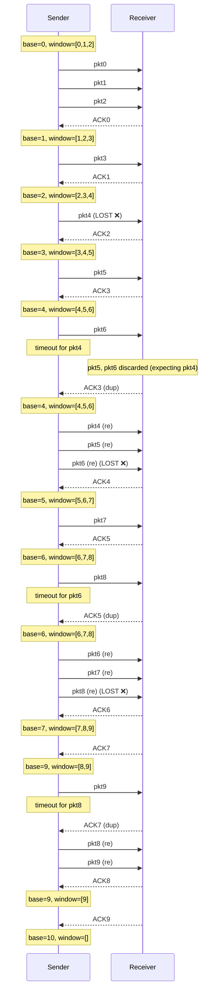
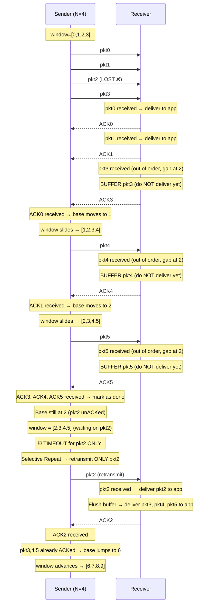
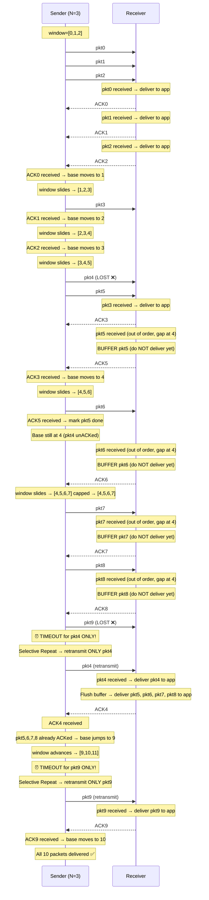
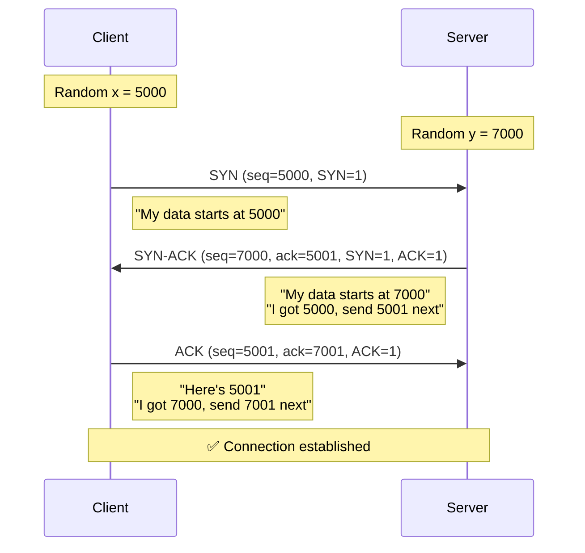
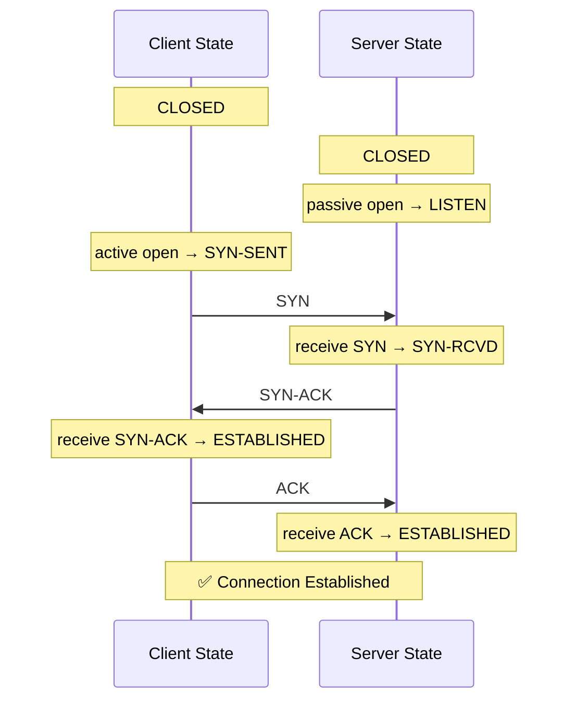
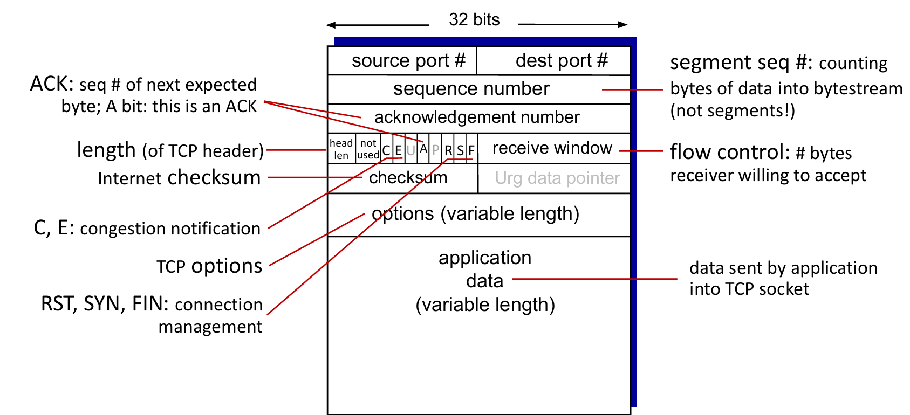

# COMPREHENSIVE NETWORKING STUDY NOTES
## Transport Layer & Network Layer Deep Dive

---

# TABLE OF CONTENTS

1. **Reliable Data Transfer Protocols**
   - Go-Back-N (GBN) Protocol
   - Selective Repeat (SR) Protocol
   
2. **Transport Layer - TCP**
   - TCP Connection & Three-Way Handshake
   - TCP Segment Structure
   - Flow Control
   - TCP Connection Management
   - TCP Congestion Control (Tahoe & Reno)
   
3. **Network Layer**
   - Forwarding vs Routing
   - Router Architecture
   - Software Defined Networking (SDN)
   
4. **Internet Protocol (IPv4)**
   - Datagram Format
   - Fragmentation
   - Addressing
   - NAT (Network Address Translation)

---

# PART 1: RELIABLE DATA TRANSFER PROTOCOLS

## 1.1 GO-BACK-N (GBN) PROTOCOL

### What is Go-Back-N?

Go-Back-N is a **sliding window protocol** used for reliable data transfer. The key idea is that the sender can have multiple packets "in flight" (transmitted but not yet acknowledged), but if any packet is lost, the sender must retransmit that packet AND ALL subsequent packets, even if they were received correctly.

### Mental Picture - The Sender Side

Imagine you're sending a series of numbered packages (packets 0, 1, 2, 3, 4, 5, 6, 7, 8...).

**The Window Concept:**
- You have a "window" of size N (let's say N=4)
- This window shows which packets you can send without waiting for acknowledgments
- The window is defined by two pointers:
  - `base`: The oldest unacknowledged packet
  - `nextseqnum`: The next packet to be sent

**Example with N=4:**
```
Packets:  0  1  2  3  4  5  6  7  8
Window:  [0  1  2  3] 4  5  6  7  8
         ^base      ^nextseqnum
```

**How the Window Moves:**
1. Initially: base=0, you can send packets 0, 1, 2, 3
2. You send all 4 packets
3. When you receive ACK(0), the window slides forward:
   ```
   Packets:  0  1  2  3  4  5  6  7  8
   Window:      [1  2  3  4] 5  6  7  8
   ```
4. Now you can send packet 4

### Key GBN Sender Rules:

1. **Sending Data:**
   - If `nextseqnum < base + N`, you can send the next packet
   - Send the packet and increment `nextseqnum`
   - If this is the first packet in the window, start a timer

2. **Receiving ACKs:**
   - GBN uses **cumulative acknowledgments**
   - ACK(n) means: "I've received all packets up to and including n"
   - When you receive ACK(n), set `base = n+1` and slide the window forward
   - Restart the timer for the new base packet

3. **Timeout:**
   - If the timer expires for the oldest unacknowledged packet
   - **Retransmit ALL packets in the current window** (from base to nextseqnum-1)
   - This is why it's called "Go-Back-N" - you go back and resend N packets

### Mental Picture - The Receiver Side

The receiver is MUCH simpler in GBN. Think of it as very strict about order.

**Receiver State:**
- Only tracks one variable: `rcv_base` (the next expected packet)

**Receiver Rules:**

1. **Packet arrives in order** (sequence number = rcv_base):
   - Deliver packet to upper layer
   - Send ACK(rcv_base)
   - Increment rcv_base

2. **Packet arrives out of order** (sequence number ≠ rcv_base):
   - **DISCARD the packet** (or optionally buffer it, implementation choice)
   - Re-send ACK for the last in-order packet received
   - Do NOT update rcv_base

**Why discard?** Because the sender will retransmit everything from the missing packet onwards anyway!

### GBN Numerical Problem - "Every 5th Packet Lost"

**Problem:** In GB3 (window size N=3), if every 5th transmitted packet is lost, how many transmissions are needed to successfully send 10 packets?

**Step-by-Step Solution:**



**Total transmissions = 18**

The key insight: Every time a packet is lost, you waste bandwidth retransmitting packets that were already received correctly.

### GBN - Critical Understanding Points

**Q: Why does the receiver discard out-of-order packets?**
A: Because the sender is going to retransmit them anyway! Since GBN retransmits from the lost packet onwards, there's no point buffering. It simplifies the receiver.

*in filght: packets that are sent but not yet acknowleged by the receiver*

**Q: What's the advantage of GBN over Stop-and-Wait?**
A: **Pipeline efficiency!** Stop-and-Wait sends one packet, waits for ACK, sends next. GBN keeps N packets in flight, utilizing the network better.

**Q: What's the disadvantage of GBN?**
A: **Wasted bandwidth** - correctly received packets get retransmitted after a loss.

**Q: How large should the window size N be?**
A: It depends on the bandwidth-delay product:
- N should be large enough to keep the pipe full
- N = (Bandwidth × Round-Trip-Time) / Packet_Size
- But too large N means more retransmissions on loss

**Q: Why cumulative ACKs?**
A: Simplicity and robustness! If an ACK is lost, the next ACK covers it. ACK(5) implicitly acknowledges 0,1,2,3,4,5.

---

## 1.2 SELECTIVE REPEAT (SR) PROTOCOL

### What is Selective Repeat?

Selective Repeat fixes GBN's inefficiency. Instead of retransmitting all packets after a loss, SR **only retransmits the packets that were actually lost**. This requires:
- Individual acknowledgments (not cumulative)
- Buffering at the receiver
- Individual timers for each packet (or a more sophisticated timer mechanism)

### Mental Picture - How SR Differs

**GBN thinking:** "One packet lost? Resend everything from that point!"
**SR thinking:** "Only resend what's actually missing, keep track of what arrived."

### Sender Side

**Sender Window:**
- Same as GBN: N consecutive sequence numbers
- But now, each packet has its own individual timer
- Window contains packets that are either:
  - Sent but not ACKed
  - Not yet sent but within the window

**Sender Data Structures:**
```
Window: [base, base+N-1]
sent_but_not_acked: Set of packet numbers
timers: One timer per packet in flight
```

**Sender Rules:**

1. **Data from above (new packet to send):**
   - If next sequence number is in the window [base, base+N-1]
   - Send the packet
   - Start a timer for this packet
   - Mark it as "sent but not ACKed"

2. **Timeout(n):**
   - Only resend packet n (not all subsequent packets!)
   - Restart timer for packet n

3. **ACK(n) received:**
   - Mark packet n as acknowledged
   - If n is the base (smallest unACKed packet):
     - Advance the window base to the next unACKed packet
     - This might be a big jump if many packets were ACKed out of order

### Receiver Side

**Receiver Window:**
- Range: [rcv_base, rcv_base+N-1]
- Tracks which packets in this range have been received
- Buffers out-of-order packets

**Receiver Data Structures:**
```
rcv_base: Smallest sequence number not yet delivered to upper layer
buffer: Stores out-of-order packets
received: Set of packet numbers received but not delivered
```

**Receiver Rules:**

1. **Packet n in [rcv_base, rcv_base+N-1]:**
   - Send ACK(n) (individual acknowledgment!)
   - If out of order (n ≠ rcv_base):
     - Buffer the packet
   - If in order (n = rcv_base):
     - Deliver to upper layer
     - Check buffer: deliver any consecutive buffered packets
     - Advance rcv_base to the next not-yet-received packet

2. **Packet n in [rcv_base-N, rcv_base-1]:**
   - This is a retransmission of an already-delivered packet
   - Send ACK(n) (the sender hasn't received the ACK yet)
   - Don't buffer or deliver again

3. **Otherwise (packet outside receiver window):**
   - Ignore it

### SR Example - Step by Step

Same scenario as GBN, but watch how differently it behaves (N=4, packet 2 lost):



**Key Difference:** Packets 3, 4, 5 were **not retransmitted**! They were buffered and delivered when packet 2 finally arrived.

### SR Numerical Problem

**Same problem:** Window size N=3, every 5th transmission is lost, send 10 packets.

With SR, each lost packet is retransmitted exactly once (not causing a cascade of retransmissions):



**Total transmissions = 12** (compared to 18 for GBN!)

### SR vs GBN - When to Use What?

| Aspect | Go-Back-N | Selective Repeat |
|--------|-----------|------------------|
| **Sender Complexity** | Simple (one timer) | Complex (timer per packet) |
| **Receiver Complexity** | Very simple (no buffering) | Complex (buffering, reordering) |
| **Bandwidth Efficiency** | Lower (retransmits good packets) | Higher (only retransmits losses) |
| **Memory at Receiver** | Minimal | Requires buffering |
| **Best for** | Low error rates, simple devices | High error rates, high bandwidth |

### Critical Understanding - The Dilemma Problem

**Q: What happens when ACK(2) arrives in the SR example?**

When the sender receives ACK(2), it marks packet 2 as acknowledged. Since packets 0, 1, 2 are now all ACKed, the sender can advance the window base to 3 (or further if 3, 4, 5 were already ACKed).

But there's a subtle issue here: **sequence number ambiguity**.

### Sequence Number Space - Critical Concept

In SR, you need to be very careful about sequence numbers!

**Problem scenario:**
```
Suppose: Window size N=3, sequence numbers 0,1,2,3 (only 4 distinct values)

Sender: Sends pkt0, pkt1, pkt2
Receiver: Receives all, sends ACK0, ACK1, ACK2
ALL ACKs are lost!

Sender: Times out, retransmits pkt0, pkt1, pkt2
Receiver: Thinks these are NEW packets (with seq# 0,1,2) and accepts them!
```

**Solution:** The sequence number space must be at least **2N** (actually 2N-1 works).

**Why?** So that old packets are clearly distinguishable from new packets even if all ACKs are lost.

### SR - Critical Understanding Points

**Q: Why buffer at the receiver?**
A: Because we don't want to throw away correctly received packets! They'll be delivered once the missing packet arrives.

**Q: When does the receiver deliver packets?**
A: Only when packets form a consecutive sequence starting from rcv_base. As soon as there's a gap, buffering occurs.

**Q: Why send ACK(n) for packets in [rcv_base-N, rcv_base-1]?**
A: These are packets already delivered, but the sender hasn't received the ACK. If we don't re-ACK, the sender will keep retransmitting.

**Q: How much buffering is needed at receiver?**
A: At most N packets (window size).

**Q: What if buffer overflows?**
A: Can't happen if both sender and receiver respect the window size N.

---

# PART 2: TRANSPORT LAYER - TCP

## 2.1 TCP OVERVIEW

### What is TCP?

**Transmission Control Protocol (TCP)** is a **connection-oriented**, **reliable**, **byte-stream** transport protocol.

**Connection-oriented:** Before sending data, sender and receiver establish a connection (like making a phone call before talking).

**Reliable:** Guarantees that data arrives:
- In order
- Without errors
- Without duplicates
- Without losses

**Byte-stream:** Treats data as a continuous stream of bytes, not as discrete messages. The application sends data as a stream; TCP segments it into packets.

### TCP vs UDP - Quick Contrast

| Feature | TCP | UDP |
|---------|-----|-----|
| Connection | Yes (connection setup) | No (connectionless) |
| Reliability | Guaranteed delivery | Best-effort (may lose) |
| Ordering | Ordered delivery | May arrive out of order |
| Flow Control | Yes | No |
| Congestion Control | Yes | No |
| Use Cases | Web, email, file transfer | Video streaming, gaming, DNS |

---

## 2.2 TCP CONNECTION - THE THREE-WAY HANDSHAKE

### Mental Picture: Establishing a TCP Connection

Think of it like a phone call:
1. You call someone: "Hello, can we talk?" (SYN)
2. They answer: "Yes, I'm ready to talk. Are you ready?" (SYN-ACK)
3. You confirm: "Yes, let's talk!" (ACK)

### The Three-Way Handshake - Step by Step

**Goal:** Synchronize sequence numbers and establish connection parameters.


*here 7000 and 5000 are byte stream positions*


### Why Three Steps? Why Not Two?

**Two-way handshake problem:**

- Client sends: "Let's talk with starting seq# x"
- Server responds: "OK, my starting seq# is y"
- what if this response is delayed and arrives late?


- The third step ensures both sides know the connection is established and *both have confirmed each other's initial sequence numbers*.

### Initial Sequence Numbers (ISN)

**Why random?** Security! If sequence numbers were predictable (like starting from 0), an attacker could inject fake packets.

**How random?** Based on a clock that increments every 4 microseconds. Different for each connection.

### What Gets Synchronized?

1. **Sequence numbers** - Starting points for byte numbering
2. **Window sizes** - How much data each side can buffer
3. **Maximum Segment Size (MSS)** - Largest chunk of data in one segment
4. **Other options** - Timestamps, window scaling, selective ACK capability

### Connection States During Handshake

**Client States:**
```
CLOSED → SYN-SENT → ESTABLISHED
```

**Server States:**
```
CLOSED → LISTEN → SYN-RECEIVED → ESTABLISHED
```

**State Transitions:**




#### State Summary Table

| Step | Client State | Server State | Event |
|------|--------------|--------------|-------|
| 0 | CLOSED | CLOSED | Initial |
| 1 | CLOSED | LISTEN | Server does passive open |
| 2 | SYN-SENT | LISTEN | Client does active open, sends SYN |
| 3 | SYN-SENT | SYN-RCVD | Server receives SYN, sends SYN-ACK |
| 4 | ESTABLISHED | SYN-RCVD | Client receives SYN-ACK, sends ACK |
| 5 | ESTABLISHED | ESTABLISHED | Server receives ACK |

---

####  Key States to Remember

| State | Meaning |
|-------|---------|
| **CLOSED** | No connection (start/end) |
| **LISTEN** | Server waiting for connection |
| **SYN-SENT** | Client sent SYN, waiting for SYN-ACK |
| **SYN-RCVD** | Server got SYN, sent SYN-ACK, waiting for ACK |
| **ESTABLISHED** | Connection ready for data transfer |
### What If Handshake Fails?

**SYN lost:**
- Client timeout → retransmit SYN
- Exponential backoff: retry after 1s, 2s, 4s, 8s...

**SYN-ACK lost:**
- Client timeout → retransmit SYN
- Server timeout → retransmit SYN-ACK

**Final ACK lost:**
- Server thinks connection not established
- But client thinks it's established!
- Server timeout → retransmit SYN-ACK
- Client receives duplicate SYN-ACK → retransmit ACK

### Critical Understanding

**Q: Why does the client go to ESTABLISHED immediately after sending the final ACK?**
A: Because the client has received confirmation from the server. If the ACK is lost, the server will retransmit SYN-ACK, and the client will re-ACK.

**Q: Can data be sent during the handshake?**
A: The final ACK can carry data! This is called "TCP Fast Open" in modern implementations.

---

## 2.3 TCP SEGMENT STRUCTURE

### Mental Picture: Anatomy of a TCP Segment

Think of a TCP segment as a package with:
- **An envelope** (TCP header) - contains metadata
- **The contents** (data) - actual application data

### TCP Segment Format


### Field-by-Field Breakdown

#### 1. Source Port (16 bits)
- Port number of the sending application
- Range: 0-65535
- Identifies which application on the sender is sending data

#### 2. Destination Port (16 bits)
- Port number of the receiving application
- Web server typically uses port 80 (HTTP) or 443 (HTTPS)
- SSH uses port 22, FTP uses 21, etc.

#### 3. Sequence Number (32 bits)
- **Critical field for reliability!**
- Byte number of the first data byte in this segment
- NOT a packet number - it's a **byte counter**

**Example:**
```
Segment 1: seq=1000, carries bytes 1000-1499 (500 bytes)
Segment 2: seq=1500, carries bytes 1500-1999 (500 bytes)
Segment 3: seq=2000, carries bytes 2000-2499 (500 bytes)
```

**Special case:** During connection setup (SYN), this is the Initial Sequence Number (ISN)

#### 4. Acknowledgment Number (32 bits)
- **Next byte expected** from the other side
- Uses cumulative acknowledgment
- Only valid when ACK flag is set

**Example:**
```
Receiver gets bytes 0-499   → sends ack=500  (I want byte 500 next)
Receiver gets bytes 500-999 → sends ack=1000 (I want byte 1000 next)
```

**Cumulative:** ack=1000 means "I've received everything up to byte 999"

#### 5. Data Offset (4 bits)
- Also called "Header Length"
- Number of 32-bit words in the TCP header
- Minimum: 5 (20 bytes header, no options)
- Maximum: 15 (60 bytes header, 40 bytes of options)
- Tells receiver where data starts

#### 6. Reserved (6 bits)
- Reserved for future use
- Must be zero

#### 7. Flags (6 bits) - CRITICAL!

Each flag is 1 bit:

**URG (Urgent):**
- Urgent Pointer field is valid
- Rarely used in practice
- Application has urgent data

**ACK (Acknowledgment):**
- Acknowledgment Number field is valid
- Set in almost all segments (except initial SYN)

**PSH (Push):**
- Push data to application immediately
- Don't wait for buffer to fill
- Used for interactive applications (telnet, ssh)

**RST (Reset):**
- Forcefully close connection
- Something went wrong
- Port not open, or application crashed

**SYN (Synchronize):**
- Used during connection establishment
- Synchronize sequence numbers

**FIN (Finish):**
- Graceful connection termination
- No more data to send

**Flag Combinations:**
```
SYN=1, ACK=0         → Initial connection request
SYN=1, ACK=1         → Connection acknowledgment
FIN=1, ACK=1         → Connection termination
RST=1                → Abort connection
ACK=1 (only)         → Normal data transfer
```

#### 8. Window Size (16 bits)
- **Flow control field**
- Number of bytes the receiver is willing to accept
- Tells sender: "I have this much buffer space available"

**Example:**
```
Receiver buffer: 8192 bytes
Currently holding: 2048 bytes
Window size = 8192 - 2048 = 6144
```

**Window = 0 means:** "Stop sending! My buffer is full!"

#### 9. Checksum (16 bits)
- Error detection
- Calculated over:
  - TCP header
  - TCP data
  - IP pseudo-header (src IP, dst IP, protocol, TCP length)
- If checksum fails, segment is discarded

#### 10. Urgent Pointer (16 bits)
- Only valid if URG flag is set
- Points to the last byte of urgent data
- Rarely used

#### 11. Options (variable length)
- Maximum Segment Size (MSS)
- Window Scaling (for windows > 65535 bytes)
- Timestamps (for RTT measurement, PAWS)
- Selective Acknowledgment (SACK)
- Padded to make header a multiple of 32 bits

### Common Options Explained

**MSS (Maximum Segment Size):**
```
Kind=2, Length=4, MSS Value (2 bytes)
```
- Maximum data bytes in one segment
- Announced during SYN
- Typically 1460 bytes (1500 MTU - 20 IP header - 20 TCP header)

**Window Scale:**
```
Kind=3, Length=3, Shift Count
```
- Allows windows larger than 65535 bytes
- Window size = (window field) × 2^(shift count)
- Example: window=65535, shift=2 → actual window = 65535 × 4 = 262,140 bytes

**Timestamp:**
```
Kind=8, Length=10, Timestamp Value, Timestamp Echo Reply
```
- Measures RTT more accurately
- Protects against wrapped sequence numbers (PAWS)

**SACK (Selective Acknowledgment):**
```
Kind=5, Length=variable, Left Edge, Right Edge (multiple blocks)
```
- Reports non-contiguous blocks of received data
- Helps sender know exactly what to retransmit
- More efficient than cumulative ACK alone

### Practical Example: Wireshark Dissection

If you open a TCP packet in Wireshark, you might see:

```
Transmission Control Protocol
    Source Port: 56789
    Destination Port: 80 (HTTP)
    Sequence number: 1 (relative)  [actual: 3284567891]
    Acknowledgment number: 1 (relative) [actual: 1827364901]
    Header Length: 32 bytes (8)
    Flags: 0x018 (PSH, ACK)
        .... .... ..0. .... = URG: Not set
        .... .... ...1 .... = ACK: Set
        .... .... .... 1... = PSH: Set
        .... .... .... .0.. = RST: Not set
        .... .... .... ..0. = SYN: Not set
        .... .... .... ...0 = FIN: Not set
    Window size value: 65535
    Checksum: 0x7a3e [correct]
    Urgent pointer: 0
    Options: (12 bytes)
        Timestamps: TSval 123456789, TSecr 987654321
    [SEQ/ACK analysis]
```

### Critical Understanding Points

**Q: Why are sequence numbers byte-based, not packet-based?**
A: Because TCP provides a byte-stream service! Applications send arbitrary amounts of data; TCP segments it. Tracking bytes, not packets, allows flexible segmentation.

**Q: What if a segment is lost?**
A: The sequence number gap is detected. Duplicate ACKs are sent, triggering retransmission.

**Q: What's the difference between sequence number and acknowledgment number?**
A:
- Sequence number: "This segment contains bytes starting from X"
- Acknowledgment number: "I've received bytes up to Y-1, send me byte Y next"

**Q: Why is window size only 16 bits? That's only 65KB!**
A: For modern high-speed networks, this is too small! That's why Window Scaling option exists, allowing windows up to 1GB.

**Q: Can sequence numbers wrap around?**
A: Yes! 32 bits = 4,294,967,296 bytes = 4GB. On a fast connection, this can wrap. Timestamps help detect old vs. new packets.

---

## 2.4 TCP FLOW CONTROL

### What is Flow Control?

**Flow control** ensures that a fast sender doesn't overwhelm a slow receiver. The receiver tells the sender: "Here's how much data I can handle right now."

### Mental Picture: The Buffer

Imagine the receiver has a **receive buffer** (like a bucket):

```
Receiver Buffer:
┌─────────────────────────────────────┐
│                                     │ ← Empty space (can receive data)
│                                     │
├─────────────────────────────────────┤
│█████████████████                    │ ← Data received, not yet read by app
└─────────────────────────────────────┘
```

- Data arrives and fills the buffer
- Application reads from buffer (empties it)
- If app is slow, buffer fills up
- If buffer fills, no more space for new data

### The Receive Window (rwnd)

**rwnd = RcvBuffer - [LastByteRcvd - LastByteRead]**

Where:
- **RcvBuffer:** Total size of receive buffer
- **LastByteRcvd:** Highest sequence number received
- **LastByteRead:** Highest sequence number read by application

**rwnd** tells the sender: "You can send this many more bytes"

### Flow Control Mechanism

**Receiver side:**
1. Receives data, places in buffer
2. Calculates available buffer space (rwnd)
3. Includes rwnd in every ACK's window field
4. Application reads data from buffer, freeing space

**Sender side:**
1. Receives ACK with window size
2. Ensures: `LastByteSent - LastByteAcked ≤ rwnd`
3. If rwnd = 0, stop sending (except for probe packets)

### Example Walkthrough

```
Initial State:
Receiver buffer = 4000 bytes
Application has read nothing yet
LastByteRead = 0, LastByteRcvd = 0
rwnd = 4000
```

**Step 1:** Sender sends 2000 bytes (seq 1-2000)
```
Receiver:
LastByteRcvd = 2000
LastByteRead = 0 (app hasn't read yet)
rwnd = 4000 - (2000 - 0) = 2000
Sends: ACK(2001) with window=2000
```

**Step 2:** Sender sends another 2000 bytes (seq 2001-4000)
```
Receiver:
LastByteRcvd = 4000
LastByteRead = 0
rwnd = 4000 - (4000 - 0) = 0
Sends: ACK(4001) with window=0 ← "STOP!"
```

**Step 3:** Sender stops. Application reads 1500 bytes.
```
Receiver:
LastByteRcvd = 4000
LastByteRead = 1500
rwnd = 4000 - (4000 - 1500) = 1500
Sends: ACK(4001) with window=1500 ← "You can send 1500 bytes now"
```

### The Zero-Window Problem

**Scenario:**
1. Receiver sends window=0
2. Sender stops sending
3. Application reads data, freeing buffer
4. Receiver sends ACK with window>0
5. **ACK is lost!**
6. Sender still thinks window=0 → **DEADLOCK!**

**Solution: Zero-Window Probes**

When sender receives window=0:
- Set a **persist timer**
- Periodically send **zero-window probe** (1 byte of data or empty segment)
- Receiver responds with current window size
- Avoids deadlock

### Silly Window Syndrome

**Problem:** Inefficient use of network when sending/receiving tiny segments.

**Scenario 1 - Sender-side silly window:**
```
Application writes data 1 byte at a time
TCP sends 1-byte segments
40 bytes header + 1 byte data = 97.5% overhead!
```

**Solution (Nagle's Algorithm):**
- Send first segment immediately
- Buffer subsequent data until:
  - Enough data for full-size segment (MSS), OR
  - Previous segment is ACKed

**Scenario 2 - Receiver-side silly window:**
```
Receiver buffer nearly full, only 50 bytes free
Receiver advertises window=50
Sender sends 50 bytes
Receiver advertises window=50 again (after app reads 50)
Inefficient!
```

**Solution (Clark's Algorithm):**
- Don't advertise window increase unless:
  - Can advertise MSS-sized window, OR
  - Can advertise at least half of buffer

### Critical Understanding

**Q: What's the difference between flow control and congestion control?**
A:
- **Flow control:** Receiver telling sender to slow down (receiver is slow)
- **Congestion control:** Network telling sender to slow down (network is congested)

**Q: Can the sender send data when window=0?**
A: Only zero-window probes (1 byte or empty segment) to check if window opened.

**Q: What if the sender has more data than the window allows?**
A: Data waits in sender's buffer until window opens (ACKs arrive, increasing allowed data).

**Q: Who controls the send rate in flow control?**
A: The receiver! Through the window size field.

---

## 2.5 TCP CONNECTION MANAGEMENT

### Connection Termination - The Four-Way Handshake

Unlike connection establishment (3-way), termination is **4-way** because each direction is closed independently.

### Mental Picture: Closing a Phone Call

```
You: "I'm done talking" (FIN)
Friend: "OK, I heard you" (ACK)
Friend: "I'm done too" (FIN)
You: "OK, goodbye" (ACK)
```

### The Four-Way Handshake

```
Client                                  Server
  |                                       |
  |          FIN (seq=x)                 |
  |------------------------------------->|  Client: "I'm done sending"
  |                                       |
  |          ACK (ack=x+1)               |
  |<-------------------------------------|  Server: "I got your FIN"
  |                                       |  (Server can still send data!)
  |                                       |
  |          FIN (seq=y)                 |
  |<-------------------------------------|  Server: "I'm done too"
  |                                       |
  |          ACK (ack=y+1)               |
  |------------------------------------->|  Client: "I got your FIN"
  |                                       |
  |     [Wait 2×MSL]                     |
  |                                       |
CLOSED                                 CLOSED
```

### State Transitions During Termination

**Active Close (Client initiates):**
```
ESTABLISHED
  |
  | send FIN
  ↓
FIN-WAIT-1
  |
  | receive ACK
  ↓
FIN-WAIT-2
  |
  | receive FIN, send ACK
  ↓
TIME-WAIT
  |
  | wait 2×MSL
  ↓
CLOSED
```

**Passive Close (Server responds):**
```
ESTABLISHED
  |
  | receive FIN, send ACK
  ↓
CLOSE-WAIT
  |
  | app closes, send FIN
  ↓
LAST-ACK
  |
  | receive ACK
  ↓
CLOSED
```

### All TCP States - Complete Diagram

```
CLOSED
  |
  ├─ passive open ──────────→ LISTEN
  |                              |
  ├─ active open, send SYN ──→ SYN-SENT ──┐
                                  |         |
                                  |         |
              receive SYN,        |         | receive SYN+ACK,
              send SYN+ACK        |         | send ACK
                                  ↓         ↓
                            SYN-RECEIVED  ESTABLISHED ←──────┐
                                  |            |             |
                                  |            |             |
                          receive ACK          |             |
                                  |            |             |
                                  └────────────┘             |
                                                             |
                                                             |
                               close or timeout              |
                                     ↓                       |
                                 FIN-WAIT-1                  |
                                     |                       |
                         receive ACK of FIN                  |
                                     ↓                       |
                                 FIN-WAIT-2                  |
                                     |                       |
                              receive FIN                    |
                              send ACK                       |
                                     ↓                       |
                                TIME-WAIT                    |
                                     |                       |
                               timeout (2MSL)                |
                                     ↓                       |
                                  CLOSED                     |
                                                             |
             Passive close path:                             |
             ESTABLISHED ──→ CLOSE-WAIT ──→ LAST-ACK ───────┘
                (recv FIN,    (app close,   (recv ACK)
                 send ACK)     send FIN)
```

### Why TIME-WAIT State?

**Two reasons:**

1. **Ensure final ACK is received:**
   - If the final ACK is lost, server retransmits FIN
   - Client (in TIME-WAIT) receives FIN again, retransmits ACK
   - Without TIME-WAIT, port would be closed, responding with RST

2. **Allow old duplicate segments to expire:**
   - Packets from this connection might still be wandering the network
   - Wait 2×MSL (Maximum Segment Lifetime) to ensure they expire
   - Prevents confusion with a new connection using same port numbers

**MSL:** Typically 30 seconds to 2 minutes
**2×MSL:** 1-4 minutes of waiting

### Simultaneous Close

Both sides send FIN at the same time:

```
Client                                  Server
  |                                       |
  |          FIN (seq=x)                 | FIN (seq=y)
  |------------------------------------->|
  |<-------------------------------------|
  |                                       |
  |          ACK (ack=y+1)               | ACK (ack=x+1)
  |------------------------------------->|
  |<-------------------------------------|
  |                                       |
Both go to TIME-WAIT
```

### Abnormal Termination - RST

**When RST is sent:**
1. Connection request to a closed port
2. Aborting a connection (close() with data still in buffer)
3. Detecting errors or malicious activity

**Difference from FIN:**
- FIN: Graceful close (finish sending, wait for other side)
- RST: Immediate close (drop everything, no waiting)

**After RST:**
- Both sides immediately go to CLOSED
- No TIME-WAIT
- Data in transit may be lost

### Half-Close

TCP allows **half-close**: One direction closed, other still open.

```
Client                                  Server
  |                                       |
  | Client sends FIN                      |
  |------------------------------------->|
  |                                       |
  | Client: FIN-WAIT-2                    | Server: CLOSE-WAIT
  | (can receive, cannot send)            | (can send, cannot receive)
  |                                       |
  |          Data                        |
  |<-------------------------------------|  Server still sending!
  |          Data                        |
  |<-------------------------------------|
  |                                       |
  |          FIN                         |
  |<-------------------------------------|  Server finally done
```

**Use case:** Client downloads a file, sends FIN when request is sent, but still receives the file data.

### Port Numbers and Reuse

**Problem:** After closing, can we immediately reopen a connection with the same port numbers?

**Issue:** TIME-WAIT state holds the port for 2×MSL

**Solution options:**
1. **SO_REUSEADDR:** Allow binding to port in TIME-WAIT (server use)
2. **Use different port numbers:** Client uses ephemeral ports (changes each time)
3. **Wait for TIME-WAIT to expire:** Safest

### Critical Understanding

**Q: Why 4 steps to close, but 3 to open?**
A: During opening, server combines SYN+ACK into one segment. During closing, data might still be in transit, so ACK and FIN are separate (server might send more data between them).

**Q: What happens if the final ACK is lost?**
A: Server retransmits FIN. Client (in TIME-WAIT) retransmits ACK. Eventually, both close.

**Q: Can I skip TIME-WAIT?**
A: Not recommended! Old packets could interfere with new connections. But SO_REUSEADDR allows it with caution.

**Q: What's the maximum number of TCP connections?**
A: Limited by:
- Available ports: ~64K ephemeral ports per IP
- Memory for connection state
- File descriptor limits

---

## 2.6 TCP CONGESTION CONTROL

### What is Congestion?

**Congestion** occurs when too much data is sent into the network too quickly, causing:
- Routers' buffers overflow
- Packets are dropped
- Delays increase
- Throughput decreases

### Congestion vs. Flow Control

| Aspect | Flow Control | Congestion Control |
|--------|--------------|-------------------|
| **Problem** | Sender too fast for receiver | Too much traffic in network |
| **Detected by** | Receiver (buffer full) | Network (packet loss, delays) |
| **Solution** | Receiver advertises window | Sender reduces sending rate |
| **Window** | rwnd (receiver window) | cwnd (congestion window) |

### The Two Windows

TCP uses **both** windows simultaneously:

**Effective window = min(cwnd, rwnd)**

- **rwnd:** Receiver's limit (flow control)
- **cwnd:** Sender's estimate of network capacity (congestion control)

### Congestion Detection

How does TCP detect congestion?

1. **Timeout:** Segment not ACKed in time
   - **Interpretation:** Severe congestion (packet completely lost)

2. **Duplicate ACKs:** Multiple ACKs with same acknowledgment number
   - **Interpretation:** Mild congestion (packet lost, but later packets arrived)

**Duplicate ACK scenario:**
```
Sender sends: pkt1, pkt2, pkt3, pkt4, pkt5
pkt2 is lost

Receiver:
Receives pkt1 → sends ACK(2)
Receives pkt3 → expected pkt2! Sends ACK(2) again (duplicate ACK)
Receives pkt4 → expected pkt2! Sends ACK(2) again (duplicate ACK)
Receives pkt5 → expected pkt2! Sends ACK(2) again (duplicate ACK)

Sender receives: ACK(2), ACK(2), ACK(2), ACK(2) ← 3 duplicate ACKs
```

**Rule:** **3 duplicate ACKs** indicate packet loss (not just reordering)

### Congestion Control Principles

**Goals:**
1. **Efficiency:** Use available bandwidth
2. **Fairness:** Share bandwidth fairly among connections
3. **Convergence:** Adapt to changing conditions

**Two phases:**
1. **Slow Start:** Quickly find available bandwidth
2. **Congestion Avoidance:** Carefully probe for more bandwidth

### Slow Start Phase

**Mental picture:** Start slow, but grow exponentially.

**Initial state:**
- cwnd = 1 MSS (Maximum Segment Size)
- ssthresh = 65535 bytes (or very large value)

**Algorithm:**
```
For each ACK received:
    cwnd = cwnd + MSS
```

**Effect:** cwnd doubles every RTT!

```
RTT 0: cwnd = 1 MSS  → send 1 segment
RTT 1: cwnd = 2 MSS  → send 2 segments (after ACK doubles cwnd)
RTT 2: cwnd = 4 MSS  → send 4 segments
RTT 3: cwnd = 8 MSS  → send 8 segments
RTT 4: cwnd = 16 MSS → send 16 segments
...
```

**Why "slow" start?** Because it's slower than sending at full speed immediately! But it's actually exponential growth.

**When to stop Slow Start?**

1. **cwnd ≥ ssthresh:** Switch to Congestion Avoidance
2. **Timeout:** Congestion detected!
3. **3 duplicate ACKs:** Mild congestion detected

### Congestion Avoidance Phase

**Mental picture:** Grow linearly (additive increase).

**Algorithm:**
```
For each RTT:
    cwnd = cwnd + MSS
```

Or equivalently:
```
For each ACK received:
    cwnd = cwnd + (MSS × MSS / cwnd)
```

**Effect:** cwnd increases by 1 MSS per RTT (linear growth)

```
RTT 0: cwnd = 16 MSS
RTT 1: cwnd = 17 MSS
RTT 2: cwnd = 18 MSS
RTT 3: cwnd = 19 MSS
...
```

**Why slower?** We're getting close to capacity; probe carefully.

### Reacting to Congestion

**When timeout occurs:**

1. **ssthresh = cwnd / 2** (remember half of current window)
2. **cwnd = 1 MSS** (restart from small window)
3. **Enter Slow Start** (rebuild quickly to ssthresh)

**When 3 duplicate ACKs received:**

This depends on the TCP variant (Tahoe vs. Reno)...

---

## 2.7 TCP TAHOE vs TCP RENO

### TCP Tahoe (Original)

**Rules:**

**Timeout:**
1. ssthresh = cwnd / 2
2. cwnd = 1 MSS
3. Enter Slow Start

**3 Duplicate ACKs:**
1. ssthresh = cwnd / 2
2. cwnd = 1 MSS
3. Enter Slow Start

**Key point:** Tahoe treats timeout and 3 dup ACKs **the same way** - restart from cwnd=1.

### TCP Reno (Improved)

**Rules:**

**Timeout:**
1. ssthresh = cwnd / 2
2. cwnd = 1 MSS
3. Enter Slow Start

**3 Duplicate ACKs (Fast Retransmit + Fast Recovery):**
1. **Fast Retransmit:** Immediately retransmit the missing segment
2. ssthresh = cwnd / 2
3. cwnd = ssthresh + 3 MSS (account for the 3 dup ACKs in flight)
4. **Enter Fast Recovery** (don't go to Slow Start!)

**Fast Recovery state:**
- For each additional duplicate ACK:
  - cwnd = cwnd + MSS (inflate window)
  - Can send new segment if allowed by cwnd
- When new ACK arrives (not duplicate):
  - cwnd = ssthresh (deflate window)
  - Enter Congestion Avoidance

**Key point:** Reno treats 3 dup ACKs as **mild congestion** - no need to restart from 1 MSS.

### Tahoe vs Reno - Side by Side

```
Event: 3 Duplicate ACKs

Tahoe:                          Reno:
ssthresh = cwnd/2               ssthresh = cwnd/2
cwnd = 1 MSS                    cwnd = ssthresh + 3 MSS
Enter Slow Start                Enter Fast Recovery
                                (then Congestion Avoidance)

Effect:                         Effect:
- Drastic rate reduction        - Moderate rate reduction
- Slow recovery                 - Faster recovery
```

### Visual Example: cwnd Over Time

**Scenario:** Initial ssthresh=16, timeout at RTT 8, 3 dup ACKs at RTT 16

**TCP Tahoe:**
```
cwnd
 32 |                    .
    |                 .     .
 24 |              .           .
    |           .                 .
 16 |========.                      ======.
    |      .                              | .
  8 |    .                                |   .
    |  .                                  |     .
  4 | .                                   |       .
  2 |.                                    |         .
  1 *-------------------------------------*-----------
    0  2  4  6  8 10 12 14 16 18 20 22 24    RTT
       ^         ^              ^
       |      timeout     3 dup ACKs
    Slow Start              (restart from 1!)
```

**TCP Reno:**
```
cwnd
 32 |                    .
    |                 .     .
 24 |              .           .
    |           .                 .
 16 |========.                      .------
    |      .                         \
  8 |    .                            \
    |  .                                \__/‾‾‾
  4 | .                                
  2 |.                                  
  1 *-------------------------------------
    0  2  4  6  8 10 12 14 16 18 20 22 24    RTT
       ^         ^              ^
       |      timeout     3 dup ACKs
    Slow Start            (Fast Recovery, then Cong. Avoid.)
```

### Numerical Problem: TCP Congestion Control

**Problem:** A TCP connection has initial cwnd=1 MSS and ssthresh=16 MSS. MSS=1000 bytes. Trace cwnd evolution over time with the following events:
- RTTs 0-7: No losses
- RTT 8: Timeout
- RTTs 9-15: No losses
- RTT 16: 3 duplicate ACKs

**Solution for Tahoe:**

```
RTT  | Event         | cwnd (before) | Action              | cwnd (after) | Phase
-----|---------------|---------------|---------------------|--------------|------------------
0    | Start         | 1             | Send 1, +1 per ACK  | 2            | Slow Start
1    | ACKs arrive   | 2             | +2 (doubled)        | 4            | Slow Start
2    | ACKs arrive   | 4             | +4 (doubled)        | 8            | Slow Start
3    | ACKs arrive   | 8             | +8 (doubled)        | 16           | Slow Start
4    | cwnd=ssthresh | 16            | +1 per RTT          | 17           | Cong. Avoidance
5    | ACKs arrive   | 17            | +1                  | 18           | Cong. Avoidance
6    | ACKs arrive   | 18            | +1                  | 19           | Cong. Avoidance
7    | ACKs arrive   | 19            | +1                  | 20           | Cong. Avoidance
8    | Timeout!      | 20            | ssthresh=20/2=10    | 1            | Slow Start
     |               |               | cwnd=1              |              |
9    | ACKs arrive   | 1             | +1 (doubled)        | 2            | Slow Start
10   | ACKs arrive   | 2             | +2                  | 4            | Slow Start
11   | ACKs arrive   | 4             | +4                  | 8            | Slow Start
12   | ACKs arrive   | 8             | +2 (reach ssthresh) | 10           | Slow Start→Cong.Avoid
13   | ACKs arrive   | 10            | +1                  | 11           | Cong. Avoidance
14   | ACKs arrive   | 11            | +1                  | 12           | Cong. Avoidance
15   | ACKs arrive   | 12            | +1                  | 13           | Cong. Avoidance
16   | 3 dup ACKs    | 13            | ssthresh=13/2=6     | 1            | Slow Start
     |               |               | cwnd=1              |              |
```

**Solution for Reno:**

```
RTT  | Event         | cwnd (before) | Action              | cwnd (after) | Phase
-----|---------------|---------------|---------------------|--------------|------------------
0    | Start         | 1             | Send 1, +1 per ACK  | 2            | Slow Start
1    | ACKs arrive   | 2             | +2 (doubled)        | 4            | Slow Start
2    | ACKs arrive   | 4             | +4 (doubled)        | 8            | Slow Start
3    | ACKs arrive   | 8             | +8 (doubled)        | 16           | Slow Start
4    | cwnd=ssthresh | 16            | +1 per RTT          | 17           | Cong. Avoidance
5    | ACKs arrive   | 17            | +1                  | 18           | Cong. Avoidance
6    | ACKs arrive   | 18            | +1                  | 19           | Cong. Avoidance
7    | ACKs arrive   | 19            | +1                  | 20           | Cong. Avoidance
8    | Timeout!      | 20            | ssthresh=20/2=10    | 1            | Slow Start
     |               |               | cwnd=1              |              |
9    | ACKs arrive   | 1             | +1 (doubled)        | 2            | Slow Start
10   | ACKs arrive   | 2             | +2                  | 4            | Slow Start
11   | ACKs arrive   | 4             | +4                  | 8            | Slow Start
12   | ACKs arrive   | 8             | +2 (reach ssthresh) | 10           | Slow Start→Cong.Avoid
13   | ACKs arrive   | 10            | +1                  | 11           | Cong. Avoidance
14   | ACKs arrive   | 11            | +1                  | 12           | Cong. Avoidance
15   | ACKs arrive   | 12            | +1                  | 13           | Cong. Avoidance
16   | 3 dup ACKs    | 13            | ssthresh=13/2=6     | 9            | Fast Recovery
     |               |               | cwnd=6+3=9          |              | then Cong. Avoid
17   | New ACK       | 9             | cwnd=ssthresh=6     | 6            | Cong. Avoidance
```

**Key difference at RTT 16:** Tahoe goes to cwnd=1, Reno goes to cwnd=9 (then 6).

### AIMD - Additive Increase, Multiplicative Decrease

TCP congestion control follows **AIMD**:

**Additive Increase:** cwnd grows by +1 MSS per RTT (linear)
**Multiplicative Decrease:** cwnd shrinks by ×0.5 (exponential)

**Why AIMD?**
- Ensures **fairness** among competing flows
- Converges to equal bandwidth sharing
- Stable and efficient

**Sawtooth pattern:**
```
cwnd
  |     /\     /\     /\     /\
  |    /  \   /  \   /  \   /  \
  |   /    \ /    \ /    \ /    \
  |  /      X      X      X      X
  | /      / \    / \    / \    / \
  |/      /   \  /   \  /   \  /   \
  +-----------------------------------> time
```

Each tooth:
- Rising edge: Additive increase
- Falling edge: Multiplicative decrease (loss detected)

---

# PART 3: NETWORK LAYER

## 3.1 FORWARDING vs ROUTING

### The Two Key Functions of the Network Layer

**1. Forwarding (Data Plane):**
- **Local action** at a single router
- Move arriving packets from input port to appropriate output port
- Based on **forwarding table**
- Happens in **nanoseconds**
- Hardware-based (ASIC, TCAM)

**2. Routing (Control Plane):**
- **Network-wide process**
- Determine the path packets take from source to destination
- Creates the **routing table**
- Happens in **seconds** or longer
- Software-based algorithms (Dijkstra, Bellman-Ford)

### Mental Picture: Delivery System

**Routing** = Planning the delivery route (GPS determining path)
**Forwarding** = At each intersection, choosing which road to take (local decision based on signs)

### Forwarding Table Example

**Router R1 forwarding table:**
```
Destination Range         Output Link
-----------------         -----------
200.23.16.0/20            0
200.23.18.0/23            1
200.23.18.64/26           2
200.23.18.128/25          3
Otherwise                 4
```

**Longest Prefix Matching:** When multiple entries match, use the most specific (longest prefix).

Example: Packet to 200.23.18.140
- Matches 200.23.16.0/20? Yes (but short prefix)
- Matches 200.23.18.0/23? Yes (longer)
- Matches 200.23.18.128/25? Yes (longest!) ← Use this one
- Forward to output link 3

---

## 3.2 INSIDE A ROUTER

### Router Architecture - Four Components

```
┌─────────────────────────────────────────────────────┐
│                  Routing Processor                  │ ← Control Plane
│          (Runs routing algorithms, BGP, etc.)       │
└────────────────────┬────────────────────────────────┘
                     │
        ┌────────────┴────────────┐
        │   Switching Fabric      │ ← Data Plane (High Speed!)
        │   (Crossbar, Bus, etc.) │
        └────┬──────────────┬─────┘
             │              │
    ┌────────┴────────┐    ┌┴────────────────┐
    │  Input Ports    │    │  Output Ports   │
    │  - Line card    │    │  - Buffering    │
    │  - Lookup       │    │  - Scheduling   │
    │  - Queueing     │    │  - Transmission │
    └─────────────────┘    └─────────────────┘
```

### Input Port Processing

**Steps at an input port:**

1. **Physical layer:** Receive bits, clock recovery
2. **Data link layer:** Frame extraction, error detection
3. **Lookup:** Consult forwarding table
   - Destination IP address
   - Longest prefix match
   - Determine output port
4. **Queueing:** If switching fabric busy, buffer packet

**Lookup speed critical:** Must match line speed!
- 10 Gbps link
- 64-byte minimum packet
- Lookup must complete in 51.2 nanoseconds!

**Solution: TCAM (Ternary Content Addressable Memory)**
- Parallel hardware lookup
- Matches in one clock cycle
- Returns output port in ~5 ns

### Switching Fabric

**Purpose:** Transfer packet from input port buffer to output port buffer

**Three types:**

**1. Memory-based switching:**
```
Input port → System Bus → Memory → System Bus → Output port
```
- Oldest method
- Bottleneck: Memory bandwidth
- Speed: 2 memory accesses per packet

**2. Bus-based switching:**
```
Input port → Shared Bus → Output port
```
- All input ports share a single bus
- Bottleneck: Bus bandwidth
- Speed limited by bus capacity

**3. Crossbar switching:**
```
    Output Ports
    0   1   2   3
I  ┌───┬───┬───┬───┐
n 0│   │ X │   │   │
p  ├───┼───┼───┼───┤
u 1│   │   │   │ X │
t  ├───┼───┼───┼───┤
  2│ X │   │   │   │
P  ├───┼───┼───┼───┤
o 3│   │   │ X │   │
r  └───┴───┴───┴───┘
t
s
```
- Non-blocking (multiple simultaneous transfers)
- Speed: N times faster than bus
- Modern routers use this

### Output Port Processing

**Functions:**

1. **Buffering:** Hold packets waiting to be transmitted
2. **Packet scheduling:** Which packet to send next?
   - FIFO (First In First Out)
   - Priority queuing
   - Weighted Fair Queueing (WFQ)
3. **Transmission:** Send bits on output link

### Buffering and Packet Loss

**Where to buffer?**
- **Input buffering:** When switching fabric slower than input rate
- **Output buffering:** When packets arrive faster than transmission rate

**How much buffering?**

**Rule of thumb:** Buffer size = RTT × Link capacity

Example:
- RTT = 250 ms
- Link capacity = 10 Gbps
- Buffer = 0.25 s × 10 Gbps = 2.5 Gb = 312.5 MB

**Modern recommendation:** For N flows, buffer = (RTT × C) / √N

**Head-of-Line (HOL) Blocking:**

Problem at input queues:
```
Input Queue 0:  [Pkt→Port2] [Pkt→Port1] ← Blocked!
Input Queue 1:  [Pkt→Port2]
```
Even though Port 1 is free, packet to Port 1 is blocked behind packet to Port 2!

**Solution:** Virtual Output Queuing (VOQ) - separate queue per output port at each input

---

## 3.3 SOFTWARE DEFINED NETWORKING (SDN)

### Traditional vs SDN Architecture

**Traditional (Distributed):**
```
Router 1: Control Plane + Data Plane (integrated)
Router 2: Control Plane + Data Plane (integrated)
Router 3: Control Plane + Data Plane (integrated)
...
Each router independently runs routing protocols
```

**SDN (Centralized):**
```
               ┌─────────────────────────┐
               │   SDN Controller        │ ← Centralized Control
               │  (Network OS)           │
               └─────────┬───────────────┘
                         │ Southbound API (OpenFlow)
         ┌───────────────┼───────────────┐
         │               │               │
    ┌────▼────┐     ┌───▼────┐     ┌───▼────┐
    │ Switch1 │     │Switch2 │     │Switch3 │ ← Data Plane Only
    │(OpenFlow│     │(OpenFlow│    │(OpenFlow│
    │ Switch) │     │Switch) │     │Switch)  │
    └─────────┘     └────────┘     └────────┘
```

### SDN Benefits

1. **Programmability:** Network behavior through software
2. **Centralized logic:** Easier to optimize
3. **Vendor independence:** Open standards (OpenFlow)
4. **Rapid innovation:** New features without hardware changes
5. **Easier management:** Single control point

### SDN Components

**1. Data Plane Switches:**
- Simple packet forwarding
- Flow tables (match-action)
- No routing intelligence

**2. SDN Controller:**
- Network operating system
- Maintains network state
- Computes flow tables
- Communicates with switches via OpenFlow

**3. Network Applications:**
- Run on controller
- Routing, load balancing, firewalls, etc.
- Use controller's northbound API

### OpenFlow Protocol

**Core abstraction:** Flow tables with **match-action** entries

**Flow Table Entry:**
```
┌──────────┬──────────┬──────────┐
│  Match   │  Action  │  Stats   │
└──────────┴──────────┴──────────┘
```

**Match fields** (can match on any combination):
- Link layer: Source/Dest MAC, Ethernet type, VLAN ID
- Network layer: Source/Dest IP, IP protocol, ToS
- Transport layer: Source/Dest port (TCP/UDP)
- Ingress port

**Actions:**
1. **Forward** to specific port(s)
2. **Drop** packet
3. **Modify** header fields
4. **Encapsulate** and send to controller

**Stats:** Packet count, byte count

### OpenFlow Examples

**Example 1: Destination-based forwarding**
```
Match                                    Action
---------------------------------------- ---------------
Dest IP = 51.6.0.8                      Forward to port 6
```
Traditional router behavior!

**Example 2: Firewall**
```
Match                                    Action
---------------------------------------- ---------------
TCP Dest Port = 22                      Drop
Source IP = 128.119.1.1                 Drop
```
Block SSH traffic, block specific host

**Example 3: Layer 2 forwarding**
```
Match                                    Action
---------------------------------------- ---------------
Dest MAC = 22:A7:23:11:E1:02            Forward to port 3
```
Switch behavior!

**Example 4: Load balancing**
```
Match                                    Action
---------------------------------------- --------------------------------
Dest IP = 10.0.0.100, TCP port = 80     Modify Dest IP = 10.0.0.10
Dest IP = 10.0.0.100, TCP port = 80     Modify Dest IP = 10.0.0.11
(alternate between these)
```

### SDN Controller - Data Plane Interaction

**Scenario:** Link failure detected

```
1. Switch S1 detects link failure
   ↓
2. S1 sends OpenFlow Port Status message to controller
   ↓
3. Controller receives notification
   ↓
4. Controller updates network topology graph
   ↓
5. Routing application (Dijkstra) is called
   ↓
6. Routing app computes new shortest paths
   ↓
7. Flow table computation component updates tables
   ↓
8. Controller sends OpenFlow Flow Mod messages to switches
   ↓
9. Switches install new flow table entries
   ↓
10. Traffic rerouted
```

### Match+Action Abstraction

**Powerful generalization:**

Traditional devices are special cases of match+action:

**Router:**
- Match: Longest destination IP prefix
- Action: Forward out link

**Switch:**
- Match: Destination MAC address
- Action: Forward or flood

**Firewall:**
- Match: IP addresses and TCP/UDP ports
- Action: Permit or deny

**NAT:**
- Match: IP address and port
- Action: Rewrite address and port

All these can be implemented with OpenFlow tables!

### Critical Understanding

**Q: What's the main advantage of SDN?**
A: Separation of control and data planes. Centralized network-wide view enables better optimization and easier management.

**Q: Is SDN faster than traditional routing?**
A: Not necessarily! First packet to controller has latency. But once flow table is populated, forwarding is fast.

**Q: What if controller fails?**
A: Single point of failure! Solutions:
- Multiple controllers (distributed)
- Switch caching (continue with old tables)
- Fallback to traditional protocols

**Q: How does SDN handle new flows?**
A: **Reactive:** First packet → controller → install flow entry
   **Proactive:** Controller pre-installs entries for expected flows

---

# PART 4: INTERNET PROTOCOL (IPv4)

## 4.1 IPv4 DATAGRAM FORMAT

### The IPv4 Header

```
 0                   1                   2                   3
 0 1 2 3 4 5 6 7 8 9 0 1 2 3 4 5 6 7 8 9 0 1 2 3 4 5 6 7 8 9 0 1
+-+-+-+-+-+-+-+-+-+-+-+-+-+-+-+-+-+-+-+-+-+-+-+-+-+-+-+-+-+-+-+-+
|Version|  IHL  |Type of Service|          Total Length         |
+-+-+-+-+-+-+-+-+-+-+-+-+-+-+-+-+-+-+-+-+-+-+-+-+-+-+-+-+-+-+-+-+
|         Identification        |Flags|      Fragment Offset    |
+-+-+-+-+-+-+-+-+-+-+-+-+-+-+-+-+-+-+-+-+-+-+-+-+-+-+-+-+-+-+-+-+
|  Time to Live |    Protocol   |         Header Checksum       |
+-+-+-+-+-+-+-+-+-+-+-+-+-+-+-+-+-+-+-+-+-+-+-+-+-+-+-+-+-+-+-+-+
|                       Source Address                          |
+-+-+-+-+-+-+-+-+-+-+-+-+-+-+-+-+-+-+-+-+-+-+-+-+-+-+-+-+-+-+-+-+
|                    Destination Address                        |
+-+-+-+-+-+-+-+-+-+-+-+-+-+-+-+-+-+-+-+-+-+-+-+-+-+-+-+-+-+-+-+-+
|                    Options                    |    Padding    |
+-+-+-+-+-+-+-+-+-+-+-+-+-+-+-+-+-+-+-+-+-+-+-+-+-+-+-+-+-+-+-+-+
|                             Data                              |
+-+-+-+-+-+-+-+-+-+-+-+-+-+-+-+-+-+-+-+-+-+-+-+-+-+-+-+-+-+-+-+-+
```

### Field-by-Field Explanation

#### Version (4 bits)
- IP version number
- IPv4 = 4 (binary 0100)
- IPv6 = 6 (binary 0110)

#### IHL - Internet Header Length (4 bits)
- Number of 32-bit words in header
- Minimum: 5 (20 bytes, no options)
- Maximum: 15 (60 bytes, 40 bytes of options)
- Actual header length = IHL × 4 bytes

#### Type of Service / DiffServ (8 bits)
Originally: Type of Service (ToS)
Now: Differentiated Services (DiffServ)

**Format:**
```
┌─────────┬─────┬─────┐
│ DSCP(6) │ECN(2)│     
└─────────┴─────┘
```

**DSCP (6 bits):** Differentiated Services Code Point
- Classifies packets for QoS
- Values: Best Effort, Expedited Forwarding, Assured Forwarding

**ECN (2 bits):** Explicit Congestion Notification
- 00: Not ECN-capable
- 01/10: ECN-capable
- 11: Congestion experienced

#### Total Length (16 bits)
- Entire datagram size (header + data)
- In bytes
- Maximum: 65,535 bytes
- Most networks limit to MTU (1500 bytes typical)

#### Identification (16 bits)
- Uniquely identifies this datagram
- All fragments of a datagram have same ID
- Used for reassembly

#### Flags (3 bits)
```
┌───┬────┬────┐
│ 0 │ DF │ MF │
└───┴────┴────┘
```

- **Bit 0:** Reserved (must be 0)
- **DF (Don't Fragment):** If set, don't fragment this datagram
  - If datagram too large and DF=1 → drop and send ICMP error
- **MF (More Fragments):** Set to 1 if more fragments follow
  - Last fragment has MF=0

#### Fragment Offset (13 bits)
- Position of this fragment in the original datagram
- In units of **8 bytes**
- Range: 0 to 8191 (×8 = 0 to 65,528 bytes)

#### Time To Live - TTL (8 bits)
- Number of hops remaining
- Decremented by 1 at each router
- When TTL=0 → drop packet, send ICMP Time Exceeded
- Prevents infinite loops
- Typical initial values: 64, 128, 255

**Traceroute uses TTL:**
- Send packets with TTL=1, 2, 3, ...
- Each router that decrements TTL to 0 sends back ICMP error
- Reveals path to destination

#### Protocol (8 bits)
- Identifies upper-layer protocol
- Common values:
  - 1 = ICMP
  - 6 = TCP
  - 17 = UDP
  - 89 = OSPF
  - 132 = SCTP

#### Header Checksum (16 bits)
- Error detection for header only (not data!)
- Calculated over entire header
- **Must be recomputed at each router** (TTL changes!)

**Algorithm:**
1. Set checksum field to 0
2. Sum all 16-bit words in header (with overflow wrapped)
3. Take one's complement
4. Store in checksum field

#### Source Address (32 bits)
- IP address of sender
- 4 bytes (e.g., 192.168.1.100)

#### Destination Address (32 bits)
- IP address of final destination
- 4 bytes

#### Options (variable length)
- Rarely used
- Examples:
  - Record Route: Each router adds its IP
  - Timestamp: Each router adds timestamp
  - Strict/Loose Source Routing: Specify path
- Padded to 32-bit boundary

---

## 4.2 IPv4 FRAGMENTATION

### Why Fragmentation?

Different networks have different **MTU (Maximum Transmission Unit)**:

- Ethernet: 1500 bytes
- Wi-Fi: 2304 bytes
- PPPoE: 1492 bytes
- Token Ring: 4464 bytes

If a datagram is larger than the next link's MTU, it must be **fragmented**.

### Fragmentation Process

**Original Datagram:**
```
┌──────────┬──────────────────────────────────┐
│  Header  │         Data (3800 bytes)        │
│ 20 bytes │                                  │
└──────────┴──────────────────────────────────┘
Total: 3820 bytes
```

**MTU = 1500 bytes → Must fragment!**

Maximum data per fragment = MTU - Header size = 1500 - 20 = 1480 bytes

But Fragment Offset is in units of 8 bytes, so data must be a multiple of 8!
Data per fragment = 1480 rounded down to multiple of 8 = 1480 bytes (already multiple of 8)

**Fragments:**

```
Fragment 1:
┌──────────┬─────────────────────────┐
│  Header  │   Data (1480 bytes)     │
│ ID=x     │                         │
│ MF=1     │                         │
│ Offset=0 │                         │
└──────────┴─────────────────────────┘

Fragment 2:
┌──────────┬─────────────────────────┐
│  Header  │   Data (1480 bytes)     │
│ ID=x     │                         │
│ MF=1     │                         │
│ Offset=185│ (1480/8 = 185)        │
└──────────┴─────────────────────────┘

Fragment 3:
┌──────────┬─────────────────┐
│  Header  │ Data (840 bytes)│
│ ID=x     │                 │
│ MF=0     │ ← Last fragment │
│ Offset=370│ (2960/8 = 370)│
└──────────┴─────────────────┘
```

### Fragmentation Fields

For each fragment:
- **Identification:** Same for all fragments of the same datagram
- **MF flag:** 1 for all fragments except last
- **Fragment Offset:** Position in original datagram (in 8-byte units)
- **Total Length:** Size of this fragment (header + data)

### Reassembly

**Where?** At the **destination host** only! (Not at intermediate routers)

**How?**
1. Receive fragments (may arrive out of order)
2. Group by Identification field
3. Use Fragment Offset to determine order
4. Wait until MF=0 fragment arrives (last one)
5. Check if all offsets are covered (no gaps)
6. Reassemble original datagram
7. Deliver to upper layer

**Reassembly timeout:** If not all fragments arrive within timeout (typically 60 seconds), discard all fragments and send ICMP Time Exceeded.

### Numerical Example

**Problem:** A 4000-byte datagram (20-byte header, 3980 bytes data) must be fragmented. MTU = 1500 bytes. What are the characteristics of each fragment?

**Solution:**

Max data per fragment = 1500 - 20 = 1480 bytes

Must be multiple of 8: 1480 is already a multiple of 8 ✓

Number of fragments: ⌈3980 / 1480⌉ = 3 fragments

**Fragment 1:**
- Length: 1500 bytes (20 header + 1480 data)
- ID: (same for all)
- MF: 1
- Offset: 0

**Fragment 2:**
- Length: 1500 bytes (20 header + 1480 data)
- ID: (same)
- MF: 1
- Offset: 1480 / 8 = 185

**Fragment 3:**
- Length: 1040 bytes (20 header + 1020 data)
  - Remaining data: 3980 - 1480 - 1480 = 1020 bytes
- ID: (same)
- MF: 0 (last fragment!)
- Offset: (1480 + 1480) / 8 = 2960 / 8 = 370

### Problems with Fragmentation

1. **Reassembly overhead:** CPU intensive
2. **Amplification of loss:** If any fragment is lost, entire datagram is lost
3. **Security issues:** Fragmentation attacks (overlapping fragments, etc.)

### Path MTU Discovery (PMTUD)

**Modern approach:** Avoid fragmentation!

**Method:**
1. Send datagrams with **DF (Don't Fragment) flag set**
2. Start with large size (e.g., 1500 bytes)
3. If router can't forward (too large), it sends **ICMP Fragmentation Needed** message
4. Sender reduces datagram size
5. Repeat until successful

**Advantage:** No fragmentation, optimal MTU found

**Disadvantage:** Some networks block ICMP, breaking PMTUD

---

## 4.3 IPv4 ADDRESSING

### IP Address Structure

**Format:** 32 bits = 4 bytes = 4 octets

**Notation:** Dotted decimal: 192.168.1.100

**Binary:** 11000000.10101000.00000001.01100100

### Address Classes (Historical - Classful Addressing)

**Class A:**
```
0xxxxxxx.xxxxxxxx.xxxxxxxx.xxxxxxxx
│       └─────────────────────────── Host (24 bits)
└── Network (7 bits)

Range: 0.0.0.0 to 127.255.255.255
Networks: 128 (2^7)
Hosts per network: 16,777,214 (2^24 - 2)
```

**Class B:**
```
10xxxxxx.xxxxxxxx.xxxxxxxx.xxxxxxxx
│        └──────────────────────── Host (16 bits)
└── Network (14 bits)

Range: 128.0.0.0 to 191.255.255.255
Networks: 16,384 (2^14)
Hosts per network: 65,534 (2^16 - 2)
```

**Class C:**
```
110xxxxx.xxxxxxxx.xxxxxxxx.xxxxxxxx
│                         └──────── Host (8 bits)
└── Network (21 bits)

Range: 192.0.0.0 to 223.255.255.255
Networks: 2,097,152 (2^21)
Hosts per network: 254 (2^8 - 2)
```

**Class D (Multicast):**
```
1110xxxx.xxxxxxxx.xxxxxxxx.xxxxxxxx
Range: 224.0.0.0 to 239.255.255.255
```

**Class E (Reserved):**
```
1111xxxx.xxxxxxxx.xxxxxxxx.xxxxxxxx
Range: 240.0.0.0 to 255.255.255.255
```

### CIDR - Classless Inter-Domain Routing

**Problem with classful:** Wasteful!
- Small company: Class C (254 hosts) too small
- Medium company: Class B (65K hosts) too large

**Solution: CIDR** - Arbitrary-length network prefixes

**Format:** a.b.c.d/x where x = prefix length

**Example:** 200.23.16.0/23

```
200.23.16.0 = 11001000.00010111.00010000.00000000
/23 means first 23 bits are network, last 9 bits are host

Network: 11001000.00010111.0001000 | 0.00000000
                                   ↑ network/host boundary

Hosts: 2^9 = 512 addresses
Usable: 512 - 2 = 510 (subtract network address and broadcast)
```

### Subnet Mask

**Netmask:** Shows which bits are network vs. host

**Example: /24**
```
IP:      192.168.1.100  = 11000000.10101000.00000001.01100100
Netmask: 255.255.255.0  = 11111111.11111111.11111111.00000000
                          └────────── network ──────┘└─ host ─┘
```

**Calculating network address:**
```
IP AND Netmask = Network Address
192.168.1.100 AND 255.255.255.0 = 192.168.1.0
```

### Subnetting Example

**Given:** 200.10.0.0/16, divide into 4 subnets

**Original:**
```
200.10.0.0/16
Network: 16 bits
Hosts: 16 bits → 65,536 addresses
```

**Need 4 subnets:** 2^n ≥ 4 → n=2 (borrow 2 bits from host)

**New prefix:** /16 + 2 = /18

**Subnets:**
```
Subnet 1: 200.10.00|000000.00000000 = 200.10.0.0/18
          Range: 200.10.0.0 - 200.10.63.255
          Hosts: 2^14 - 2 = 16,382

Subnet 2: 200.10.01|000000.00000000 = 200.10.64.0/18
          Range: 200.10.64.0 - 200.10.127.255
          Hosts: 16,382

Subnet 3: 200.10.10|000000.00000000 = 200.10.128.0/18
          Range: 200.10.128.0 - 200.10.191.255
          Hosts: 16,382

Subnet 4: 200.10.11|000000.00000000 = 200.10.192.0/18
          Range: 200.10.192.0 - 200.10.255.255
          Hosts: 16,382
```

### Special Addresses

**Network Address:** All host bits = 0
- Example: 192.168.1.0/24 (network address is 192.168.1.0)

**Broadcast Address:** All host bits = 1
- Example: 192.168.1.255/24 (broadcast is 192.168.1.255)

**Loopback:** 127.0.0.0/8
- 127.0.0.1 = localhost (loopback to self)

**Private Addresses (RFC 1918):**
- 10.0.0.0/8 (10.0.0.0 - 10.255.255.255)
- 172.16.0.0/12 (172.16.0.0 - 172.31.255.255)
- 192.168.0.0/16 (192.168.0.0 - 192.168.255.255)
- Not routable on public Internet

**Link-Local:** 169.254.0.0/16
- Auto-configured when DHCP fails

**Multicast:** 224.0.0.0/4

---

## 4.4 NAT - NETWORK ADDRESS TRANSLATION

### The IPv4 Address Exhaustion Problem

**IPv4 addresses:** 2^32 = 4.3 billion
**World population:** 8 billion
**Devices per person:** Multiple!

**Solution: NAT** - Multiple devices share one public IP

### How NAT Works

**Scenario:**
```
Home Network (Private):           Internet (Public):
192.168.1.0/24                    

┌──────────┐                      ┌──────────┐
│ PC 1     │                      │          │
│192.168.1.2│                     │  Server  │
└─────┬────┘                      │65.123.   │
      │                           │45.67     │
┌─────┴────┐                      └────▲─────┘
│ PC 2     │                           │
│192.168.1.3│       ┌───────┐          │
└─────┬────┘        │  NAT  │──────────┘
      │             │Router │
      └─────────────┤       │  Public IP:
                    │       │  138.76.29.7
                    └───────┘
```

**NAT Router maintains a translation table:**

```
Private IP:Port       Public IP:Port        Destination
----------------      ---------------       -----------
192.168.1.2:3345  →  138.76.29.7:5001  →  65.123.45.67:80
192.168.1.3:3346  →  138.76.29.7:5002  →  65.123.45.67:80
```

### NAT Translation Process

**Outgoing (PC → Server):**

1. PC 1 sends:
   ```
   Src: 192.168.1.2:3345
   Dst: 65.123.45.67:80
   ```

2. NAT router:
   - Creates table entry
   - Replaces source:
   ```
   Src: 138.76.29.7:5001  ← Changed!
   Dst: 65.123.45.67:80
   ```
   - Forwards to Internet

3. Server sees request from 138.76.29.7:5001

**Incoming (Server → PC):**

1. Server sends response:
   ```
   Src: 65.123.45.67:80
   Dst: 138.76.29.7:5001
   ```

2. NAT router:
   - Looks up 5001 in translation table
   - Finds: 192.168.1.2:3345
   - Replaces destination:
   ```
   Src: 65.123.45.67:80
   Dst: 192.168.1.2:3345  ← Changed!
   ```
   - Forwards to PC 1

### NAT Types

**1. Static NAT (One-to-One):**
- One private IP → One public IP (permanent)
- Useful for servers

**2. Dynamic NAT (Many-to-Many):**
- Pool of public IPs
- Assign dynamically as needed

**3. PAT - Port Address Translation (Many-to-One):**
- Most common (described above)
- Many private IPs → One public IP (different ports)
- Also called "NAT overload"

### NAT Advantages

1. **Conserves IPv4 addresses:** Thousands of devices behind one IP
2. **Security:** Hides internal network structure
3. **Flexibility:** Change ISP without renumbering internal network

### NAT Disadvantages & Problems

1. **Violates end-to-end principle:** IP addresses should uniquely identify hosts
2. **Breaks peer-to-peer applications:** Incoming connections blocked
3. **Port forwarding needed:** For running servers behind NAT
4. **Complexity:** Router must maintain state, modify packets
5. **Application issues:** Some protocols embed IP addresses in data (FTP, SIP)

### NAT Traversal Techniques

**Problem:** How can external hosts connect to device behind NAT?

**Solutions:**

**1. Port Forwarding (Manual):**
```
External Port 80 → 192.168.1.10:80 (web server)
External Port 22 → 192.168.1.11:22 (SSH)
```

**2. UPnP (Universal Plug and Play):**
- Devices automatically request port mappings

**3. STUN (Session Traversal Utilities for NAT):**
- Discover public IP and port
- Used by VoIP, video calls

**4. Relay (TURN - Traversal Using Relays around NAT):**
- Third-party server relays traffic
- Last resort when direct connection impossible

### NAT and Layer Violations

**NAT operates at layer 3.5:**
- Modifies layer 3 (IP addresses) ✓
- Modifies layer 4 (port numbers) ← Violation!

**Layering principle:** Each layer should only modify its own headers

**NAT checksum issue:**
- TCP/UDP checksums include IP addresses (pseudo-header)
- When NAT changes IP, must recalculate checksum
- NAT must understand layer 4 protocols

---

# CONCLUSION & STUDY STRATEGY

## Summary of Key Concepts

### Reliable Data Transfer
- **GBN:** Retransmit from lost packet onwards (simple receiver, wasteful)
- **SR:** Retransmit only lost packets (complex receiver, efficient)

### TCP
- **Connection:** Three-way handshake (SYN, SYN-ACK, ACK)
- **Segment:** Sequence numbers (bytes), ACKs (cumulative), flags, window
- **Flow Control:** Receiver advertises window (rwnd)
- **Congestion Control:** Slow start (exponential) → Congestion avoidance (linear)
- **Tahoe vs Reno:** Tahoe always restarts from 1 MSS; Reno uses Fast Recovery

### Network Layer
- **Forwarding:** Local (input → output), nanoseconds, hardware
- **Routing:** Global (path computation), seconds, software
- **Router:** Input ports (lookup), switching fabric (transfer), output ports (buffering)
- **SDN:** Centralized control, OpenFlow match-action tables

### IPv4
- **Datagram:** 20-byte header minimum, TTL, protocol, addresses
- **Fragmentation:** MF flag, fragment offset (in 8-byte units), reassemble at destination
- **Addressing:** CIDR notation (a.b.c.d/x), subnetting
- **NAT:** Many private IPs → One public IP + different ports

## How to Study This Material

### For Conceptual Understanding
1. **Draw diagrams:** Every protocol (GBN, SR, TCP handshake, NAT)
2. **Trace examples:** Follow packets step-by-step
3. **Compare & contrast:** GBN vs SR, Tahoe vs Reno, Forwarding vs Routing

### For Numerical Problems
1. **Practice fragment calculations:** Given datagram size and MTU
2. **Practice TCP congestion control:** Trace cwnd over time with events
3. **Practice subnetting:** Divide networks, calculate ranges
4. **Practice GBN/SR transmission counts:** With specific loss patterns

### For Wireshark Practice

**Capture scenarios to see:**

1. **TCP handshake:**
   - Filter: `tcp.flags.syn == 1`
   - Observe: SYN, SYN-ACK, ACK sequence

2. **TCP congestion control:**
   - Create large file transfer
   - Graph: Statistics → TCP Stream Graphs → Time-Sequence (Stevens)
   - Observe: Slow start, congestion avoidance, retransmissions

3. **IP fragmentation:**
   - Send large ping: `ping -s 3000 <host>`
   - Filter: `ip.flags.mf == 1 or ip.frag_offset > 0`
   - Observe: Multiple fragments, offsets, MF flag

4. **NAT:**
   - Capture on both sides of NAT router
   - Compare IP addresses and ports before/after translation

### Common Confusions - Clarified

**1. "Sequence numbers vs packet numbers"**
- TCP sequence numbers count **bytes**, not packets
- First byte in segment determines sequence number

**2. "Cumulative ACK in GBN vs individual ACK in SR"**
- GBN ACK(n) = "I have everything up to n"
- SR ACK(n) = "I have n specifically (may have gaps)"

**3. "Window size in flow control vs congestion control"**
- rwnd: Receiver's buffer capacity (from receiver)
- cwnd: Network capacity estimate (from sender)
- Effective: min(rwnd, cwnd)

**4. "Fragment offset units"**
- Offset is in **8-byte units**, not bytes!
- Offset 185 means 185 × 8 = 1480 bytes

**5. "NAT modifying checksums"**
- IP checksum: Only header (easy to recompute)
- TCP/UDP checksum: Includes IP addresses in pseudo-header
- NAT must recalculate TCP/UDP checksums when changing IPs

## Final Tips

1. **Understand the "why":** Don't just memorize - understand why protocols work this way
2. **Mental models:** Build visual pictures of packet flows, state machines, window movements
3. **Practice problems:** Do many numerical examples
4. **Teach someone:** Best way to solidify understanding
5. **Connect concepts:** See how layers interact (e.g., NAT touches both L3 and L4)

