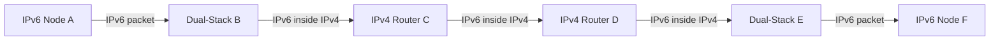
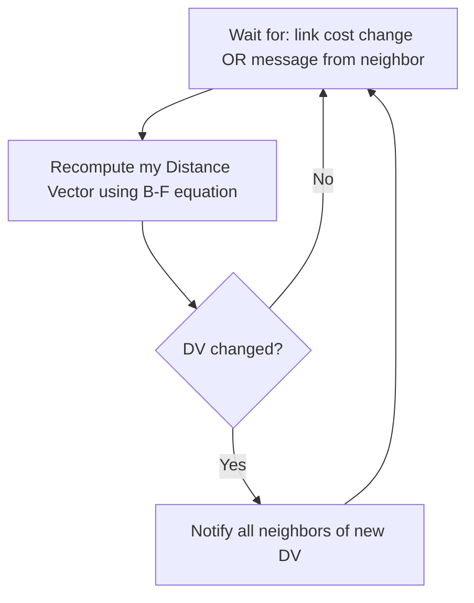
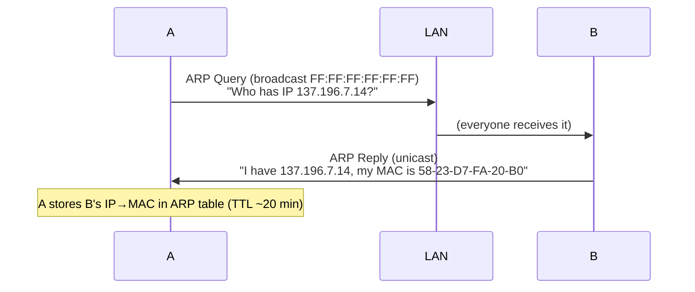
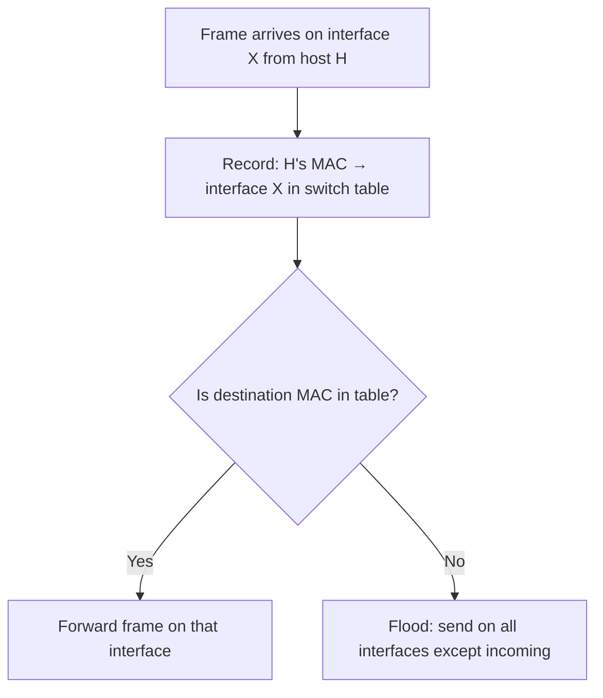
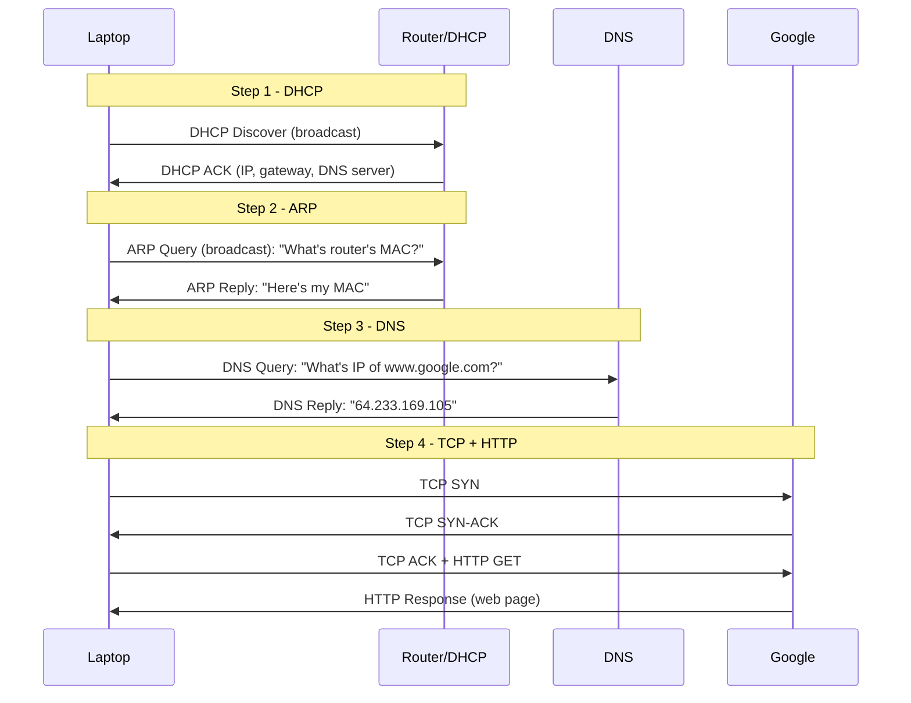
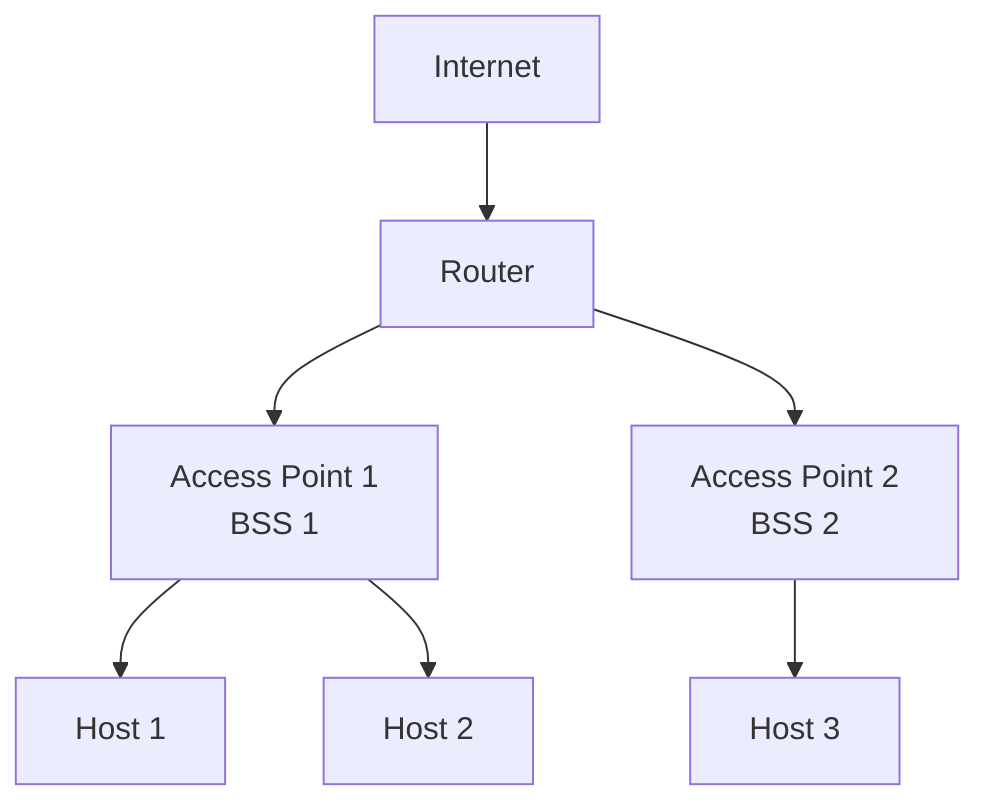

# Computer Networks — Study Notes

> Covers: Network Layer Protocols, IPv6, Routing Algorithms, Link Layer, Error Detection, Multiple Access, Switched LAN, Physical Layer, Wireless LAN (802.11)

---

## Table of Contents
1. [DHCP](#1-dhcp)
2. [ICMP](#2-icmp)
3. [IPv6](#3-ipv6)
4. [Transition: IPv4 → IPv6 (Tunneling)](#4-transition-ipv4--ipv6)
5. [Routing Algorithms — Dijkstra (Link State)](#5-dijkstra-link-state-algorithm)
6. [Routing Algorithms — Bellman-Ford (Distance Vector)](#6-bellman-ford-distance-vector-algorithm)
7. [Link State vs Distance Vector](#7-link-state-vs-distance-vector-comparison)
8. [Error Detection & Correction](#8-error-detection--correction)
9. [Multiple Access Protocols — CSMA/CD & CSMA/CA](#9-multiple-access-protocols)
10. [MAC Addresses & ARP](#10-mac-addresses--arp)
11. [Ethernet](#11-ethernet)
12. [Link Layer Switches](#12-link-layer-switches)
13. [Day in the Life of a Web Request](#13-day-in-the-life-of-a-web-request)
14. [Physical Layer](#14-physical-layer)
15. [Wireless LAN — IEEE 802.11](#15-wireless-lan--ieee-80211)

---

## 1. DHCP

**What it does:** Automatically assigns IP address to a host when it joins a network.

**Why needed:** Instead of manually configuring each device, DHCP handles it dynamically — plug-and-play.

### DHCP also provides:
- IP address for the host
- Address of first-hop router (default gateway)
- Name and IP of DNS server
- Subnet mask

### 4-Step DHCP Process (DORA):

```
Client                          DHCP Server
  |                                  |
  |--- DHCP DISCOVER (broadcast) --->|   src: 0.0.0.0:68, dst: 255.255.255.255:67
  |                                  |
  |<-- DHCP OFFER (broadcast) -------|   src: server_IP:67, offers IP + lease time
  |                                  |
  |--- DHCP REQUEST (broadcast) ---->|   "I want that IP"
  |                                  |
  |<-- DHCP ACK (broadcast) ---------|   "Confirmed, it's yours"
```

**Key points:**
- All messages are **broadcast** (before client has an IP)
- Client uses `0.0.0.0` as source until it gets an IP
- DHCP server is usually co-located in the router
- Lease time = how long the IP is valid (e.g., 3600 seconds)
- If client remembers a previous IP, it can skip DISCOVER + OFFER

---

## 2. ICMP

**What it does:** Used by hosts and routers to communicate network-layer **error/control information**.

**Where it sits:** Architecturally just above IP (carried as IP payload).

### Common ICMP Message Types:

| Type | Code | Meaning |
|------|------|---------|
| 0 | 0 | Echo Reply (ping response) |
| 3 | 0 | Destination Network Unreachable |
| 3 | 1 | Destination Host Unreachable |
| 3 | 3 | Destination Port Unreachable |
| 8 | 0 | Echo Request (ping) |
| 11 | 0 | TTL Expired |
| 12 | 0 | Bad IP Header |

### Tools that use ICMP:
- **ping** — uses Echo Request (type 8) and Echo Reply (type 0)
- **traceroute** — uses TTL Expired (type 11) messages

---

## 3. IPv6

### Why IPv6?
- IPv4 = 32-bit → only ~4.3 billion addresses (exhausted)
- IPv6 = 128-bit → 340 undecillion (340 × 10³³) addresses
- Improved header: fixed 40-byte length, no checksum, no fragmentation
- No fragmentation/reassembly at routers (speeds up forwarding)
- New options handled via "Next Header" extension headers

### IPv6 Address Format
- 128 bits = eight 16-bit blocks separated by `:`
- Each block written in **hexadecimal**
- Example: `2001:0DB8:0000:0000:0000:0000:0000:0001`

### Compression Rules:

| Rule | Description | Example |
|------|-------------|---------|
| Rule 1 | Drop **leading zeros** within each block | `0DB8` → `DB8` |
| Rule 2 | Replace **one** group of consecutive all-zero blocks with `::` | `0000:0000:0000` → `::` |
| Rule 3 | `::` can only appear **once** in an address (else ambiguous) | `2001::abcd::1234` is INVALID |

### Examples:

| Full Address | Compressed |
|---|---|
| `0000:0000:FFFF:0000:0000:0000:0000:0000` | `0:0:FFFF::` |
| `1234:2346:0000:0000:0000:0000:0000:1111` | `1234:2346::1111` |
| `0000:0000:0000:0000:0000:0000:0000:0000` | `::` |

### IPv6 Address Types:

| Type | Description |
|------|-------------|
| **Unicast** | One-to-one (single interface) |
| **Multicast** | One-to-many (all group members get a copy) |
| **Anycast** | One-to-nearest (group shares one address, nearest responds) |
| ~~Broadcast~~ | **Removed** in IPv6 |

### IPv6 Datagram Header (40 bytes fixed):

```
+---------+-----+------------------+
|  ver(4) |pri(8)|   flow label(20) |
+---------+-----+------------------+
| payload len(16)| next hdr(8)|hop lim(8)|
+----------------+-----------+--------+
|         source address (128 bits)   |
+-------------------------------------+
|      destination address (128 bits) |
+-------------------------------------+
|              data / payload         |
```

**Removed compared to IPv4:** checksum, fragmentation/reassembly, options in header

---

## 4. Transition: IPv4 → IPv6

**Problem:** Can't upgrade all routers simultaneously. Mixed IPv4/IPv6 networks will exist.

**Solution: Tunneling**

IPv6 datagrams are carried **as payload inside IPv4 datagrams** when passing through IPv4-only routers.



**Key detail:**
- B and E are **dual-stack** (support both IPv4 and IPv6)
- B wraps the IPv6 packet in an IPv4 header with src=B, dst=E
- E unwraps it and forwards the original IPv6 packet to F
- The IPv4 routers C and D never see the IPv6 header

---

## 5. Dijkstra (Link State) Algorithm

**Type:** Global / Centralized — all routers know full network topology via **link state broadcast**.

**Goal:** Find least-cost paths from one source to all other nodes.

### Notation:
- `cx,y` — direct link cost from x to y (∞ if not direct neighbors)
- `D(v)` — current estimated cost from source to v
- `p(v)` — predecessor of v on least-cost path
- `N'` — set of nodes with finalized least-cost paths

### Algorithm:

```
Initialize:
  N' = {source}
  For all nodes v:
    if v is direct neighbor → D(v) = cost of direct link
    else → D(v) = ∞

Loop until all nodes in N':
  Find w ∉ N' with minimum D(w)
  Add w to N'
  For all v adjacent to w and v ∉ N':
    D(v) = min(D(v), D(w) + cw,v)
```

### Example (source = u):

Network:
```
    v --3-- w
   /2      1\5
  u----2----x--1--y
  |1        |3    |2
  (via x,y)  -----z
```

| Step | N' | D(v) | D(w) | D(x) | D(y) | D(z) |
|------|-----|------|------|------|------|------|
| 0 | {u} | 2,u | 5,u | 1,u | ∞ | ∞ |
| 1 | {u,x} | 2,u | 4,x | — | 2,x | ∞ |
| 2 | {u,x,y} | 2,u | 3,y | — | — | 4,y |
| 3 | {u,x,y,v} | — | 3,y | — | — | 4,y |
| 4 | {u,x,y,v,w} | — | — | — | — | 4,y |
| 5 | {u,x,y,v,w,z} | done |

**Result:** All shortest paths from u found.

### Properties:
- O(n²) time complexity (basic), O(n log n) with priority queue
- Used in **OSPF** and **IS-IS** routing protocols

---

## 6. Bellman-Ford (Distance Vector) Algorithm

**Type:** Decentralized / Distributed — each router only knows costs to neighbors; learns rest iteratively.

### Core Equation (Bellman-Ford):
```
Dx(y) = min over all neighbors v { cx,v + Dv(y) }
```
"My cost to reach y = minimum of (cost to neighbor v) + (neighbor v's cost to y)"

### How it works:



### Example:
Node u has neighbors x, v, w:
- `cu,v = 2`, `Dv(z) = 5`
- `cu,x = 1`, `Dx(z) = 3`
- `cu,w = 5`, `Dw(z) = 3`

```
Du(z) = min{2+5, 1+3, 5+3} = min{7, 4, 8} = 4   (via x)
```

### Properties:
- Iterative and asynchronous
- Distributed and self-stopping (notifies only when DV changes)
- Used in **RIP** routing protocol

### Problem: Count-to-Infinity

When a link cost **increases significantly**, bad news propagates slowly.

**Scenario:** Link x↔y cost goes from 4 to 60.
- y sees its direct link cost to x is 60, but z claims it can reach x in 5 → y thinks it can go via z (cost = 6)
- z updates → cost 7, tells y → y updates → cost 8... keeps counting up to the actual cost (∞ cycles)

**Fix:** Poisoned reverse, split horizon (not exam detail here, but concept is important)

---

## 7. Link State vs Distance Vector Comparison

| Feature | Distance Vector (BF) | Link State (Dijkstra) |
|---------|---------------------|----------------------|
| Info shared | Full routing table to neighbors | Only link state to all |
| Network knowledge | Only from neighbors | Complete topology |
| Convergence | **Slow** | **Fast** |
| CPU/Memory | Less | More |
| Routing loops | Vulnerable (count-to-infinity) | Less prone |
| Updates | Periodic (every 30–90 sec), broadcast | Triggered on change, multicast |
| Scalability | Less scalable | More scalable |
| Examples | **RIP**, IGRP | **OSPF**, IS-IS |

---

## 8. Error Detection & Correction

### Why needed:
Bits can flip due to signal attenuation and noise. Sender adds **EDC (Error Detection and Correction)** bits.

> Error detection is NOT 100% reliable — larger EDC field = better detection.

---

### 8.1 Parity Check

**Single-bit parity:**
- Add 1 bit so total 1s = even (even parity) or odd (odd parity)
- Detects **single-bit errors only**
- Cannot detect 2-bit errors (they cancel out)

**2D (Two-dimensional) parity:**
- Arrange data in a grid; compute parity for each row AND each column
- Can **detect AND correct** single-bit errors
- Works by finding which row and column parity fails → intersection = error bit

```
Data:        Row parity:
1 0 1 0 1    → 1
1 0 1 1 0    → 1
0 1 1 1 0    → 1
1 0 1 0 1    → 1

Col parity:  1 1 0 0 0  → 1 (overall)
```

---

### 8.2 Internet Checksum

**Used in:** UDP, TCP, IP headers.

**Sender:**
1. Treat segment contents as 16-bit integers
2. Sum all integers using **one's complement addition**
3. Store result in checksum field

**Receiver:**
1. Compute checksum of received data
2. Compare to received checksum field
3. Not equal → error detected; Equal → probably no error (but not guaranteed)

---

### 8.3 Cyclic Redundancy Check (CRC)

**Most powerful** of the three. Used in Ethernet, 802.11 WiFi.

**Concept:**
- D = data bits (d bits)
- G = generator polynomial (r+1 bits) — agreed upon by sender/receiver
- R = CRC bits (r bits) appended to D

```
Transmitted = <D, R>  where  D*2^r XOR R is divisible by G
```

**Sender:**
1. Append r zeros to D → gives D*2^r
2. Divide D*2^r by G using **binary (XOR) division**
3. Remainder = R (the CRC bits)
4. Replace appended zeros with R → transmit <D, R>

**Receiver:**
1. Divide received <D, R> by G
2. Remainder = 0 → **no error**
3. Remainder ≠ 0 → **error detected** → request retransmission

**Key properties:**
- Detects all burst errors of length ≤ r bits
- r = degree of generator polynomial

**Example:**
- D = `101110` (d=6), G = `1001` (r=3)
- Append 3 zeros: `101110000`
- XOR divide by `1001` → remainder R = `011`
- Transmit: `101110011`

---

## 9. Multiple Access Protocols

**Why needed:** When multiple nodes share one broadcast channel, collisions happen. MAC protocols control who transmits when.

### Three categories:
1. **Channel partitioning** — TDMA, FDMA, CDMA (not in syllabus detail)
2. **Random access** — CSMA/CD, CSMA/CA ← **in syllabus**
3. **Taking turns** — polling, token passing

---

### 9.1 CSMA/CD (Carrier Sense Multiple Access / Collision Detection)

**Used in:** Wired Ethernet

**How it works:**
```
1. Listen before transmit (Carrier Sense)
2. If channel idle → transmit frame
3. If channel busy → wait until idle, then transmit
4. While transmitting, keep listening (Collision Detection)
5. If collision detected → send JAM signal → abort
6. Binary exponential backoff:
   - After n collisions, wait K × 512 bit times
   - K chosen randomly from {0, 1, ..., 2^n - 1}
   - More collisions → longer wait
7. Retry from step 1
```

**Why collisions still happen:** Propagation delay — two nodes may not hear each other's just-started transmission before both start.

**CD is easy in wired** (just measure voltage), **hard in wireless** (sender can't hear while transmitting).

---

### 9.2 CSMA/CA (Carrier Sense Multiple Access / Collision Avoidance)

**Used in:** 802.11 WiFi (wireless)

**Why "avoidance" not "detection":** In wireless, a node cannot detect a collision while transmitting (its own signal drowns out others).

**Strategy:**
- **Avoid** collisions before they happen using:
  - Random backoff before transmitting
  - ACK-based confirmation (if no ACK received → assume collision → retry)
  - Optional RTS/CTS (Request to Send / Clear to Send) mechanism

---

## 10. MAC Addresses & ARP

### MAC Address
- 48-bit address burned into the NIC ROM
- Written in hexadecimal: e.g., `1A-2F-BB-76-09-AD`
- **Flat address** — portable across subnets (unlike IP)
- Administered by IEEE (manufacturers buy address blocks)
- Analogy: MAC = Social Security Number, IP = Postal Address
- Broadcast address: `FF-FF-FF-FF-FF-FF`

### ARP (Address Resolution Protocol)

**Problem:** You know the IP address of the destination, but you need its MAC address to build the Ethernet frame.

**Solution:** ARP



**ARP Table:** Stores `<IP address, MAC address, TTL>` mappings. TTL ≈ 20 minutes.

### Sending to Another Subnet (via Router):

```
A wants to reach B on different subnet, via router R

Step 1: A builds frame with:
   IP src = A_IP, IP dst = B_IP  (unchanged end-to-end)
   MAC src = A_MAC, MAC dst = R_MAC  (changes at each hop!)

Step 2: R receives frame, strips link layer
   R looks up B_IP, determines outgoing interface
   R builds new frame with:
   MAC src = R_MAC (outgoing), MAC dst = B_MAC

Step 3: B receives frame
```

**Key insight:** IP addresses don't change hop to hop; MAC addresses change at every router.

---

## 11. Ethernet

**Dominant wired LAN technology.**

### Physical Topology:
- **Bus** (old, until mid-90s): all nodes share one cable → all in same collision domain
- **Switched** (modern): switch in center, each node gets dedicated link → no collisions

### Ethernet Frame Structure:

```
| Preamble (7B) | SFD (1B) | Dest MAC (6B) | Src MAC (6B) | Type (2B) | Data (46-1500B) | CRC (4B) |
```

- **Preamble:** 7 bytes of `10101010` + 1 byte `10101011` — synchronizes clocks
- **Dest/Src MAC:** 6-byte addresses
- **Type:** upper-layer protocol (e.g., 0x0800 = IPv4)
- **CRC:** 4-byte error detection — if error, frame dropped silently

### Key Properties:
- **Connectionless:** no handshaking
- **Unreliable:** no ACK/NAK — dropped frames recovered only by TCP (if used)
- **MAC protocol:** Unslotted CSMA/CD with binary backoff

### Standards:
- Speeds: 10 Mbps → 400 Gbps
- Media: twisted pair copper, fiber
- All share same MAC protocol and frame format

---

## 12. Link Layer Switches

**What a switch does:** Stores and forwards Ethernet frames based on MAC address. Operates at Layer 2.

### Key Features:
- **Transparent:** hosts don't know switches exist
- **Plug-and-play / self-learning:** no manual configuration needed
- **No collisions:** each link is its own collision domain (full duplex)
- **Multiple simultaneous transmissions:** A→A' and B→B' at the same time (unless destination conflicts)

### Self-Learning:



### Switch Table Entry:
`<MAC address, Interface, TTL>`

### Switches vs Routers:

| | Switches | Routers |
|--|----------|---------|
| Layer | Layer 2 (Link) | Layer 3 (Network) |
| Addresses used | MAC | IP |
| Table built by | Self-learning (flooding) | Routing algorithms |
| Headers examined | Link-layer headers | Network-layer headers |

---

## 13. Day in the Life of a Web Request

**Scenario:** Student connects laptop to campus network, requests `www.google.com`



### Full Protocol Chain:
1. **DHCP** → get IP, gateway, DNS server
2. **ARP** → get router's MAC address
3. **DNS** → resolve `www.google.com` to IP (involves routing through ISP via OSPF/BGP)
4. **TCP** → 3-way handshake to Google's server
5. **HTTP** → request and receive the web page

Every step involves encapsulation: HTTP → TCP → IP → Ethernet → Physical signal.

---

## 14. Physical Layer

**Purpose:** Convert bits (0s and 1s) into physical signals and transmit them across a medium.

### What Physical Layer does:
- Encodes data link layer frames into **signals** (voltage, light, radio waves)
- Transmits and receives signals across **physical media**
- Defines connectors, timing, signal levels

### Signal Types:
- **Analog signal:** continuous values (amplitude/frequency varies)
- **Digital signal:** discrete values (0s and 1s)

### Encoding Methods:

| Method | Description |
|--------|-------------|
| **NRZ (Non-Return to Zero)** | Low voltage = 0, High voltage = 1 |
| **Manchester Encoding** | Low→High transition within bit = 1; High→Low = 0. Clock info embedded in signal. |

### Physical Layer Components:
- **Physical components:** cables, connectors, NICs, hubs, repeaters, modems
- **Encoding:** converting bits to signal representation
- **Signaling:** actually putting signal on medium

### Transmission Media:
- **Copper wire** (twisted pair, coaxial)
- **Optical fiber** (uses light — very high bandwidth, low interference)
- **Wireless** (radio waves)

### Standards Bodies:
- ISO, IEEE, ANSI, ITU, EIA/TIA, FCC

---

## 15. Wireless LAN — IEEE 802.11

### Key Terminology:
- **Wireless host:** laptop, smartphone, IoT device
- **Base station / Access Point (AP):** connects wireless hosts to wired network
- **BSS (Basic Service Set):** one AP + its associated wireless hosts = one "cell"
- **Infrastructure mode:** hosts connect via AP to wired internet
- **Ad hoc mode:** no AP, hosts communicate directly with each other

### 802.11 Standards:

| Standard | Year | Max Rate | Range | Frequency |
|----------|------|----------|-------|-----------|
| 802.11b (WiFi 1) | 1999 | 11 Mbps | 30 m | 2.4 GHz |
| 802.11g (WiFi 3) | 2003 | 54 Mbps | 30 m | 2.4 GHz |
| 802.11n (WiFi 4) | 2009 | 600 Mbps | 70 m | 2.4/5 GHz |
| 802.11ac (WiFi 5) | 2013 | 3.47 Gbps | 70 m | 5 GHz |
| 802.11ax (WiFi 6) | 2020 | 14 Gbps | 70 m | 2.4/5 GHz |

All use **CSMA/CA** for multiple access.

### 802.11 Architecture:



### Channels & Association:
- 2.4 GHz band divided into channels (e.g., 2.4–2.4835 GHz)
- AP admin configures: channel + SSID
- Neighboring APs may use same channel → **WiFi jungle** (interference)

### Host Association Process:

**Passive Scanning:**
1. AP sends **beacon frames** (contains SSID + MAC)
2. Host listens, picks AP
3. Host sends **Association Request**
4. AP sends **Association Response**

**Active Scanning:**
1. Host broadcasts **Probe Request**
2. APs respond with **Probe Response**
3. Host sends **Association Request** to chosen AP
4. AP sends **Association Response**

After association → host runs **DHCP** to get an IP address.

### CSMA/CA (Why not CD?):
- Wireless nodes **cannot detect collisions** while transmitting
- Collision **avoidance** instead:
  - Random backoff before transmitting
  - ACK required for every frame (if no ACK → retransmit)
  - Optional: RTS/CTS exchange to reserve channel

---

## Quick Reference Cheat Sheet

| Topic | Key Numbers |
|-------|------------|
| DHCP Discover/Request src port | 68 |
| DHCP Offer/ACK src port | 67 |
| IPv6 address size | 128 bits, 8 × 16-bit blocks |
| IPv6 header size | 40 bytes (fixed) |
| MAC address size | 48 bits (6 bytes) |
| Ethernet frame CRC | 4 bytes |
| Ethernet preamble | 7 bytes (10101010) + 1 byte (10101011) |
| ARP TTL | ~20 minutes |
| CRC burst error detection | All errors ≤ r bits |
| 802.11 MAC protocol | CSMA/CA |
| Wired Ethernet MAC protocol | CSMA/CD |
