# Lab 4: TCP Congestion Window using Wireshark 
---
## name: dharani s
## srn: pes2ug24cs157
## section: c
---
## **Task A: Capture TCP traffic and plot the Congestion Window:**
### **1. Screenshot of SYN , SYN-ACK, & ACK Packets from the Wireshark packet capture.**
### Syn
#### 1. packet capture: No. : 633
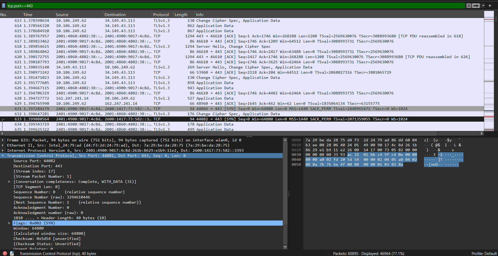
#### 2. Congestion window:
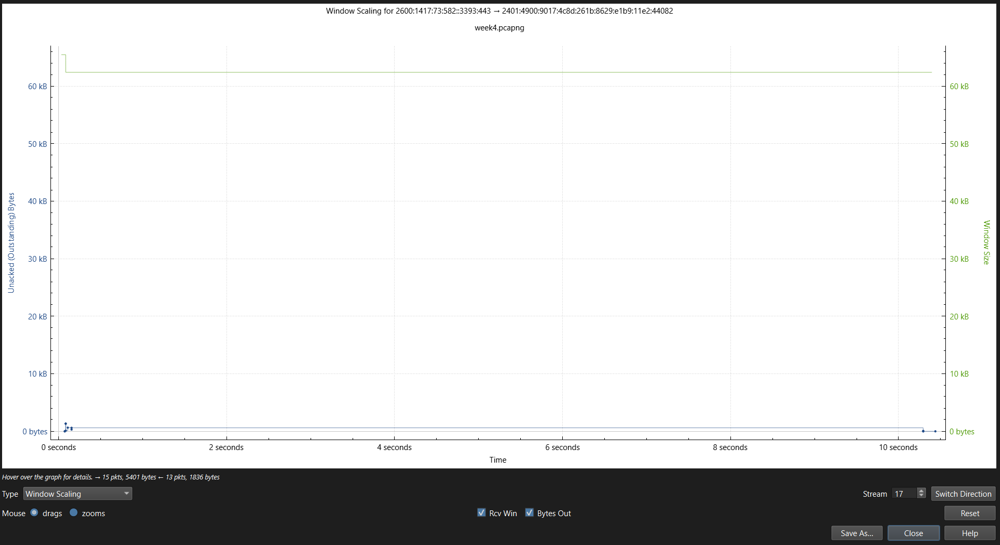
### What is the sequence number of the TCP SYN segment used to initiate the TCP connection between the client and the server? 
#### **raw sequence no. : `3294610446`**
### which field or flag in the TCP segment indicates that the segment is a SYN packet?
#### **TCP flags field**
#### **Syn flag = 1 (set)**
#### **`Flags: 0x002`(syn)**
#### screenshot
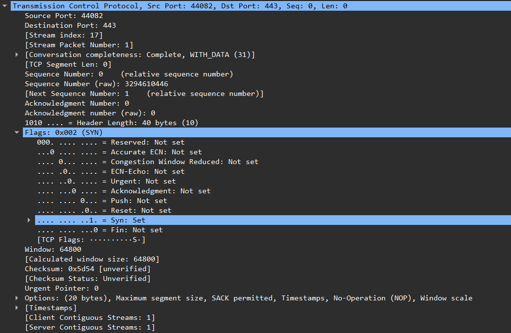

### Syn-Ack
#### 1. packet capture: No. 650
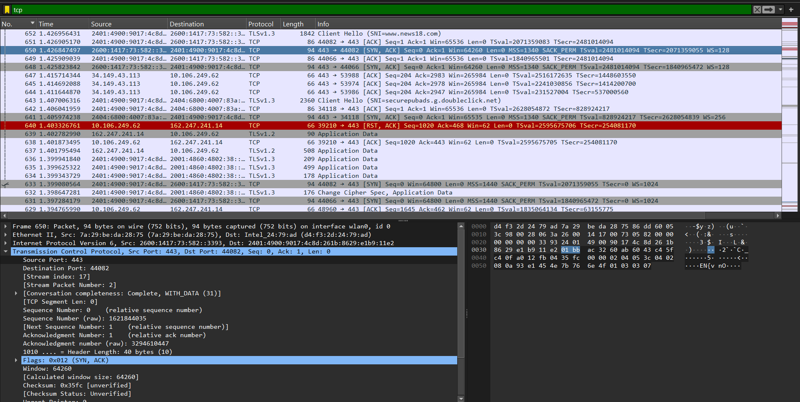
#### 2. Congestion window:
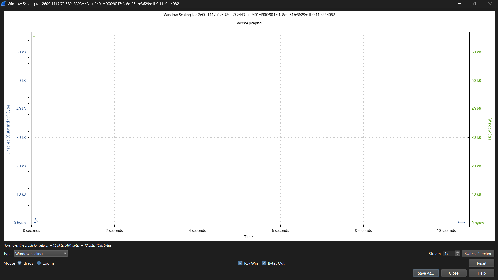
### 3. What is the sequence number of the SYN-ACK segment sent by the server to the client in response to the SYN request? Which field or flag in the TCP header indicates that the segment is a SYN-ACK packet? Additionally, what is the value of the Acknowledgement field in the SYN-ACK segment, and why is it set to that value?

#### **Sequence number of Syn-Ack: `1621844035`
#### **TCP Flags field**
#### **Flags: 0x012 (SYN, ACK)**
#### Both bits are set:
##### SYN = 1
##### ACK = 1

#### **Acknowledgement Number (raw): 3294610447**
#### screenshot:
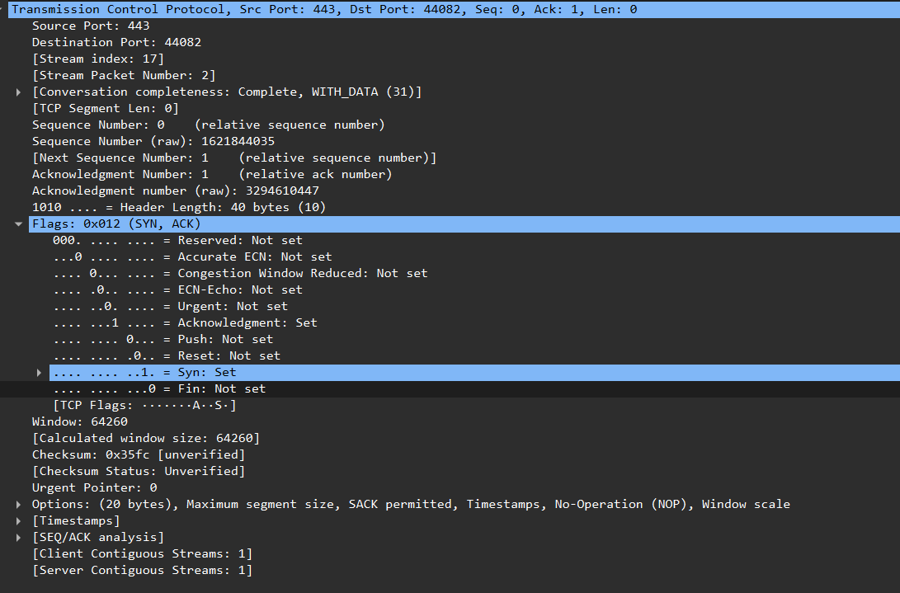

### Ack
#### 1. packet capture: No. 651
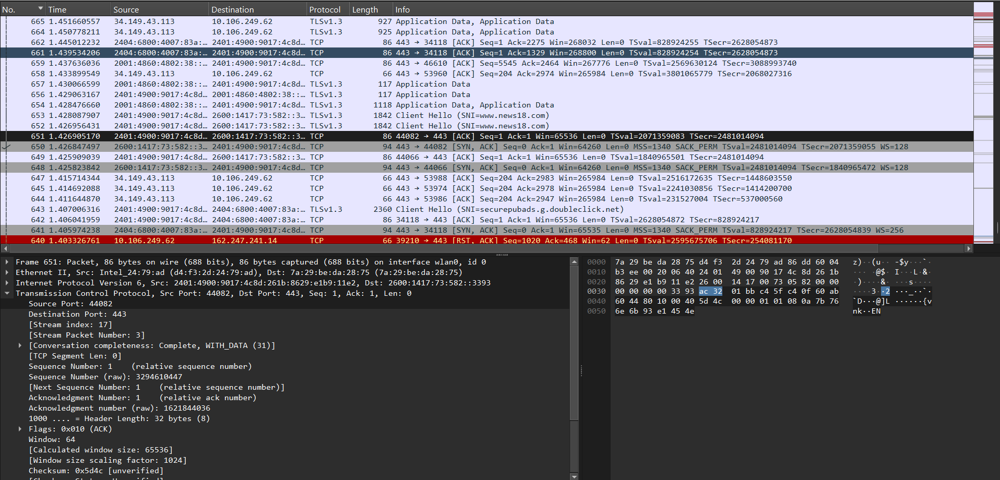
#### 2. Congestion window
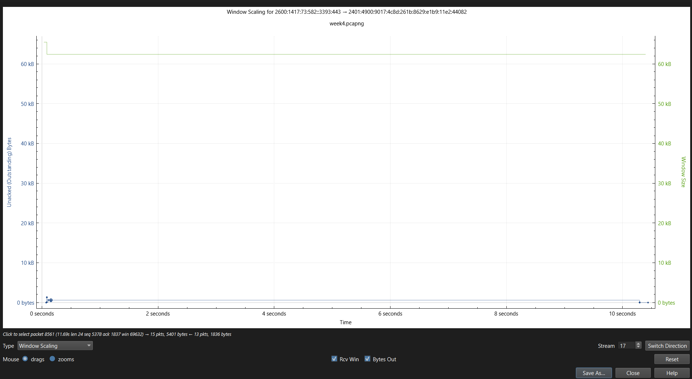

### What do the blue and green lines in the plot represent?  

#### **Blue line** : Congestion Window (cwnd)Shows how the sender’s congestion window size changes over time This controls how much data can be “in flight” without waiting for ACKs

#### **Green line**  Slow Start Threshold (ssthresh) The boundary between slow start and congestion avoidance

### Based on the plot, what can you infer about TCP transmission behavior (indicate receiver-side or sender-side congestion control) and why? 
#### Inference: The plot indicates that TCP transmission is sender-side limited rather than receiver-side controlled. This is because the receiver window (green line) remains constant, showing that the receiver is not restricting the flow. Meanwhile, the bytes in flight (blue line) remain very low, indicating that the sender is not utilizing the available window. Hence, there is no evidence of congestion control mechanisms like slow start or congestion avoidance actively affecting transmission.
---
---
### **Task B: Analyzing the Congestion Window from the packet capture.**

### 1. Provide a screenshot of the congestion window and clearly mark the different phases of TCP, such as Slow Start and Congestion Avoidance. Based on your observation of the graph, identify which TCP variant (flavor) is being used.

#### Screenshot:
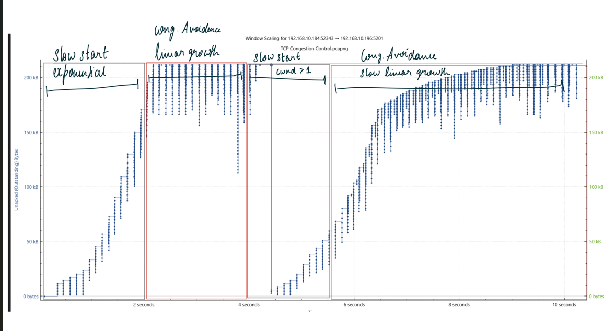

#### The behavior matches TCP Reno:

#### Slow Start (0 to ~2s): cwnd grows exponentially (steep steep curve) until it hits ssthresh (~150 kB)
#### Congestion Avoidance (2s–4s): cwnd grows linearly, gradually approaching the ~210 kB window ceiling
#### Timeout/Loss event (~4s): cwnd crashes back to 1 (vertical drop — this is the key indicator of Reno, not Cubic or New Reno which would halve)
#### Slow Start again (4s–6s): exponential rise repeats
#### Congestion Avoidance again (~6s onward): slower, linear climb : the sawtooth pattern characteristic of Reno

### Examining the given PCAP file, provide a relevant screenshot that shows three duplicate ACKs in Wireshark. What do you observe in the subsequent packet transmission, and how would you explain this behavior? 
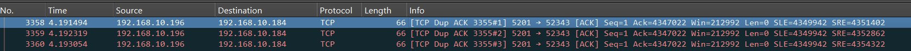
#### This is TCP's fast retransmit mechanism : instead of waiting for a timeout, 3 dup ACKs signal that a specific segment was lost, so the sender immediately resends it without waiting. The window then drops (in Reno, to 1; in New Reno/Cubic, to half ssthresh).
#### After the 3rd duplicate ACK, TCP triggers fast retransmit : the sender immediately resends the missing segment without waiting for a timeout. The congestion window then resets, which is visible in the Window Scaling graph as the sharp drop around the 4-second mark

### Explain under what conditions the TCP congestion window (cwnd) decreases to 1, and describe the network event that causes this behavior.

#### cwnd drops to 1 MSS (Maximum Segment Size, usually 1460 bytes) when a retransmission timeout (RTO) occurs : meaning the sender waited the full timeout period without receiving any ACK

### Provide a screenshot of the packets observed in Wireshark after the congestion window is reduced to 1. Based on the subsequent packets, describe how the congestion window size changes over time.
#### screenshot: 
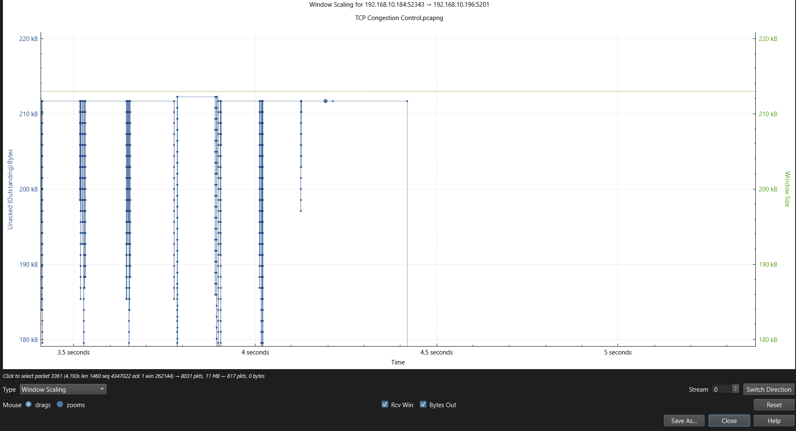
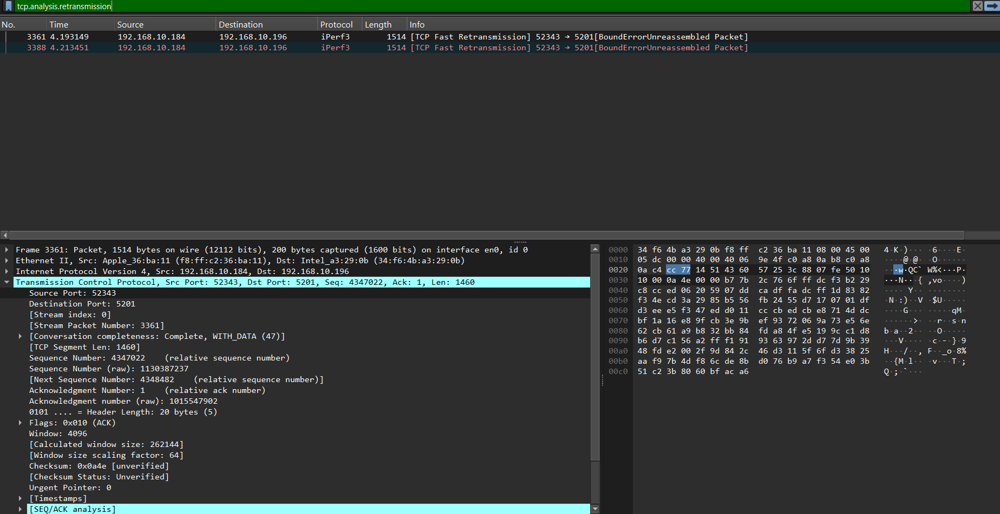

#### **Packets observed:** Packets 3361 and 3388 are both `[TCP Fast Retransmission]` with **Seq: 4347022, Len: 1460** , confirming cwnd = 1 MSS (only 1 segment in flight).

#### **How cwnd changes over time:**After resetting to 1 MSS, TCP enters **Slow Start** : cwnd doubles every RTT (1→2→4→8 MSS). Once it hits ssthresh, it switches to **Congestion Avoidance** where cwnd grows linearly (+1 MSS per RTT). This matches the steep exponential rise (~4s–6s) followed by the gentle slope (6s–10s) seen in the Window Scaling graph.
