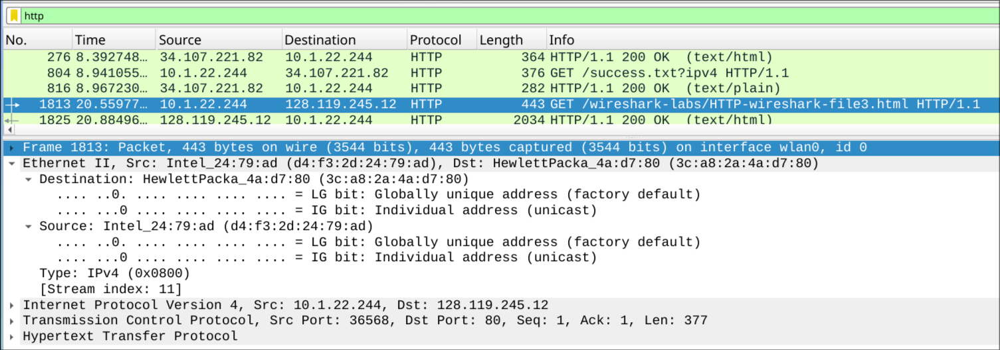
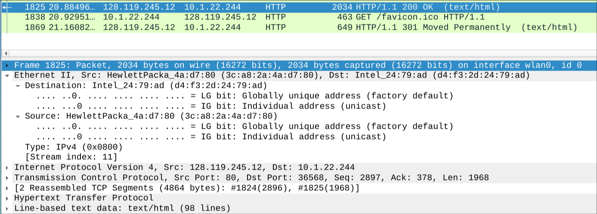
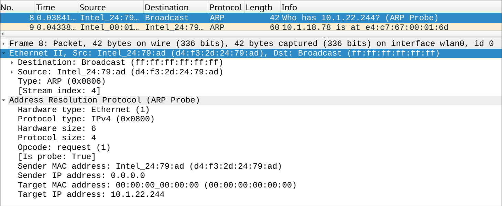
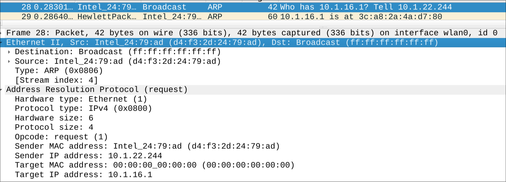
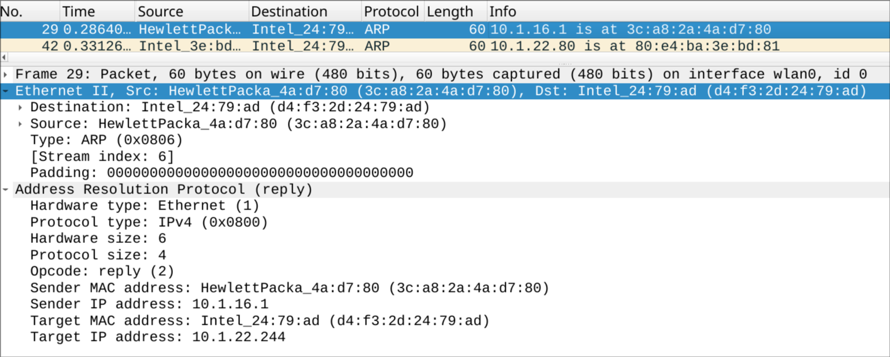

# Lab 5: Understanding Ethernet and ARP using Wireshark
## **name: Dharani S**
## **SRN: PES2UG24CS157**
## **SECTION: C**

## PART A
###  1. Provide a screenshot of the packet that contains the HTTP GET request sent to the server, including the Ethernet frame information.

### 2. In this packet, what is the Ethernet source address? Is this the physical (MAC) address of your device?
#### Ethernet source address: d4:f3:2d:24:79:ad
#### Yes. This is the physical (MAC) address of my device (NIC).
### 3. In the same packet, what is the Ethernet destination address? Is this the physical address of the server? If not, provide a justification.
#### Ethernet destination address: 3c:a8:2a:4a:d7:80
#### No. This is NOT the server’s MAC address.
#### Ethernet frames operate only within the local network (LAN). Since the server (128.119.245.12) is on a different network, device sends the frame to the next hop , typically the default gateway (router). Therefore, this MAC address belongs to the router, not the remote server.
### 4. What is the destination IP address in this packet? Does it correspond to the IP address of the server?
#### Destination IP address: 128.119.245.12
#### Yes. This corresponds to the IP address of the server.
#### IP operates end-to-end across networks, unlike Ethernet. So even though the Ethernet frame is sent to the router, the IP packet inside still carries the final destination (the server).
### 5. Provide a screenshot of the packet containing the HTTP text response from the server, including the Ethernet frame information.

### 6. 
#### In the earlier HTTP GET packet:
- Ethernet Source Address = device’s MAC address
- Ethernet Destination Address = router’s (default gateway) MAC address

#### In this packet (HTTP response):
- Ethernet Source Address = router’s MAC address
- Ethernet Destination Address = device’s MAC address

#### The direction of communication is reversed.

#### For the request:
##### device → router → internet → server

#### For the response:
##### server → router → device

#### At the Ethernet layer, communication is limited to the local network (single hop). So the router rewrites the Ethernet frame before forwarding it to the device:
- Source MAC = router’s interface MAC
- Destination MAC = device’s MAC

#### Ethernet addresses change at each hop and represent only the local link, not the end-to-end path.

## PART B:

### 1. Provide a screenshot of the ARP probe packet, clearly showing the sender IP address and target IP address. Explain why this packet is transmitted.

#### Sender IP address: 0.0.0.0  
#### Target IP address: 10.1.22.244  

#### This packet is transmitted to check whether the IP address is already in use on the network before assigning it to the device.  
#### This process helps avoid IP address conflicts. Since the device does not yet have an assigned IP address, it uses 0.0.0.0 as the sender IP.

---

### 2. Provide a screenshot of the ARP packet sent from your device, including the sender IP address and target IP address.

#### Sender IP address: 10.1.22.244  
#### Target IP address: 10.1.16.1  

---

### A. What differences do you observe when compared with the ARP probe packet?

#### In the ARP probe:
- Sender IP address = 0.0.0.0  
- Used for checking IP availability  

#### In the ARP request:
- Sender IP address = actual assigned IP (10.1.22.244)  
- Used to discover the MAC address of another device  

#### The ARP probe is used before IP assignment, whereas the ARP request is used after the device has a valid IP.

---

### B. What is the target MAC address in this packet? Justify your answer.

#### Target MAC address: 00:00:00:00:00:00  

#### This is because the device does not know the MAC address of the target IP.  
#### Therefore, the request is broadcast to all devices in the network to identify the correct MAC address.

---

### C. Which opcode value in the packet indicates that it is an ARP request?

#### Opcode value: 1  
#### This indicates that the packet is an ARP request.

---

### 3. Provide a screenshot of the ARP response packet received after the ARP request, showing the sender and target IP addresses.

#### Sender IP address: 10.1.16.1  
#### Target IP address: 10.1.22.244  

---

### A. What changes do you observe compared to the ARP request packet?

#### In the ARP request:
- Packet is broadcast  
- Sender asks for MAC address  

#### In the ARP reply:
- Packet is unicast (sent directly to the device)  
- Sender provides its MAC address  

#### The roles are reversed: the requester becomes the receiver, and the target responds.

---

### B. What is the target MAC address in this packet? Justify your answer.

#### Target MAC address: d4:f3:2d:24:79:ad  

#### This is the MAC address of the device.  
#### Since the sender already knows the requester, the reply is sent directly (unicast) to the device.

---

### C. Which opcode value indicates that the packet is an ARP reply?

#### Opcode value: 2  
#### This indicates that the packet is an ARP reply.
