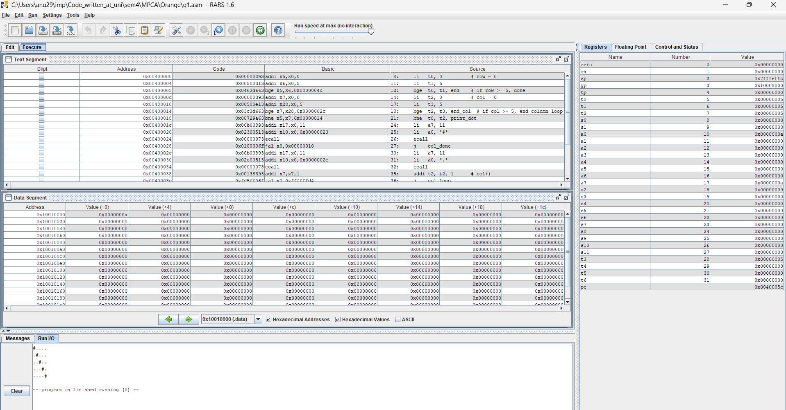
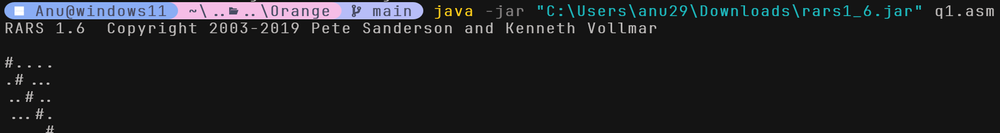
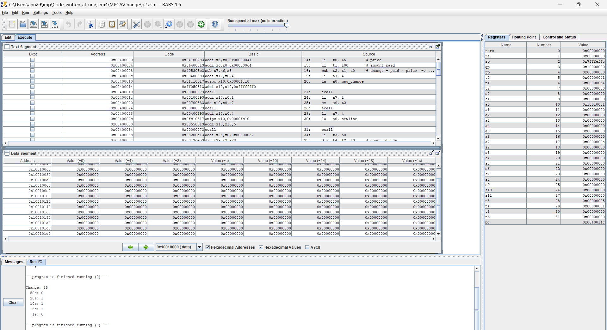
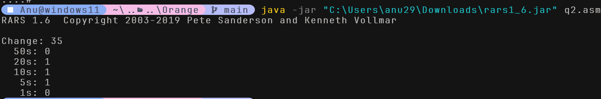

# Orange Problem Assignment Report

---
## Name: dharani S
## SRN: PES2UG24CS157
## SECTION: c
---
## Q7A : Crime Scene Laser Grid

### Code Logic

The program uses two nested loops to iterate over a 5×5 grid (rows and columns, each from 0 to 4). For every cell:

- If the **row index equals the column index** (i.e., on the main diagonal), the character `#` is printed using RARS system call `ecall 11`.
- Otherwise, `.` is printed.

After each row's inner loop completes, a newline character is printed and the row counter increments. This continues until all 5 rows are processed, after which the program exits via `ecall 10`.

**Registers used:**
| Register | Purpose |
|----------|---------|
| `t0` | Row counter |
| `t1` | Column counter (reused as limit check temp) |
| `t2` | Column counter |
| `t3` | Temporary limit (5) |
| `a0`, `a7` | System call arguments |

---
### Output Screenshot

---
---

## Q7B: Vending Machine Change Calculator

### Code Logic

The program calculates the minimum number of notes/coins needed to return change to a customer.

**Given values:**
- Price = 65
- Amount Paid = 100
- Change = 100 − 65 = **35**

The denominations used (in descending order): **50, 20, 10, 5, 1**

For each denomination, the program:
- Divides the remaining change by the denomination using `div` → gets the count.
- Takes the remainder using `rem` → updates remaining change.
- Prints the denomination label and count using `ecall 4` (string) and `ecall 1` (integer).

This greedy approach ensures the minimum number of notes/coins is always used.

**Registers used:**
| Register | Purpose |
|----------|---------|
| `t0` | Price |
| `t1` | Amount paid |
| `t2` | Remaining change |
| `t3` | Current denomination |
| `t4` | Count of that denomination |
| `a0`, `a7` | System call arguments |

---
### Output:

