# Complete Cache Memory & Optimization Study Guide

## Table of Contents
1. [Foundation: Why Cache Exists](#foundation-why-cache-exists)
2. [Memory Hierarchy](#memory-hierarchy)
3. [Cache Basics - The Core Concepts](#cache-basics)
4. [Cache Mapping Techniques](#cache-mapping-techniques)
5. [Cache Performance Metrics](#cache-performance-metrics)
6. [Cache Optimization Techniques](#cache-optimization-techniques)
7. [Advanced Topics](#advanced-topics)
8. [Practice Problems with Solutions](#practice-problems)

---

## Foundation: Why Cache Exists

### The Speed Gap Problem

**The Core Problem:**
- CPU operates at GHz speeds (billions of operations per second)
- Main memory (RAM) operates at much slower speeds
- This creates a "memory wall" - CPU wastes cycles waiting for data

**Real Numbers to Remember:**
- CPU cycle time: ~0.3 ns (3 GHz processor)
- L1 Cache access: ~1 ns (3-4 cycles)
- L2 Cache access: ~3-10 ns (10-30 cycles)
- L3 Cache access: ~10-20 ns (30-60 cycles)
- Main Memory (RAM) access: ~100 ns (300+ cycles)
- Disk access: ~10,000,000 ns (millions of cycles!)

**Mental Picture:**
If CPU operations were 1 second:
- L1 Cache = 3 seconds
- L2 Cache = 10 seconds
- RAM = 6 minutes
- Disk = 4 months!

### Why Not Make Everything Fast?

**Three Constraints (Triangle of Tradeoffs):**

1. **Speed** - Faster memory uses more expensive technology
2. **Size** - Larger memory is slower and more expensive
3. **Cost** - Limited budget for computer systems

**Technology Differences:**
- **SRAM (Static RAM)** - Used in cache
  - Very fast (6 transistors per bit)
  - Expensive
  - Retains data as long as power is on
  - No refresh needed
  
- **DRAM (Dynamic RAM)** - Used in main memory
  - Slower (1 transistor + 1 capacitor per bit)
  - Cheaper
  - Needs periodic refresh (capacitor leaks charge)
  - Higher density (more storage per chip)

**Why Refresh is Needed in DRAM:**
DRAM stores each bit as a charge in a tiny capacitor. Capacitors leak charge over time (like a bucket with a small hole). Every few milliseconds, the memory controller must read and rewrite each bit to restore the charge before it's lost. This is called "refresh cycle."

---

## Memory Hierarchy

### The Pyramid Structure

```
         [Registers]           <- Fastest, Smallest, Most Expensive
            |
         [L1 Cache]            <- Split: I-Cache (instructions) & D-Cache (data)
            |
         [L2 Cache]            <- Unified or separate
            |
         [L3 Cache]            <- Shared across cores
            |
        [Main Memory]          <- DRAM, 100x slower than L1
            |
     [Secondary Storage]       <- HDD/SSD, 100,000x slower than L1
```

### How Hierarchy Works

**Key Principle: Locality of Reference**

Programs don't access memory randomly. They exhibit two types of locality:

1. **Temporal Locality (Time-based)**
   - If you access data now, you'll likely access it again soon
   - Example: Loop counter variable `i` is accessed repeatedly
   
   ```c
   for (int i = 0; i < 1000; i++) {
       sum += array[i];  // 'i' accessed 1000 times
   }
   ```

2. **Spatial Locality (Space-based)**
   - If you access data at address X, you'll likely access X+1, X+2, etc.
   - Example: Array elements accessed sequentially
   
   ```c
   for (int i = 0; i < 1000; i++) {
       sum += array[i];  // array[0], array[1], array[2]... sequentially
   }
   ```

**Why This Matters:**
Cache exploits locality by:
- Keeping recently used data (temporal locality)
- Fetching blocks of adjacent data (spatial locality)

### Block/Line Concept

**Cache doesn't store individual bytes - it stores BLOCKS**

- **Block (or Line)**: Minimum unit of data transfer between cache and memory
- Typical block sizes: 32, 64, 128, 256 bytes

**Why Blocks?**
1. Spatial locality - if you need byte X, you'll probably need X+1
2. Efficient bus utilization - transfer multiple bytes at once
3. Reduces tag overhead (explained later)

**Mental Picture:**
Think of cache as a bookshelf with limited space. Instead of storing individual words (bytes), you store entire pages (blocks). When you need one word, you bring the whole page.

---

## Cache Basics

### Cache Hit vs Cache Miss

**Cache Hit:**
- Requested data IS in cache
- Fast access (1-10 cycles)
- Continue execution immediately

**Cache Miss:**
- Requested data is NOT in cache
- Must fetch from main memory (100+ cycles)
- Types of misses (The 3 C's):

### The 3 C's of Cache Misses

#### 1. Compulsory Miss (Cold Start Miss)

**Cause:**
- First access to a block EVER
- Cache starts empty, must fill it
- Unavoidable on first access

**Example:**
```c
int array[100];
// First time accessing array[0] = COMPULSORY MISS
// Must bring block into cache
int x = array[0];  
// Accessing array[1] might be a HIT if in same block
int y = array[1];  
```

**Effect on Performance:**
- Happens at program start
- Relatively small percentage in long-running programs
- Higher percentage in short programs or frequent context switches

**Solutions:**
1. **Larger block size** - Bring more data per miss (helps spatial locality)
2. **Prefetching** - Predict and fetch blocks before they're needed
   - Hardware prefetching: Detect sequential access patterns
   - Software prefetching: Compiler inserts prefetch instructions

**Multicore Advancement:**
- **Shared L3 cache** reduces compulsory misses - one core's miss fills cache for other cores
- **Cache warming** - critical data preloaded by OS before task starts

---

#### 2. Capacity Miss

**Cause:**
- Cache is too small to hold all needed blocks
- Working set size > cache size
- Even with perfect replacement, some data must be evicted

**Example:**
```c
// Assume cache can hold 4 blocks, each block = 4 integers
int A[8], B[8], C[8];  // Total = 24 integers = 6 blocks

for (int i = 0; i < 8; i++) {
    C[i] = A[i] + B[i];  
}
// Working set = 6 blocks, Cache = 4 blocks
// Guaranteed capacity misses as we cycle through data
```

**Effect on Performance:**
- Increases with program working set size
- Major issue in data-intensive applications
- Gets worse as dataset grows

**Solutions:**
1. **Increase cache size** (hardware solution - expensive)
2. **Improve locality** (software solution):
   ```c
   // Bad: Poor locality
   for (i = 0; i < N; i++)
       for (j = 0; j < N; j++)
           sum += matrix[j][i];  // Column-wise (non-contiguous)
   
   // Good: Better locality
   for (i = 0; i < N; i++)
       for (j = 0; j < N; j++)
           sum += matrix[i][j];  // Row-wise (contiguous)
   ```
3. **Cache blocking/tiling** - Restructure algorithm to fit in cache
4. **Data compression** in cache (recent advancement)

**Multicore Era:**
- **Private vs Shared caches** tradeoff
  - Private L1/L2: Fast but capacity divided among cores
  - Shared L3: Larger effective capacity, slower access
- **Victim caches** - Small buffer for evicted blocks

---

#### 3. Conflict Miss (Collision Miss)

**Cause:**
- Multiple blocks map to the same cache location
- Cache has space available, but mapping function forces collision
- Only happens in Direct-Mapped and Set-Associative caches
- NOT in Fully Associative caches

**Example (Direct Mapped):**
```c
// Assume:
// Cache: 4 blocks
// Block size: 16 bytes (4 integers)
// Direct mapped: Block i goes to cache location (i % 4)

int A[4];  // Block 0 -> Cache slot 0
int B[4];  // Block 1 -> Cache slot 1
int C[4];  // Block 4 -> Cache slot 0 (CONFLICT with A!)

for (int i = 0; i < 4; i++) {
    C[i] = A[i] + B[i];  
}
// A[0] loads -> cache slot 0
// B[0] loads -> cache slot 1
// C[0] loads -> cache slot 0 (evicts A!)
// Next iteration: A[1] -> miss! (was evicted)
// Ping-pong effect between A and C
```

**Effect on Performance:**
- Can be worse than capacity misses
- Creates "cache thrashing" - repeated evictions
- Pathological cases: cache mostly empty but high miss rate

**Solutions:**
1. **Increase associativity** (explained in mapping section)
   - Direct-mapped → 2-way → 4-way → Fully associative
2. **Change mapping function** - Hash-based instead of modulo
3. **Compiler optimizations**:
   - Array padding to avoid conflicts
   - Loop interchange
   - Data layout transformations
4. **Victim cache** - Small fully-associative buffer for conflict victims

**Multicore Advancement:**
- **Pseudo-LRU** instead of LRU for faster conflict resolution
- **Skewed-associative caches** - Different hash functions per way
- **Dynamic set balancing** - Redistribute sets based on conflict patterns

---

### Cache Structure - Anatomy of a Cache Line

Each cache line contains:

```
+------+-------+----------+----------------+
| Valid| Dirty | Tag      | Data Block     |
+------+-------+----------+----------------+
  1bit   1bit    n bits     block_size bytes
```

**Fields Explained:**

1. **Valid Bit (V)**
   - 1 = This line contains valid data
   - 0 = This line is empty/invalid
   - Necessary because cache starts uninitialized

2. **Dirty Bit (D)** 
   - 1 = Data modified (different from memory)
   - 0 = Data clean (same as memory)
   - Only used in write-back policy

3. **Tag**
   - Identifies which memory block is stored here
   - Used for comparison during lookup

4. **Data Block**
   - Actual data bytes (e.g., 64 bytes)
   - The payload we care about

**Total Cache Size vs Usable Size:**

Example: 16 KB cache, 64-byte blocks, 32-bit addresses, 8-way set associative

```
Number of sets = 16 KB / (64 bytes × 8 ways) = 32 sets
Set index bits = log₂(32) = 5 bits
Block offset bits = log₂(64) = 6 bits
Tag bits = 32 - 5 - 6 = 21 bits

Per line overhead:
- Valid: 1 bit
- Dirty: 1 bit  
- Tag: 21 bits
- Data: 64 bytes = 512 bits
Total per line: 535 bits

Total cache storage: 32 sets × 8 ways × 535 bits = 136,960 bits = 17.12 KB
But usable data: 32 × 8 × 512 bits = 131,072 bits = 16 KB

Overhead: (17.12 - 16) / 17.12 = 6.5%
```

---

## Cache Mapping Techniques

This is THE MOST IMPORTANT section. Understand this deeply!

### Problem Statement

**Given:**
- Main memory: M blocks (numbered 0, 1, 2, ..., M-1)
- Cache: C lines (where C << M)
- Need to map M blocks into C lines

**Question:** How do we decide which block goes where?

**Three Solutions:**
1. Direct Mapped
2. Fully Associative
3. Set Associative (compromise between 1 & 2)

---

### 1. Direct Mapped Cache

**Rule:** Each memory block has EXACTLY ONE possible cache location

**Mapping Formula:**
```
Cache Line Number = (Memory Block Number) % (Number of Cache Lines)
```

**Mental Picture:**
Think of a parking lot with numbered spaces. Your car (memory block) MUST park in the space matching your license plate's last digit. No choice!

**Example:**

```
Memory:          Cache:
Block 0  ----→  Line 0
Block 1  ----→  Line 1
Block 2  ----→  Line 2
Block 3  ----→  Line 3
Block 4  ----→  Line 0  (4 % 4 = 0)
Block 5  ----→  Line 1  (5 % 4 = 1)
Block 6  ----→  Line 2
Block 7  ----→  Line 3
...
```

**Address Breakdown (32-bit address, 16 KB cache, 64-byte blocks):**

```
Total cache lines = 16 KB / 64 bytes = 256 lines

Address bits breakdown:
31                    14 13        6 5           0
+----------------------+-----------+-------------+
|      Tag (18 bits)   | Index(8)  | Offset (6)  |
+----------------------+-----------+-------------+

Offset bits = log₂(block size) = log₂(64) = 6 bits
Index bits = log₂(num lines) = log₂(256) = 8 bits  
Tag bits = 32 - 8 - 6 = 18 bits
```

**How Lookup Works:**

1. Extract Index from address → tells which line to check
2. Check Valid bit → is line occupied?
3. Compare Tag → is it the right block?
4. If Valid=1 AND Tag matches → HIT!
5. If not → MISS

**Example Access:**

```
Memory address: 0x00012340 (in binary)

0000 0000 0000 0001 0010 0011 0100 0000
|-- Tag: 0x00004 --|Index:0x8D|Off:0x00|

1. Go to cache line 0x8D (141 in decimal)
2. Check if Valid = 1
3. Compare Tag: Is it 0x00004?
4. If yes → HIT, return data[offset]
   If no → MISS, fetch from memory
```

**Advantages:**
✓ Simple and fast - no search needed
✓ Cheap hardware - minimal comparators
✓ Low power consumption
✓ Deterministic lookup time

**Disadvantages:**
✗ High conflict miss rate
✗ Poor utilization - some lines unused, others overused
✗ Pathological cases - cache thrashing

**When Direct Mapping Thrashes:**

```c
// Worst case for direct-mapped cache
int A[256], B[256];  
// Assume both arrays map to same cache lines!

for (int i = 0; i < 256; i++) {
    B[i] = A[i] * 2;  
}
// Every access causes a miss!
// A[i] loaded → evicts B[i]
// B[i] loaded → evicts A[i]
// Miss rate = 100% despite cache having space!
```

---

### 2. Fully Associative Cache

**Rule:** Any memory block can go into ANY cache line

**Mapping Formula:**
```
No formula! Block can be placed anywhere.
Must search ALL lines to check if block is present.
```

**Mental Picture:**
Free parking - park anywhere you find an empty spot. But finding your car requires searching the entire lot!

**How Lookup Works:**

```
For EVERY cache line in parallel:
    If (Valid == 1) AND (Tag == Address_Tag):
        HIT! Return data
    
If no line matches:
    MISS! Fetch from memory
```

**Address Breakdown (32-bit address, 256 lines, 64-byte blocks):**

```
31                           6 5           0
+----------------------------+-------------+
|      Tag (26 bits)         | Offset (6)  |
+----------------------------+-------------+

No Index needed! Can go anywhere.
Offset bits = log₂(64) = 6 bits
Tag bits = 32 - 6 = 26 bits (much larger tag!)
```

**Advantages:**
✓ No conflict misses - EVER!
✓ Best cache utilization
✓ Flexible placement

**Disadvantages:**
✗ Expensive - need comparator for EACH line
✗ Slow - must check all tags (even with parallel hardware)
✗ High power consumption - all comparators active
✗ Large tag overhead
✗ Complex replacement logic

**Hardware Complexity:**

```
256 lines = 256 comparators running in parallel!

Each comparator:
- Compares 26-bit tags
- Checks valid bit
- Outputs hit/miss signal

Final OR gate combines all 256 signals
```

**Why Fully Associative is "Faster" for Hits (but not really):**

The question asks why fully associative is "faster" than direct mapped. Let me clarify:

**For CACHE HITS:**
- Both are equally fast (1 cycle typically)
- Both just read data once location is identified
- Fully associative has parallel comparison hardware

**For OVERALL PERFORMANCE (considering misses):**
- Fully associative has FEWER misses (no conflicts!)
- Fewer misses = fewer expensive memory accesses
- Overall program runs faster
- But each individual cache access might be slightly slower

**Example Justification:**

```c
// Same pathological case from before
int A[256], B[256];  

for (int i = 0; i < 256; i++) {
    B[i] = A[i] * 2;  
}

Direct Mapped:
- Miss rate: ~100% (conflict thrashing)
- Execution time: 256 misses × 100 cycles = 25,600 cycles

Fully Associative:
- Miss rate: ~2% (only compulsory)
- First access misses: 256 compulsory misses
- Subsequent: all hits
- Execution time: 256 × 100 = 25,600 cycles (first pass)
                  + negligible for hits

Over multiple iterations, fully associative MUCH faster!
```

---

### 3. Set Associative Cache

**Rule:** Compromise! Divide cache into SETS, each set has multiple WAYS

**The Best of Both Worlds:**
- N-way set associative = N direct-mapped caches working together
- Block maps to a specific SET (like direct-mapped)
- Within that SET, can go into any of N ways (like fully associative)

**Mapping Formula:**
```
Set Number = (Memory Block Number) % (Number of Sets)
Within the set: can go into any of the N ways
```

**Mental Picture:**
Parking garage with multiple floors (sets). Your license plate tells you which floor (set), but you can park in any spot on that floor (ways).

**Example: 4-Way Set Associative**

```
Cache: 16 lines total = 4 sets × 4 ways

         Way 0   Way 1   Way 2   Way 3
Set 0:  [    ]  [    ]  [    ]  [    ]
Set 1:  [    ]  [    ]  [    ]  [    ]
Set 2:  [    ]  [    ]  [    ]  [    ]
Set 3:  [    ]  [    ]  [    ]  [    ]

Memory Block Mapping:
Block 0 → Set 0 (can use any of 4 ways in Set 0)
Block 1 → Set 1
Block 2 → Set 2
Block 3 → Set 3
Block 4 → Set 0 (shares set with Block 0)
Block 5 → Set 1
...
```

**Address Breakdown (32-bit, 16KB cache, 4-way, 64-byte blocks):**

```
Total lines = 16 KB / 64 bytes = 256 lines
Number of sets = 256 / 4 = 64 sets

31                    12 11      6 5           0
+----------------------+---------+-------------+
|      Tag (20 bits)   | Set(6)  | Offset (6)  |
+----------------------+---------+-------------+

Offset bits = log₂(64) = 6 bits
Set index bits = log₂(64) = 6 bits
Tag bits = 32 - 6 - 6 = 20 bits
```

**How Lookup Works:**

1. Extract Set Index → tells which set to check
2. Check all 4 ways in that set IN PARALLEL
3. Compare each tag, check valid bit
4. If any way matches → HIT!
5. If none match → MISS

**Hardware Needed:**

```
Only 4 comparators (one per way)
Much cheaper than 256 comparators (fully associative)
Much better than 1 comparator (direct mapped)
```

**Why Set Associative is Faster than Direct Mapped:**

**Conflict Reduction:**

```c
// Same example
int A[256], B[256];

Direct Mapped (256 lines):
- A and B might map to same lines
- Conflicts, thrashing, high miss rate

4-Way Set Associative (256 lines = 64 sets × 4 ways):
- A[0] and B[0] map to same SET
- But can occupy different WAYS in that set
- First access: A[0] goes to Way 0 of Set X
- Second access: B[0] goes to Way 1 of Set X
- Both coexist! No thrashing!

Miss rate drops significantly!
```

**Quantitative Example:**

```
Cache: 64 KB, Block: 64 bytes, Total blocks: 1024

Direct Mapped (1024 lines):
- Benchmark miss rate: 15%

2-Way (512 sets × 2):
- Benchmark miss rate: 10%

4-Way (256 sets × 4):
- Benchmark miss rate: 7%

8-Way (128 sets × 8):
- Benchmark miss rate: 5%

Fully Associative (1 set × 1024):
- Benchmark miss rate: 3%

Speedup = (Misses avoided) × (Miss penalty)
4-way vs Direct: (15% - 7%) × 100 cycles = 8 cycles saved per access
```

**Diminishing Returns:**

```
Associativity    Miss Rate    Complexity
1-way (Direct)     15%         Lowest
2-way              10%         Low
4-way               7%         Medium
8-way               5%         Medium-High
16-way              4%         High
Fully Assoc         3%         Highest

Sweet spot: 4-way or 8-way
- 8-way gets most benefits
- 16-way adds little improvement
- Fully associative is overkill
```

---

### Replacement Policies

**Question:** When cache is full and we need to bring in a new block, which block should we evict?

**Policies (in order of complexity):**

#### 1. Random Replacement
- Pick a random block to evict
- Simplest to implement
- Surprisingly effective!
- Used in some modern processors

```c
// Pseudocode
evict_line = rand() % num_ways;
```

#### 2. FIFO (First In, First Out)
- Evict the oldest block
- Like a queue
- Fair but not optimal

```c
// Need timestamp/counter per block
// Evict block with smallest timestamp
```

#### 3. LRU (Least Recently Used)
- Evict block that hasn't been used for longest time
- Best performance (exploits temporal locality)
- Most complex to implement

**LRU for 4-Way:**

```
Maintain age counter for each way:
Access Way 2:
  Old ages: [3, 2, 0, 1]
  New ages: [3, 2, 0, 1] → Way 2 becomes most recent (0)
            [2, 3, 0, 1] → Others age

Evict: Way with age = 3 (oldest)
```

**Hardware for LRU:**

```
2-way: 1 bit (0=Way0 recent, 1=Way1 recent)
4-way: 3 bits per set (complex!)
8-way: 28 bits per set (impractical!)

Solution: Pseudo-LRU (approximation)
- Uses fewer bits
- "Good enough" in practice
```

#### 4. LFU (Least Frequently Used)
- Evict block used fewest times
- Needs usage counter
- Can be fooled by historical access patterns

**Performance Comparison:**

```
Policy          Miss Rate    Hardware Cost
Random          8.5%         Very Low
FIFO            8.2%         Low
Pseudo-LRU      7.5%         Medium
True LRU        7.0%         High (only for ≤4-way)
```

**Modern Advancement:**

Recent papers propose:
- **Dynamic Insertion Policy (DIP)** - Don't always insert at MRU
- **Re-reference Interval Prediction (RRIP)** - Predict next use time
- **Sampling Dead Block Prediction (SDBP)** - Predict which blocks won't be reused

---

## Cache Performance Metrics

### Key Formulas (MEMORIZE THESE!)

**1. Hit Rate**
```
Hit Rate = Number of Hits / Total Accesses
```

**2. Miss Rate**
```
Miss Rate = Number of Misses / Total Accesses
Miss Rate = 1 - Hit Rate
```

**3. Average Memory Access Time (AMAT)**
```
AMAT = Hit Time + (Miss Rate × Miss Penalty)
```

Where:
- Hit Time = Time to access cache on a hit (e.g., 1 cycle)
- Miss Penalty = Time to fetch from next level (e.g., 100 cycles)

**4. AMAT for Multi-Level Cache**

```
AMAT = L1_Hit_Time 
       + (L1_Miss_Rate × L2_Hit_Time)
       + (L1_Miss_Rate × L2_Miss_Rate × Memory_Access_Time)
```

**Important:** Use LOCAL miss rate for L2, not global!

**Example:**

```
L1 Cache:
- Hit Time: 1 cycle
- Miss Rate: 5%

L2 Cache:
- Hit Time: 10 cycles
- LOCAL Miss Rate: 20% (misses that go to L2, how many miss again?)
- GLOBAL Miss Rate: 5% × 20% = 1%

Main Memory:
- Access Time: 100 cycles

AMAT = 1 + (0.05 × 10) + (0.05 × 0.20 × 100)
     = 1 + 0.5 + 1.0
     = 2.5 cycles per access

Without L2:
AMAT = 1 + (0.05 × 100) = 6 cycles
L2 provides 2.4× speedup!
```

### CPI (Cycles Per Instruction) Impact

**Without Cache Misses:**
```
Base CPI = 1.0 (perfect processor)
```

**With Cache Misses:**
```
Actual CPI = Base CPI + (Memory Accesses per Instruction × Miss Rate × Miss Penalty)
```

**Example:**

```
Program:
- Base CPI: 1.0
- Memory accesses: 1.5 per instruction (some insts access memory)
- L1 Miss Rate: 5%
- Miss Penalty: 100 cycles

CPI = 1.0 + (1.5 × 0.05 × 100)
    = 1.0 + 7.5
    = 8.5 cycles per instruction

CPU is stalled 88% of the time waiting for memory!
This is the "memory wall" problem.
```

---

## Cache Optimization Techniques

Three categories:
1. Reduce Miss Rate
2. Reduce Miss Penalty  
3. Reduce Hit Time

---

### Category 1: Reduce Miss Rate

#### Optimization 1: Larger Block Size

**Idea:** Fetch more data per miss to exploit spatial locality

**Effect:**
- ✓ Reduces compulsory misses (more data per fetch)
- ✓ Reduces some capacity misses (better spatial locality)
- ✗ Increases conflict misses (fewer blocks fit in cache)
- ✗ Increases miss penalty (more data to transfer)

**Optimal Block Size:**

```
Too Small (16 bytes):
- Many compulsory misses
- Doesn't exploit spatial locality

Sweet Spot (64 bytes):
- Good balance
- Most modern processors use this

Too Large (256+ bytes):
- Pollution - bring unused data
- Fewer blocks = more conflicts
- Long transfer time
```

**Graph of Miss Rate vs Block Size:**

```
Miss Rate
  ^
  |   Compulsory
  |   Capacity
  |   Conflict
  |                    ___----
  |              __---
  |         __--     (optimal)
  |    ___--
  |___/
  +----------------------> Block Size
     16  32  64 128 256
```

---

#### Optimization 2: Larger Cache Size

**Idea:** More capacity = fewer capacity misses

**Effect:**
- ✓ Reduces capacity misses significantly
- ✓ Reduces conflict misses (more space)
- ✗ Increases hit time (larger array to search)
- ✗ Increases cost and power
- ✗ Larger physical size

**Typical Sizes:**

```
L1: 32-64 KB per core
- Must be small for speed (1-2 cycle access)
- Private per core

L2: 256-512 KB per core
- Balance of speed and capacity
- Private or shared

L3: 8-32 MB shared
- Large capacity
- Shared across all cores
- Slower but reduces memory traffic
```

---

#### Optimization 3: Higher Associativity

**Idea:** More ways per set = fewer conflict misses

**Effect:**
- ✓ Reduces conflict misses dramatically
- ✗ Increases hit time (more comparators)
- ✗ Increases power (parallel tag checks)
- ✗ Complex replacement logic

**Rule of Thumb:**

```
N-way set associative has conflict misses close to (N+1)-way

Going from direct to 2-way: BIG improvement
Going from 2-way to 4-way: Good improvement
Going from 4-way to 8-way: Marginal improvement
Going from 8-way to 16-way: Tiny improvement

Typical modern CPUs:
L1: 4-way or 8-way
L2: 8-way or 16-way
L3: 16-way or 20-way
```

---

#### Optimization 4: Victim Cache

**Idea:** Small fully-associative buffer for recently evicted blocks

**Structure:**

```
Main Cache (Direct Mapped)
     |
     | (on eviction)
     v
Victim Cache (4-16 entries, Fully Associative)
     |
     | (on victim miss)
     v
Next Level
```

**How It Works:**

1. Block evicted from main cache → goes to victim cache
2. On main cache miss:
   - Check victim cache first
   - If hit: swap with main cache entry
   - If miss: fetch from memory

**Effect:**
- ✓ Captures conflict misses cheaply
- ✓ Small size (4-16 entries sufficient)
- ✓ Low overhead
- Miss rate reduction: 20-95% for conflict misses!

**Example:**

```c
// Conflict between A and C
A[i] loaded → cache
C[i] loaded → evicts A → A goes to victim cache
A[i+1] needed → miss in main → HIT in victim! → swap
// No trip to memory!
```

---

#### Optimization 5: Prefetching

**Idea:** Predict future accesses and fetch data before it's needed

**Types:**

**1. Hardware Prefetching (Automatic)**

```c
// Processor detects pattern
for (int i = 0; i < 1000; i++) {
    sum += array[i];
}
// Hardware sees: array[0], array[1], array[2]...
// Predicts: will access array[3], array[4]...
// Prefetches ahead!
```

**Common Patterns Detected:**
- Sequential (stride = 1)
- Strided (stride = constant, e.g., every 4th element)

**2. Software Prefetching (Compiler-Inserted)**

```c
// Original code
for (int i = 0; i < 1000; i++) {
    process(array[i]);
}

// Compiler-transformed code
for (int i = 0; i < 1000; i++) {
    __prefetch(&array[i + 8]);  // Fetch 8 ahead
    process(array[i]);
}
```

**Prefetch Distance:**
- Too small: Data not ready when needed
- Too large: Waste bandwidth, evict useful data
- Sweet spot: Depends on miss penalty and loop iteration time

**Prefetching Challenges:**

1. **Accuracy** - Wrong prefetch wastes bandwidth
2. **Timeliness** - Too early/late is useless
3. **Pollution** - Prefetch evicts useful data

**Advanced Prefetchers:**

- **Markov Prefetcher** - Uses history table to predict sequences
- **Correlation Prefetcher** - Learns complex access patterns
- **Dead Block Prediction** - Don't prefetch into blocks that won't be reused

---

#### Optimization 6: Compiler Optimizations

**1. Loop Interchange**

```c
// Bad: Column-major access (cache-unfriendly)
for (int i = 0; i < N; i++)
    for (int j = 0; j < N; j++)
        sum += matrix[j][i];

// Good: Row-major access (cache-friendly)
for (int j = 0; j < N; j++)
    for (int i = 0; i < N; i++)
        sum += matrix[j][i];
```

**2. Loop Fusion**

```c
// Bad: Two passes over array
for (int i = 0; i < N; i++)
    A[i] = B[i] + C[i];
for (int i = 0; i < N; i++)
    D[i] = A[i] * 2;

// Good: One pass (A[i] stays in cache)
for (int i = 0; i < N; i++) {
    A[i] = B[i] + C[i];
    D[i] = A[i] * 2;
}
```

**3. Cache Blocking (Tiling)**

```c
// Matrix multiplication: Bad cache behavior
for (int i = 0; i < N; i++)
    for (int j = 0; j < N; j++)
        for (int k = 0; k < N; k++)
            C[i][j] += A[i][k] * B[k][j];
// Working set too large!

// Blocked version
int block = 64;  // Fits in cache
for (int ii = 0; ii < N; ii += block)
    for (int jj = 0; jj < N; jj += block)
        for (int kk = 0; kk < N; kk += block)
            // Work on block
            for (int i = ii; i < min(ii+block, N); i++)
                for (int j = jj; j < min(jj+block, N); j++)
                    for (int k = kk; k < min(kk+block, N); k++)
                        C[i][j] += A[i][k] * B[k][j];
// Each block fits in cache!
```

---

### Category 2: Reduce Miss Penalty

#### Optimization 1: Multi-Level Caches

**Idea:** Insert smaller, faster cache between L1 and memory

**Structure:**

```
CPU → L1 (fast, small) → L2 (medium) → L3 (large, slow) → Memory
      1-2 cycles           10 cycles      40 cycles       100+ cycles
```

**Why This Works:**

```
Without L2:
AMAT = 1 + (0.05 × 100) = 6 cycles

With L2 (L2 hit time = 10, L2 local miss rate = 20%):
AMAT = 1 + (0.05 × 10) + (0.05 × 0.20 × 100)
     = 1 + 0.5 + 1.0 = 2.5 cycles

Speedup = 6 / 2.5 = 2.4×
```

**Design Principles:**

L1: Optimize for hit time
- Small (32-64 KB)
- Low associativity (4-8 way)
- Fast critical path

L2: Optimize for miss rate
- Larger (256-512 KB)
- Higher associativity (8-16 way)
- Can be slower

L3: Optimize for capacity
- Very large (8-32 MB)
- Shared across cores
- Reduce memory traffic

---

#### Optimization 2: Critical Word First

**Problem:** Fetching 64-byte block takes time, but CPU only needs 4-8 bytes

**Solution:** Send requested word first!

**Normal Block Fetch:**

```
Request word at offset 32 in block
Wait for entire 64-byte block to arrive
Then return word 32

Time: 64 bytes × transfer time
```

**Critical Word First:**

```
Request word at offset 32
Send word 32 FIRST
CPU continues immediately
Rest of block arrives in background

Time to resume CPU: 4-8 bytes × transfer time
```

**Effect:**
- ✓ Reduces effective miss penalty by 50-75%
- ✓ CPU resumes faster
- ✗ Slightly more complex bus protocol

---

#### Optimization 3: Early Restart

**Idea:** Don't wait for full block, start as soon as requested word arrives

**Wrapped Fetch:**

```
Block has 8 words: [W0, W1, W2, W3, W4, W5, W6, W7]
Request: W5

Fetch order: W5, W6, W7, W0, W1, W2, W3, W4
Start CPU after W5 arrives (first)
Continue fetching rest
```

**Effect:**
- ✓ Similar to critical word first
- ✓ Works well with sequential access
- ✗ Doesn't help random access within block

---

#### Optimization 4: Non-Blocking Caches (Hit Under Miss)

**Problem:** Traditional cache stalls CPU on ANY miss

**Solution:** Allow cache hits while miss is being serviced

**How It Works:**

```
Time 0: Miss on A → start fetch from memory
Time 1: Request B → HIT in cache → return immediately (don't stall!)
Time 2: Request C → HIT in cache → return immediately
Time 100: A arrives from memory → install in cache

Without non-blocking:
  - Stall 100 cycles
  - Process B and C after

With non-blocking:
  - Process B and C immediately
  - Only stall if need A again
```

**Requirements:**

- **Miss Status Holding Registers (MSHRs)** - Track pending misses
- Out-of-order execution support
- Complex control logic

**Modern CPUs:**
- Support 8-32 outstanding misses
- Dramatic performance improvement for memory-intensive code

---

#### Optimization 5: Merging Write Buffer

**Problem:** Write misses wait for memory

**Solution:** Buffer writes and merge multiple writes to same block

**Example:**

```c
array[0] = 1;  // Miss → add to write buffer
array[1] = 2;  // Same block → merge into buffer entry
array[2] = 3;  // Same block → merge
// Write entire block to memory once
```

**Effect:**
- ✓ Reduces write traffic
- ✓ Amortizes write penalty
- ✓ Allows CPU to continue

---

### Category 3: Reduce Hit Time

#### Optimization 1: Small and Simple Caches

**Idea:** L1 must be FAST above all else

**Trade-offs:**

```
Smaller cache:
- ✓ Faster access (less to search)
- ✗ Higher miss rate

Lower associativity:
- ✓ Faster tag comparison (fewer ways)
- ✗ More conflict misses

Typical L1:
- Size: 32-64 KB (not larger!)
- Associativity: 4-8 way (not more!)
- Hit time: 1-2 cycles (critical!)
```

---

#### Optimization 2: Virtual Addressing (Virtually Indexed Caches)

**Problem:** Physical addresses require TLB lookup → adds latency

**Solution:** Use virtual addresses to index cache

**Physical Indexed:**

```
Virtual Address → TLB Lookup → Physical Address → Cache Lookup
                  (1-2 cycles)                     (1 cycle)
Total: 2-3 cycles
```

**Virtually Indexed:**

```
Virtual Address → Cache Lookup (index with virtual bits)
                  TLB Lookup (parallel for tag comparison)
Total: 1 cycle (parallel operations)
```

**Challenge: Synonyms (Aliasing)**
- Different virtual addresses map to same physical address
- Can have multiple copies in cache!

**Solution:**
- OS ensures virtual pages don't alias, or
- Use page offset bits for index (same in virtual and physical)

---

#### Optimization 3: Pipelined/Banked Caches

**Idea:** Overlap multiple cache accesses

**Pipelined:**

```
Cycle 1: Access 1 - Tag lookup
Cycle 2: Access 1 - Data read, Access 2 - Tag lookup
Cycle 3: Access 1 - Done, Access 2 - Data read, Access 3 - Tag lookup
```

**Banked:**

```
Divide cache into banks
Even addresses → Bank 0
Odd addresses → Bank 1

Both banks can be accessed simultaneously
Doubles throughput
```

---

#### Optimization 4: Trace Caches

**Idea:** Cache dynamic instruction sequences (traces), not static blocks

**Traditional I-Cache:**
- Stores instructions by address
- Branch causes new cache line fetch

**Trace Cache:**
- Stores executed instruction sequences
- Includes across branches
- Reduces fetch stalls

**Effect:**
- ✓ Higher instruction fetch bandwidth
- ✗ Complex design
- Used in Intel Pentium 4 (later abandoned due to complexity)

---

## Advanced Topics

### Write Policies

**Two Questions:**
1. When to write to memory? (Write-through vs Write-back)
2. What to do on write miss? (Write-allocate vs No-write-allocate)

---

#### Write-Through vs Write-Back

**Write-Through:**

```
On write:
1. Write to cache
2. Write to memory immediately
3. Wait for memory write to complete
```

**Pros:**
- ✓ Memory always up-to-date
- ✓ Simple to implement
- ✓ Easy cache coherence (multicore)

**Cons:**
- ✗ Slow (every write waits for memory)
- ✗ High memory bandwidth usage
- ✗ Bus congestion

**Write-Back:**

```
On write:
1. Write to cache only
2. Set dirty bit
3. Write to memory only when evicting dirty block
```

**Pros:**
- ✓ Fast (write at cache speed)
- ✓ Multiple writes to same block → only one memory write
- ✓ Reduced memory traffic

**Cons:**
- ✗ Memory can be stale
- ✗ Complex coherence
- ✗ Must write back on eviction (slows eviction)

**Modern Solution:** Write-back with write buffer

---

#### Write-Allocate vs No-Write-Allocate

**On Write Miss:**

**Write-Allocate (Fetch on Write):**
```
1. Fetch block from memory into cache
2. Write to cache
3. (If write-back, set dirty bit)
```

**No-Write-Allocate (Write-Around):**
```
1. Write directly to memory
2. Don't bring block into cache
```

**Typical Combinations:**
- Write-back + Write-allocate (most common)
- Write-through + No-write-allocate

---

### Multilevel Cache Write Policies

**Scenario:** L1 (Private) + L2 (Public/Shared)

**Inclusive vs Exclusive:**

**Inclusive Cache:**
- L2 contains EVERYTHING in L1
- L1 ⊆ L2 ⊆ Memory

```
Pros:
- ✓ Easy coherence (check L2 only)
- ✓ Simple validation

Cons:
- ✗ Wasted space (duplication)
- ✗ L1 eviction → might evict from L2
```

**Exclusive Cache:**
- L1 and L2 have no overlap
- L1 ∩ L2 = ∅

```
Pros:
- ✓ More effective capacity
- ✓ No duplication

Cons:
- ✗ Complex coherence
- ✗ L1 miss might be in L2 (swap needed)
```

**Modern Approach:** Mostly Inclusive
- Intel uses inclusive L3
- AMD uses exclusive victim cache design

---

### Cache Coherence (Multicore)

**Problem:** Multiple cores, each with private cache

```
Core 0          Core 1
L1: X=5         L1: X=5
   ↓               ↓
     L2/L3: X=5
         ↓
    Memory: X=5

Core 0 writes X=10:
Core 0: L1: X=10
Core 1: L1: X=5  ← STALE!
```

**Challenge:** Keep caches consistent

**Solution: Cache Coherence Protocols**

#### MESI Protocol (Most Common)

**Four States per cache line:**

- **M (Modified)**: Dirty, only in this cache, memory stale
- **E (Exclusive)**: Clean, only in this cache, memory up-to-date
- **S (Shared)**: Clean, might be in other caches, memory up-to-date
- **I (Invalid)**: Not valid

**State Transitions:**

```
Example: Core 0 reads X, Core 1 reads X, Core 1 writes X

Initial: All caches Invalid (I)

1. Core 0 reads X:
   Core 0: I → E (exclusive, clean copy)
   
2. Core 1 reads X:
   Core 0: E → S (now shared)
   Core 1: I → S (shared copy)
   
3. Core 1 writes X:
   Core 1: S → M (modified, exclusive dirty)
   Core 0: S → I (invalidated!)
   
4. Core 0 reads X:
   Core 1: M → S (write back to memory, now shared)
   Core 0: I → S (get updated value)
```

**Implementation:**
- Snooping bus - all caches monitor bus
- Directory-based - central directory tracks who has what
- Modern CPUs use hybrid

---

### Von Neumann vs Harvard Architecture

**Von Neumann (Unified Cache):**

```
         CPU
          |
    [Unified Cache]
          |
      [Memory]

Same cache for instructions and data
```

**Pros:**
- ✓ Flexible - any program mix of inst/data
- ✓ Simple design
- ✓ Better utilization

**Cons:**
- ✗ Structural hazard - can't fetch instruction and data simultaneously
- ✗ Slower for instruction-heavy code

**Harvard (Split Cache):**

```
         CPU
        /   \
   [I-Cache] [D-Cache]
        \   /
      [Memory]

Separate caches for instructions and data
```

**Pros:**
- ✓ No structural hazard - parallel fetch
- ✓ Can optimize each cache differently
  - I-Cache: read-only, sequential access
  - D-Cache: read-write, random access
- ✓ Higher bandwidth

**Cons:**
- ✗ Fixed partition - waste if imbalance
- ✗ More complex

**Modern CPUs:** Modified Harvard
- L1: Split (I-Cache + D-Cache)
- L2/L3: Unified
- Best of both worlds!

**Equations:**

```
Von Neumann bandwidth: B
Harvard bandwidth: 2B (parallel access)

Effective bandwidth depends on inst/data ratio:
If program is 50% inst, 50% data:
  Von Neumann: B/2 (instructions), B/2 (data)
  Harvard: B (instructions), B (data)
  Harvard is 2× faster!
```

---

### ARM Cache Architecture Example: ARM Cortex-A53

**Philosophy:**
- Low power consumption
- Scalable performance
- Coherent multicore

**Design:**

```
Per Core:
├── L1 I-Cache: 8-64 KB, 2-way or 4-way
├── L1 D-Cache: 8-64 KB, 4-way
└── L2 Unified: 128-2048 KB, 16-way (optional)

Shared:
└── L3/System Cache (optional, varies by SoC)
```

**L1 D-Cache Specifics:**
- 4-way set associative
- 64-byte cache lines
- VIPT (Virtually Indexed, Physically Tagged)
- Write-back, write-allocate
- Pseudo-random or round-robin replacement
- Hit time: 2-3 cycles
- Supports hit-under-miss

**Write Policy:**
- Write-back to L2
- Write buffers for merging
- Dirty bit per line

**Read Policy:**
- Allocate on read miss
- Critical word first
- Sequential prefetch (optional)

**Optimizations:**
- Hardware prefetching for sequential and strided patterns
- Branch prediction integration
- Low-power modes (way shutdown)

**Coherence:**
- MESI protocol for snooping
- ACE (AXI Coherency Extensions) for system coherence
- Integrated GIC (Generic Interrupt Controller)

---

## Practice Problems with Solutions

### Problem 1: Direct Mapped Cache - Tag Calculation

**Given:**
- Cache size: 16 KB
- Block size: 256 bytes
- Main memory: 128 KB

**Find:** Number of bits in tag

**Solution:**

```
Step 1: Find number of cache lines
Lines = Cache Size / Block Size
     = 16 KB / 256 bytes
     = 16384 / 256
     = 64 lines

Step 2: Find address bits needed
Memory size = 128 KB = 128 × 1024 = 131072 bytes
Address bits = log₂(131072) = 17 bits

Step 3: Find offset bits (within block)
Offset bits = log₂(Block Size)
           = log₂(256)
           = 8 bits

Step 4: Find index bits (which line)
Index bits = log₂(Number of Lines)
          = log₂(64)
          = 6 bits

Step 5: Calculate tag bits
Tag bits = Address bits - Index bits - Offset bits
        = 17 - 6 - 8
        = 3 bits

Answer: 3 bits in tag
```

---

### Problem 2: Set Associative Cache - Tag Calculation

**Given:**
- 2-way set associative cache
- Cache size: 16 KB
- Block size: 256 bytes
- Main memory: 128 KB

**Find:** Number of bits in tag

**Solution:**

```
Step 1: Find total lines
Lines = 16 KB / 256 bytes = 64 lines

Step 2: Find number of sets
Sets = Total Lines / Associativity
    = 64 / 2
    = 32 sets

Step 3: Address bits
Memory = 128 KB → 17 address bits (same as before)

Step 4: Offset bits
Offset = log₂(256) = 8 bits

Step 5: Set index bits
Set index = log₂(32) = 5 bits

Step 6: Tag bits
Tag = 17 - 5 - 8 = 4 bits

Answer: 4 bits in tag

Note: More associativity → fewer sets → fewer index bits → more tag bits
```

---

### Problem 3: Cache Hit/Miss Sequence

**Given:**
- 16-bit memory addresses
- 2K-byte cache, direct-mapped
- 64 bytes per block
- Access sequence: 128, 144, 2176, 2180, 128, 2176

**Find:** Hit or miss for each access (cache initially empty)

**Solution:**

```
Step 1: Break down address format
Cache size = 2 KB = 2048 bytes
Lines = 2048 / 64 = 32 lines
Offset bits = log₂(64) = 6 bits
Index bits = log₂(32) = 5 bits
Tag bits = 16 - 5 - 6 = 5 bits

Address format:
15      11 10    6 5     0
[Tag: 5][Idx: 5][Off: 6]

Step 2: Convert addresses and analyze

Address 128 (decimal) = 0000000010000000 (binary)
Tag = 00000, Index = 00010, Offset = 000000
Block number = 128 / 64 = 2
Cache line = 2 % 32 = 2
Status: MISS (cold start)
[Cache line 2 now holds block 2, tag=00000]

Address 144 = 0000000010010000
Tag = 00000, Index = 00010, Offset = 010000
Block = 144 / 64 = 2
Cache line = 2
Status: HIT (same block as 128)

Address 2176 = 0000100010000000
Tag = 00001, Index = 00010, Offset = 000000
Block = 2176 / 64 = 34
Cache line = 34 % 32 = 2
Status: MISS (different block, same line, evicts previous)
[Cache line 2 now holds block 34, tag=00001]

Address 2180 = 0000100010000100
Tag = 00001, Index = 00010, Offset = 000100
Block = 2180 / 64 = 34
Cache line = 2
Status: HIT (same block as 2176)

Address 128 = 0000000010000000
Tag = 00000, Index = 00010, Offset = 000000
Block = 2
Cache line = 2
Status: MISS (was evicted by block 34)
[Cache line 2 now holds block 2, tag=00000]

Address 2176 = 0000100010000000
Tag = 00001, Index = 00010, Offset = 000000
Block = 34
Cache line = 2
Status: MISS (was evicted by block 2)
[Cache line 2 now holds block 34, tag=00001]

Summary:
128:  MISS
144:  HIT
2176: MISS
2180: HIT
128:  MISS (conflict!)
2176: MISS (conflict!)

This demonstrates conflict misses - blocks 2 and 34 keep evicting each other!
```

---

### Problem 4: Finding Main Memory Size

**Given:**
- Direct mapped cache
- Cache size: 512 KB
- Block size: 1 KB
- Tag: 7 bits

**Find:** Size of main memory

**Solution:**

```
Step 1: Find cache parameters
Lines = Cache Size / Block Size
     = 512 KB / 1 KB
     = 512 lines

Step 2: Find bit fields
Offset bits = log₂(1 KB) = log₂(1024) = 10 bits
Index bits = log₂(512) = 9 bits
Tag bits = 7 bits (given)

Step 3: Total address bits
Address bits = Tag + Index + Offset
            = 7 + 9 + 10
            = 26 bits

Step 4: Main memory size
Memory = 2^26 bytes
       = 67,108,864 bytes
       = 64 MB

Answer: 64 MB
```

---

### Problem 5: Finding Cache Size

**Given:**
- Direct mapped
- Block size: 4 KB
- Main memory: 16 GB
- Tag: 10 bits

**Find:** Cache size

**Solution:**

```
Step 1: Find address bits
Memory = 16 GB = 2^34 bytes
Address bits = 34 bits

Step 2: Find offset bits
Block size = 4 KB = 2^12 bytes
Offset bits = 12 bits

Step 3: Find index bits
Tag bits = 10 (given)
Index bits = Address bits - Tag bits - Offset bits
          = 34 - 10 - 12
          = 12 bits

Step 4: Find number of lines
Lines = 2^12 = 4096 lines

Step 5: Find cache size
Cache size = Lines × Block size
          = 4096 × 4 KB
          = 16 MB

Answer: 16 MB
```

---

### Problem 6: Set Associative - Cache Size

**Given:**
- 4-way set associative
- Block size: 4 KB
- Main memory: 16 GB
- Tag: 10 bits

**Find:** Cache size

**Solution:**

```
Step 1: Address bits
Memory = 16 GB = 2^34 bytes
Address bits = 34 bits

Step 2: Offset bits
Block = 4 KB = 2^12 bytes
Offset bits = 12 bits

Step 3: Set index bits
Tag = 10 bits
Set index = 34 - 10 - 12 = 12 bits

Step 4: Number of sets
Sets = 2^12 = 4096 sets

Step 5: Total lines
Total lines = Sets × Ways
           = 4096 × 4
           = 16,384 lines

Step 6: Cache size
Cache size = Lines × Block size
          = 16,384 × 4 KB
          = 64 MB

Answer: 64 MB

Note: For N-way, cache size = (2^index bits) × N × block size
```

---

### Problem 7: Performance Calculation

**Scenario:**
- L1 hit time: 1 cycle
- L1 miss rate: 5%
- L2 hit time: 10 cycles
- L2 local miss rate: 30%
- Memory access time: 100 cycles

**Find:** AMAT and effective CPI if base CPI = 1.0 and 40% instructions access memory

**Solution:**

```
Step 1: Calculate AMAT
L1 hit = 1 cycle
L1 miss, L2 hit = 1 + 10 = 11 cycles
L1 miss, L2 miss = 1 + 10 + 100 = 111 cycles

AMAT = Hit_time + (L1_Miss_Rate × L2_Hit_Time) 
               + (L1_Miss_Rate × L2_Miss_Rate × Mem_Time)
     = 1 + (0.05 × 10) + (0.05 × 0.30 × 100)
     = 1 + 0.5 + 1.5
     = 3 cycles

Step 2: Calculate effective CPI
Memory stall cycles per instruction:
= Memory_Accesses_per_Inst × Miss_Rate × Miss_Penalty

More accurately:
= Fraction_memory_insts × (AMAT - 1)
= 0.40 × (3 - 1)
= 0.40 × 2
= 0.8 cycles

Effective CPI = Base_CPI + Memory_stall
             = 1.0 + 0.8
             = 1.8 cycles per instruction

Speedup relative to no cache:
No cache: CPI = 1.0 + (0.40 × 100) = 41 cycles
With cache: CPI = 1.8
Speedup = 41 / 1.8 = 22.8×
```

---

### Problem 8: 2-Way Set Associative Hit/Miss Trace

**Given:**
- 16-bit addresses
- 2K-byte cache, 2-way set associative
- 64 bytes per block
- LRU replacement
- Access: 128, 144, 2176, 2180, 128, 2176

**Find:** Hit/Miss for each

**Solution:**

```
Step 1: Cache organization
Lines = 2048 / 64 = 32 lines
Sets = 32 / 2 = 16 sets
Offset bits = log₂(64) = 6
Set index bits = log₂(16) = 4
Tag bits = 16 - 4 - 6 = 6 bits

Address format:
15    10 9    6 5     0
[Tag:6][Set:4][Off:6]

Step 2: Analyze each access

Address 128 = 0000000010000000
Tag = 000000, Set = 0010 (2), Offset = 000000
Status: MISS (cold)
[Set 2, Way 0 ← Block 2, Tag=000000] LRU=Way1

Address 144 = 0000000010010000
Tag = 000000, Set = 0010 (2), Offset = 010000
Status: HIT (same block)
[Set 2, Way 0 still MRU]

Address 2176 = 0000100010000000
Tag = 000001, Set = 0010 (2), Offset = 000000
Block = 34
Status: MISS (different tag, goes to Way 1)
[Set 2, Way 0 ← Block 2, Way 1 ← Block 34] LRU=Way0

Address 2180 = 0000100010000100
Tag = 000001, Set = 0010 (2)
Status: HIT (same block as 2176)
[Set 2, Way 1 now MRU] LRU=Way0

Address 128 = 0000000010000000
Tag = 000000, Set = 0010 (2)
Status: HIT! (Still in Way 0)
[Set 2, Way 0 now MRU] LRU=Way1

Address 2176 = 0000100010000000
Tag = 000001, Set = 0010 (2)
Status: HIT! (Still in Way 1)
[Set 2, Way 1 now MRU]

Summary (2-way set associative):
128:  MISS
144:  HIT
2176: MISS
2180: HIT
128:  HIT ← Different from direct-mapped!
2176: HIT ← Different from direct-mapped!

Result: 2-way set associative eliminates the conflict misses!
Both blocks can coexist in different ways of the same set.
```

---

## Quick Reference Formulas

```
CACHE SIZE CALCULATIONS:
========================
Number of Lines = Cache Size / Block Size
Number of Sets = Number of Lines / Associativity

BITS CALCULATION:
=================
Offset bits = log₂(Block Size in bytes)
Index bits (Direct) = log₂(Number of Lines)
Set Index bits (N-way) = log₂(Number of Sets)
Tag bits = Address bits - Index/Set bits - Offset bits

PERFORMANCE:
============
Hit Rate = Hits / Total Accesses
Miss Rate = 1 - Hit Rate

AMAT = Hit Time + (Miss Rate × Miss Penalty)


Multi-level AMAT:
AMAT = L1_Hit + (L1_Miss × L2_Hit) + (L1_Miss × L2_Miss × Mem)

CPI = Base_CPI + (Mem_Access_Rate × Miss_Rate × Miss_Penalty)

MAPPING:
========
Direct Mapped:
  Cache Line = Block Number % Number of Lines

N-Way Set Associative:
  Set Number = Block Number % Number of Sets
  Can go in any of N ways within that set

Fully Associative:
  Can go in any line (no formula)
```

# Cache Memory - Visual Diagrams

## Memory Hierarchy Pyramid

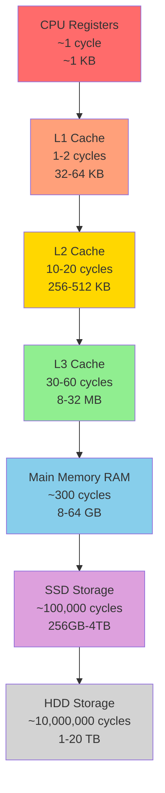

---

## Cache Address Breakdown

### Direct Mapped Cache Address

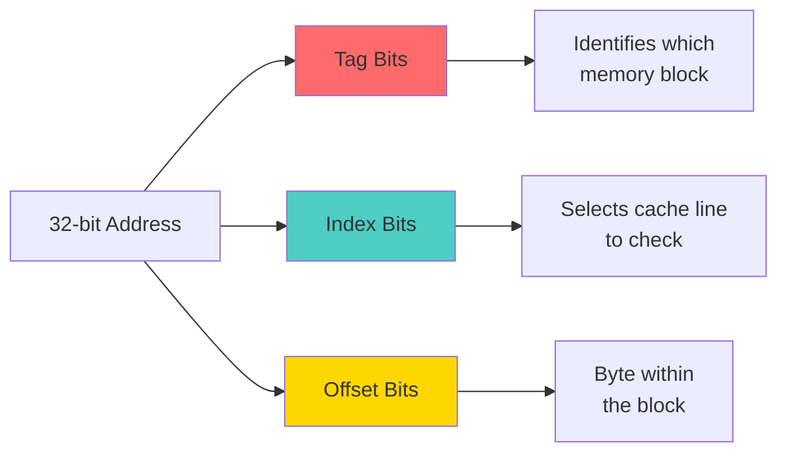

### Example: 16KB Cache, 64B Blocks

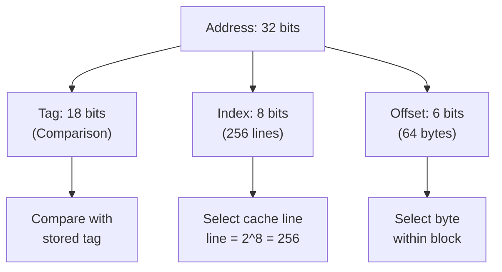

---

## Cache Mapping Techniques Comparison

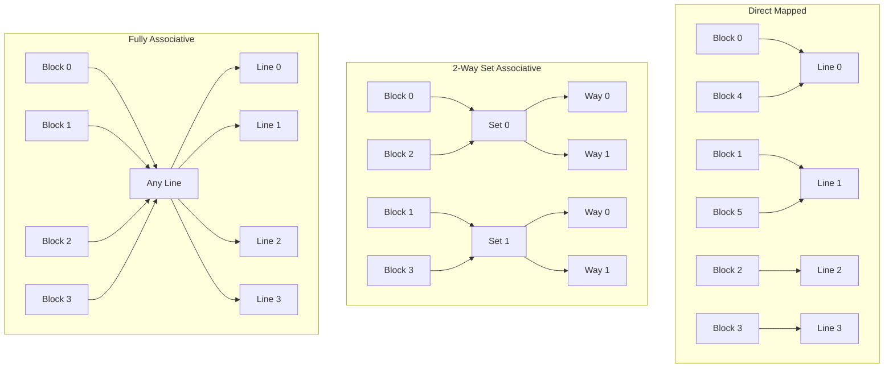

---

## Cache Lookup Process

### Direct Mapped Lookup

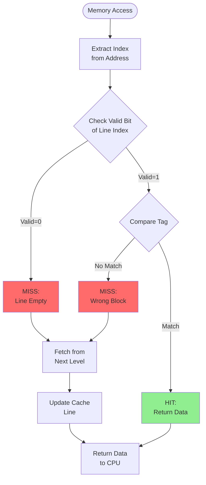

### Set Associative Lookup

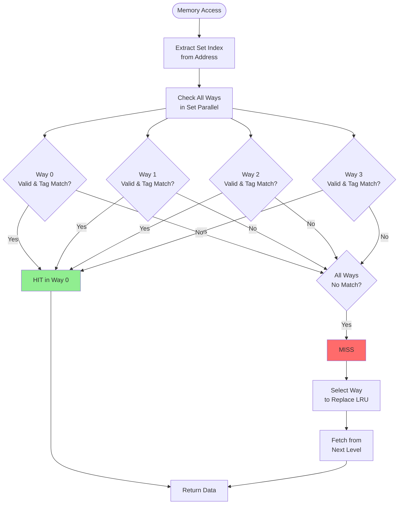

---

## The 3 C's of Cache Misses

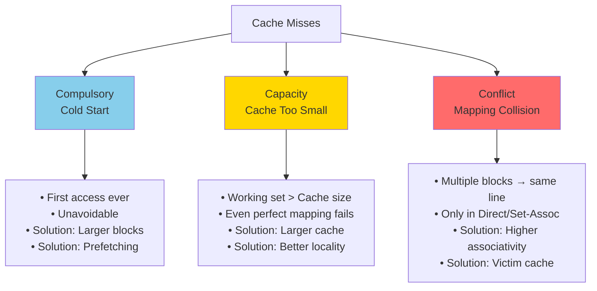

---

## Conflict Miss Example

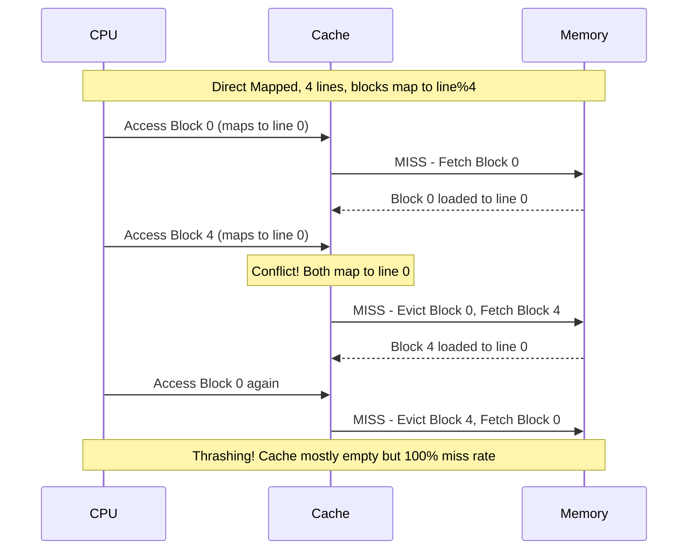

---

## Set Associative - Conflict Resolution

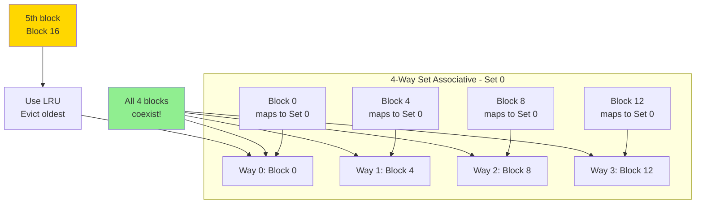

---

## Write Policies Decision Tree

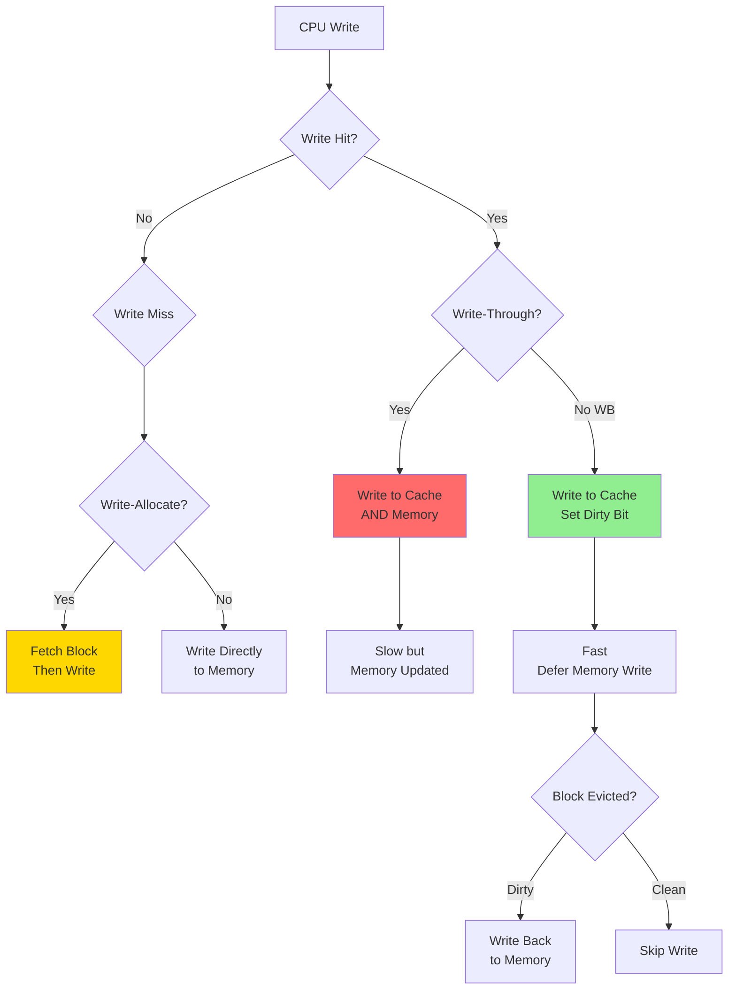

---

## Multi-Level Cache Hierarchy

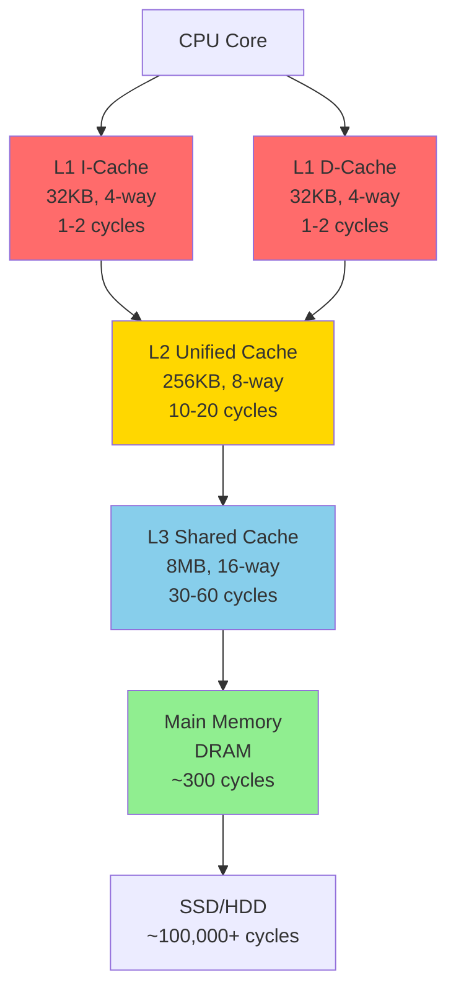

---

## Cache Performance - AMAT Calculation

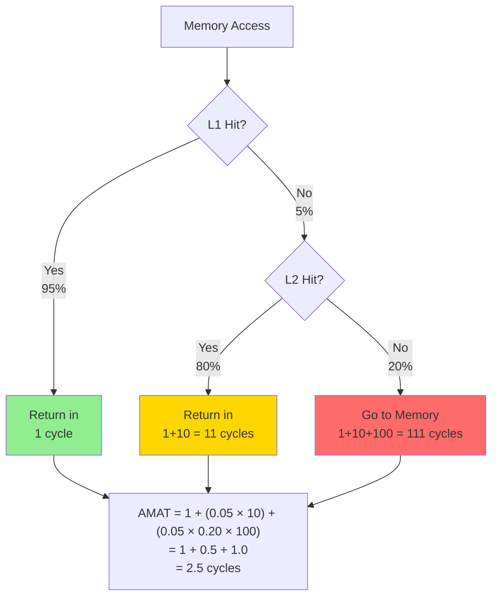

---

## Cache Optimization Categories

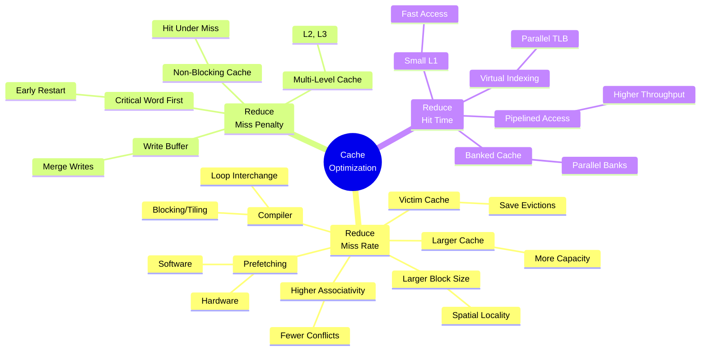

---

## Prefetching Process

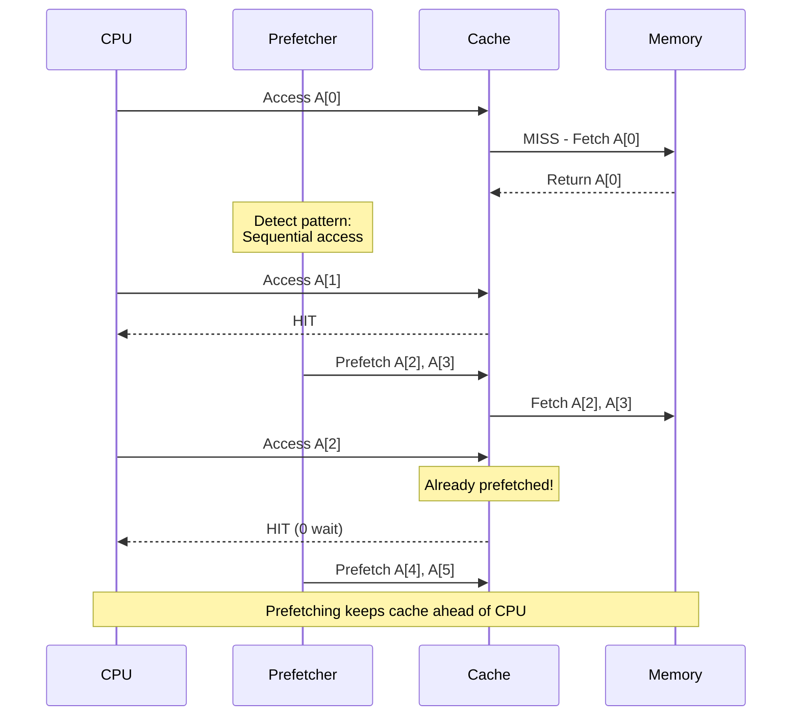

---

## Cache Coherence - MESI Protocol

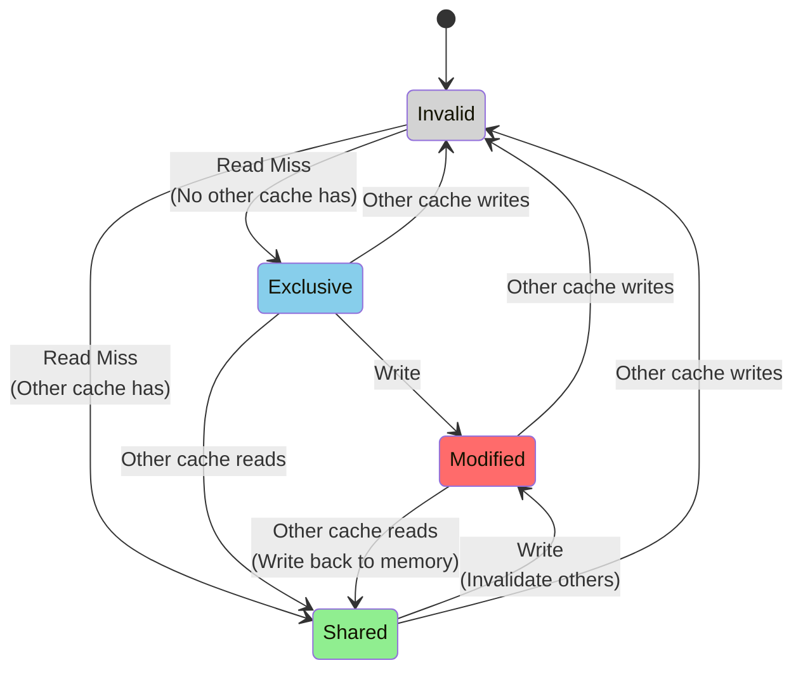

### MESI State Meanings

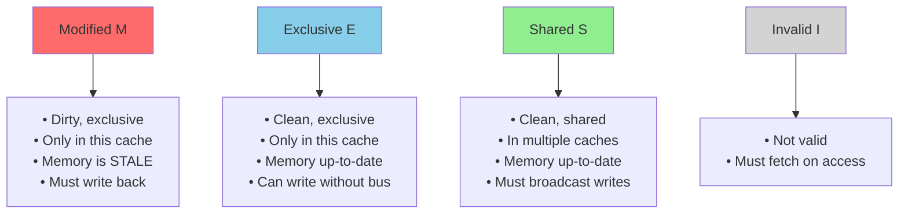

---

## Von Neumann vs Harvard Architecture

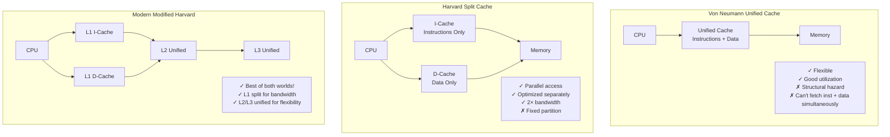

---

## Replacement Policy Comparison

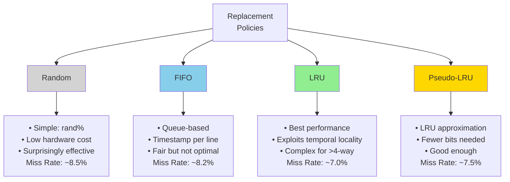

---

## Block Size vs Miss Rate

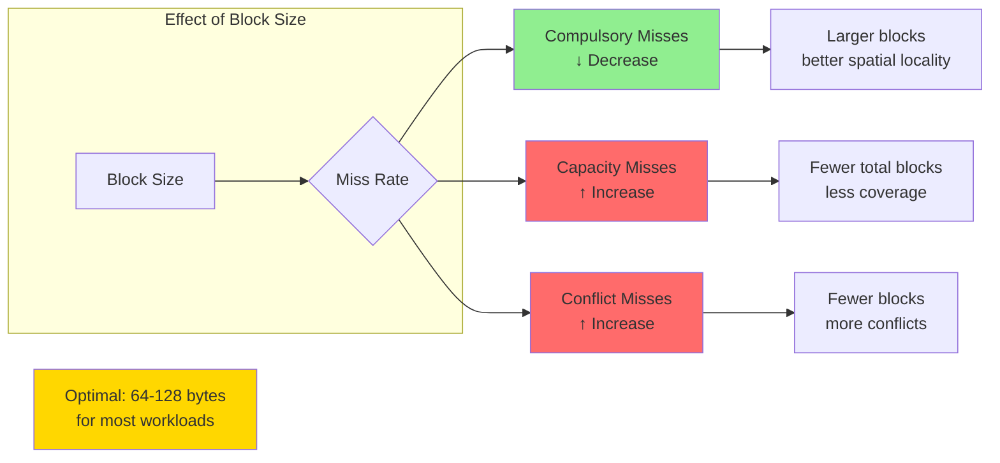

---

## Locality of Reference

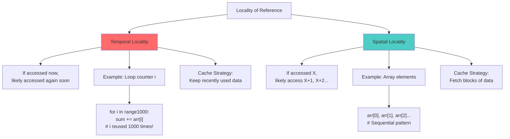

---

## Practice Problem Walkthrough

### Address Breakdown Visualization

```mermaid
graph TD
    A["Example: 32-bit address<br/>16KB cache, 64B blocks, Direct Mapped"] --> B[Calculate Fields]
    
    B --> C["Lines = 16KB / 64B = 256"]
    B --> D["Offset = log₂64 = 6 bits"]
    B --> E["Index = log₂256 = 8 bits"]
    B --> F["Tag = 32 - 8 - 6 = 18 bits"]
    
    G["Address: 0x00012340"] --> H["Binary:<br/>0000 0000 0000 0001 0010 0011 0100 0000"]
    
    H --> I["Tag: 000000000000000001<br/>18 bits"]
    H --> J["Index: 00100011<br/>8 bits"]
    H --> K["Offset: 010000<br/>6 bits"]
    
    I --> L[Compare with<br/>cache line tag]
    J --> M[Go to line 35<br/>35 in decimal]
    K --> N[Get byte 16<br/>within block]
    
    style A fill:#87ceeb
    style G fill:#ffd700
```

---

## Study Strategy Flowchart

```mermaid
flowchart TD
    Start([Start Studying]) --> Basics{Understand<br/>Basics?}
    
    Basics -->|No| Learn[Learn:<br/>• Why cache exists<br/>• Memory hierarchy<br/>• Locality principle]
    Learn --> Basics
    
    Basics -->|Yes| Map{Understand<br/>Mapping?}
    
    Map -->|No| LearnMap[Learn:<br/>• Direct mapped<br/>• Set associative<br/>• Fully associative<br/>• Practice calculations!]
    LearnMap --> Map
    
    Map -->|Yes| Perf{Understand<br/>Performance?}
    
    Perf -->|No| LearnPerf[Learn:<br/>• 3 C's of misses<br/>• AMAT calculation<br/>• Hit/miss traces<br/>• Work examples!]
    LearnPerf --> Perf
    
    Perf -->|Yes| Opt{Understand<br/>Optimizations?}
    
    Opt -->|No| LearnOpt[Learn:<br/>• Miss rate reduction<br/>• Miss penalty reduction<br/>• Hit time reduction<br/>• Know trade-offs!]
    LearnOpt --> Opt
    
    Opt -->|Yes| Practice[Practice Problems<br/>from QB]
    Practice --> Test{Can solve<br/>without notes?}
    
    Test -->|No| Review[Review weak areas]
    Review --> Practice
    
    Test -->|Yes| Ready([Ready for Exam! 🎯])
    
    style Learn fill:#ff6b6b
    style LearnMap fill:#ffd700
    style LearnPerf fill:#87ceeb
    style LearnOpt fill:#90ee90
    style Ready fill:#4ecdc4
```

---

## Quick Reference: Common Cache Sizes

```mermaid
graph TD
    A[Modern CPU Cache Hierarchy] --> B[Mobile/Low Power]
    A --> C[Desktop/Laptop]
    A --> D[Server/HPC]
    
    B --> B1["L1: 16-32 KB<br/>L2: 128-512 KB<br/>L3: 2-4 MB"]
    
    C --> C1["L1: 32-64 KB<br/>L2: 256-512 KB<br/>L3: 8-16 MB"]
    
    D --> D1["L1: 32-64 KB<br/>L2: 512 KB-1 MB<br/>L3: 32-64 MB"]
    
    style B1 fill:#87ceeb
    style C1 fill:#90ee90
    style D1 fill:#ff6b6b
```

---

## Exam Quick Facts

```mermaid
mindmap
    root((Quick Facts<br/>for Exam))
        Address Bits
            Offset = log₂Block Size
            Index = log₂Lines Direct
            Set Index = log₂Sets
            Tag = Address - Index - Offset
        Associativity
            1-way = Direct Mapped
            N-way = N ways per set
            Full = All lines = 1 set
            Higher = Fewer conflicts
        Performance
            AMAT = Hit + Miss×Penalty
            Miss Rate = 1 - Hit Rate
            Use LOCAL miss for L2
        Miss Types
            Compulsory = First access
            Capacity = Cache too small
            Conflict = Mapping collision
            No conflicts in Full Assoc
```

---

## Final Checklist

```mermaid
flowchart LR
    A[Exam Ready?] --> B{Can you...}
    
    B --> C[✓ Break down any address<br/>into Tag/Index/Offset?]
    B --> D[✓ Calculate cache size<br/>from given parameters?]
    B --> E[✓ Trace hit/miss<br/>sequences?]
    B --> F[✓ Explain each<br/>optimization?]
    B --> G[✓ Calculate AMAT<br/>for multi-level?]
    B --> H[✓ Know write policies<br/>and trade-offs?]
    
    C --> Final{All Yes?}
    D --> Final
    E --> Final
    F --> Final
    G --> Final
    H --> Final
    
    Final -->|Yes| Ready[You're Ready! 🎯]
    Final -->|No| Study[Review those topics]
    
    style Ready fill:#90ee90
    style Study fill:#ff6b6b
```

---


