# 🗄️ MPCA Unit 3: Complete Cache Memory Notes
### Microprocessor & Computer Architecture — Basics of Cache & Cache Optimization


##  TABLE OF CONTENTS

1. [Why Cache Exists — The Speed Gap](#1-why-cache-exists--the-speed-gap)
2. [Memory Hierarchy](#2-memory-hierarchy)
3. [Locality of Reference](#3-locality-of-reference)
4. [Cache Terminology & Structure](#4-cache-terminology--structure)
5. [Cache Read & Write Policies](#5-cache-read--write-policies)
6. [Cache Mapping Techniques](#6-cache-mapping-techniques)
7. [Replacement Algorithms](#7-replacement-algorithms)
8. [Worked Trace Examples (Direct / 2-Way / Fully Associative)](#8-worked-trace-examples)
9. [Cache Performance Analysis (AMAT, CPI)](#9-cache-performance-analysis)
10. [The 3 C's of Cache Misses](#10-the-3-cs-of-cache-misses)
11. [Six Cache Optimizations](#11-six-cache-optimizations)
12. [6th Optimization: VIPT — Reduce Hit Time](#12-6th-optimization-vipt--reduce-hit-time)
13. [Formula Cheat Sheet](#13-formula-cheat-sheet)

---

## 1. Why Cache Exists — The Speed Gap

### The Core Problem

CPU is getting faster every year. Memory is NOT keeping up.

| | Improvement per year |
|--|--|
| **CPU performance** | **55% per year** |
| **Memory performance** | **7% per year** |

> The gap between CPU speed and memory speed **widens every year** — this is called the **Memory Wall**.

### Real-world Speed Numbers ( if 1 CPU op = 1 second)

| Level | Real Time | "If 1 op = 1 second" |
|-------|-----------|----------------------|
| CPU Register | < 1 ns | 1 second |
| L1 Cache | ~1 ns | 3 seconds |
| L2 Cache | ~5 ns | 15 seconds |
| L3 Cache | ~15 ns | 45 seconds |
| RAM (Main Memory) | ~100 ns | **6 minutes** |
| SSD | ~100,000 ns | 3 days |
| HDD | ~10,000,000 ns | **4 months!** |

### Why Not Make Everything Fast?
Three competing constraints — you can only optimize two at a time:

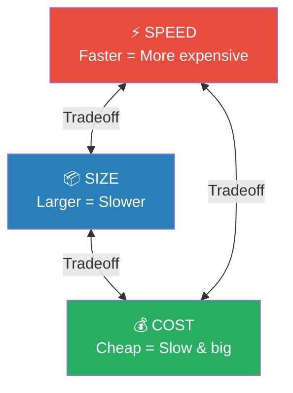

### SRAM vs DRAM

| | SRAM (Cache) | DRAM (Main Memory) |
|--|--|--|
| **Structure** | 6 transistors per bit | 1 transistor + 1 capacitor |
| **Speed** | Very fast | Slower |
| **Cost** | Expensive | Cheap |
| **Density** | Low | High |
| **Refresh needed?** | No | **Yes — every few ms** |

> **Why DRAM needs refresh:** The capacitor in each bit slowly leaks charge (like a bucket with a tiny hole). Every few milliseconds, the memory controller must re-read and re-write every bit to restore the charge — this is the refresh cycle.

---

## 2. Memory Hierarchy

The solution to the speed-size-cost triangle: **organize memory into levels**.

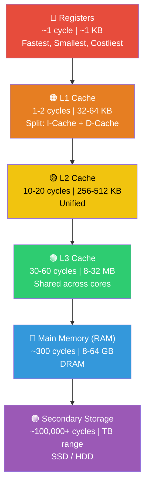

**The key rule:** Each level is a **subset** of the level below it.

> **Cache definition:** An architectural arrangement that makes main memory *appear* faster to the processor than it really is.

---

## 3. Locality of Reference

This is WHY caches work. Programs don't access memory randomly — they follow predictable patterns.

**The 90/10 Rule:** "A program spends 90% of its time in 10% of its code."

### Two Types of Locality

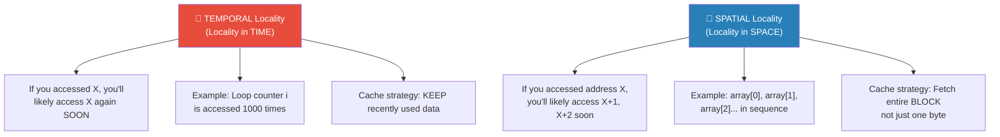

```c
for (int i = 0; i < 1000; i++) {
    sum += array[i];
}
// i is accessed 1000 times → TEMPORAL locality
// array[0], array[1], ... sequential → SPATIAL locality
```

> **Temporal locality** → Don't put all data in memory (keep what was used recently in cache)
> **Spatial locality** → Don't transfer single bytes — transfer **blocks** of contiguous bytes

---

## 4. Cache Terminology & Structure

### Key Jargons

| Term | Meaning |
|------|---------|
| **Memory Latency** | Time to transfer ONE word of data to/from memory |
| **Memory Bandwidth** | Number of bits/bytes transferred per second |
| **Block (Line)** | Minimum unit of transfer — a set of contiguous addresses |
| **Cache Line** | One slot in the cache that stores one block |
| **Block Size** | How many bytes in one block (typically 32–256 bytes) |
| **Hit** | Requested data IS in cache |
| **Miss** | Requested data is NOT in cache |
| **Miss Penalty** | Extra time to fetch from next level on a miss |

### The Cache Hierarchy

```
Main Memory:
- 16-bit address → 65,536 (64K) words
- 4096 (4K) blocks of 16 words each

Cache:
- 128 lines of 16 words each
- Total size: 2048 (2K) words
- Ratio: 4096 ÷ 128 = 32 possible blocks map to ONE cache line
```

### Anatomy of a Cache Line

```
+-------+-------+-----------+------------------+
| Valid |  Dirty |    Tag    |   Data Block      |
|  bit  |  bit  |  (n bits) |  (block_size B)   |
+-------+-------+-----------+------------------+
   1 b     1 b
```

| Field | Purpose |
|-------|---------|
| **Valid bit (V=1)** | Line contains meaningful data; V=0 means empty |
| **Dirty bit (D=1)** | Data was MODIFIED in cache but NOT yet written to memory (write-back only) |
| **Tag** | Identifies WHICH memory block is stored here |
| **Data** | The actual bytes — the payload |

### Four Fundamental Cache Design Questions

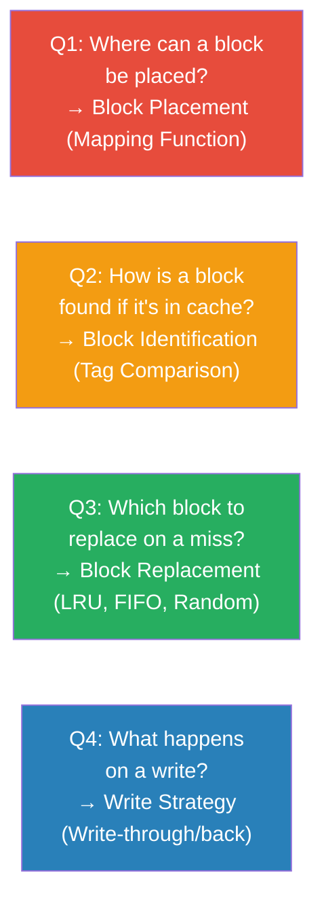

---

## 5. Cache Read & Write Policies

### Read Policies

**On Read HIT:** Data is in cache → return it immediately. Fast!

**On Read MISS:** Data is NOT in cache → fetch entire block from memory.

**Load-Through (Early-Restart):**
> Instead of waiting for the ENTIRE block to arrive from memory, the processor gets the requested word as soon as it's transferred, without waiting for the rest of the block to arrive.

This reduces visible miss penalty!

---

### Write Policies — The Consistency Problem

When CPU writes `A = 11`, should memory also be updated immediately?

```
Before write A:
  Cache: A=0    Memory: A=0      ← Consistent ✅

After write A to cache only:
  Cache: A=11   Memory: A=0      ← INCONSISTENT ❌
```

Two strategies for what to do on a **Write HIT:**

### Write-Through (on Hit)

> Write to BOTH cache AND memory simultaneously.

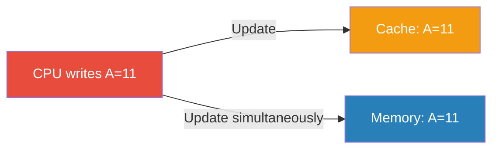

| ✅ Pros | ❌ Cons |
|---------|---------|
| Memory always up-to-date | Slow — every write waits for memory |
| Simple consistency | High memory bandwidth usage |
| Easy for multiprocessor | Cache speed advantage lost |

**Write Buffer for Write-Through:**
To avoid blocking the CPU, use a write buffer between cache and memory. CPU writes to cache + buffer, then continues. Buffer drains to memory in background.

---

### Write-Back (on Hit)

> Write to cache ONLY. Set dirty bit = 1. Write to memory only when block is EVICTED.

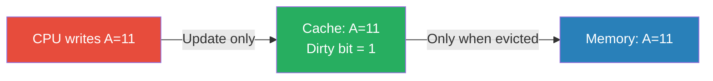

**When dirty block is evicted:**
1. Write dirty block back to memory
2. Replace with new block
3. Set dirty bit = 0

| ✅ Pros | ❌ Cons |
|---------|---------|
| Fast — write at cache speed | Memory can be stale |
| Multiple writes → only 1 memory write | Complex coherence in multicore |
| Reduced memory traffic | Eviction takes longer (dirty write-back) |

---

### Write Miss Policies — What happens on a Write MISS?

Two options:

**Write-Allocate (Fetch on Write):**
1. Bring block from memory into cache
2. Write to cache
3. (If write-back, set dirty bit)

```c
// Good for: data written THEN read again soon
a[i] = value;        // Write miss → bring block in
result = a[i] + 1;   // Read hit! Block is already in cache
```

**Write No-Allocate (Write-Around):**
1. Write directly to memory
2. Don't bring block into cache

```c
// Good for: data written but NOT used again soon
for (i=0; i<10; i++)
    a[i] = i*2;  // Each location written ONCE, never re-read
                 // No point loading into cache
```

### Summary Table

| Policy combo | Write Hit | Write Miss |
|--|--|--|
| **Write-back + Write-allocate** | Write to cache (dirty bit) | Fetch then write to cache |
| **Write-through + No-write-allocate** | Write to cache AND memory | Write directly to memory |

### Cache Friendly Code 💡

```c
// Row-wise (GOOD) — Spatial locality — Miss rate ~25%
for (i = 0; i < M; i++)
    for (j = 0; j < N; j++)
        sum += a[i][j];   // a[i][0], a[i][1]... contiguous in memory

// Column-wise (BAD) — No spatial locality — Miss rate ~100%
for (j = 0; j < N; j++)
    for (i = 0; i < M; i++)
        sum += a[i][j];   // a[0][j], a[1][j]... non-contiguous!
```

---

## 6. Cache Mapping Techniques

> **This is the most important section.** Understand how addresses are split and how lookup works.

### The Big Picture

Main memory has M blocks. Cache has C lines (C << M). How do we decide which block goes where?

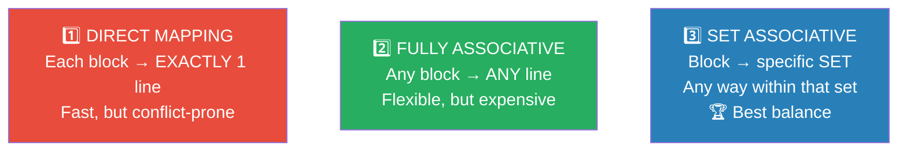

---

### 6.1 Direct Mapping

**Rule:** Block j maps to **cache line = j mod (number of lines)**

> **Mental model:** Numbered parking spaces. Your block MUST go to slot (block# % total_slots). No choice!

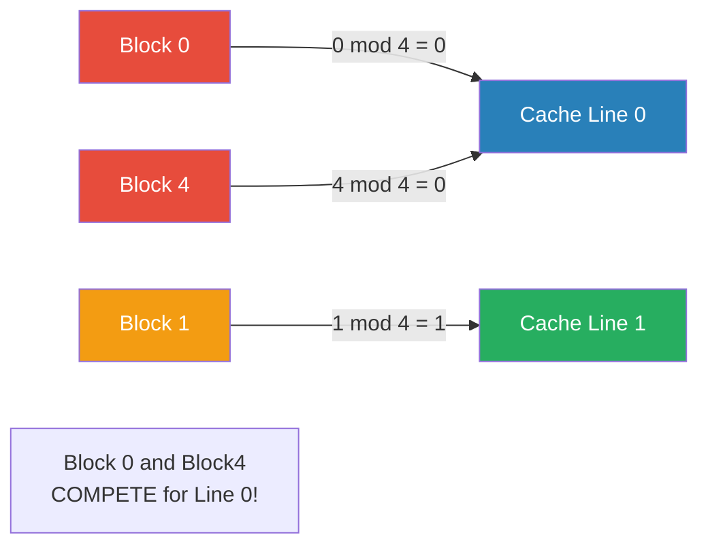

### Address Breakdown — Direct Mapped

**Given:** Cache size = 16 KB, Block size = 64 B, Address = 16 bits

```
Step 1: Lines = 16 KB / 64 B = 256 lines
Step 2: Offset bits = log₂(64) = 6 bits
Step 3: Index bits = log₂(256) = 8 bits
Step 4: Tag bits = 16 - 8 - 6 = 2 bits
```

```
Address (16 bits):
15     14 13      6  5         0
+--------+---------+-----------+
|  Tag   |  Index  |   Offset  |
| 2 bits |  8 bits |   6 bits  |
+--------+---------+-----------+
     ↓         ↓         ↓
 Compare   Which     Which byte
 stored     line      in block
  tag      to go     
```

| Field | What it tells you | Size |
|-------|-------------------|------|
| **Offset** | Which byte inside the block (0-63) | 6 bits |
| **Index** | Which cache line to look in (0-255) | 8 bits |
| **Tag** | Which memory block is currently in that line (compare with stored tag) | 2 bits |
---

### Lookup Process — Direct Mapped

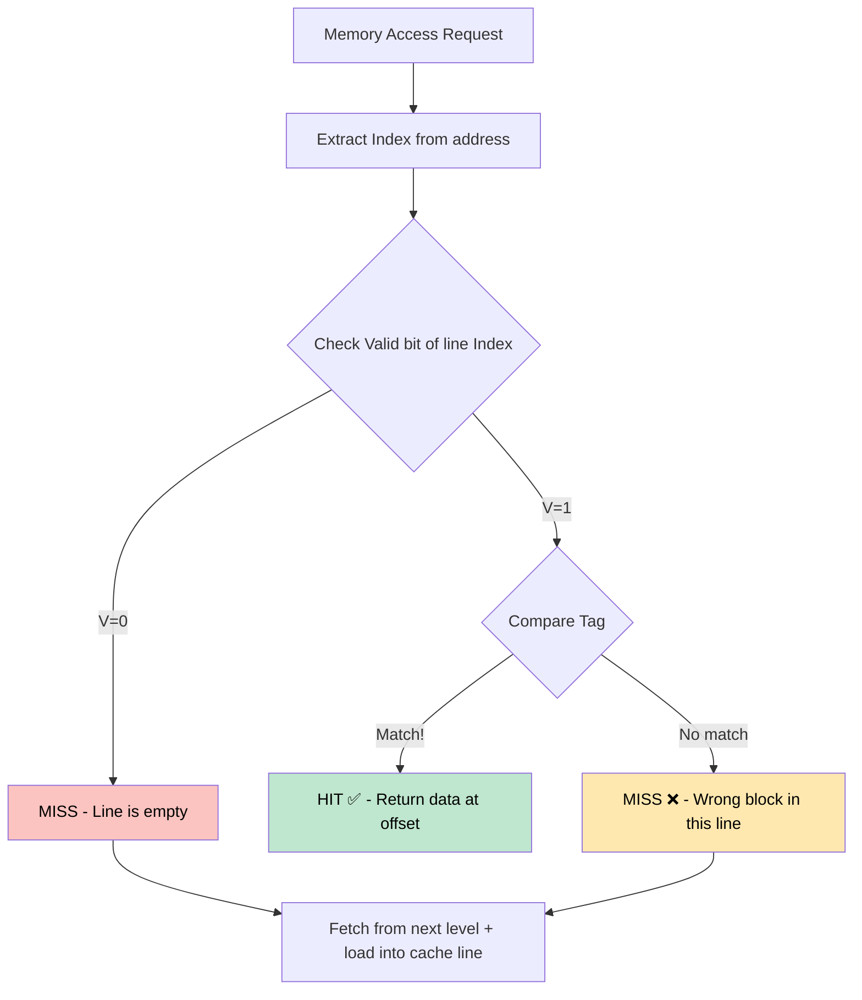

**Pros:** Simple, fast, cheap, deterministic lookup time

**Cons:** Conflict misses! Two popular blocks fighting for the same line causes **thrashing**

---

### 6.2 Fully Associative Mapping

**Rule:** Any block can go into ANY cache line. No index field!

> **Mental model:** Open parking — park anywhere. But to find your car, you must check every space!

### Address Breakdown — Fully Associative

```
Step 1: Offset bits = log₂(Block Size)
Step 2: NO index bits (can go anywhere)
Step 3: Tag bits = Address bits - Offset bits

Address:
31                    6  5         0
+------------------------+-----------+
|     Tag (all bits)     |   Offset  |
+------------------------+-----------+
          ↓                    ↓
   Compare against ALL      Which byte
   lines in parallel          in block
```

### Lookup: Check ALL lines simultaneously (parallel comparators)

| ✅ Pros | ❌ Cons |
|---------|---------|
| NO conflict misses | Very expensive hardware |
| Best cache utilization | N comparators for N lines |
| Flexible placement | High power |
| No thrashing possible | Larger tags |

---

### 6.3 Set Associative Mapping (The Best of Both)

**Rule:** Divide cache into SETS. Block maps to a specific SET (like direct-mapped), but can go into ANY WAY within that set (like fully associative).

> **Mental model:** Multi-floor parking garage. Your license plate tells you which FLOOR (set). You can park in any SPACE on that floor (ways).

### Key Formula

```
Set Number = Block Number mod (Number of Sets)
Within that set: block can go into any of the N ways
```

### Address Breakdown — N-Way Set Associative

**Given:** 4-way, Cache = 16 KB, Block = 64 B, Address = 16 bits

```
Step 1: Total lines = 16 KB / 64 B = 256 lines
Step 2: Sets = 256 / 4 = 64 sets
Step 3: Offset bits = log₂(64) = 6
Step 4: Set index bits = log₂(64) = 6
Step 5: Tag bits = 16 - 6 - 6 = 4 bits
```

```
Address (16 bits):
15        12 11      6  5         0
+-----------+---------+-----------+
|   Tag     |   Set   |   Offset  |
|  4 bits   |  6 bits |   6 bits  |
+-----------+---------+-----------+
      ↓           ↓          ↓
  Compare all  Which set  Which byte
  4 ways in    to search
  this set
```

### Lookup Process — N-Way Set Associative
---
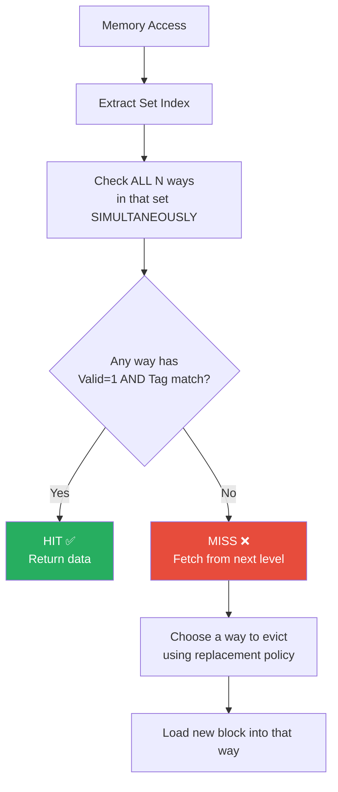


### Comparison Table — All Three Mappings

| Feature | Direct Mapped | Set Associative | Fully Associative |
|---------|--------------|----------------|-------------------|
| **Placement** | Exactly 1 line | Any way in 1 set | Any line |
| **Hardware** | 1 comparator | N comparators | N comparators per line |
| **Conflict misses** | HIGH | Medium | ZERO |
| **Tag size** | Smaller | Medium | Largest |
| **Complexity** | Simple | Moderate | Complex |
| **Speed** | Fastest | Fast | Slower |
| **Associativity** | 1-way | N-way | C-way (C = total lines) |

> **Key Insight from the slides:** 
> - Direct mapped = Set associative with 1 way per set
> - Fully associative = Set associative with ALL blocks in 1 set

---

### Address Breakdown Examples from PDF

#### Exercise 1: Fully Associative, 16 KB cache, 256 B block, 128 KB memory
```
Memory = 128 KB = 2¹⁷ → 17 address bits
Block = 256 B = 2⁸ → Offset = 8 bits
Tag = 17 - 8 = 9 bits    (No index — fully associative!)
```

#### Exercise 2: 2-Way SA, 16 KB cache, 256 B block, 128 KB memory
```
Total lines = 16 KB / 256 B = 64 lines
Sets = 64 / 2 = 32 sets → Set index = 5 bits
Offset = log₂(256) = 8 bits
Tag = 17 - 5 - 8 = 4 bits
```

#### Exercise 3: 2-Way SA, 2 KB cache, 64 B block, 16-bit address
```
Lines = 2 KB / 64 B = 32 lines
Sets = 32 / 2 = 16 sets → Set index = 4 bits
Offset = log₂(64) = 6 bits
Tag = 16 - 4 - 6 = 6 bits
```
Trace: 128, 144, 2176, 2180, 128, 2176
→ **MISS, HIT, MISS, HIT, HIT, HIT** (Hit rate = 4/6 = 0.667)

*Compare to direct-mapped: MISS, HIT, MISS, HIT, MISS, MISS (Hit rate = 2/6 = 0.333)*

---

## 7. Replacement Algorithms

> Only needed for **Set Associative** and **Fully Associative** caches (Direct mapped has no choice — fixed location).

**Question:** When a miss occurs and all ways in a set are full, which block do we evict?

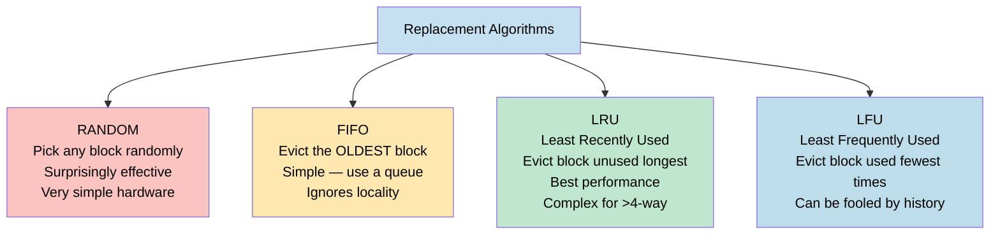

### LRU — How It Works

Maintain an age ordering. When you access a block, mark it as "most recently used". When you need to evict, pick the "least recently used".

**2-way example:**
```
Set has: [Block A (older), Block B (newer)]
Access Block A → now: [Block B (older), Block A (newer)]
Miss → evict Block B (LRU)
```

| Algorithm | Miss Rate | Hardware Cost | Notes |
|-----------|-----------|---------------|-------|
| Random | ~8.5% | Very Low | Good enough, used in some real CPUs |
| FIFO | ~8.2% | Low | Easy queue |
| Pseudo-LRU | ~7.5% | Medium | Approximation, practical |
| True LRU | ~7.0% | High | Only practical up to 4-way |

> **Direct mapping** has NO replacement choice — the new block always replaces whatever is in its mapped line.

---

## 8. Worked Trace Examples

### Trace Problem Setup 

**Sequence:** `4, 3, 25, 8, 19, 6, 25, 8, 16, 35, 45, 22, 8, 3, 16, 25, 7`

### Exercise 1: Direct Mapping — 8 Cache Blocks

**Rule:** Line = Block# mod 8

| Block | mod 8 → Line | Block | mod 8 → Line |
|-------|-------------|-------|-------------|
| 4 | → Line 4 | 8, 16 | → Line 0 |
| 3, 19, 35 | → Line 3 | 25 | → Line 1 |
| 6, 22 | → Line 6 | 45 | → Line 5 |
| 7 | → Line 7 | | |

**Result:** Miss=14, Hit=3 (25, 8, 25) → **Hit ratio = 3/17**

### Exercise 2: FIFO — 2-Way Set Associative, 4 Sets (j mod 4)

**Set groups:**
- Set 0: 4, 8, 16, ...
- Set 1: 25, 45, ...
- Set 2: 6, 22, ...
- Set 3: 3, 7, 19, 35, ...

**Result:** Miss=12, Hit=5 → **Hit ratio = 5/17**

### Exercise 3: FIFO — Fully Associative, 8 Lines

| Step | Access | Result | Cache Contents (8 slots) | Evict |
|------|--------|--------|--------------------------|-------|
| 1 | 4 | MISS | `[4, -, -, -, -, -, -, -]` | — |
| 2 | 3 | MISS | `[4, 3, -, -, -, -, -, -]` | — |
| 3 | 25 | MISS | `[4, 3, 25, -, -, -, -, -]` | — |
| 4 | 8 | MISS | `[4, 3, 25, 8, -, -, -, -]` | — |
| 5 | 19 | MISS | `[4, 3, 25, 8, 19, -, -, -]` | — |
| 6 | 6 | MISS | `[4, 3, 25, 8, 19, 6, -, -]` | — |
| 7 | 25 | HIT | `[4, 3, 25, 8, 19, 6, -, -]` | — |
| 8 | 8 | HIT | `[4, 3, 25, 8, 19, 6, -, -]` | — |
| 9 | 16 | MISS | `[4, 3, 25, 8, 19, 6, 16, -]` | — |
| 10 | 35 | MISS | `[4, 3, 25, 8, 19, 6, 16, 35]` | — |
| 11 | 45 | MISS | `[45, 3, 25, 8, 19, 6, 16, 35]` | **4** |
| 12 | 22 | MISS | `[45, 22, 25, 8, 19, 6, 16, 35]` | **3** |
| 13 | 8 | HIT | `[45, 22, 25, 8, 19, 6, 16, 35]` | — |
| 14 | 3 | MISS | `[45, 22, 3, 8, 19, 6, 16, 35]` | **25** |
| 15 | 16 | HIT | `[45, 22, 3, 8, 19, 6, 16, 35]` | — |
| 16 | 25 | MISS | `[45, 22, 3, 25, 19, 6, 16, 35]` | **8** |
| 17 | 7 | MISS | `[45, 22, 3, 25, 7, 6, 16, 35]` | **19** |

**Result:** Miss=13, Hit=4 → **Hit ratio = 4/17**

### Exercise 4: LRU — Fully Associative, 8 Lines

Same structure but smarter eviction — evict what was used LEAST recently.

**Result:** Miss=12, Hit=5 → **Hit ratio = 5/17** (better than FIFO!)

### Practice Problem: 4-Block Cache, Sequence: 5, 12, 13, 17, 4, 12, 13, 17, 2, 13, 19, 13, 43, 61, 19

| Algorithm | Hits | Hit Ratio |
|-----------|------|-----------|
| FA FIFO | 5 | 5/15 = 0.33 |
| FA LRU | 6 | 6/15 = **0.40** |
| Direct Mapping | 1 | 1/15 = 0.07 |
| 2-Way SA LRU | 5 | 5/15 = 0.33 |

**Key Takeaway:** LRU > FIFO > Direct (for this sequence). More associativity generally helps.

---

## 9. Cache Performance Analysis

### Three Key Performance Factors

```
AMAT = Hit Time + Miss Rate × Miss Penalty
```

| Factor | Definition |
|--------|-----------|
| **Hit Time** | Time to access data when it IS in cache |
| **Miss Rate** | Fraction of accesses that result in a miss |
| **Miss Penalty** | Extra time to fetch from the next level on a miss |

### AMAT(Average Memory Access Time) Formula

```
AMAT = Hit Time + (Miss Rate × Miss Penalty)
```

**Lower AMAT = better performance.**

### Calculating Miss Penalty

Three steps to load a block from RAM:
1. Send address to RAM (1 cycle)
2. RAM access latency (e.g., 15 cycles)
3. Receive data from RAM (1 cycle)

**Example 1:** 1-word block
```
Miss Penalty = 1 + 15 + 1 = 17 cycles
```

**Example 2:** 4-word block (naive, sequential fetch)
```
Miss Penalty = 4 × (1 + 15 + 1) = 68 cycles  ← too slow!
```

**Example 3:** 4-word block with overlapped memory banks (pipelining!)
```
Miss Penalty = 1 + 15 + (4 × 1) = 20 cycles  ← much better!
```

> **The interleaved/banked memory idea:** As soon as you request word 1 from Bank 1, you can immediately request word 2 from Bank 2 — they work in parallel. Individual load = 17 cycles, but 4 overlapped loads = 20 cycles only!

### CPI Impact of Cache

```
CPU Execution Time = IC × CPI × Cycle Time

Overall CPI = Base CPI + Memory Stall Cycles

Memory Stall Cycles = Memory Accesses × Miss Rate × Miss Penalty
```

### AMAT Example (from PDF)

**Given:** Cache 1: 32-byte blocks, 5% miss rate | Cache 2: 64-byte blocks, 4% miss rate
Memory overhead = 1 cycle, RAM = 15 cycles, Bus = 8 bytes wide

```
Cache 1: Miss Penalty = 1 + 15 + 32/8 = 20 cycles
         AMAT = 1 + 0.05 × 20 = 2.0 cycles

Cache 2: Miss Penalty = 1 + 15 + 64/8 = 24 cycles
         AMAT = 1 + 0.04 × 24 = 1.96 cycles  ← slightly better
```

### Example: Split I-Cache + D-Cache (from PDF)

```
Given:
- I-cache miss rate = 2%
- D-cache miss rate = 4%
- Miss penalty = 100 cycles
- Base CPI = 2
- Load/stores = 36% of instructions

Miss cycles per instruction:
  I-cache: 0.02 × 100 = 2 cycles
  D-cache: 0.36 × 0.04 × 100 = 1.44 cycles

Actual CPI = 2 + 2 + 1.44 = 5.44

Ideal CPU speedup = 5.44 / 2 = 2.72×
```

### Multi-Level Cache AMAT

```
AMAT = Hit_Time_L1 + Miss_Rate_L1 × [Hit_Time_L2 + Miss_Rate_L2 × Miss_Penalty_L2]
```

**Local vs Global Miss Rate:**
- **Local Miss Rate L2** = Misses in L2 / Accesses to L2
- **Global Miss Rate L2** = Miss_Rate_L1 × Miss_Rate_L2

> Always use **global miss rate** when evaluating second-level caches!

### Multi-level Example (from PDF)

```
Given: 1000 refs → 40 L1 misses → 20 L2 misses
L1 hit time = 1, L2 hit time = 10, Memory penalty = 200, 1.5 refs/instruction

Miss rates:
  L1 miss rate = 40/1000 = 4%
  L2 local miss rate = 20/40 = 50%
  L2 global miss rate = 20/1000 = 2%

AMAT = 1 + 4% × (10 + 50% × 200)
     = 1 + 0.04 × 110
     = 5.4 clock cycles
```

---

## 10. The 3 C's of Cache Misses

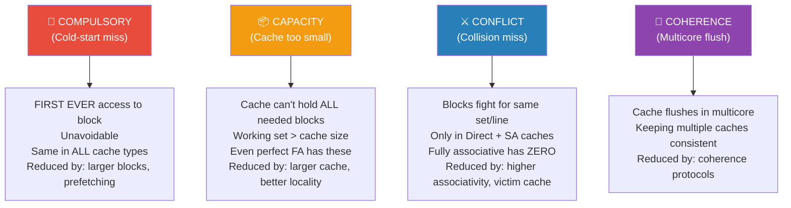

### How to Calculate Each Type

| Type | How to count |
|------|-------------|
| Compulsory | Misses that occur even with an **infinite** cache |
| Capacity | Misses in **fully associative** cache minus compulsory |
| Conflict | Misses in N-way SA cache minus (compulsory + capacity) |

---

## 11. Six Cache Optimizations

```
AMAT = Hit Time + Miss Rate × Miss Penalty
         ↑               ↑              ↑
     Optimization 6   Opt 1,2,3      Opt 4,5
```

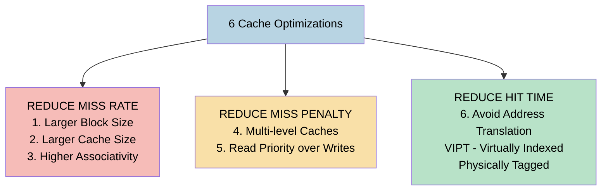

---

### Optimization 1: Larger Block Size → Reduce Miss Rate

**Targets:** Compulsory misses

**Why it helps:** Exploits spatial locality — when you fetch more bytes per miss, neighboring data (that you'll probably need soon) comes along for free.

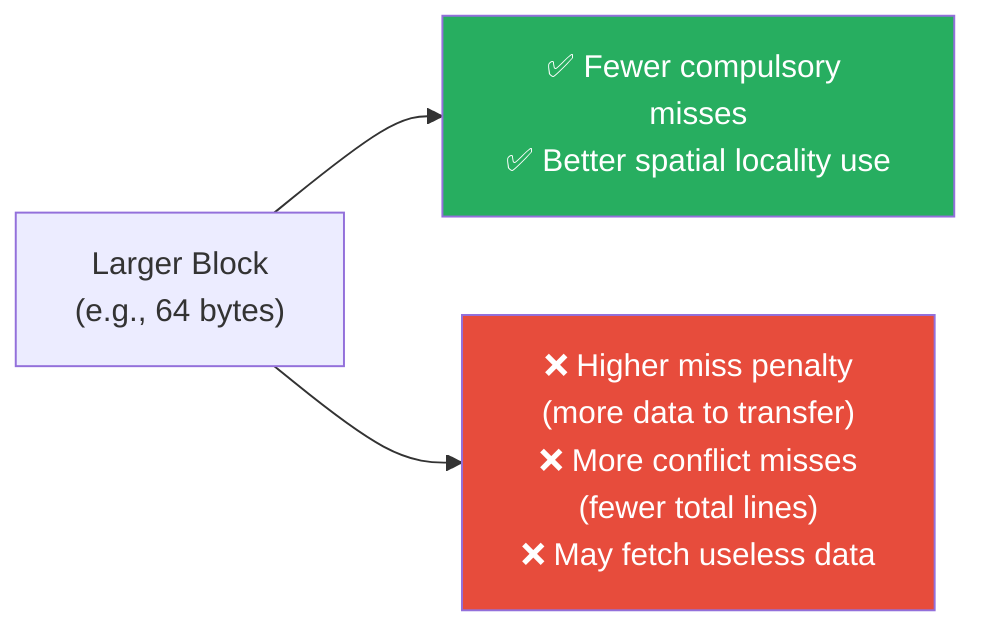

**Optimal block size:** 64 bytes for most workloads — beyond that, conflict misses start increasing.

**From PDF example:** A 32-word cache:
- As 8 blocks of 4 words → more lines, fewer conflicts
- As 2 blocks of 16 words → fewer lines, more conflicts, but fewer compulsory misses

---

### Optimization 2: Larger Cache → Reduce Miss Rate

**Targets:** Capacity misses

**Why it helps:** More lines → larger working set fits in cache → fewer evictions.

| ✅ Advantage | ❌ Disadvantage |
|-------------|----------------|
| Reduces capacity misses | Increases hit time |
| Accommodates larger memory footprint | High cost, area, and power |

**Typical sizes:**
- L1: 32-64 KB (small for speed — must be 1-2 cycle access)
- L2: 256-512 KB
- L3: 8-32 MB

---

### Optimization 3: Higher Associativity → Reduce Miss Rate

**Targets:** Conflict misses

**Why it helps:** More ways per set → multiple blocks can coexist in same set → no thrashing.

```
Conflict miss rate vs associativity:
Direct mapped (1-way)  →  highest conflicts
2-way  →  big drop
4-way  →  good
8-way  →  small improvement
Fully associative → zero conflicts (but impractical)
```

**BUT — Higher associativity increases hit time!** More ways = more comparators = slower lookup.

**AMAT Trade-off example from PDF:**
```
Given: Miss penalty = 25 cycles, Hit time scales with associativity:
  1-way hit time = 1.00, miss rate = 9.8%
  8-way hit time = 1.52, miss rate = 0.6%

AMAT 1-way = 1.00 + 0.098 × 25 = 3.45
AMAT 8-way = 1.52 + 0.006 × 25 = 1.67

→ 8-way still wins despite higher hit time!
```

> **Sweet spot:** 4-way or 8-way set associative in modern CPUs.

---

### Optimization 4: Multilevel Caches → Reduce Miss Penalty

**Targets:** Miss penalty

**Why it helps:** Instead of going all the way to slow RAM on every L1 miss, go to a faster L2 first.

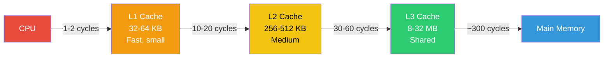

**Design principles:**
- **L1:** Optimize for **hit time** — small, low associativity
- **L2:** Optimize for **miss rate** — larger, higher associativity
- **L3:** Optimize for **capacity** — very large, shared across cores

**AMAT with L2:**
```
Without L2: AMAT = 1 + (0.05 × 100) = 6 cycles
With L2:    AMAT = 1 + (0.05 × 10) + (0.05 × 0.20 × 100) = 2.5 cycles
Speedup = 6 / 2.5 = 2.4×
```

---

### Optimization 5: Prioritize Reads Over Writes → Reduce Miss Penalty

**Targets:** Miss penalty for read misses

**Problem with write buffers:** On a read miss, the needed data might still be in the write buffer (not yet written to memory). Two choices:
1. Wait for write buffer to empty → slow
2. Check write buffer for conflicts → if no conflict, **let read continue immediately**

> **Virtually all processors use option 2** — read miss checks write buffer; if no conflict and memory is free, the read proceeds without waiting.

**Write-back cache complication:**
When a read miss needs to replace a **dirty block**:
- Copy dirty block to a temporary buffer
- Read new block from memory
- Write dirty block back to memory later

This way, the read completes sooner!

**Read-After-Write Hazard Example from PDF:**
```assembly
SW R3, 512(R0)    ; Write R3 to address 512 → goes to write buffer
LW R1, 1024(R0)  ; Read from 1024 → miss! (512 and 1024 map to same line)
LW R2, 512(R0)   ; Read from 512 → if write buffer not checked, gets OLD value!
```
→ Without proper read-priority, **R2 ≠ R3** even though we just wrote R3 to 512!

---

## 12. 6th Optimization: VIPT — Reduce Hit Time

### The Problem

Every cache access needs a physical address, but the CPU generates a **virtual address**. Converting virtual → physical requires a **TLB lookup** — which takes extra cycles.


### The Solution: VIPT (Virtually Indexed, Physically Tagged)

**Key insight:** The **page offset** bits are the SAME in both virtual and physical address (OS doesn't change them). So we can use the offset bits to START indexing the cache while TLB is running in parallel!

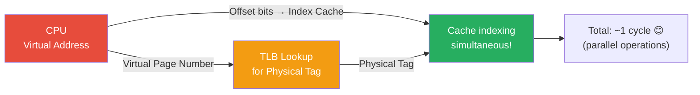

### PIPT vs VIPT Summary

| | PIPT | VIPT |
|--|------|------|
| **Indexing** | Physical address | Virtual address (offset bits) |
| **Tagging** | Physical address | Physical address |
| **TLB timing** | Sequential (slow) | Parallel (fast) |
| **Correctness** | Always correct | Correct if page offset ≥ index bits |

### Case Study from PDF

**Specification:**
```
64-bit Virtual Address, 41-bit Physical Address
8 KB Page Size (= 2¹³)
TLB: Direct Mapped, 256 entries
L1 Cache: 8 KB, Direct Mapped, 64 B blocks
L2 Cache: 4 MB, Direct Mapped, 64 B blocks
```

**Step-by-step solution:**

```
Page Offset = log₂(8KB) = 13 bits
VPN = 64 - 13 = 51 bits
PPN = 41 - 13 = 28 bits

TLB:
  Index = log₂(256) = 8 bits
  Tag = VPN - TLB index = 51 - 8 = 43 bits

L1 Cache:
  Blocks = 8KB / 64B = 2⁷ = 128 → Index = 7 bits
  Offset = log₂(64) = 6 bits
  Tag = Physical address - (index + offset) = 41 - 7 - 6 = 28 bits

L2 Cache:
  Blocks = 4MB / 64B = 2¹⁶ → Index = 16 bits
  Offset = 6 bits
  Tag = 41 - 16 - 6 = 19 bits
```

| Component | Tag | Index | Offset |
|-----------|-----|-------|--------|
| TLB | 43 | 8 | 13 (page offset) |
| L1 Cache | 28 | 7 | 6 |
| L2 Cache | 19 | 16 | 6 |

---

## 13. Formula Cheat Sheet

### Address Bit Calculations

```
Offset bits    = log₂(Block Size in bytes)
Lines (direct) = Cache Size / Block Size
Index bits     = log₂(Number of Lines)
Sets (N-way)   = Number of Lines / N
Set index bits = log₂(Number of Sets)
Tag bits       = Address bits - Index/Set bits - Offset bits
```

**Memory size from tag bits:**
```
Total address bits = Tag + Index + Offset
Memory size = 2^(Total address bits) bytes
```

### Performance Formulas

```
Hit Rate = Hits / Total Accesses
Miss Rate = 1 - Hit Rate = Misses / Total Accesses

AMAT = Hit Time + Miss Rate × Miss Penalty

Multi-level AMAT:
AMAT = L1_Hit + (L1_Miss × L2_Hit) + (L1_Miss × L2_Miss × Mem)

CPI = Base_CPI + Memory_Stalls_per_Instruction
Memory_Stalls = Memory_Accesses × Miss_Rate × Miss_Penalty

Effective CPI = Base_CPI + (Mem_Access_Fraction × Miss_Rate × Miss_Penalty)
```

### The 6 Optimizations Summary

| # | What | Targets | Trade-off |
|---|------|---------|-----------|
| 1 | Larger block size | Miss Rate (compulsory) | More miss penalty + conflict misses |
| 2 | Larger cache | Miss Rate (capacity) | Higher hit time + cost |
| 3 | Higher associativity | Miss Rate (conflict) | Higher hit time + complexity |
| 4 | Multi-level cache | Miss Penalty | More cost + complexity |
| 5 | Read priority over writes | Miss Penalty | Complex control logic |
| 6 | VIPT (avoid VA→PA translation) | Hit Time | Aliasing issues |

### Mapping Quick Reference

| Type | Address = | Key Formula |
|------|-----------|-------------|
| Direct | Tag + Index + Offset | Line = Block# mod Lines |
| Set Associative | Tag + Set + Offset | Set = Block# mod Sets |
| Fully Associative | Tag + Offset | Any line — no formula |

---
