# 🖥️ MPCA Unit 4: Complete Exam Notes
### Microprocessor & Computer Architecture — Parallel Computing

> **How to use these notes:** Read each section completely, visualize the diagrams, then try to re-explain it in your own words. Every question from the question bank is covered here.

---

## 📚 TABLE OF CONTENTS

1. [Introduction to Parallel Computing](#1-introduction-to-parallel-computing)
2. [Parallel Computer Memory Architectures](#2-parallel-computer-memory-architectures)
3. [Flynn's Taxonomy](#3-flynns-taxonomy)
4. [Parallel Computing Concepts & Terminology](#4-parallel-computing-concepts--terminology)
5. [Design Issues & Constraints](#5-design-issues--constraints)
6. [Performance: Amdahl's Law & Gustafson's Law](#6-performance-amdahls-law--gustafsons-law)
7. [Multicore Processors](#7-multicore-processors)
8. [OpenMP Programming](#8-openmp-programming)
9. [Heterogeneous Parallel Computing & GPUs](#9-heterogeneous-parallel-computing--gpus)
10. [GPU Computing & Architecture](#10-gpu-computing--architecture)
11. [ML Operations on Modern Architecture (TPU)](#11-ml-operations-on-modern-architecture-tpu)
12. [ILP Techniques](#12-ilp-techniques)
13. [Cache Coherence](#13-cache-coherence)
14. [TLB & Address Translation](#14-tlb--address-translation)
15. [Speedup, Scalability, Efficiency](#15-speedup-scalability-efficiency)
16. [Quick Exam Reference](#16-quick-exam-reference)

---

## 1. Introduction to Parallel Computing

### 🔑 Mental Model: Payroll System
> **Sequential:** One accountant processing employee salaries one by one.
> **Parallel:** 10 accountants each handling a portion of salaries simultaneously.

### Sequential Computing — The Old Way
- One CPU, one instruction at a time
- Instructions execute one after another
- Only ONE instruction may execute at any moment

### Parallel Computing — The New Way
- **Definition:** Simultaneous use of multiple compute resources to solve a computational problem
- Problem is broken into discrete parts solved **concurrently**
- Each part runs on a different CPU simultaneously

### For a Problem to be Parallelizable it Must:
1. Be breakable into independent pieces
2. Allow simultaneous execution of instructions
3. Be solvable faster with multiple resources than one

### Why Use Parallel Computing?
| Reason | Example |
|--------|---------|
| **Save time & money** | Payroll processed 10x faster |
| **Solve larger/complex problems** | Weather simulation for a week vs 24 hours |
| **Provide concurrency** | Multiple users on a web server |
| **Non-local resources** | Grid computing |
| **Better use of parallel hardware** | Using all 8 cores of your laptop |

### Applications (Grand Challenge Problems)
- AI / ML / Deep Learning
- Weather forecasting
- Medical imaging & diagnosis
- Pharmaceutical drug design
- Financial modeling
- Web search engines (Google!)
- Entertainment & gaming graphics

### FLOPS — Measuring Parallel Power

| Unit | Value |
|------|-------|
| kiloFLOPS (kFLOPS) | 10³ |
| megaFLOPS (MFLOPS) | 10⁶ |
| gigaFLOPS (GFLOPS) | 10⁹ |
| teraFLOPS (TFLOPS) | 10¹² |
| petaFLOPS (PFLOPS) | 10¹⁵ |
| exaFLOPS (EFLOPS) | 10¹⁸ |

> **India's Supercomputer:** SahasraT (Cray XC40) at IISc, Bangalore — 901.5 TFLOPS

---

## 2. Parallel Computer Memory Architectures

> **Exam Tip:** Know all 3 architectures + diagrams + pros/cons + examples. Questions 2, 3, 4, 20, 25, 30 all ask about this!

### 2.1 Shared Memory Architecture

**Definition:** ALL processors share a single global physical memory. Every processor can directly access any memory location.

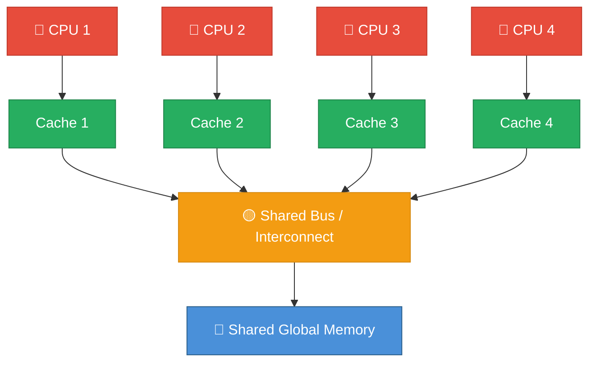

**Key Features:**
- All processors access a **common global memory space**
- Communication via shared variables (read/write to same memory)
- Also called **SMP (Symmetric Multi-Processor)** — equal access for all

**Sub-type: UMA vs NUMA**

| Feature | UMA (Uniform Memory Access) | NUMA (Non-Uniform Memory Access) |
|---------|----|----|
| Memory | Single shared memory | Memory distributed physically near each processor |
| Access time | **Same** for all processors | **Different** — local memory is faster |
| Example | Typical desktop dual-core | AMD EPYC servers, large multi-socket systems |
| Scalability | Poor (bus becomes bottleneck) | Better — less bus contention |

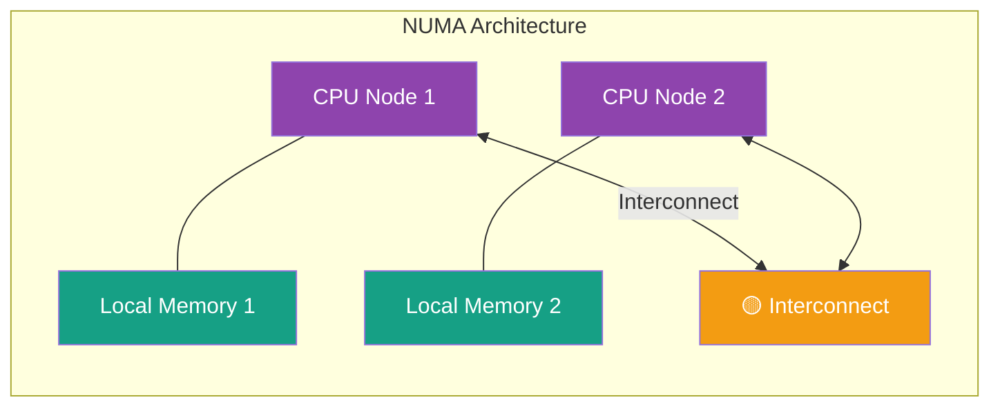

**Pros:** Easy to program, fast communication (shared variables)
**Cons:** Cache coherence problem, limited scalability, memory bandwidth bottleneck

**Examples:** Intel Core i7, AMD Ryzen, Sun Microsystems servers

---

### 2.2 Distributed Memory Architecture

**Definition:** Each processor has its OWN private memory. Processors communicate by **passing messages** over a network.

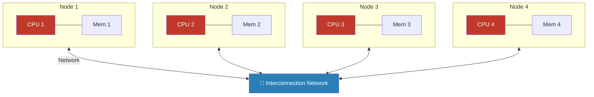

**Key Features:**
- Processors have **no global memory view** — each only "sees" its own local memory
- Communication = **Message Passing (MPI)**
- A send operation MUST have a matching receive operation

**Pros:** Highly scalable (just add more nodes), no cache coherence problem
**Cons:** Harder to program, communication overhead, programmer manages data distribution

**Examples:** Supercomputer clusters (LLNL), AWS computing clusters, Beowulf clusters

---

### 2.3 Hybrid Memory Architecture

**Definition:** Combination of shared + distributed memory. Most modern supercomputers use this.

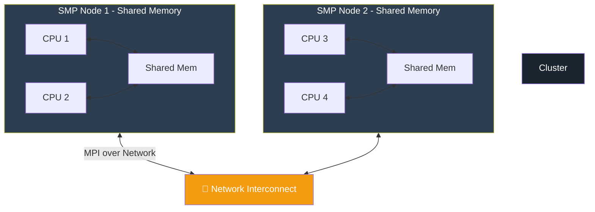

**Programming Model:** Typically **OpenMP (within node) + MPI (between nodes)**

**Examples:** Most Top500 supercomputers, modern HPC clusters

---

## 3. Flynn's Taxonomy

> **Mental Model: Airport check-in desk analogy (from the slides)**
> - **SISD:** One desk, one agent
> - **SIMD:** Many desks, supervisor with megaphone giving same instruction
> - **MIMD:** Many desks working at their own pace
> - **MISD:** Theoretically: same passenger processed by many desks with different rules

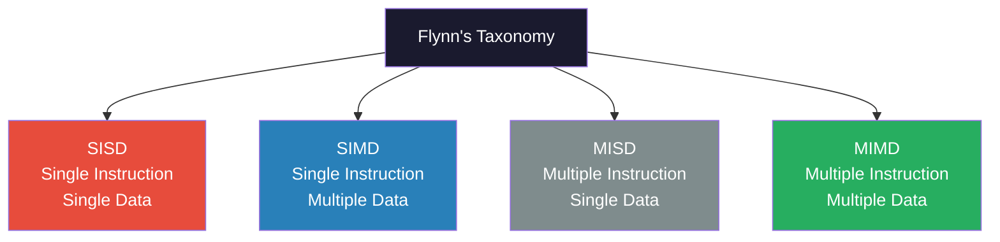

### SISD — Single Instruction Single Data
- Classic von Neumann architecture
- ONE instruction stream, ONE data stream
- **Deterministic execution**
- **Example:** Intel Atom (Silverthorne, Lincroft, Pineview)
- Almost non-existent in modern systems

### SIMD — Single Instruction Multiple Data
- ONE instruction acts on MULTIPLE data streams simultaneously
- Best for **regular problems** like image processing, matrix operations
- Two varieties:
  - **Processor Arrays** — Connection Machine CM-2, MasParMP-1
  - **Vector Pipelines** — Cray C90, IBM 9000, Fujitsu VP

> **Think:** Apply the same filter to EVERY pixel of an image simultaneously

### MISD — Multiple Instruction Single Data
- Multiple instructions act on a SINGLE data stream
- **Rarely exists in practice** — mostly theoretical
- **Example:** Systolic Arrays (experimental CMU design)

### MIMD — Multiple Instruction Multiple Data
- **THE MOST COMMON type** — most modern parallel computers!
- Multiple processors execute DIFFERENT instructions on DIFFERENT data
- Can be synchronous or asynchronous
- **Examples:** Supercomputers, modern SMP systems, multi-processor PCs, networked grids

---

### Systolic Arrays (MISD / TPU concept)

A systolic array replaces a single processing element with a **regular grid of PEs**. Data flows through in a pipelined, synchronized manner — like the heart pumping blood.


**Used in:** Google TPU (Matrix Multiply Unit), hardware accelerators

---

## 4. Parallel Computing Concepts & Terminology

> These are the **definitions** questions. Know them cold!

| Term | Definition |
|------|-----------|
| **Node** | A standalone "computer in a box" — has CPU, memory, network interface |
| **Task** | A logically discrete section of computational work executed by a processor |
| **Pipelining** | Breaking a task into stages performed by different processor units (assembly line analogy) |
| **Shared Memory** | Hardware architecture where all processors share common physical memory |
| **SMP** | Symmetric Multi-Processor — shared memory where all processors have EQUAL access |
| **Distributed Memory** | Tasks only see local memory; must use messages to access remote memory |
| **Communications** | Exchange of data between parallel tasks (via shared bus or network) |
| **Synchronization** | Coordinating parallel tasks — one task waits for another at a sync point |
| **Granularity** | Ratio of computation to communication — Coarse (lots of work between comms) vs Fine (little work between comms) |
| **Speedup** | wall-clock time (serial) / wall-clock time (parallel) |
| **Parallel Overhead** | Time spent coordinating tasks, NOT doing useful work (sync, startup, comms, etc.) |
| **Massively Parallel** | Hardware with hundreds of thousands to millions of processing elements |
| **Embarrassingly Parallel** | Problems that are easily parallelized with little/no coordination needed. Example: rendering each movie frame independently |
| **Scalability** | Parallel system's ability to show proportionate speedup when resources are added |

---

## 5. Design Issues & Constraints

### Designing a Parallel Program — 4 Steps


### Auto vs Manual Parallelization

**Manual:**
- Programmer identifies and implements parallelism
- Time-consuming, error-prone, iterative

**Automatic (Parallelizing Compiler):**
- Fully Automatic: Compiler analyzes source code, finds parallelism opportunities. **Loops are the #1 target.**
- Programmer Directed: Programmer uses compiler directives (like `#pragma omp`) to tell compiler how to parallelize

### Parallel Programming Models

| Model | Description | Language/Tool |
|-------|-------------|--------------|
| **Shared Memory (threads)** | Threads share global variables; communicate via shared data | OpenMP, Pthreads |
| **Distributed/Message Passing** | Each process has private memory; communicate by sending/receiving messages | MPI |
| **Data Parallel** | Same operation on partitions of shared data structure | OpenMP, CUDA |
| **Hybrid** | Combine multiple models | MPI + OpenMP |
| **SPMD** | All tasks run the SAME program on DIFFERENT data | MPI programs |
| **MPMD** | Tasks run DIFFERENT programs on DIFFERENT data | Specialized HPC |

---

## 6. Performance: Amdahl's Law & Gustafson's Law

> **Exam core topic.** Know formulas, examples, comparison, and the driving metaphor!

### 6.1 Amdahl's Law

**Named after:** Gene Amdahl

**Key Statement:**
> *The maximum speedup is limited by the SEQUENTIAL portion of the code.*

**Formula:**
```
Speedup = 1 / [ (1 - F) + (F/N) ]
```
Where:
- **F** = Fraction (proportion) of the program that CAN be parallelized
- **(1-F)** = Serial (non-parallelizable) fraction
- **N** = Number of processors

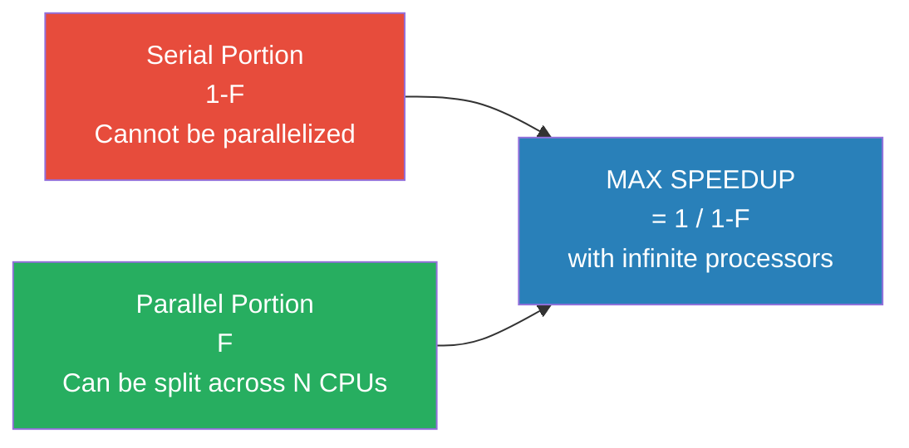

**Key Takeaways:**
- Even with **infinite processors**, max speedup = **1/(1-F)**
- If 10% is serial → max speedup ever = 10x (even with 1000 CPUs!)
- **Diminishing returns:** Going from 1→10 processors helps a lot, 100→1000 barely changes anything
- **Bottleneck:** The serial portion always takes the same time regardless of processors

### Amdahl's Law — Worked Examples

**Example 1:** 60% sequential, 40% parallelizable, 25 processors
```
Speedup = 1 / [(1 - 0.4) + (0.4/25)]
        = 1 / [0.6 + 0.016]
        = 1 / 0.616
        = 1.623
```

**Example 2:** 90% parallelizable, 10% serial, 100 processors
```
Speedup = 1 / [(1 - 0.9) + (0.9/100)]
        = 1 / [0.1 + 0.009]
        = 1 / 0.109
        = 9.17
```

**Example 3:** Matrix sum (10×10) + 10 scalar variables, 10 vs 100 processors
- Total = 110 operations; 100 parallelizable, 10 serial
- F (parallel fraction for 100 processors) = 100/110 = 0.909
- On 10 processors: Speedup = 1/(0.091 + 0.909/10) = **5.5**
- On 100 processors: Speedup = 1/(0.091 + 0.909/100) = **10.0**

**Limitations of Amdahl's Law:**
- Does NOT consider problem size
- Ignores communication cost
- Acts as a "fatal limit" — pessimistic about parallel computing

---

### 6.2 Gustafson's Law

**Named after:** John L. Gustafson

**Key Idea:**
> *As problem size increases, the serial fraction DECREASES. Scale the problem WITH the processors.*

**Gustafson's Insight:** Amdahl's Law assumes FIXED problem size. But in reality, when you get more processors, you solve BIGGER problems, not the same problem faster. The serial part stays roughly constant while the parallel part grows.

**Formula:**
```
Scaled Speedup = N - (N - 1) × S
```
Where:
- **N** = Number of processors
- **S** = Serial fraction of the program

**Example:** S = 0.1, N = 16
```
Scaled Speedup = 16 - (16 - 1) × 0.1
               = 16 - 15 × 0.1
               = 16 - 1.5
               = 14.5
```

### The Driving Metaphor 🚗

| Law | Car Metaphor |
|-----|-------------|
| **Amdahl's** | Car must travel 60 miles. Already spent 1 hr going 30 mph. No matter how fast the remaining 30 miles, you can NEVER average 90 mph. The first hour is already locked in. Fixed distance = fixed code size. |
| **Gustafson's** | Car traveled at 30 mph for 1 hr. But the road is INFINITE. Drive at 120 mph for 2 more hours and you WILL average 90 mph eventually. Variable distance = scalable problem size. |

### Amdahl's Law vs Gustafson's Law — Comparison

| Feature | Amdahl's Law | Gustafson's Law |
|---------|-------------|----------------|
| Assumption | Fixed problem size | Fixed parallel execution time |
| As N → ∞ | Speedup → 1/(1-F) — limited! | Speedup grows linearly |
| Real-world applicability | Pessimistic; single-user use cases | More realistic for HPC/scientific computing |
| Formula | 1 / [(1-F) + F/N] | N - (N-1)×S |
| Nature | Mathematical theorem | Observed phenomenon |

**Comparison Example:** Serial fraction = 5%, N = 20 processors
- Gustafson: 20 - (19 × 0.05) = 20 - 0.95 = **19.05**
- Amdahl: 1 / [0.05 + 0.95/20] = 1 / [0.05 + 0.0475] = **10.25**

Gustafson always gives a higher (more optimistic) speedup because it allows problem size to grow.

---

## 7. Multicore Processors

### Why Did We Move from Single-Core to Multi-Core?

**Three Walls That Stopped Single-Core:**


**Solution:** Instead of ONE fast core, use MULTIPLE moderate-speed cores.

### Homogeneous vs Heterogeneous Multicore

**Homogeneous:**
- All cores are IDENTICAL, support same ISA
- Examples: Intel Core Duo, MPC8641
- Simpler to program

**Heterogeneous:**
- Cores are DIFFERENT, may support different ISAs
- Examples: ARM big.LITTLE, Intel Core M (performance + efficiency cores)
- More efficient — right core for right task
- Modern smartphones, Apple M-series chips

### Multi-Core Architecture Visualization

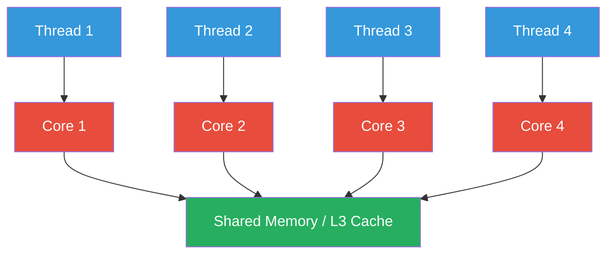

### Roles of OS, User, Memory in Multicore

| Layer | Role |
|-------|------|
| **User/Programmer** | Must write parallel code using threads/processes; spread workload manually |
| **Operating System** | Sees each core as a separate processor; scheduler maps threads to cores |
| **Memory** | Cache placed on-chip to reduce latency; memory contention is a real problem |

### Cache Coherence Problem

> **Definition:** When multiple cores have copies of the same data in their caches, keeping those copies consistent is the **cache coherence problem**.

**Example:**
1. Core 1 reads X=5 from memory into its cache
2. Core 2 also reads X=5 from memory into its cache
3. Core 1 writes X=10
4. Now Core 2's cache still shows X=5 — **STALE DATA!**

**Two Main Approaches:**

#### 1. Snooping (Bus-based) Cache Coherence
- All caches monitor ("snoop") the shared bus
- When a core writes, it broadcasts to all caches
- Other caches either **invalidate** their copy or **update** it
- Works well for small number of processors (UMA/SMP systems)

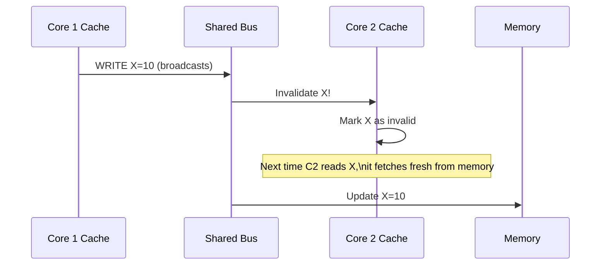

#### 2. Directory-Based Cache Coherence
- A central **directory** tracks which caches have a copy of each memory block
- When a write happens, the directory sends invalidation only to those specific caches
- More scalable than snooping (no broadcasting to everyone)
- Used in NUMA and large distributed shared memory systems

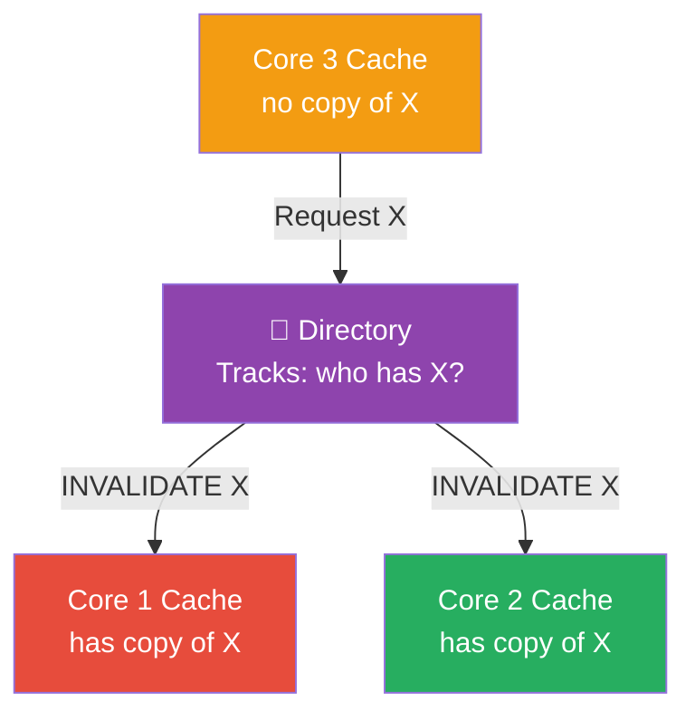

### False Sharing

> **Definition:** Two or more processors write to DIFFERENT variables that happen to be in the **same cache line** — causing unnecessary cache invalidation traffic.

**Example:**
- Core 1 writes to `a[0]`
- Core 2 writes to `a[1]`
- Both happen to be in the same 64-byte cache line
- Core 1's write invalidates Core 2's entire cache line — even though they touched different data!

**Fix:** Pad data structures so that shared variables are in different cache lines.

---

## 8. OpenMP Programming

### What is OpenMP?
- **Open Multi-Processing** — API for shared-memory parallel programming in **C, C++, Fortran**
- Uses `#pragma omp` directives to mark parallel regions
- Threads share global variables; communicate through shared memory
- Works on multicore CPUs

### Key Directives

| Directive | Meaning |
|-----------|---------|
| `#pragma omp parallel` | Creates a parallel region — multiple threads run this block |
| `#pragma omp parallel for` | Distributes loop iterations across threads |
| `#pragma omp critical` | Only ONE thread can execute this block at a time (prevents race conditions) |
| `#pragma omp single` | Only ONE thread executes this, others wait |
| `collapse(2)` | Combines TWO nested loops into a single loop for parallel distribution |
| `shared(var)` | Declares variable as shared among all threads |

### Hello World with OpenMP

```c
#include <stdio.h>
#include <omp.h>

int main() {
    #pragma omp parallel
    {
        int ID = omp_get_thread_num();  // Each thread gets its own ID
        printf("hello(%d) world(%d)\n", ID, ID);
    }
    return 0;
}
```

**How it works:**
- `#pragma omp parallel` creates N threads (N = number of CPU cores by default)
- ALL threads execute the block simultaneously
- Each thread gets a unique ID from `omp_get_thread_num()`

### Parallelizing Matrix Addition

```c
#pragma omp parallel for collapse(2)
for (int i = 0; i < N; i++) {
    for (int j = 0; j < N; j++) {
        C[i][j] = A[i][j] + B[i][j];  // Each thread handles different [i][j]
    }
}
```

- `collapse(2)` — merges both loops; total N×N iterations distributed across threads
- Each thread works on different rows and columns

### Shared Variables & Race Conditions

**Problem:** If two threads update the same variable simultaneously, results are unpredictable.

```c
#pragma omp parallel shared(sharedVar)
{
    #pragma omp critical      // CRITICAL prevents race condition
    sharedVar += 1;
}
```

**Data Parallelism with OpenMP:**
- Use `#pragma omp parallel for` — each loop iteration runs on different core
- Different iterations = different data = data parallelism

**Functional Parallelism with OpenMP:**
- Use `#pragma omp sections` — different code sections run in parallel
- Different functions/tasks = functional parallelism

### Compiling OpenMP

```bash
gcc -fopenmp your_program.c    # Linux/Ubuntu
export OMP_NUM_THREADS=4       # Set number of threads
./a.out
```

---

## 9. Heterogeneous Parallel Computing & GPUs

### Why Heterogeneous?
After 2003, single-core performance stagnated due to power/heat limits. The solution: use the **right processor for the right job**.

### CPU vs GPU — Design Philosophy

| Feature | CPU (Multicore) | GPU (Many-thread) |
|---------|----------------|-------------------|
| **Focus** | Sequential tasks | Parallel tasks |
| **Cores** | Few (4–64), powerful | Thousands, simple |
| **Cache** | Large | Small |
| **Memory Bandwidth** | Lower | Higher (~10× CPU) |
| **Clock Speed** | Higher per core | Lower per core |
| **Best for** | Complex logic, branching | Repetitive, data-parallel work |
| **Example** | Intel Core i9 (12 cores) | NVIDIA Tesla P100 (5000+ threads) |

### The Restaurant Analogy 🍽️
- **Head Chef = CPU:** Skilled, handles complex dishes (one at a time), precision work
- **Line Cooks = GPU Cores:** Many cooks doing repetitive tasks (chopping, grilling) simultaneously
- Best kitchen **uses BOTH** — chef for specialty, cooks for bulk prep

### Heterogeneous Computing Model

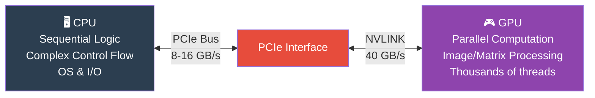

**Frameworks:** CUDA (NVIDIA), OpenCL, OpenACC, C++AMP

---

## 10. GPU Computing & Architecture

### GPU Architecture Overview

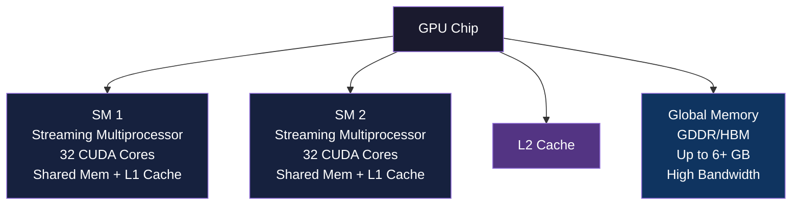

**Key GPU Components:**

| Component | Description |
|-----------|-------------|
| **SM (Streaming Multiprocessor)** | Mini-processor inside GPU; contains multiple CUDA cores, control logic, registers, shared memory |
| **SP / CUDA Core** | Individual execution unit (like a mini-CPU); executes one thread |
| **Global Memory** | Main GPU RAM (GDDR/HBM); accessible by both GPU and CPU |
| **Shared Memory** | Fast per-SM memory; shared among threads in same SM |
| **Warp** | Group of 32 threads that execute SAME instruction simultaneously (SIMD within GPU) |

### GPU Generations (Performance per Watt)

```
Tesla (2008) → Fermi (2010) → Kepler (2012) → Maxwell (2014) → ...
Each generation: more SMs, more CUDA cores, better memory bandwidth
```

### Fermi SM Architecture
- **32 CUDA Cores per SM**
- 2 warp schedulers (up to 1536 threads concurrently)
- 32K registers
- 64KB configurable Shared Mem + L1 Cache

### Why GPU for Parallel Tasks?

**CPU Design Philosophy:** Minimize latency (get ONE result fast)
**GPU Design Philosophy:** Maximize throughput (get MANY results simultaneously)

- CPU: Complex control logic for out-of-order, speculative execution
- GPU: Most transistors dedicated to ACTUAL COMPUTATION; tolerates memory latency via parallelism

### 3 Ways to Accelerate with GPU

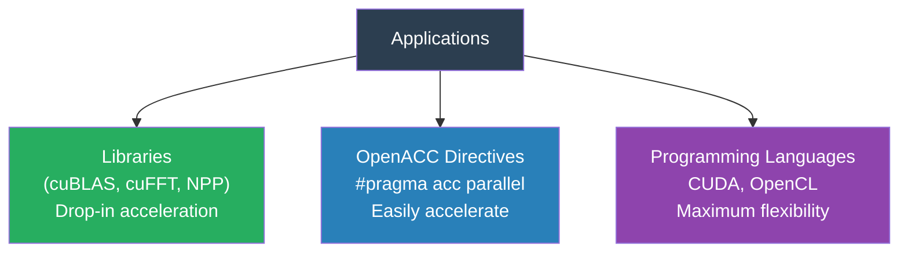

### CUDA Unified Memory
- Before: Developer must manually copy data CPU↔GPU over PCIe (bottleneck!)
- With Unified Memory ("managed memory"): Single pointer visible to both CPU and GPU; hardware handles migration

---

## 11. ML Operations on Modern Architecture (TPU)

### What is a TPU?
- **Tensor Processing Unit** — custom ASIC by Google
- Specifically designed for **machine learning (neural networks)**
- Optimized for **high-throughput, low-precision computation**
- Higher performance/watt than CPU or GPU

### Neural Network Basics (Why We Need TPUs)
- Each neuron: multiply inputs by weights → sum → apply activation function
- Large networks: billions of weights → BILLIONS of multiply-add operations per inference
- This is essentially **matrix multiplication**

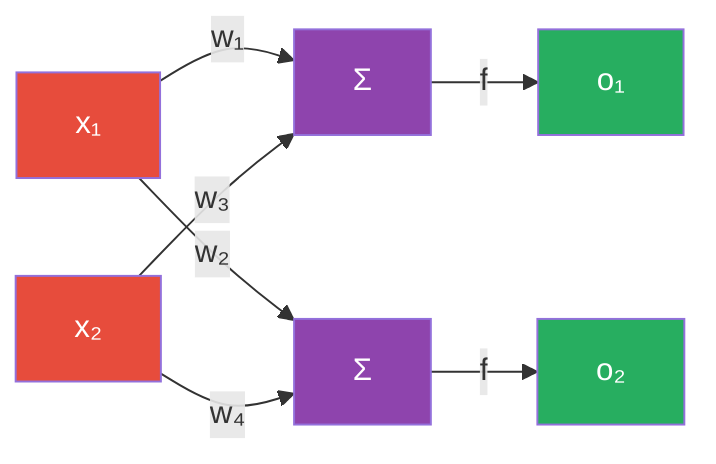

`z = Σ(w·x)` then `y = f(z)` where f = ReLU, Sigmoid, etc.

### TPU Architecture

**Key Components:**
| Component | Description |
|-----------|-------------|
| **MXU (Matrix Multiplier Unit)** | 65,536 8-bit multiply-add units — does hundreds of thousands of ops per clock cycle |
| **Unified Buffer (UB)** | 24 MB SRAM registers |
| **Activation Unit (AU)** | Hardwired activation functions (ReLU, Sigmoid) |

**MXU uses a Systolic Array** — data flows through a grid of PEs in waves. Rows of matrix A move horizontally, columns of matrix B move vertically. At each intersection, a PE computes partial results.

### CPU vs GPU vs TPU for Matrix Multiplication

| | CPU | GPU | TPU |
|--|-----|-----|-----|
| **Architecture** | Few powerful cores | Many lightweight cores | Systolic array |
| **Execution** | Sequential loops (SIMD for limited parallelism) | Thousands of threads compute in parallel | Inputs streamed through PE grid, systolic pipelining |
| **Memory** | Frequent cache misses | Block decomposition + shared memory | High data reuse, reduced memory bandwidth |
| **Best for** | General compute, high accuracy | Large-scale parallel ML | Dedicated ML inference/training |

### Quantization
Converting **FP32 (32-bit float)** → **INT8 (8-bit int)** for faster, smaller, more efficient computation at some precision loss.

| Format | Bits | Used by |
|--------|------|---------|
| FP64 | 64 | CPU high-precision science |
| FP32 (IEEE 754) | 32 | CPU general, GPU training |
| FP16 | 16 | GPU inference |
| bfloat16 | 16 | TPU — same range as FP32, less precision |
| INT8 | 8 | TPU inference, quantized models |

---

## 12. ILP Techniques

> **ILP = Instruction Level Parallelism** — extracting parallelism from a stream of instructions

### Mental Model: Assembly Line for Instructions

Consider the loop: `for(i=1; i<=6; i++) out = i + i;`

### Scalar (Sequential) Execution
```
Time: [1][2][3][4][5][6][7][8][9][10]
       i1 i2 i3 i4 i5 i6
```
One instruction per time unit — slow!

### Pipelining
- **Idea:** Divide instruction execution into stages (Fetch, Decode, Execute, Writeback)
- While instruction 2 is being decoded, instruction 1 is already executing!
- Like a car assembly line — multiple cars at different stages

```mermaid
gantt
    title Pipeline Execution (5-stage)
    dateFormat X
    axisFormat %s

    section I1
    Fetch: 0, 1
    Decode: 1, 2
    Execute: 2, 3
    Mem: 3, 4
    WB: 4, 5

    section I2
    Fetch: 1, 2
    Decode: 2, 3
    Execute: 3, 4
    Mem: 4, 5
    WB: 5, 6

    section I3
    Fetch: 2, 3
    Decode: 3, 4
    Execute: 4, 5
    Mem: 5, 6
    WB: 6, 7
```

### Super-Pipelining
- Divide each pipeline stage into MULTIPLE sub-stages
- Clock runs faster, more instructions "in flight" at once

### Superscalar
- **Multiple execution units** in parallel
- Can execute MORE THAN ONE instruction per clock cycle
- Hardware detects independent instructions and executes them simultaneously

```
Time:  [1][2][3][4][5][6][7][8][9][10]
Unit1:  i1 i3 i5 ...
Unit2:  i2 i4 i6 ...
```
Two instructions executed per clock cycle!

### Out-of-Order Execution
- CPU doesn't execute instructions in program order if they don't depend on each other
- Keeps execution units busy even when some instructions stall

**Example:**
```
i1: A = B + C      (takes 5 cycles - memory access)
i2: D = A + 1      (DEPENDS on i1 - must wait)
i3: E = F + G      (INDEPENDENT of i1, i2 - can execute while waiting!)
```
CPU executes i3 while i1 is still completing — better utilization!

### VLIW (Very Long Instruction Word)
- **Compiler** finds independent instructions and **packs them into one long instruction**
- Hardware is SIMPLE — no dynamic scheduling needed
- Compiler does all the work (static scheduling)

```
VLIW Word: [ADD | MUL | ADDF | MULF | LDR | MOV]
           All these execute SIMULTANEOUSLY in one clock
```

**Drawback:** If compiler can't find enough independent instructions → must insert NOPs (wasted slots) or recompile.

### VLIW vs Superscalar

| Feature | Superscalar | VLIW |
|---------|------------|------|
| Scheduling | **Dynamic** (hardware detects parallelism at runtime) | **Static** (compiler packs instructions) |
| Hardware | **Complex** (out-of-order logic, hazard detection) | **Simple** (just executes long word) |
| Compiler | Simpler | Must be very smart |
| Examples | Intel Core, AMD Ryzen | Intel Itanium (EPIC), DSP chips |

### EPIC (Explicitly Parallel Instruction Computing)
- Like VLIW but standardized
- Programmer/compiler explicitly marks instruction groups as parallel
- Intel Itanium architecture

### Thread-Level Parallelism

**Multi-threading:** Multiple threads share execution resources. When one thread stalls (e.g., cache miss), another runs.

**SMT (Simultaneous Multithreading / Hyper-Threading):**
- Multiple threads run CONCURRENTLY on ONE core by sharing functional units
- Intel calls it "Hyper-Threading"
- Thread 1 uses FP unit while Thread 2 uses Integer unit simultaneously

**Multi-core:** Threads run on SEPARATE physical cores — true parallelism


---

## 13. Cache Coherence

*(Expanded from Section 7 for exam completeness)*

### The Problem
When multiple processors cache the same memory location and one modifies it, others have **stale (outdated) copies**.

**Two Main Approaches:**

### 1. Snooping Protocol (Write-Invalidate)
- All cache controllers watch the shared bus
- On a write: broadcast to all, others **invalidate** their copy
- On next read of invalidated line: fetch fresh from memory

**Write-Update variant:** Instead of invalidating, broadcast the new value to all caches (more traffic but fewer re-fetches)

**Suitable for:** Small SMP systems (few processors on a bus)

### 2. Directory-Based Protocol
- A **directory** maintains state of each cache line (who has it, is it modified?)
- On write: directory sends **targeted** invalidation only to caches holding that line
- More scalable — no broadcasting

```
States per directory entry:
- UNCACHED: No processor has this line
- SHARED: One or more processors have a read-only copy
- EXCLUSIVE/MODIFIED: One processor has the only copy and may have written to it
```

**Suitable for:** Large NUMA systems, distributed shared memory

---

## 14. TLB & Address Translation

### Virtual to Physical Address Translation

Every memory access requires translating a **virtual address** (what program uses) to a **physical address** (actual RAM location) via the **page table**.

**Problem:** Page table lookup itself requires memory accesses — slow!

**Solution:** TLB (Translation Lookaside Buffer)

### What is a TLB?

- A small, **fast hardware cache** that stores **recent virtual-to-physical address mappings**
- Located inside the processor (very fast — few cycles)
- Works on the principle of **temporal locality** (recently used translations likely used again soon)

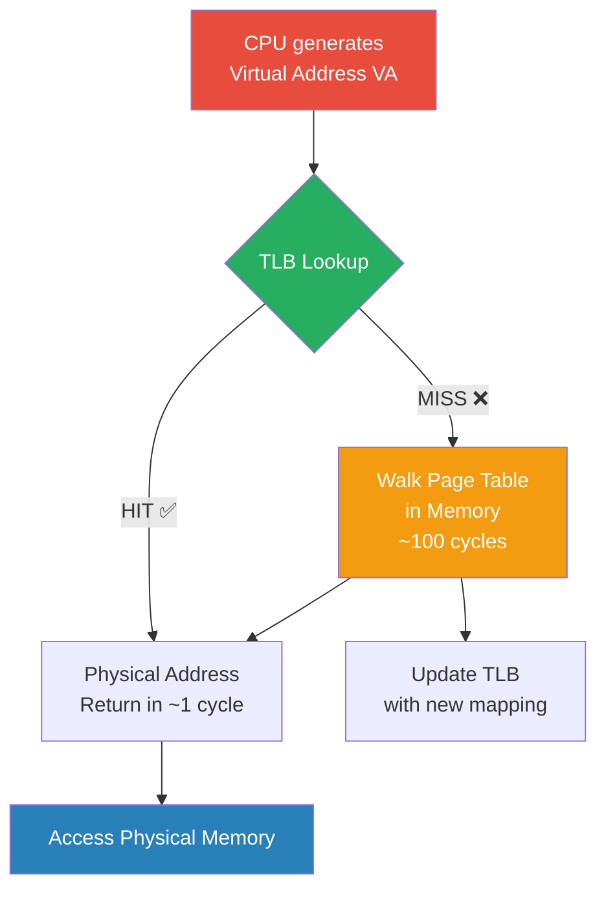

### TLB Entries — What's Stored?

Each TLB entry contains:
| Field | Description |
|-------|-------------|
| **Virtual Page Number (VPN)** | The virtual address tag we're looking up |
| **Physical Frame Number (PFN)** | Corresponding physical memory frame |
| **Valid bit** | Is this entry valid? |
| **Protection bits** | Read/Write/Execute permissions |
| **Dirty bit** | Has this page been modified? |
| **Reference/Access bit** | Has this page been recently accessed? |
| **ASID** | Address Space ID (to distinguish between processes) |

### TLB Operation

1. CPU generates virtual address VA
2. Extract **VPN** from VA
3. Look up VPN in TLB (parallel comparison of all entries)
4. **TLB Hit:** Return PFN immediately → physical address = PFN + offset
5. **TLB Miss:** Walk page table in memory → load mapping into TLB → retry

### TLB Simplifications

- **Fully Associative:** Any VPN can map to any TLB entry — best hit rate, expensive hardware
- **Set-Associative:** Compromise between associativity and hardware cost
- **Small size:** Typically 32–1024 entries (enough to cover frequently used pages)
- **Hardware-managed TLB:** Hardware automatically handles misses (x86)
- **Software-managed TLB:** OS handles miss (MIPS, SPARC) — flexible but slower

### Why TLB Reduces Translation Time

Without TLB: Every memory access = page table walk = multiple memory accesses (100+ cycles)
With TLB: Most accesses = TLB hit = 1-3 cycles

**TLB hit rate** is typically **>99%** due to locality of reference.

---

## 15. Speedup, Scalability, Efficiency

### Speedup Definition
```
Speedup(N) = T_serial / T_parallel(N)
```
- T_serial = time on 1 processor
- T_parallel(N) = time on N processors

**Linear Speedup:** Speedup = N (ideal, rarely achieved)
**Super-linear Speedup:** Speedup > N (possible if parallel version uses caches better)

### Efficiency
```
Efficiency = Speedup / N = T_serial / (N × T_parallel)
```
- Efficiency = 1.0 (100%): Perfect — all processors fully utilized
- Efficiency < 1.0: Some overhead/idle time
- Efficiency drops as N increases (Amdahl's Law effect)

### Scalability
A system is **scalable** if efficiency remains acceptably high as N increases.

Two types:
- **Strong Scaling:** Fixed problem size, increase N → harder to scale (Amdahl limited)
- **Weak Scaling:** Increase problem size WITH N, keep work per processor constant → easier to scale (Gustafson's scenario)

### Flat Memory Approximation
Used in performance modeling — assumes uniform (flat) memory access time across all processors (ignores NUMA effects). Simplifies analysis but not fully accurate for real systems.

### Limitations of Speedup
1. **Amdahl's Law** — serial fraction limits maximum
2. **Communication overhead** — as N grows, coordination cost grows
3. **Load imbalance** — one slow processor stalls everyone at synchronization
4. **Memory bandwidth** — all cores compete for the same bus
5. **False sharing** — cache line interference adds unexpected overhead
6. **Synchronization cost** — barriers, locks cause waiting

---

## 16. Quick Exam Reference

### Interconnection Networks

| Network | Topology | Latency | Bandwidth | Cost |
|---------|---------|---------|-----------|------|
| **Bus** | Single shared wire | Low (small) | Limited (shared) | Cheap |
| **Crossbar Switch** | Full NxN switch | Very Low | High | Expensive |
| **Ring** | Each node connects to 2 neighbors | Medium | Medium | Medium |
| **Mesh** | 2D/3D grid | Medium | Medium | Medium |
| **Torus** | Mesh with wrap-around | Lower | Higher | Higher |
| **Hypercube** | N-dimensional cube | Log(N) | Good | Higher |
| **Fat Tree** | Hierarchical tree with increasing bandwidth upward | Low | High | High |
| **Infiniband** | Industry standard HPC network | Very Low | Very High | High |

### Parallelism Types Summary

| Type | Description | Example |
|------|-------------|---------|
| **Data Parallelism** | Same operation on different parts of data | Matrix multiply — each core handles rows |
| **Task Parallelism** | Different tasks run simultaneously | One core reads file, another processes it |
| **Functional Parallelism** | Different functions run in parallel | Pipeline stages — render, physics, AI in games |
| **Instruction-Level (ILP)** | CPU extracts parallelism from instruction stream | Pipelining, superscalar, OOO execution |
| **Thread-Level (TLP)** | Multiple threads run concurrently | Multi-threading, hyperthreading |

### Loop Parallelism (Handling Loops in Multicore)

```c
// PARALLEL LOOP — iterations are independent
for (i = 0; i < N; i++) {
    A[i] = B[i] + C[i];   // A[0] doesn't depend on A[1], etc. → SAFE to parallelize
}

// SERIAL LOOP — loop-carried dependency, CANNOT parallelize directly
for (i = 1; i < N; i++) {
    A[i] = A[i-1] + B[i];  // A[i] depends on previous A[i-1] → loop-carried dependency
}
```

**Loop Handling Strategies:**
- **Loop distribution:** Separate independent and dependent loops
- **Loop fusion:** Combine independent loops
- **Loop interchange:** Swap inner/outer loops for better cache behavior
- **OpenMP parallel for:** Distribute independent iterations

### Flynn's Taxonomy — One-line Summaries

| Type | One Line | Real Example |
|------|----------|-------------|
| SISD | Classic single CPU | Old Intel processors |
| SIMD | One instruction, many data | GPU pixel shaders, SSE/AVX |
| MISD | Rare, mostly theoretical | Systolic arrays |
| MIMD | The modern standard | Supercomputers, multi-core PCs |

### Key Formulas Cheat Sheet

| Formula | Variables | Use |
|---------|-----------|-----|
| `Speedup = 1/[(1-F) + F/N]` | F=parallel fraction, N=processors | Amdahl's Law |
| `Speedup = N - (N-1)×S` | N=processors, S=serial fraction | Gustafson's Law |
| `Max Speedup = 1/(1-F)` | F=parallel fraction | Amdahl's upper bound with ∞ processors |
| `Efficiency = Speedup/N` | Speedup, N=processors | How well processors are used |
| `Speedup = T_serial/T_parallel` | T = wall clock time | Basic speedup definition |

---

## 🔄 Visual: The Big Picture of Parallel Computing

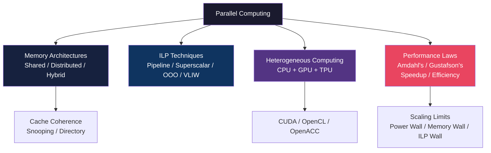

---

*Notes compiled from MPCA Unit 4 lectures (Sessions 4.1–4.9) | PES University UE24CS251B*
*All topics from question bank covered: Flynn's Taxonomy, Memory Architectures, Amdahl/Gustafson, OpenMP, Cache Coherence, TLB, ILP, GPU Computing, TPU/ML Architectures*
