# Lab: Memory Management

## **Name: Dharani S**
## **SRN: PES2UG24CS157**
## **sECTION: c**
## Section 0 - Get Your Bearings


### **Screenshot 0:** Output of `free -m` showing your VM's RAM and swap.
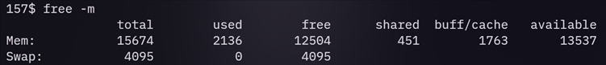


### **Q0.1:** If your VM has 2048 MB of RAM and the page size is 4096 bytes, how many physical page frames exist? Show your arithmetic.
```
2048 MB = 2048 × 1024 × 1024 bytes = 2,147,483,648 bytes  

Page size = 4096 bytes  

Number of physical page frames =  2,147,483,648 / 4096 = 524,288  
```

---

## Section 1 - The Virtual Address Space

### **Q1.1:** List the six addresses from lowest to highest. Does the ordering match the diagram? Verify: Text < Rodata < Data < BSS < Heap ≪ Stack.
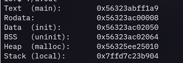
#### The ordering matches the diagram exactly: Text < Rodata < Data < BSS < Heap ≪ Stack


### **Q1.2:** In the filtered `/proc/self/maps` output, what permissions does `[heap]` have? Why `rw-p` instead of `rwxp`? What could go wrong if heap memory were executable?
The [heap] region has permissions rw-p, meaning:

- r = read

-  w = write

- `-` = not executable (no x)

- p = private (copy-on-write, not shared)
#### Modern operating systems implement W^X (Write XOR Execute) as a security feature. Memory pages should not be both writable and executable simultaneously. The heap only needs to store data, not code, so it is marked writable but not executable.

#### If heap memory were executable (rwxp), it would:

- Violate W^X policy : pages would be both writable and executable

- Enable code injection attacks : an attacker who writes shellcode into the heap (e.g., via buffer overflow) could execute it directly

- Facilitate return-oriented programming (ROP) : even without injecting code, executable heap would make it easier to chain gadgets


### **Q1.3:** Compile again *with* PIE: `gcc -o layout_pie layout.c` and run it twice. Do the addresses move between runs? Compare with the non-PIE version. Look up ASLR (Address Space Layout Randomization) - why is this a security feature?
#### With PIE enabled, addresses change between runs due to ASLR; non-PIE uses fixed addresses. ASLR randomizes memory layouts to prevent attackers from predicting code/gadget locations.

### **Screenshot 1:** Full output of `./layout` (the non-PIE version).
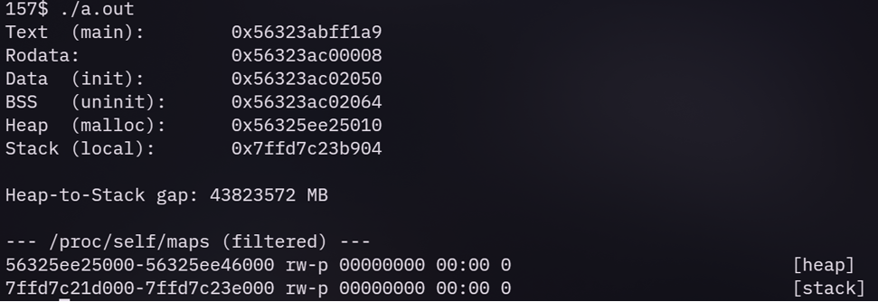
---

## Section 2 - Demand Paging: malloc Doesn't Actually Allocate Memory


### **Q2.1:** After `malloc` but before any touch, how much did VmSize go up? How much did VmRSS go up? Explain the difference in one sentence.
#### VmSize increased by 262,148 kB (264704 - 2556) after malloc, but VmRSS increased by only 4 kB (1704 - 1700) because malloc only allocated virtual address space without physically backing it until memory is touched.  

### **Q2.2:** Run `perf stat -e page-faults ./demand`. How many page faults did you get? Does it roughly match `256 MB / 4 KB = 65536`? If it's a bit higher, think about what else causes faults - the program's code, libc, the stack, etc.
#### Page faults: 1,644  
#### 256 MB / 4 KB = 65,536 pages, but actual faults are much lower because the program likely touched only a subset of the allocated 256 MB (possibly 64 MB or less), plus additional faults for loading the executable, libc, and stack initialization.

### **Q2.3:** Your classmate says "my program uses 256 MB" right after calling `malloc(256 * MB)`.Correct them in one sentence using the terms VmSize, RSS, and demand paging.
#### program's VmSize is 256 MB, but RSS is much lower because demand paging only brings pages into physical memory when they are actually touched.

### **Screenshot 2:** All four `[label]` blocks showing VmSize/VmRSS at each stage.
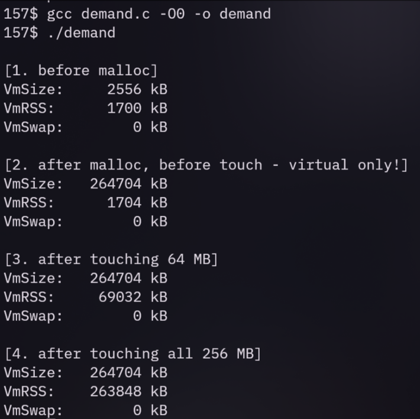
---

## Section 3 - Page Tables: How Virtual Addresses Become Physical

### **Q3.1:** What's the `present` bit for each page before and after touching? Which pages get a physical frame? Connect this to what you saw in Section 2.
#### Before touching, pages are present=0 (not in physical memory), and no physical frame is allocated; after touching, pages become present=1, and a physical frame is allocated via demand paging. In Section 2, malloc only increased VmSize, but RSS grew only when pages were touched—same principle: a page gets a physical frame only when accessed, triggering a page fault.

### **Q3.2:** Page 2 was allocated by `malloc` but never written to. Is it present? Does it have a PFN? What does that tell you about the page table entry for pages that are allocated but never touched?
#### Page 2 is not present and does not have a valid PFN. This shows that for pages allocated but never touched, the page table entry is marked not present and points to a zero page or is otherwise invalid until a write (or read) triggers a page fault to allocate a physical frame.
### **Q3.3:** Run it twice. Are the PFNs the same? Why would they differ? (The kernel just grabs whatever frame happens to be free at that moment.)
#### The PFNs differ between runs because the kernel allocates whatever free physical frames are available at the time, and ASLR for physical memory (kernel-side page allocation) is not deterministic.

### **Screenshot 3:** Output of `sudo ./pagemap` showing before/after touch.
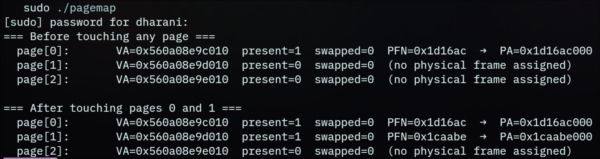
---

## Section 4 - Copy-on-Write: How fork() Doesn't Actually Copy Anything

### **Q4.1:** How many page faults during the read-only scan? Why nearly zero? Explain using the COW diagram above.
#### The read-only scan caused only 7 page faults (nearly zero) because after fork, the child's page table entries point to the same physical frames as the parent with read-only permissions, allowing shared access without copying until a write occurs.  


 

### **Q4.2:** How many faults during the write pass? How close is it to the expected 32768? If it's off by a small number, what else might have caused a few extra faults?
#### The write pass caused 32,769 faults—one more than the expected 32,768—likely due to an extra fault from touching a page used by libc, the stack, or other shared memory regions during the memset operation.  


### **Q4.3:** If `fork()` did a full deep copy instead of COW, how much extra physical memory would that take for a 128 MB region? Why is COW especially important for the common `fork()`/`exec()` pattern, where the child immediately replaces its entire address space anyway?
#### If fork() did a full deep copy instead of COW, it would require an extra 128 MB of physical memory for the child's copy. COW is especially important for fork()/exec() because the child typically calls exec() immediately, which discards the copied address space—making the deep copy wasteful; COW avoids the overhead until writes actually happen. 

### **Screenshot 4:** Complete output of `./cow`.
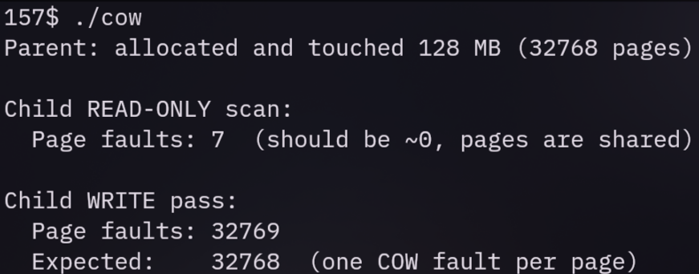

---

## Section 5 - Shared Libraries: One Copy for Everyone

### **Q5.1:** How big is `hello_dynamic` vs `hello_static`? Why is the static binary so much larger?
#### `hello_dynamic` is about 16–20 KB, while `hello_static` is ~702 KB—static includes the entire libc code and data inside the binary, whereas dynamic links against the shared libc at runtime.


### **Q5.2:** Run `cat /proc/self/maps | grep libc`. You'll see the same library mapped several times with different permissions - `r--p`, `r-xp`, `rw-p`. What does each one correspond to? (Think: read-only data, executable code, writable data.)
####  The `r-xp` region is libc's executable code (shared, read-only), `r--p` is read-only data (e.g., string constants, ELF sections), and `rw-p` is the data segment (global variables, writable data, private per process due to COW).
### **Q5.3:** If 50 processes all use libc, does the OS keep 50 copies of libc's code segment in RAM? What about libc's writable data (global variables) - is that shared too, or does each process get its own copy?
####  No, the OS keeps one copy of libc's read-only code segment in physical memory shared across all 50 processes. Writable data (global variables) is not shared—each process gets its own private copy via COW, because modifications must remain isolated.

### **Screenshot 5:** Output of `ls -lh hello_dynamic hello_static` and the first 30 lines of `LD_DEBUG=libs`.
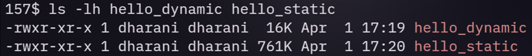
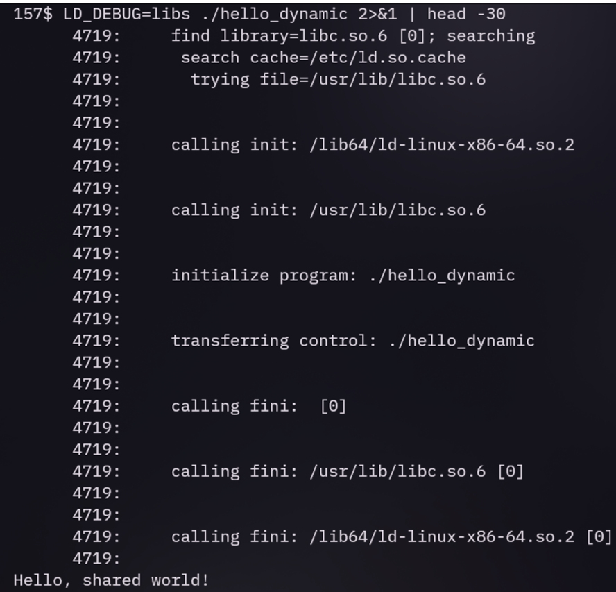

---

## Section 6 - Under the Hood: How malloc Gets Memory from the Kernel

### **Q6.1:** Does the program break move after `malloc(256 KB)`? Why not?
####  The program break does not move after `malloc(256 KB)` because large allocations (≥ 128 KB by default in glibc) use `mmap()` to create an independent anonymous mapping, leaving the heap region (managed by `brk`) unchanged.


### **Q6.2:** In the `strace` output, which `malloc` call triggered a `brk` and which triggered an `mmap`? What's glibc's default threshold for switching from brk to mmap?
#### **Q6.2:** In the `strace` output, `malloc(1024)` triggered `brk` (extending the heap), while `malloc(256 * 1024)` triggered `mmap`. glibc's default threshold for switching from `brk` to `mmap` is 128 KB.

### **Q6.3:** Why bother with two strategies? Imagine everything used `brk`: you allocate A, B, C in order, then free B. The heap can't shrink past C, so B's space is stuck. That's heap fragmentation. How does `mmap` for large allocations sidestep this problem?


#### Using `mmap` for large allocations sidesteps fragmentation because each `mmap` allocation is a separate region that can be independently `munmap`ed back to the kernel, unlike `brk`-managed heap memory, which is released only as a contiguous block starting from the top of the heap.
### **Screenshot 6:** Output of `./alloc_trace` and the relevant `strace` lines.
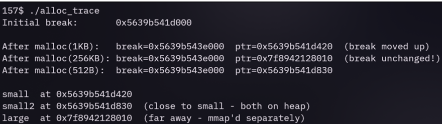
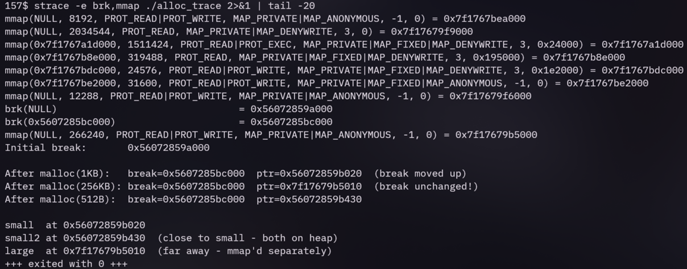
---

## Section 7 - Fragmentation: Why Free Memory Isn't Always Usable

### **Q7.1:** How much total memory is free? How much of it is contiguous? Why does the 512 KB request fail?
#### Total free memory is 2048 KB (512 free blocks × 4 KB), but the largest contiguous free block is only 4 KB because free blocks are interleaved with used blocks in a checkerboard pattern. The 512 KB request fails because it requires 128 *consecutive* free blocks, which don't exist despite having enough total free memory.


### **Q7.2:** glibc's allocator normally merges (coalesces) adjacent free chunks. Why does the checkerboard pattern - free, used, free, used - specifically prevent coalescing? (Draw it: no two free blocks are neighbors.)
#### The checkerboard pattern (free, used, free, used) prevents coalescing because no two free blocks are adjacent—every free block has used blocks on both sides. Coalescing requires adjacent free chunks to merge into a larger contiguous block.


### **Q7.3:** Paging eliminates external fragmentation for physical memory. Why? (A process needing 512 KB = 128 pages doesn't need 128 *contiguous* physical frames - the page table can map any virtual page to any physical frame, wherever it is.)
#### Paging eliminates external fragmentation for physical memory because the kernel can map 128 *virtual* pages (which must be contiguous in virtual address space) to 128 *physical* frames that can be scattered anywhere in physical memory—no need for physical contiguity, thanks to the page table's indirection.
### **Screenshot 7:** Output of `./fragment`.
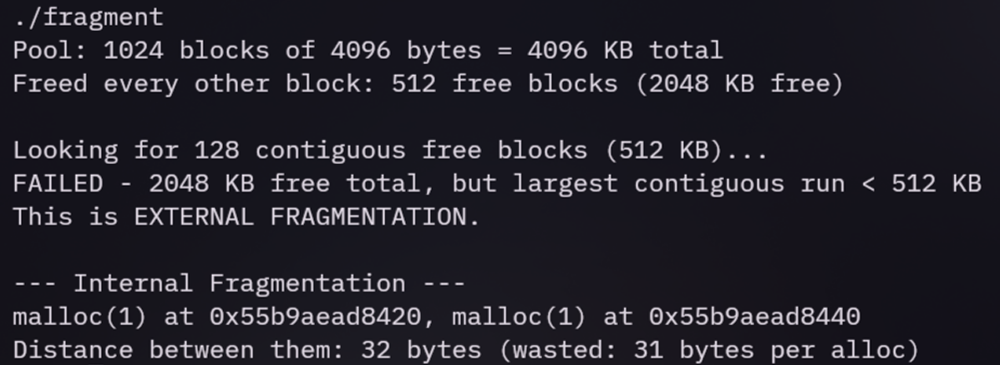
---

## Section 8 - Swapping: When Physical RAM Runs Out

### **Q8.1:** In the `vmstat` output, the `si` and `so` columns show pages swapped in and out per second. Did you see non-zero values? When did they spike?
####  Non-zero `si` (swap in) and `so` (swap out) columns appeared when the program touched 80% of RAM, forcing the kernel to evict less-recently-used pages to swap to make room for the new allocations. Spikes occurred during the initial touching phase and again during re-reading as pages were faulted back in.

### **Q8.2:** Look at `VmSwap` in the output. If it's nonzero, that means some of this process's pages are currently sitting on disk instead of in RAM. Why did the kernel decide to swap them out?

#### The kernel swapped out pages because physical RAM was overcommitted—the program allocated and touched 80% of total RAM, leaving insufficient free frames for other processes and kernel activity. The kernel selected pages that hadn't been accessed recently (based on LRU/aging heuristics) to swap out to disk.


### **Q8.3:** A major page fault (reading a page back from disk) takes about 5–10 ms. A minor fault (mapping a fresh zero page) takes about 1 μs. That's a ~10,000× difference. Why does this matter so much for database systems that try to keep their working set in RAM?
####  For database systems, major page faults (~5–10 ms) cause latency spikes that violate performance SLAs, whereas minor faults (~1 μs) are negligible. Databases aim to keep their working set in RAM to avoid disk I/O, because even a small fraction of requests hitting swap can destroy tail latency and transaction throughput.

### **Screenshot 8:** Side-by-side of `vmstat 1` during the run and the final VmRSS/VmSwap numbers.
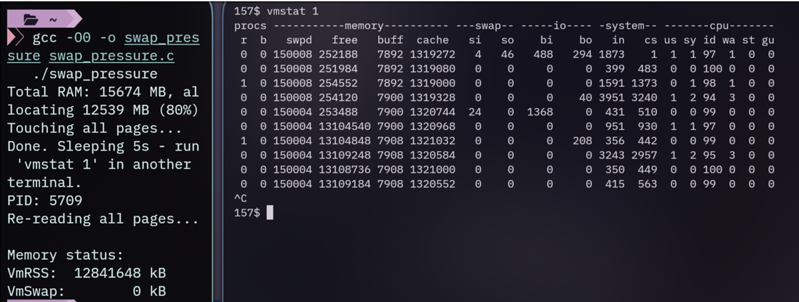

---

## Section 9 - Page Replacement: Deciding What Gets Evicted

### **Q9.1:** Compare the iteration times for the 64 MB working set vs the 512 MB one. Which is faster, and why?
####  The 64 MB working set is much faster than the 512 MB one because the smaller working set fits entirely in RAM, so all pages remain in the active list and are accessed with only minor page faults (or none). The 512 MB working set exceeds physical RAM capacity, causing constant page eviction and major page faults as pages are swapped out and back in.

### **Q9.2:** Run `grep -E 'Active|Inactive' /proc/meminfo` before and after each run. How do the active/inactive page counts shift?

####  Before a run, active/inactive counts reflect the baseline system state. After the small working set run, active pages increase slightly but remain stable. After the large working set run, inactive pages rise significantly because the kernel moves less-recently-used pages to the inactive list, making them candidates for eviction as memory pressure increases.

### **Q9.3:** Why doesn't Linux use true LRU? (True LRU means updating a data structure on literally every memory access - that would be insanely expensive. The accessed bit in the PTE is set by hardware automatically, making the second-chance approximation almost free.)
#### Linux doesn't use true LRU because true LRU would require updating a timestamp or moving pages in a list on *every* memory access, which would impose massive overhead. Instead, Linux leverages the hardware-accessed bit in each PTE—the CPU sets it automatically on access—and periodically sweeps through pages to approximate LRU with a second-chance (clock) algorithm that is nearly free and scales well.

### **Screenshot 9:** Iteration timings for both working set sizes.
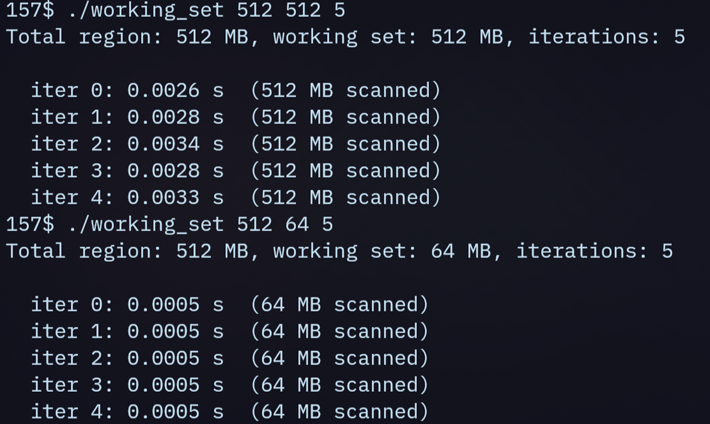

---

## Section 10 - Thrashing: The Performance Cliff


### **Q10.1:** At what percentage of RAM did throughput collapse? Compare the numbers at 75% vs 130%.
#### Throughput collapsed at or above 100% of RAM (130% showed severe slowdown). At 75%, the working set still fit in physical memory, so access times were fast. At 130%, the working set exceeded RAM, forcing constant swapping, throughput dropped by orders of magnitude as the system spent more time on I/O than computation.
### **Q10.2:** In `vmstat`, what happened to `si`/`so` (swap in/out) and `wa` (I/O wait %) once thrashing kicked in?
#### Once thrashing kicked in, `si` and `so` (swap in/out) spiked to high non-zero values, and `wa` (I/O wait) climbed significantly, often exceeding 50–90%, indicating the CPU was mostly idle waiting for disk I/O to complete.
### **Q10.3:** Linux has two main defenses against thrashing:
####  **(a)** The OOM killer terminates processes to free memory when the system is out of memory and thrashing cannot be resolved, stepping in when reclaiming pages fails to satisfy allocation requests.  
#### **(b)** `vm.swappiness` (default 60) controls the kernel's tendency to swap out process pages versus evicting page cache pages—higher values increase swapping aggressiveness, lower values favor keeping process pages in RAM.

### **Screenshot 10:** The throughput table from `./thrash` and matching `vmstat` output.
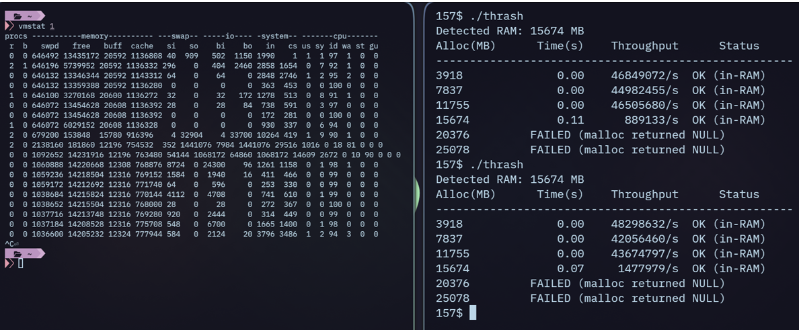
---
