# Assignment0: Hadoop Map reduce
### Name: Dharani S
### SRN: PES2UG24CS157
### Section: C

## 1. Verify the number of records:
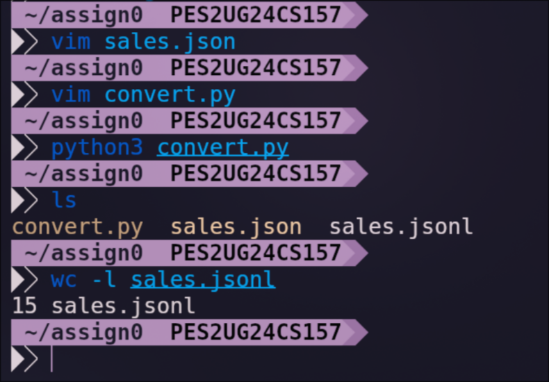
## 2. `cat sales.jsonl` 
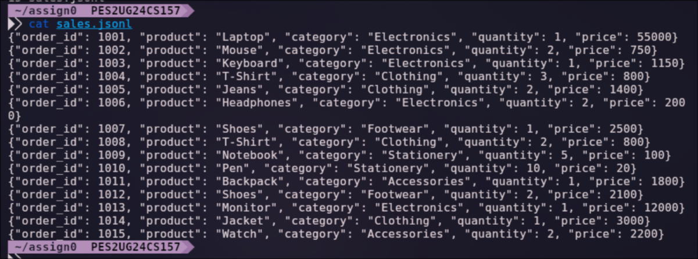
## 3. Pass the input dataset to the mapper:
`cat sales.jsonl | ./mapper.py`
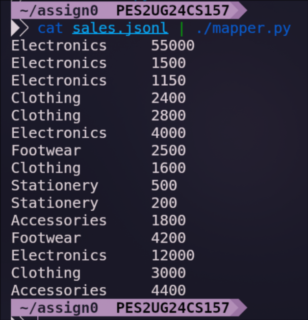
## 4. Sort the output from mapper using: `cat sales.jsonl | ./mapper.py | sort`
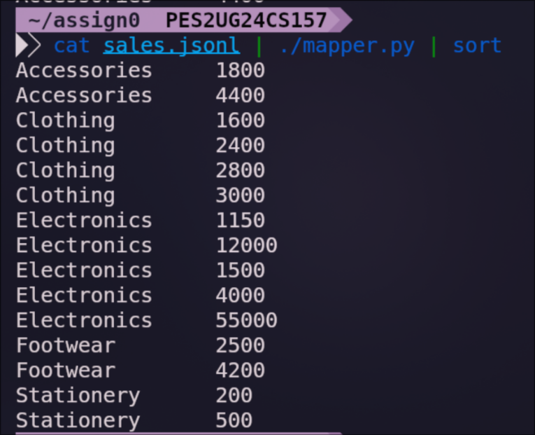
## 5. sorted output  provided as input to the Reducer: `cat sales.jsonl | ./mapper.py | sort | ./reducer.py`
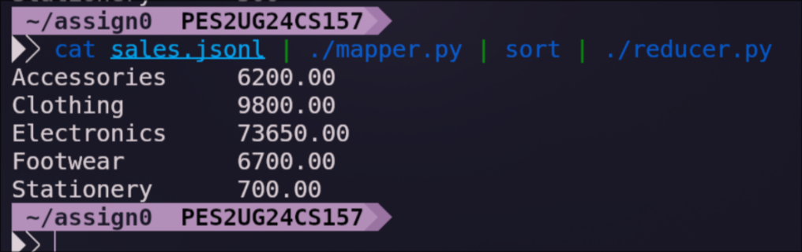
## 6. Ingest the dataset into HDFS
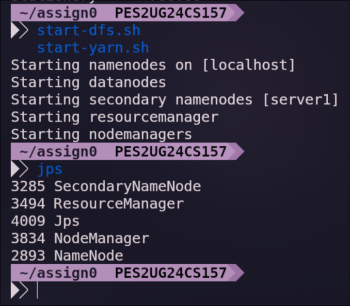

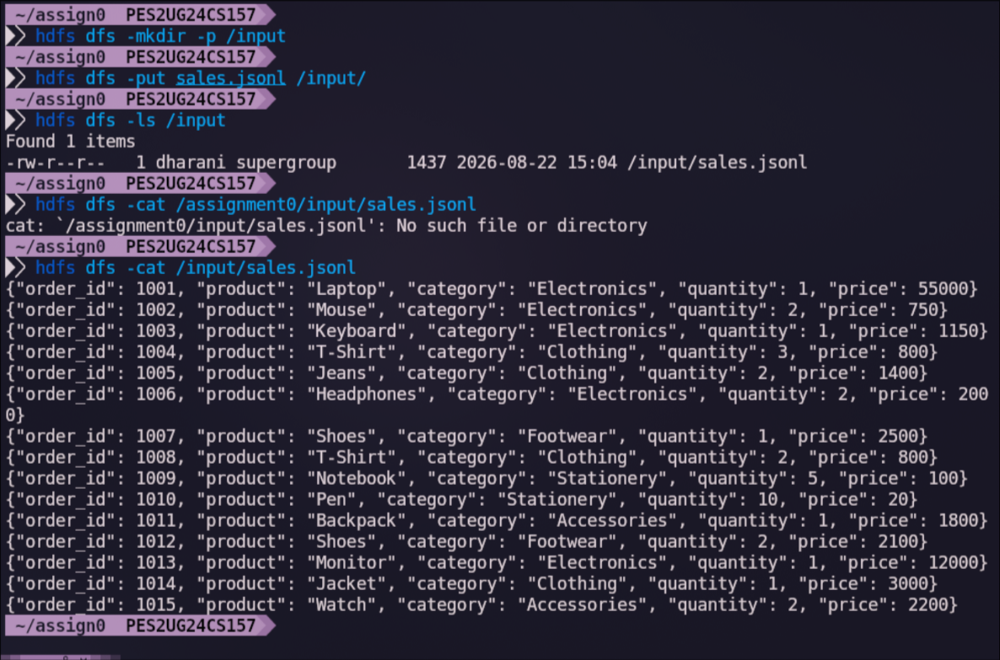
## 7. Run the MapReduce job on Hadoop
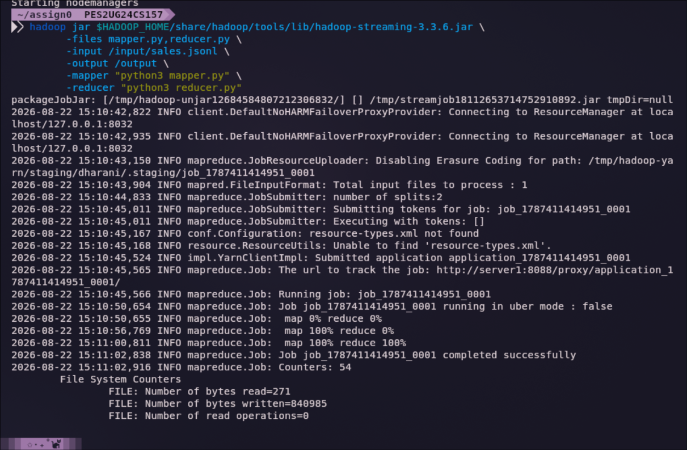
#### Check the output directory:
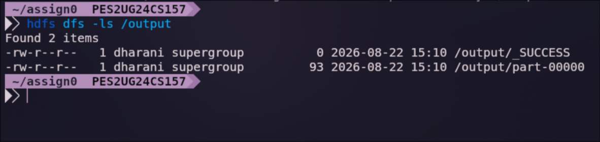
#### Verify its content
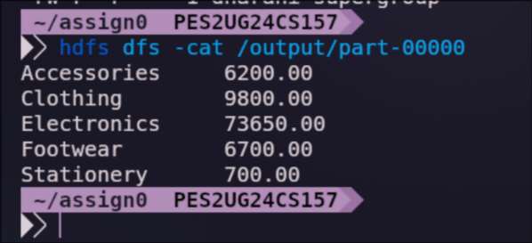
## 8. Verify the job through yarn
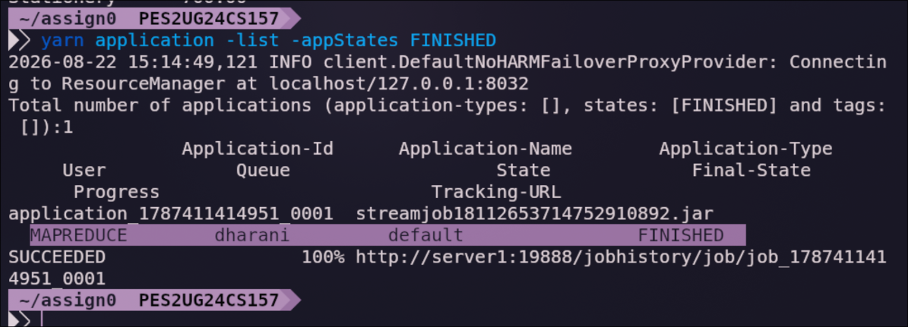
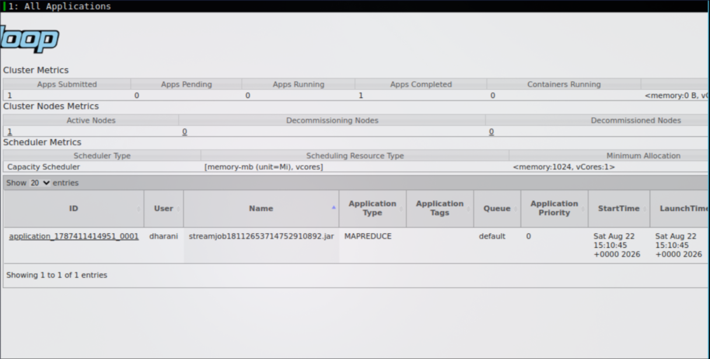