# Hadoop Installation and Verification
### Name: Dharani S
### SRN: PES2UG24CS157
### Section: C

# Hadoop Installation
## 1. Download and verify Hadoop 3.3.6
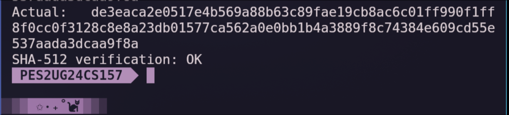
## 2. Environment Variables
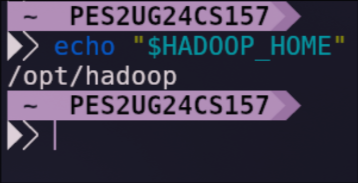
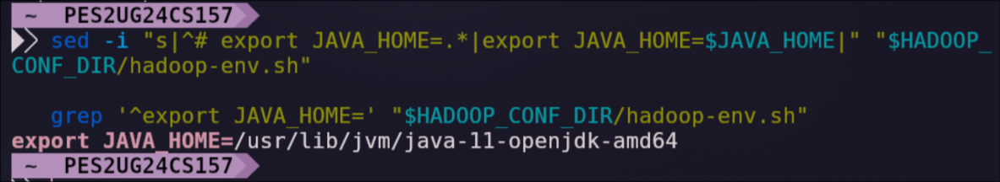
## 3.  Format HDFS (only once, reformatting wipes existing data)
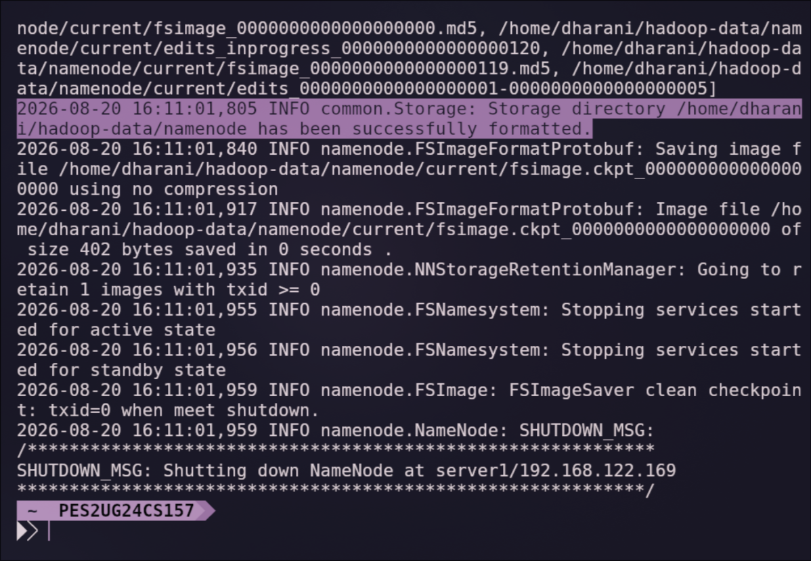
## 4. Start HDFS and YARN
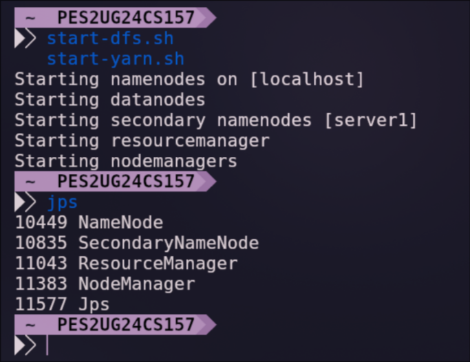

# Verification

## 1. HDFS health check
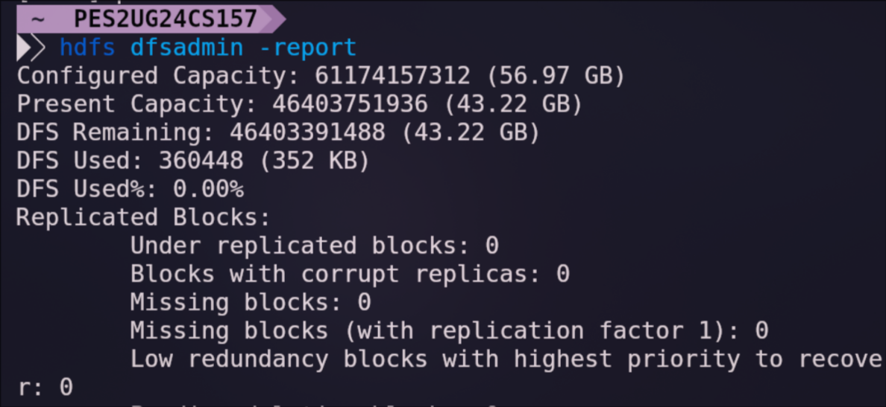
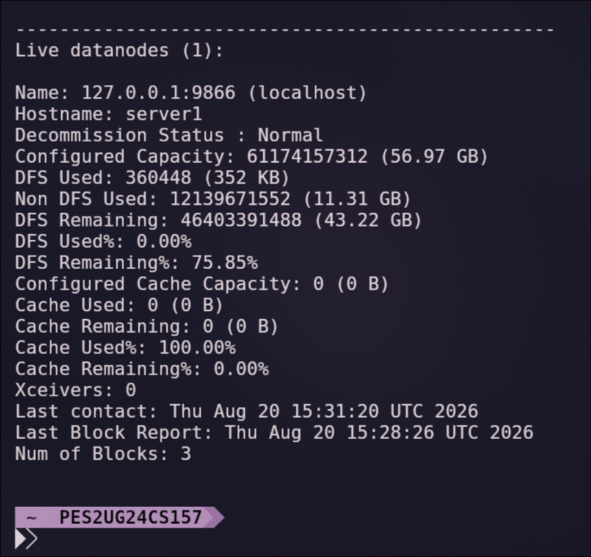
## 2. Basic HDFS read/write smoke test
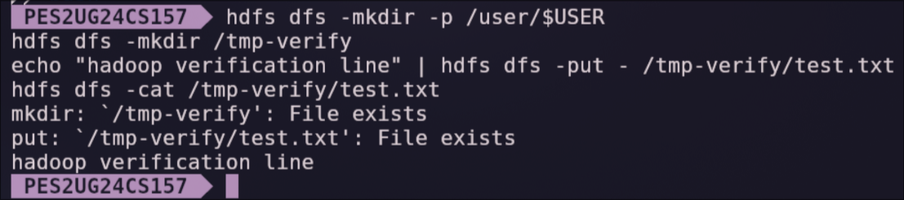
## 3. YARN job, the pi example
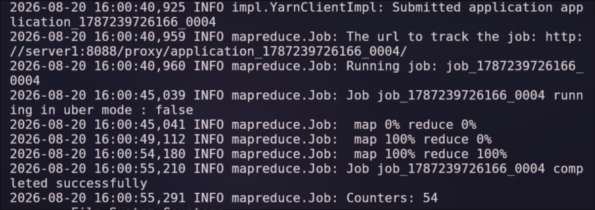
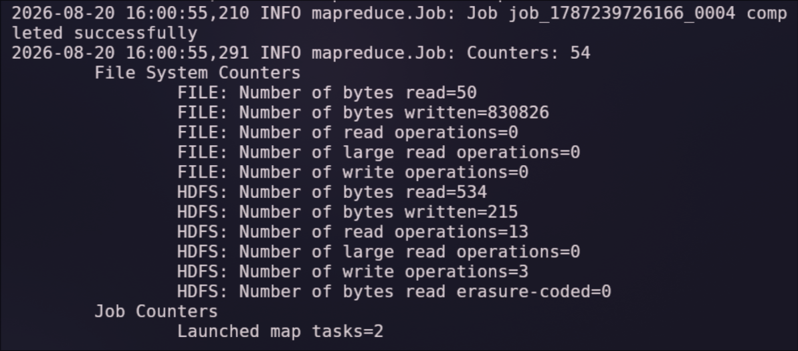
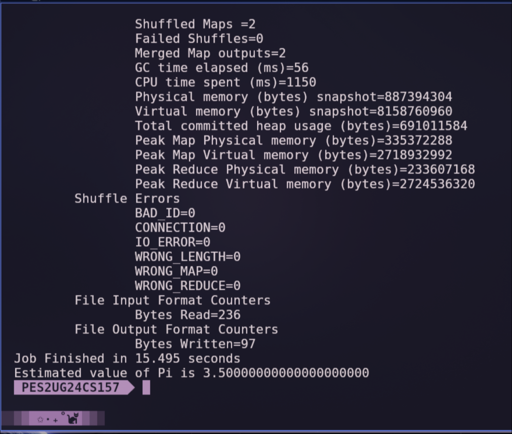
## 4. Exiting HDFS
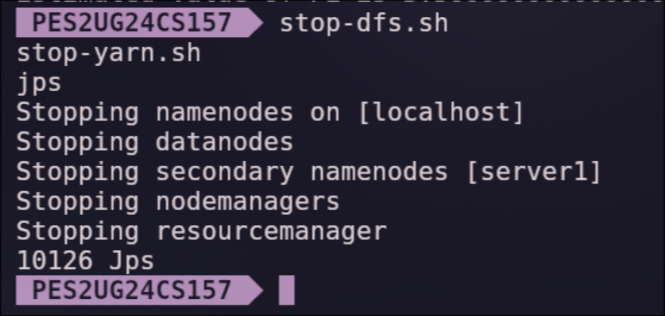