# RELATIONAL SCHEMA: Smart Hostel Management System

### **Name: Dharani S**
### **SRN: PES2UG24CS157**
### **Section: C**

### Task 1:

1. HOSTEL(Hostel_ID PK, Hostel_Name, Location, Capacity)

2. STAFF(Staff_ID PK, Name, Salary, Designation,
         Hostel_ID FK -> HOSTEL(Hostel_ID) NOT NULL,
         Supervisor_ID FK -> STAFF(Staff_ID) NULL)

   [Step 6 - HOSTEL EMPLOYS STAFF (1:N, Staff=total) -> FK on STAFF]
   [Step 8 - STAFF SUPERVISES STAFF (recursive 1:N, partial) -> FK on same table]

3. ROOM(Hostel_ID FK -> HOSTEL(Hostel_ID), Room_Number, Floor,
         PK (Hostel_ID, Room_Number),
         ON DELETE CASCADE)

   [Step 4 - weak entity ROOM identified by owner HOSTEL via identifying
    relationship HAS -> composite PK = owner PK + partial key]

4. BED(Hostel_ID, Room_Number, Bed_Number, Availability,
        PK (Hostel_ID, Room_Number, Bed_Number),
        FK (Hostel_ID, Room_Number) -> ROOM(Hostel_ID, Room_Number),
        ON DELETE CASCADE)

   [Step 5 - multivalued composite attribute BED of ROOM -> own relation]

5. STUDENT(Student_ID PK, First_Name, Middle_Name, Last_Name,
            Gender, Date_of_Birth, Email_Address)

   [Step 2 - composite attribute Student_Name -> flattened into components]
   [Age is derived -> not stored]

6. STUDENT_PHONE(Student_ID FK -> STUDENT(Student_ID), Phone_Number,
                  PK (Student_ID, Phone_Number))

   [Step 5 - multivalued attribute Phone_Number -> own relation]

7. ALLOCATES(Hostel_ID, Room_Number, Student_ID, Allocation_Date,
              Check_in_Date, Check_out_Date,
              PK (Hostel_ID, Room_Number, Student_ID, Allocation_Date),
              FK (Hostel_ID, Room_Number) -> ROOM(Hostel_ID, Room_Number),
              FK Student_ID -> STUDENT(Student_ID))

   [Step 7 - ROOM ALLOCATES STUDENT (M:N) -> new relation with FKs of
    both participants + relationship attributes]

8. PAYMENT(Payment_ID PK, Payment_Date, Amount, Payment_Type,
            Student_ID FK -> STUDENT(Student_ID) NOT NULL)

   [Step 6 - STUDENT MAKES PAYMENT (1:N, Payment=total) -> FK on PAYMENT]

9. RECEIPT(Receipt_ID PK, Receipt_Date,
            Payment_ID FK -> PAYMENT(Payment_ID) NOT NULL UNIQUE,
            ON DELETE CASCADE)

   [Step 3 - PAYMENT GENERATES RECEIPT (1:1, both total) -> FK placed on
    RECEIPT since Receipt cannot exist without Payment]

10. FACILITY(Facility_ID PK, Facility_Name, Operating_Hours,
              Hostel_ID FK -> HOSTEL(Hostel_ID) NOT NULL)

    [Step 6 - HOSTEL PROVIDES FACILITY (1:N, Facility=total) -> FK on FACILITY]

11. USES(Student_ID, Facility_ID, Usage_Date,
          PK (Student_ID, Facility_ID, Usage_Date),
          FK Student_ID -> STUDENT(Student_ID),
          FK Facility_ID -> FACILITY(Facility_ID))

    [Step 7 - STUDENT USES FACILITY (M:N) -> new relation with FKs of
     both participants]
---

## Task 2:

### 0. Create database:
```sql
CREATE DATABASE smart_hostel_mgmt;
USE smart_hostel_mgmt;
```
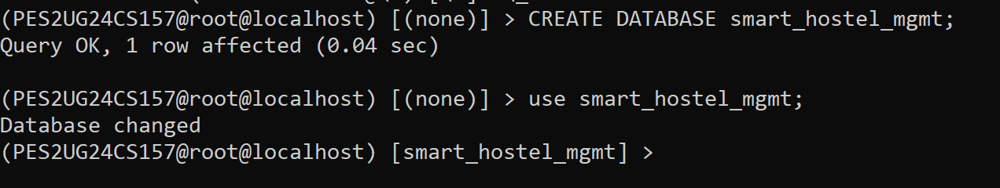
### 1. Create all tables:
```sql
CREATE TABLE HOSTEL (
    Hostel_ID     INT PRIMARY KEY,
    Hostel_Name   VARCHAR(50) NOT NULL,
    Location      VARCHAR(100),
    Capacity      INT CHECK (Capacity > 0)
);

CREATE TABLE STAFF (
    Staff_ID       INT PRIMARY KEY,
    Name           VARCHAR(50) NOT NULL,
    Salary         DECIMAL(10,2) DEFAULT 0,
    Job            VARCHAR(50),
    Hostel_ID      INT NOT NULL,
    Supervisor_ID  INT,
    FOREIGN KEY (Hostel_ID) REFERENCES HOSTEL(Hostel_ID)
        ON DELETE CASCADE ON UPDATE CASCADE,
    FOREIGN KEY (Supervisor_ID) REFERENCES STAFF(Staff_ID)
        ON DELETE SET NULL ON UPDATE CASCADE
);
...
...
```
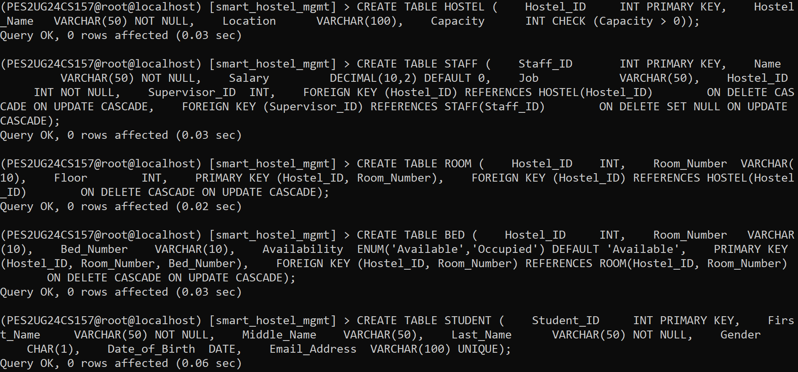
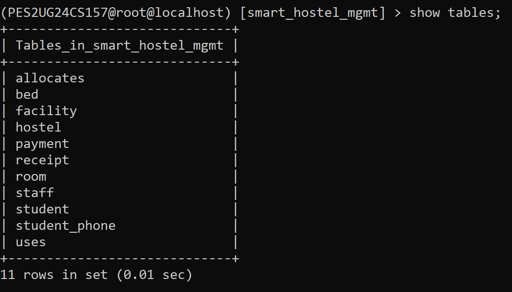
### 2. Alter FACILITY
```sql
ALTER TABLE FACILITY ADD COLUMN Facility_Code VARCHAR(10) FIRST;
DESC FACILITY;
```
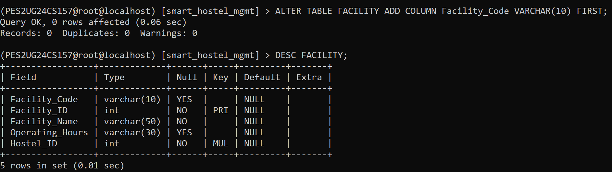
### 3. Add constraint
```sql
ALTER TABLE STAFF ADD CONSTRAINT chk_salary CHECK (Salary >= 0);
SHOW CREATE TABLE STAFF;
```
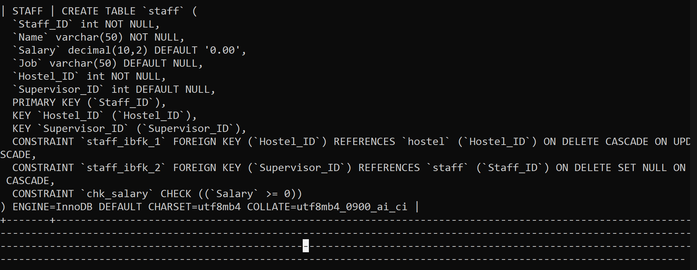
### 4. Rename column: Job → Designation (2.4)
```sql
ALTER TABLE STAFF CHANGE COLUMN Job Designation VARCHAR(50);
DESC STAFF;
```
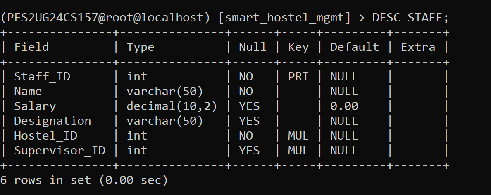
### 5. Change Gender to ENUM (2.5)
```sql
ALTER TABLE STUDENT MODIFY COLUMN Gender ENUM('M','F','Other');
DESC STUDENT;
```
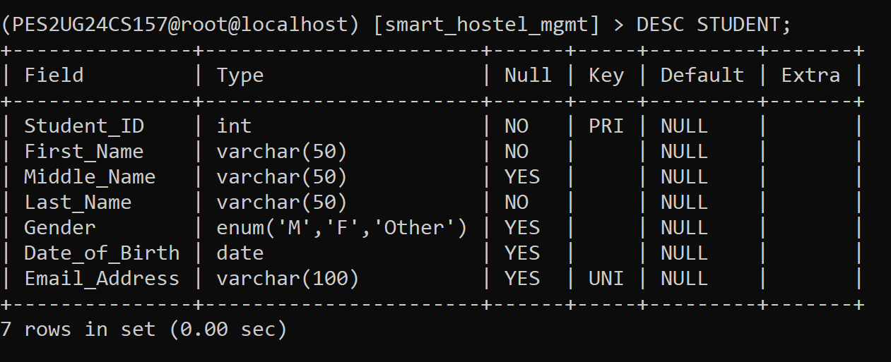
### 6. Drop the renamed column (2.6)
```sql
ALTER TABLE STAFF DROP COLUMN Designation;
DESC STAFF;
```
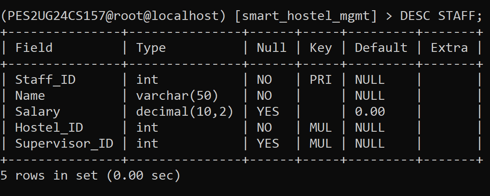
### 7. Change a column's data size (2.7)
```sql
ALTER TABLE HOSTEL MODIFY COLUMN Hostel_Name VARCHAR(100);
DESC HOSTEL;
```
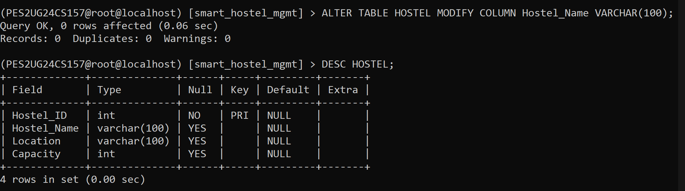
### 8. Rename a table (2.8)
```sql
ALTER TABLE PAYMENT RENAME TO FEE_PAYMENT;
SHOW TABLES;
```
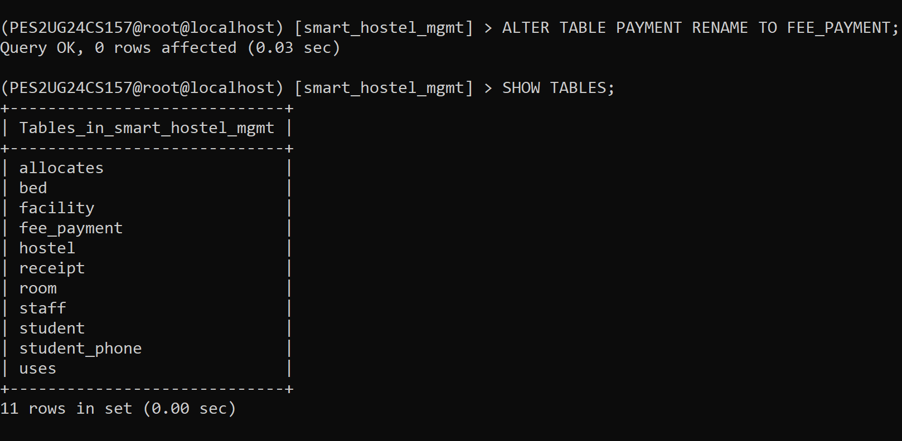
### 9. Drop tables after dropping constraints (2.9)
```sql
SHOW CREATE TABLE RECEIPT;
```
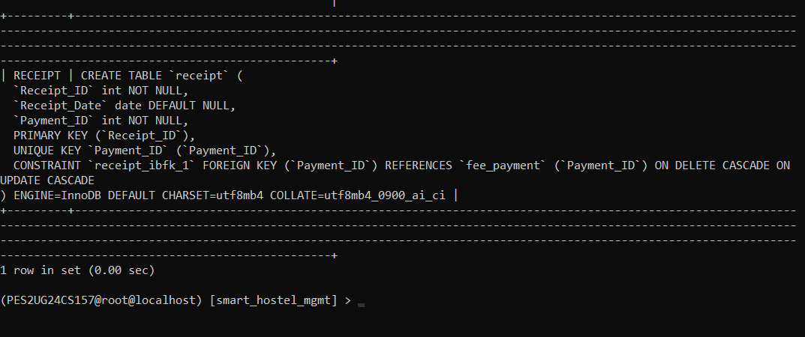
```sql
ALTER TABLE RECEIPT DROP FOREIGN KEY receipt_ibfk_1;
DROP TABLE FEE_PAYMENT;
SHOW TABLES;
```
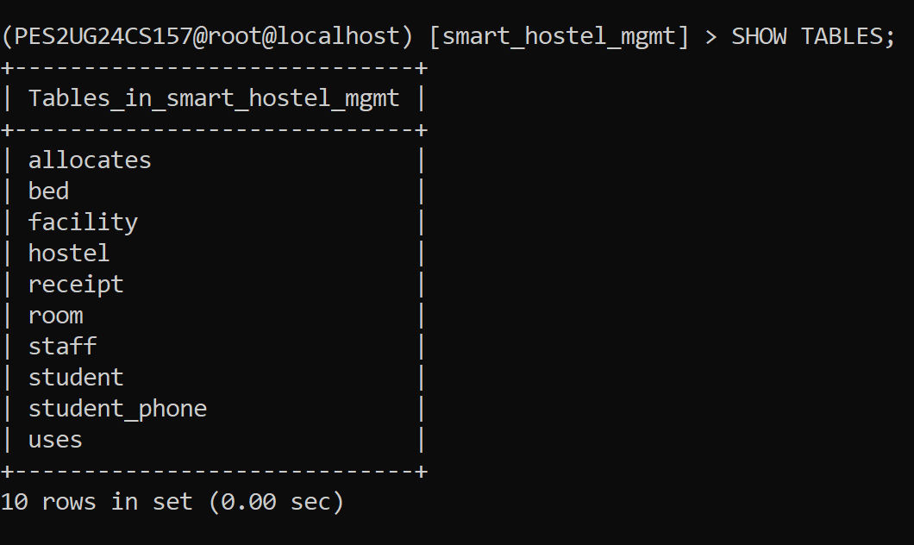