# MACHINE LEARNING - UNIT 1 COMPLETE NOTES

## TOPIC 1: What is Machine Learning?


### Simple definition (Tom Mitchell, 1997):
"Machine learning is the study of computer algorithms that allow 
computer programs to automatically improve through experience."

### Formal definition (MUST MEMORIZE - exam favorite):
A well-defined learning problem is described by three things: **P, T, E**

| Symbol | Stands for | Meaning |
|--------|-----------|---------|
| T | Task | What the program is trying to do |
| P | Performance measure | How you judge if it's doing well |
| E | Experience | The data/training the program learns from |

**"A program learns from Experience E, with respect to Task T, 
improving its Performance P."**

A well-posed learning task = **<P, T, E>**

### Memory trick:
Think of a student:
- T = the exam they're taking
- P = the marks they score
- E = the practice/study they did before

###  Check yourself:
1. What do P, T, E stand for?
2. Write the Tom Mitchell definition in your own words.
3. If E is bad (bad training data), what happens to P?


## TOPIC 2: ML as a Flow (the pipeline)


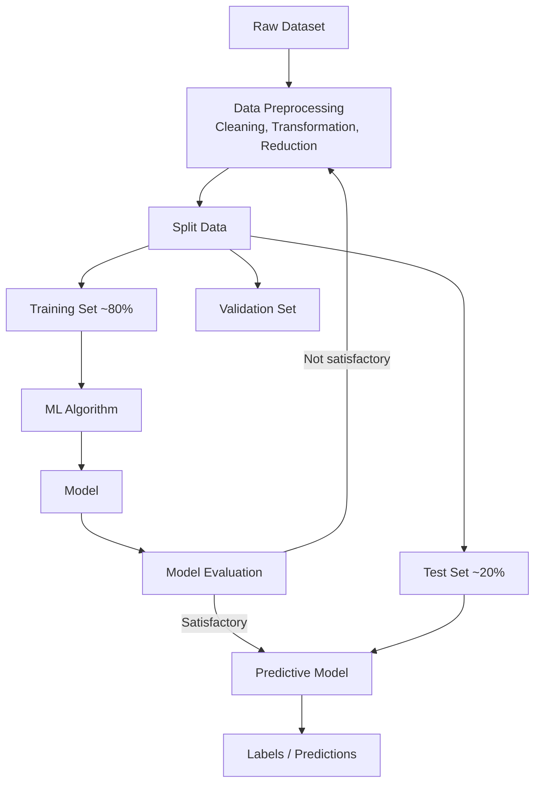

### Key points:
- Data is usually split **80% training / 20% testing**
- Within training, a **validation set** is used to tune the model 
  (like a mock test before the real exam)
- Test set = final exam, used ONLY at the end to check performance
- If results aren't good, you loop back and preprocess/retrain

### Why do we split data?
If you train AND test on the same data, the model just "memorizes" 
(like memorizing answers, not understanding the concept). Splitting 
checks if it actually learned to generalize to NEW, unseen data.

---
###  Check yourself:
1. What is the typical train/test split ratio?
2. Why do we need a separate validation set from the training set?
3. What happens if "satisfactory result" is not reached?


## TOPIC 3: PTE — Well-posed Learning Problems (Practice Table)


"Identify T, P, E for X problem"

| # | Problem | Task (T) | Training Experience (E) | Performance (P) |
|---|---------|----------|--------------------------|-------------------|
| 1 | Checkers game | Playing checkers | Practice games against itself | Fraction of games won |
| 2 | Handwriting recognition | Recognizing/classifying handwritten words | Database of handwritten words + labels | Fraction of correct words identified |
| 3 | Self-driving car | Drive using vision sensor | Images + steering commands from human driver | Avg distance before error |
| 4 | Text categorization | Assign document to category | Database of pre-classified docs | Fraction of docs correctly tagged |
| 5 | Spam detection | Classify email spam/not spam | User-labeled emails | Fraction of emails correctly classified |
| 6 | Credit card fraud | Label transaction fraud/not fraud | Historical labeled transactions | Accuracy (with higher penalty for missed fraud) |

### How to answer ANY new PTE question (method):
1. **T (Task)** — ask "what decision/output is the system producing?"
2. **E (Experience)** — ask "what past data does it learn from?"
3. **P (Performance)** — ask "how do we numerically measure success?"

---
###  Check yourself:
1. Without looking, write T, P, E for "Learning to detect Credit Card Fraud."
2. Make up your own example (e.g., "Netflix recommending movies") and 
   define its T, P, E.


## TOPIC 4: 7 Steps to Machine Learning


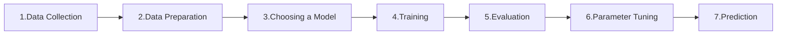

Just memorize this order (mnemonic: 
**"Do Data Cleanly, Choose, Train, Evaluate, Tune, Predict"**
→ Collect, Prepare, Choose model, Train, Evaluate, Tune, Predict)

---
###  Check yourself:
1. List all 7 steps in order without looking.
2. Which step comes right after "Training"?


## TOPIC 5: THE THREE MAIN TYPES OF ML (core topic!)


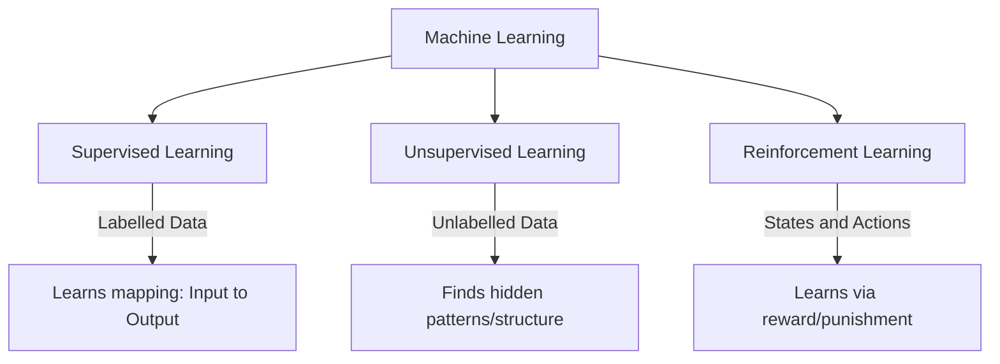

| Criteria | Supervised | Unsupervised | Reinforcement |
|----------|-----------|---------------|----------------|
| Definition | Learns using labelled data | Trained on unlabelled data, no guidance | Learns by interacting with environment |
| Data type | Labelled | Unlabelled | No predefined data |
| Problem types | Regression, Classification | Association, Clustering | Exploitation or Exploration |
| Supervision | Extra supervision (has "answer key") | No supervision | No supervision |
| Algorithms | Linear/Logistic Regression, SVM, KNN | K-Means, C-Means, Apriori | Q-Learning, SARSA |
| Aim | Calculate outcomes | Discover underlying patterns | Learn a series of actions |
| Applications | Risk evaluation, Sales forecast | Recommendation systems, Anomaly detection | Self-driving cars, Gaming, Healthcare |

### Simple analogy to remember the difference:
- **Supervised** = Student learns with a teacher correcting answers (has labels)
- **Unsupervised** = Student groups similar things on their own (no labels, finds patterns)
- **Reinforcement** = Student/animal learns by trial-and-error, getting rewards/punishments (dog training example)

---
### ✅ Check yourself:
1. Name the 3 main types of ML.
2. Which type uses NO labels at all and just groups similar data?
3. Which type uses "rewards and punishment" instead of labels?
4. Give one real-world example for each type (not from the slides).


## TOPIC 6: SUPERVISED LEARNING (deep dive)


### Core idea:
- Given: training data **+ desired output (labels)**
- **Step 1 (Training):** model learns from labelled dataset
- **Step 2 (Testing):** model is tested on new data and predicts output

### The Math (IMPORTANT, gets asked a lot):
- You have input variables **X** and output variable **Y**
- Algorithm learns a mapping function: **Y = f(X)**
- Goal: approximate f(X) so well that for NEW x, you can predict Y
- This approximation function is called the **hypothesis function** 
  (an "educated guess"/claim about the true relationship)

### Example: Shapes dataset (square, triangle, hexagon)
- Step 1 (Training): "4 equal sides → Square", "3 sides → Triangle", 
  "6 equal sides → Hexagon"
- Step 2 (Testing): Given a NEW shape, predict which category it belongs to

### Two types of Supervised Learning:

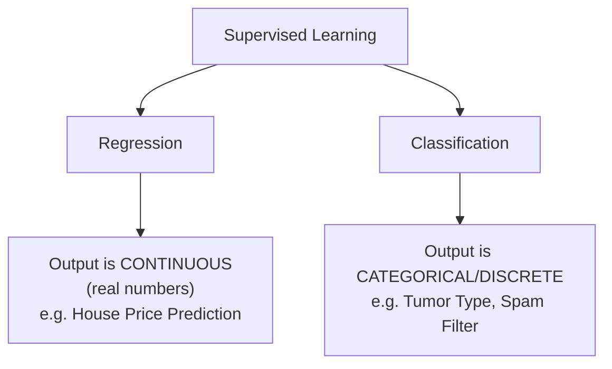

| | Regression | Classification |
|---|-----------|-----------------|
| Output | Continuous (real-valued, e.g. 45.6, 100) | Categorical/discrete (e.g. Yes/No, Cat/Dog) |
| Example | Predicting house price | Predicting if tumor is malignant/benign |
| Formula view | y is real-valued → regression | y is categorical → classification |

### Common Algorithms:
**For Classification:**
- Random Forest
- Decision Trees
- Logistic Regression
- Support Vector Machines (SVM)

**For Regression:**
- Linear Regression
- Bayesian Linear Regression

Note: **Random Forest** can do BOTH classification and regression.
Note: A **Neural Network is "supervised"** if the desired output is already known.

### Applications:
- Spam Detection (email → spam/not spam)
- Speech Recognition

---
### ✅ Check yourself:
1. Write the equation representing supervised learning (Y = ?)
2. What is a "hypothesis function"?
3. Give 2 examples of regression algorithms and 2 of classification algorithms.
4. Is "predicting tomorrow's temperature" regression or classification? Why?
5. Is "predicting whether it will rain tomorrow (Yes/No)" regression or 
   classification? Why?


## TOPIC 7: UNSUPERVISED LEARNING (deep dive)


### Core idea:
- Given: training data **WITHOUT desired outputs** (no labels)
- Model finds the underlying **structure/pattern** of the dataset on its own
- Groups data by similarity, represents it in compressed format

### How it works:
1. Unlabeled input data fed into model
2. Model interprets raw data to find **hidden patterns**
3. Applies algorithm (e.g., k-means clustering)
4. Divides data into groups based on similarities/differences

### Two types of Unsupervised Learning:

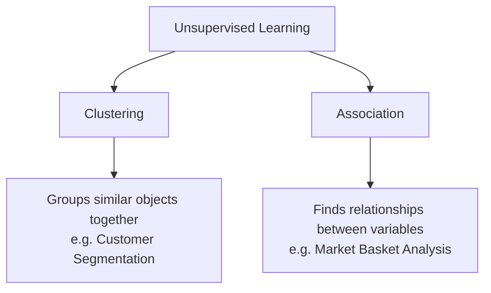

**Clustering:** Grouping objects such that objects within a group are 
similar to each other, and different from objects in other groups.
- Example: Sorting mixed-color potatoes into piles by color

**Association:** Finding relationships/rules between variables in large 
datasets — "which items occur together"
- Examples:
  - People who buy a new home → likely buy new furniture
  - Cancer patients grouped by gene expression
  - Shopper groups based on browsing/purchase history
  - Movies grouped by viewer ratings

### Common Algorithms:
- K-means clustering
- Hierarchical clustering
- Anomaly detection
- Neural Networks (can be unsupervised too)
- Principal Component Analysis (PCA)
- Independent Component Analysis
- Apriori algorithm (mainly for Association)
- Singular Value Decomposition (SVD)

### Applications:
- Organize computing clusters
- Social network analysis
- Market segmentation
- Astronomical data analysis

---
### ✅ Check yourself:
1. What's the KEY difference between supervised and unsupervised data?
2. Name the 2 types of unsupervised learning.
3. Which algorithm is commonly used for Clustering? For Association?
4. "Grouping customers by shopping behavior with no predefined categories" 
   — is this clustering or association?


## TOPIC 8: OTHER TYPES — Semi-Supervised & Self-Supervised


### Semi-Supervised Learning:
- Mix of **labelled + unlabelled data** (partial labels)
- Example: You know some animals are "Camel" and "Cow" (labelled), 
  but there's also unlabelled data (elephant image with "?"). 
  Model uses both to predict the unlabelled one.

### Self-Supervised Learning:
- Model is pre-trained on data WITHOUT labels doing a "pretext task"
- Then knowledge is TRANSFERRED to a "target task" using labelled data
- Two stages: pre-training model (no labels) → target model (fine-tuned)

### Quick comparison:
| Type | Labels available? |
|------|---------------------|
| Supervised | All data labelled |
| Unsupervised | No labels at all |
| Semi-supervised | SOME data labelled, some not |
| Self-supervised | No labels initially, generates its own "pseudo-labels" via pretext task |

---
### ✅ Check yourself:
1. What's the difference between semi-supervised and self-supervised learning?
2. In self-supervised learning, what are the two tasks called?


## TOPIC 9: REINFORCEMENT LEARNING (deep dive)


### Core idea:
"Learning what to do and how to map situations to actions" 
— by getting **rewards** (positive feedback) or **punishment** 
(negative feedback) from an environment.

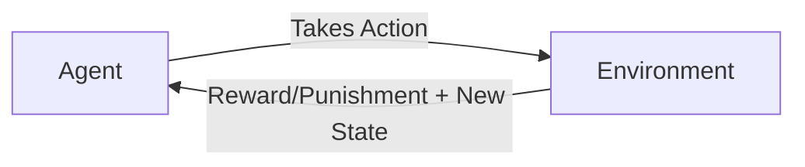

### The Agent-Environment Interface (formal loop):
- Agent and environment interact at discrete time steps: t = 0, 1, 2, ...
- Agent observes **state** at step t: s_t
- Agent produces an **action** at step t: a_t
- Agent gets a **reward**: r_(t+1)
- Environment moves to a **new state**: s_(t+1)

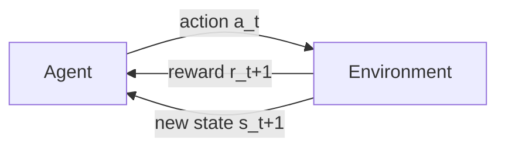

### Key Elements of RL (memorize these 3):
| Element | Meaning |
|---------|---------|
| **Agent** | Software/program that makes intelligent decisions (the "learner") |
| **Policy Function** | Defines the agent's BEHAVIOR — decides which action to take based on past rewards/penalties |
| **Value Function** | Denotes HOW GOOD it is to be in a particular state; total expected reward from that state onward, denoted v(s) |

### Example 1: Dog fetching a ball
- Dog fetches ball → gets a cookie (reward)
- Dog fails to fetch → no cookie (no reward)
- Over time dog learns a **"control policy"** — the strategy that maximizes cookies

### Example 2: Chess pawn
- Agent (pawn) takes random action → moves forward
- Gets reward if it helps toward winning (kills a target)
- Gets penalty for bad moves
- Over many rounds ("episodes"), it learns which actions bring the best rewards

### Example 3: PacMan
- Goal: eat food, avoid ghosts
- Reward: eating food | Punishment: getting killed by ghost
- States = PacMan's location in the grid
- Dilemma: **Exploration vs Exploitation** 
  (try new paths vs. stick to known good paths)

### RL vs Supervised vs Unsupervised (IMPORTANT distinction):
- **Supervised vs RL:** Both map input→output, but supervised gets the 
  "correct answer" directly; RL only gets rewards/punishments (indirect feedback)
- **Unsupervised vs RL:** Unsupervised finds similarities/patterns; 
  RL's goal is to MAXIMIZE cumulative reward via an action model

### Applications of RL:
- **Gaming:** AlphaGo Zero (beat world champion at Go)
- **Robotics:** high-dimensional control, e.g., Google cut energy usage 
  ~50% using DeepMind
- **Text mining:** Salesforce used RL for text summarization
- **Trade execution:** JPMorgan uses robots for trading large orders
- **Healthcare:** medication dosing, treatment policy optimization, clinical trials

---
### Check yourself:
1. Name the 3 key elements of RL and define each in your own words.
2. Draw (mentally) the Agent-Environment loop with state, action, reward.
3. What's the "exploration vs exploitation" dilemma?
4. In the dog example, what is the "control policy"?
5. How is RL different from Supervised Learning in terms of feedback type?


## TOPIC 10: Summary Table — All 3 Types with Applications 


This table type appeared as QUIZ questions in your slides — MEMORIZE:

| Applications | Type |
|-------------|------|
| Automated/self-driving vehicle | **Supervised Learning** (uses labelled steering data) |
| Real-time decisions, Game AI, Skill Acquisition, Robot Navigation | **Reinforcement Learning** |
| Targeted marketing, Recommender Systems, Customer Segmentation | **Unsupervised Learning - Clustering** |
| Fraud Detection, Image Classification, Diagnostics, Customer Retention | **Supervised Learning - Classification** |
| "Exploratory Learning" (alternate name) | **Unsupervised Learning** |

### 🚨 TRICKY QUIZ POINT: 
Even though self-driving cars sound "autonomous," the slide classifies 
this under **SUPERVISED learning** because the model learns from labeled 
training data (images + steering commands recorded from a human driver).

---
###  Check yourself:
1. Automated vehicle → which type of learning? WHY (not what you'd guess)?
2. What is "exploratory learning" another name for?
3. Fraud detection → classification or clustering? Supervised or unsupervised?


## TOPIC 11: Generative vs Discriminative Models


### Core idea:
- **Discriminative model:** predicts based on **conditional probability** 
  p(y|x) — "given input x, what's the probability of label y?" 
  Used for classification/regression. Draws BOUNDARIES in data space.
- **Generative model:** models the **joint probability** p(x,y) — 
  understands how the whole data is DISTRIBUTED. Can even generate new 
  data. Models how data is PLACED throughout the space.

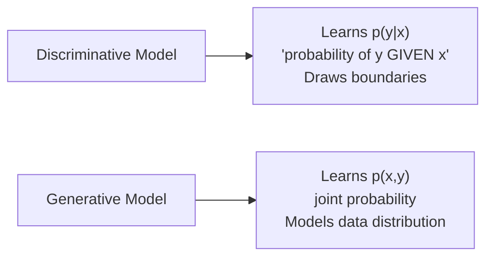

### Memory trick:
- Discriminative = "DISCRIMINATES / separates" categories with a boundary line
- Generative = "GENERATES" new examples because it understands the full distribution

### Types of Discriminative Models:
- Logistic Regression
- Support Vector Machine (SVM)
- Decision Tree
- Random Forest

### Types of Generative Models:
- Bayesian Network
- Hidden Markov Model
- Autoregressive model
- Generative Adversarial Network (GANs)

### The math example (x=input, y=label):
p(y|x) is the NATURAL distribution for classifying x into class y 
→ that's why models that do this directly are called discriminative.

Generative models learn p(x,y), which CAN be converted to p(y|x) using 
Bayes' Rule, but p(x,y) can ALSO be used to generate new (x,y) pairs — 
that's the extra power generative models have.

---
### ✅ Check yourself:
1. What's the key formula difference: discriminative learns ___, 
   generative learns ___?
2. Name 2 discriminative algorithms and 2 generative algorithms.
3. Which type of model could you use to literally GENERATE a new fake image? Why?


## TOPIC 12: CONCEPT LEARNING — Concept, Feature Space, Concept Space


This is the MOST theory-heavy and MOST test-worthy section. Go slow here.

### 12a. What is a "Concept"?
A **Concept** defines what belongs to a category and what doesn't.
- Example: The "concept" of letter 'A' — some shapes are A, some aren't, 
  even if they look different (cursive A, block A, etc.)

### 12b. What is "Feature Space"?
The **feature space** = the set of ALL possible combinations of 
attributes (features) used to describe examples.

Example — describing letter 'A' with 5 Yes/No features:
| Feature | Values |
|---------|--------|
| Has Crossbar | Yes/No |
| Has Pointed Top | Yes/No |
| Symmetrical | Yes/No |
| Has Two Legs | Yes/No |
| Is Curved | Yes/No |

Each character = a feature VECTOR:
- 'A' → [Yes, Yes, Yes, Yes, No]
- 'Λ' → [No, Yes, Yes, Yes, No]
- 'a' → [Yes, No, No, No, Yes]

### 12c. What is "Concept Space"?
The **concept space** = the set of ALL POSSIBLE concepts that can be 
formed using the feature space. It includes EVERY possible labeling 
(positive/negative) of EVERY feature vector.

### 🚨 THE FORMULA (definitely gets asked in exams):
If you have **n** binary features, then:
- Number of possible examples (instances): **m = 2ⁿ**
- Number of possible CONCEPTS (size of concept space): **2^m = 2^(2ⁿ)**
  (because EACH example can independently be labeled Yes or No)

### Worked Example (fruit edibility — 2 features):
Features: Color (Red/Green), Shape (Round/Long)

Feature space (m = 2² = 4 combinations):
| # | Color | Shape |
|---|-------|-------|
| RR | Red | Round |
| RL | Red | Long |
| GR | Green | Round |
| GL | Green | Long |

Concept space size = 2^m = 2^4 = **16 possible concepts**
(because each of the 4 combos can independently be labeled edible(1) 
or inedible(0) → 2×2×2×2 = 16 total labeling patterns)

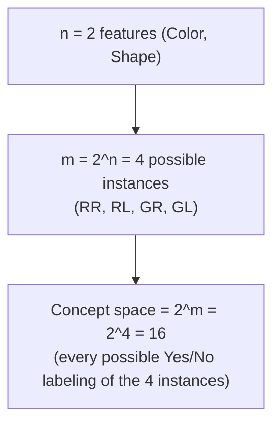

---
### ✅ Check yourself:
1. What does "Concept" mean in ML terms?
2. What's the formula for size of feature space, given n binary features?
3. What's the formula for size of concept space?
4. If you have 3 binary features, how many instances (m) are possible? 
   How many concepts?
   (Answer: m = 2³ = 8, concepts = 2^8 = 256)


## TOPIC 13: Hypothesis Space & Inductive Bias


### The problem:
16 (or more) possible concepts is TOO MANY to search through efficiently. 
So we make an ASSUMPTION about the nature of the concept to reduce the space.

### Key definitions:
- **Inductive Bias** = the assumption we make that REDUCES the concept space
- **Hypothesis Space (H)** = the smaller, "shrunken" space AFTER applying 
  the inductive bias — it's a SUBSET of the Concept Space

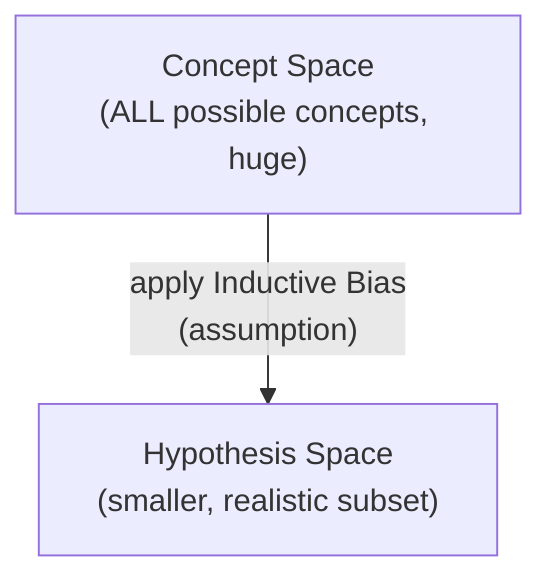

### Our specific bias in the fruit example:
We assume the hypothesis is a **CONJUNCTION** of attribute values 
(i.e., specific value AND specific value — not arbitrary combos).

### Possible values per attribute, with bias:
Number of actual values + **"?"** (means "any value is fine, don't care") 
+ **"Ø"** (means "reject all — no value works", empty/null hypothesis)

### Worked example (Color: Red/Green, Shape: Round/Long):
- Modified size of H = (3 × 3) + 1 = **10 semantically distinct hypotheses**
  - 3 = (2 actual values + "?") for Color
  - 3 = (2 actual values + "?") for Shape  
  - +1 = for the single "Ø" (reject-all) hypothesis, since if ONE 
    attribute is Ø, the WHOLE thing must be negative
  
- List: {R,R}, {R,L}, {R,?}, {G,R}, {G,L}, {G,?}, {?,R}, {?,L}, {?,?}(Accept All) 
  + Reject All (Ø) = **10 total**

- This is a REDUCTION from 16 (concept space) → 10 (hypothesis space)
  (6 hypotheses got excluded because they can't be written as a 
  conjunction — e.g., "Red AND Long" OR "Green AND Round" — that's 
  a disjunction/OR, not allowed under our bias)

### Practice Problem (6 attributes, a1 has 3 values, rest are binary):
- Concept space = 2^(3×2×2×2×2×2) = **2^96**
- Hypothesis space (with conjunctive bias) = (4×3×3×3×3×3) + 1 = **973**
  - 4 = (3 actual values + "?") for a1
  - 3 = (2 actual values + "?") for each binary attribute
  - +1 = Reject All (Ø)
- Reduction: from 2^96 down to just 973!! (massive reduction)

### Why does this matter?
Because it's the reason WHY the specific type of bias (called 
**"Restriction Bias"**) makes learning computationally feasible. Without 
bias, searching all 2^96 possibilities is impossible.

### Important caveat:
The TRUE target concept **may or may not** actually be present in the 
hypothesis space (especially if there are errors in training data, or 
if the true concept requires OR/disjunction logic that our bias excludes).

---
###  Check yourself:
1. Define "Inductive Bias" in one sentence.
2. What does "?" mean in a hypothesis? What does "Ø" mean?
3. For 2 attributes each with 2 possible values, what's the formula for 
   hypothesis space size? (Hint: (values+1) × (values+1) + 1)
4. Why is the Reject-All hypothesis just "+1" and not multiplied in?
5. What type of bias is used here, and what's the underlying assumption?


## TOPIC 14: Version Space


### Definition:
**Version Space (VS)** = the set of ALL hypotheses from the Hypothesis 
Space (H) that are CONSISTENT with the training data.

A hypothesis is "**consistent**" with training data if it correctly 
classifies ALL objects in the training set to their correct labels.

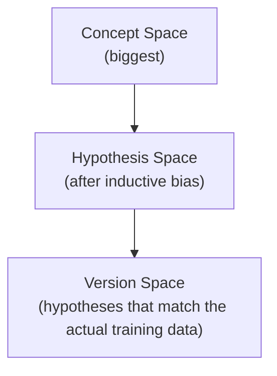

**Formula:** VS = { h : h ∈ H and h is consistent with D_training }

### Worked example:
Training data:
| # | Color | Shape | Edible? |
|---|-------|-------|---------|
| RR | Red | Round | Yes |
| RL | Red | Long | No |

Unknown (not yet seen): GR (Green, Round), GL (Green, Long)

H = {R,R}, {R,L}, {R,?}, {G,R}, {G,L}, {G,?}, {?,R}, {?,L}, {?,?} + Ø

Checking which hypotheses are CONSISTENT with the 2 training rows:
- {R,R} → says "Red Round = Yes" ✓ matches RR=Yes; doesn't contradict RL 
  (since RL isn't Red-Round) ✓ CONSISTENT
- {?,R} → says "anything Round = Yes" → matches RR=Yes; RL is Long not 
  Round so no conflict ✓ CONSISTENT
- Others get eliminated because they conflict with the labels

**VS = {R,R}, {?,R}**

### Why Version Space matters:
It narrows down to ONLY the hypotheses that could actually be true, 
given what you've observed so far. As more training data comes in, 
Version Space usually SHRINKS further.

---
###  Check yourself:
1. Define Version Space in your own words.
2. What does "consistent with training data" mean?
3. Is Version Space bigger or smaller than Hypothesis Space? Why?
4. In the worked example, why was {R,L} NOT included in the Version Space?
   (Think: does {R,L} correctly predict RR is Edible=Yes? {R,L} means 
   "Red AND Long" — RR is Red but ROUND not Long, so {R,L} would say 
   RR doesn't match = reject it, but RR should be Yes → CONTRADICTION 
   → excluded)


## TOPIC 15: Concept Learning (formal definition) & FIND-S Algorithm


### Concept Learning — Tom Mitchell's definition:
"The problem of searching through a predefined space of potential 
hypotheses for the hypothesis that best fits the training examples."

### FIND-S Algorithm — THE most important algorithm in this unit
(Very likely to be asked as a full numerical problem in exams)

### Key facts about FIND-S:
- It is the **FIRST/most basic ML algorithm**
- Finds the **MOST SPECIFIC hypothesis** that fits ALL positive examples
- Considers **ONLY POSITIVE** training examples (completely IGNORES 
  negative examples)
- Moves from **most specific → most general** hypothesis
- Starts with the most specific hypothesis (all Ø's) and generalizes it 
  EACH time it fails to correctly classify a positive example

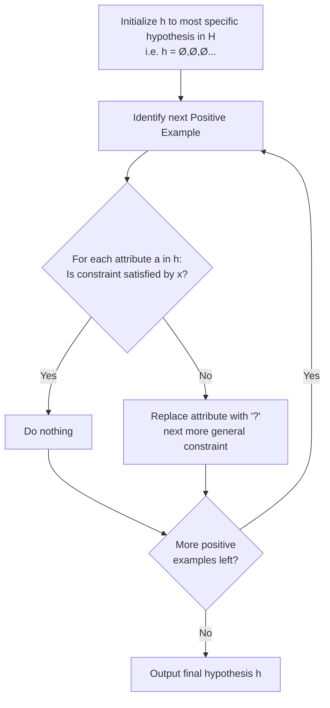

### THE ALGORITHM (word-for-word, memorize this):
```
1. Initialize h to the most specific hypothesis in H (h = <Ø,Ø,...,Ø>)
2. For each POSITIVE training instance x:
      For each attribute constraint a_i in h:
          If the constraint a_i IS satisfied by x:
              Then do nothing
          Else:
              Replace a_i in h by the next more general 
              constraint that IS satisfied by x
3. Output hypothesis h
```

### FULLY WORKED EXAMPLE — "EnjoySport" (classic textbook problem):

Training data:
| sky | temp | humidity | wind | water | forecast | enjoy |
|-----|------|----------|------|-------|----------|-------|
| sunny | warm | normal | strong | warm | same | **yes** |
| sunny | warm | high | strong | warm | same | **yes** |
| rainy | cold | high | strong | warm | change | **no** |
| sunny | warm | high | strong | cool | same | **yes** |

**Step 0:** Initialize h = < Ø, Ø, Ø, Ø, Ø, Ø > (assume everything negative)

**Step 1 (use 1st positive example, row 1):**
h = < sunny, warm, normal, strong, warm, same >
(Simply COPY the first positive example exactly — makes sense, it's 
the most specific match possible)

**Step 2 (use 2nd positive example, row 2):**
```
h (current) = {sunny, warm, normal, strong, warm, same}
x (new)     = {sunny, warm, high,   strong, warm, same}
                        ↑ mismatch here (normal vs high)
Result: h = {sunny, warm, ?, strong, warm, same}
```
(Wherever attribute doesn't match, replace with "?" = generalize)

**Step 3 (row 3 is NEGATIVE → SKIP IT COMPLETELY, do nothing)**

**Step 4 (use 3rd positive example, row 4):**
```
h (current) = {sunny, warm, ?, strong, warm, same}
x (new)     = {sunny, warm, high, strong, cool, same}
                                          ↑ mismatch (warm vs cool)
Result: h = {sunny, warm, ?, strong, ?, same}
```

**FINAL HYPOTHESIS:** 
```
C = {sunny, warm, ?, strong, ?, same}
```

### Using the learned hypothesis to predict:
New data: x = {sunny, warm, high, strong, warm, same}
Check against C = {sunny, warm, ?, strong, ?, same}
- sunny=sunny ✓, warm=warm ✓, ?=high (any value OK) ✓, strong=strong ✓, 
  ?=warm (any value OK) ✓, same=same ✓
→ **Prediction: c(x) = 1 (Yes, will enjoy sport)**

---
###  Check yourself (redo this WITHOUT looking):
1. What does FIND-S do with NEGATIVE examples? (ignores them completely)
2. Write out the FIND-S algorithm from memory (the 3 steps).
3. Solve this by hand:

| Age Group | Device | Trial | Engagement | Buys Subscription |
|-----------|--------|-------|------------|---------------------|
| Teen | Mobile | No | Low | No |
| Adult | Laptop | Yes | High | Yes |
| Senior | Laptop | Yes | Medium | Yes |
| Adult | Tablet | No | Low | No |
| Teen | Laptop | Yes | High | Yes |

(Answer: h = {?, Laptop, Yes, ?} — verify this yourself by working 
through row by row!)


## TOPIC 16: Limitations of FIND-S Algorithm (common exam question!)


1. Finds the most specific hypothesis consistent with POSITIVE examples 
   only — the final hypothesis MAY ALSO happen to be consistent with a 
   negative example (by luck), but it's not verified that way
2. The output is just ONE of MANY possible hypotheses that could fit the 
   data equally well — it doesn't explore alternatives
3. **Inconsistent training sets can MISLEAD FIND-S**, since it completely 
   ignores negative examples (if there's noisy/wrong data among positives, 
   it can't self-correct)
4. FIND-S provides **NO BACKTRACKING** — it can't go back and try a 
   different generalization path if needed

### Related discussion questions (from slides, good for viva):
- Could we start from the MOST GENERAL hypothesis <?,?,?,?,?,?> and 
  progressively SPECIALIZE it using only NEGATIVE examples? 
  → Yes, this is possible
- Could we COMBINE both ideas (use positive AND negative examples 
  together)? 
  → Yes! This leads to the **Candidate Elimination Algorithm** 
  (explicitly noted as **NOT in your syllabus**, so you don't need 
  details, just know it exists as the "next level" solution)

---
###  Check yourself:
1. List all 4 limitations of FIND-S.
2. Why can't FIND-S "self-correct" using negative examples?
3. What's the name of the algorithm that fixes these limitations 
   (even though it's not in your syllabus)?


## FINAL: BIG PICTURE - How everything connects


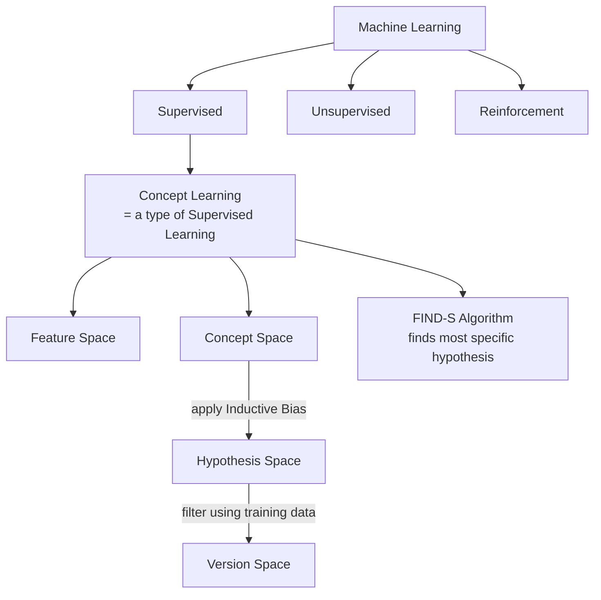

### The whole story in one paragraph:
Machine Learning has 3 main types (Supervised, Unsupervised, 
Reinforcement). Within Supervised Learning, there's a sub-topic called 
"Concept Learning" — where we try to learn a target concept (a rule that 
separates positive from negative examples) using training data. We 
describe data using a Feature Space, and all possible concepts form the 
huge Concept Space. Since searching the whole Concept Space is too 
expensive, we apply an Inductive Bias (an assumption) to shrink it down 
to a manageable Hypothesis Space. Within that Hypothesis Space, the 
Version Space is the subset that's actually consistent with our specific 
training data. FIND-S is a simple algorithm that finds ONE hypothesis 
(the most specific one) by only looking at positive examples.

---
###  FINAL SELF-TEST (do this after studying everything):
1. Explain P, T, E with a new example of your own.
2. Draw the ML pipeline flow from memory.
3. List differences between Supervised, Unsupervised, Reinforcement 
   learning in a table, from memory.
4. Define Regression vs Classification with 1 example each.
5. Explain the 3 key elements of RL.
6. Explain Generative vs Discriminative models with an example.
7. Explain Concept, Feature Space, Concept Space, Hypothesis Space, 
   Inductive Bias, Version Space — in that order, showing how they connect.
8. Write the FIND-S algorithm from memory and solve a numerical problem 
   with a NEW dataset you make up (5 rows, 4 attributes).
9. List all 4 limitations of FIND-S.