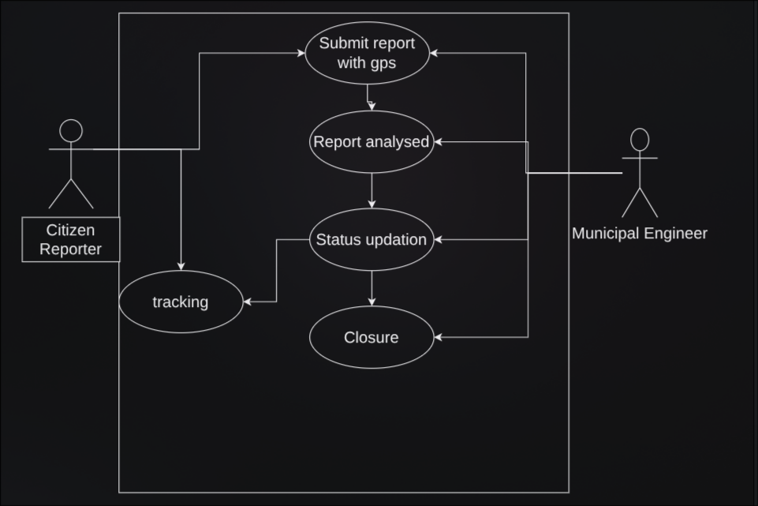

# Use-Case Flow Specification
#### Name: Dharani S
#### SRN: PES2UG24CS157
#### Section: C

## UML Use-Case Diagram

## Use-Case Flow Specification 
**Use Case:** Submit Damage Report
**Primary Actor:** Citizen Reporter
**Secondary Actors:** System (GPS/GIS Service), Municipal Notification Service
**Related Requirements:** FR-001, FR-002, FR-003
**Includes:** Extract GPS Metadata
**Extended by:** Draft Report Offline (when no network connectivity)

## Preconditions
1. The Citizen Reporter has an active account and is logged into the mobile app.
2. Device camera and location (GPS) permissions are enabled.
3. The device has at least one of: (a) active mobile/Wi-Fi network, or (b) sufficient local storage for an offline draft.

## Postconditions
**Success:**
- A new ticket is created with a unique Ticket ID, category, GPS coordinates, photo(s), and a "Submitted" status.
- The ticket is automatically routed to the correct municipal engineering division.
- The Citizen Reporter receives an on-screen and push confirmation with the Ticket ID.

**Failure:**
- No ticket is created, and the citizen is shown a specific error message (e.g., missing location data, unsupported photo format).

---

## Main Success Scenario

| Step | Actor Action / System Response |
|------|--------------------------------|
| 1 | Citizen Reporter opens the app and selects "Report New Issue." |
| 2 | Citizen selects a damage category: Pothole, Streetlight, or Water Leak. |
| 3 | Citizen captures or uploads up to 3 photos of the damage. |
| 4 | System extracts EXIF GPS metadata from the photo(s) **(include: Extract GPS Metadata)** and pins the location on the GIS map. |
| 5 | Citizen reviews the auto-filled location, adjusts the map pin if needed, and adds an optional text description. |
| 6 | Citizen taps "Submit Report." |
| 7 | System validates the submission (category selected, at least one photo, valid GPS coordinates present). |
| 8 | System generates a unique Ticket ID, sets status to "Submitted," and automatically routes the ticket to the relevant municipal division based on category + GPS zone. |
| 9 | System sends a confirmation notification to the Citizen Reporter containing the Ticket ID and expected division. |
| 10 | Use case ends successfully. |

---

## Alternate Flow

### A1: No Network Connectivity at Submission Time
**Trigger:** At Step 6, the device has no active network connection.

| Step | Actor Action / System Response |
|------|--------------------------------|
| 6a.1 | System detects no connectivity and notifies the Citizen: "No connection, report will be saved as a draft." |
| 6a.2 | System saves the report locally, including photos and extracted GPS metadata, with status "Draft: Pending Sync" **(extend: Draft Report Offline)**. |
| 6a.3 | Citizen may continue using the app; the draft remains visible under "My Reports." |
| 6a.4 | When the device regains connectivity, the system automatically syncs the draft to the server. |
| 6a.5 | Flow resumes at Main Success Scenario Step 7 (validation), continuing to Step 10. |

**Resulting Postcondition:** The ticket is eventually created and routed exactly as in the main flow, with an additional timestamp recording the offline drafting period for audit purposes.

---

## Exception Flow (for reference)

### E1: Missing or Corrupted GPS Metadata
**Trigger:** At Step 4, no EXIF GPS metadata can be extracted from the uploaded photo(s).

- System prompts the Citizen to manually drop a pin on the map.
- If the Citizen declines, the report cannot be submitted (see FR-001 acceptance criteria, Fail condition), and the use case ends in failure at Step 7.

