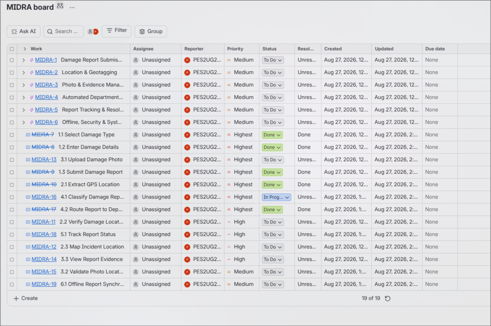
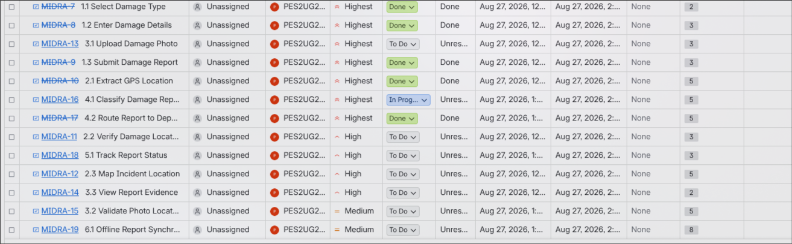
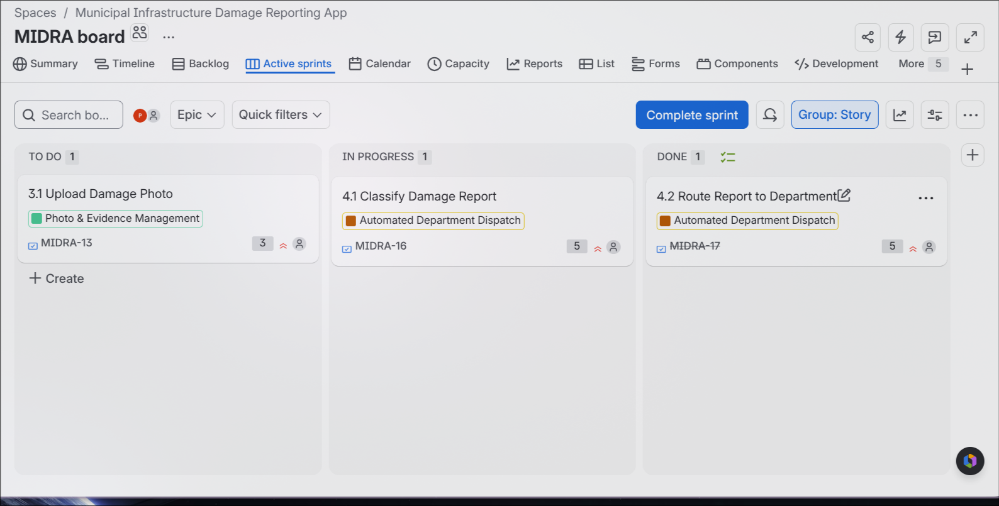
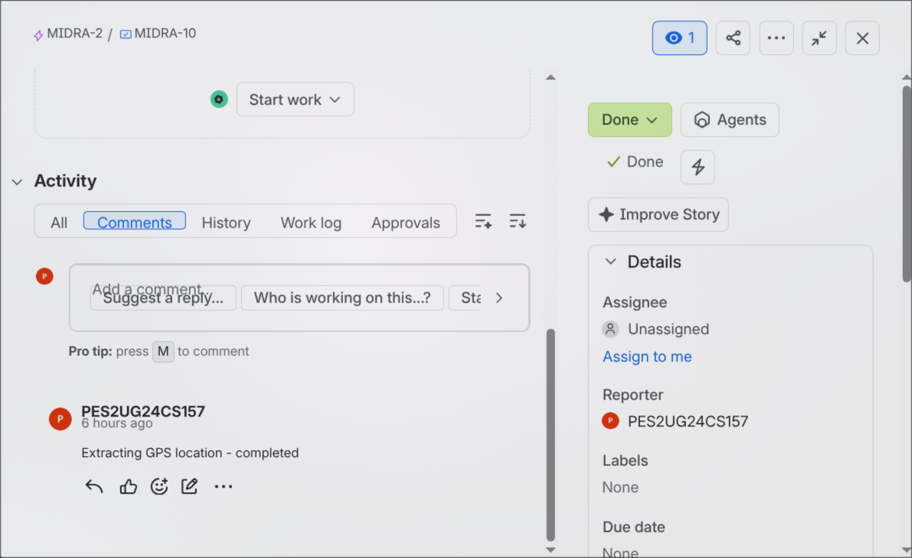
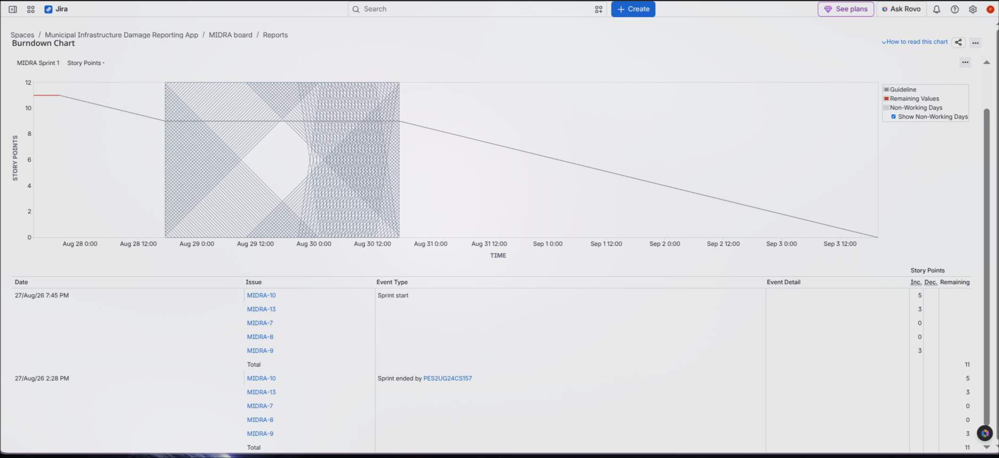
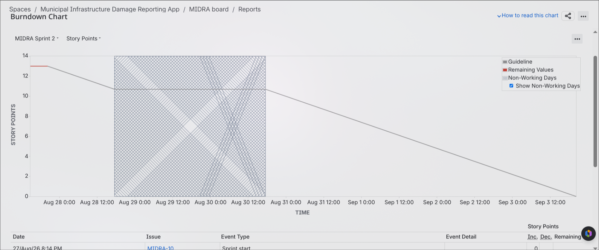

# Running the Jira Agile Backlog & Sprint Simulation Lab

### Name: Dharani S
### SRN: PES2UG24CS157
### Section: C

#### 1. Screenshot of the Backlog view showing all Epics and User Stories 

#### 2. Screenshot showing Story Point assignments 

#### 3. Screenshot of the Sprint board (Active Sprint view) mid-progress, plus evidence of at least one logged comment
##### Active Sprint view of Sprint 3

##### Evidence of logged comment

#### 4. Screenshot of the Burndown Charts

##### Sprint 1

##### Sprint 2

#### 5. Written answers to the 4 reflection questions

##### 1. Did your estimations reflect the actual effort?

Mostly yes. The story points gave a reasonable estimate of relative complexity. Smaller tasks such as selecting a damage type required fewer points, while GPS extraction, location validation, and offline synchronization were more complex and received higher estimates.

##### 2. Was your backlog well-prioritized?

Yes. Core functions such as submitting damage reports, capturing locations, uploading evidence, and routing reports to the correct department were given higher priority because they are essential to the application's main purpose. Supporting features such as offline synchronization were given lower priority.

##### 3. How did your simulated sprint align with your plan?

The sprint followed the planned priority order. The highest-priority stories were picked up first, some were completed, and one story was intentionally left in progress to simulate unfinished work. This demonstrated that the sprint plan was realistic rather than assuming that everything would be completed.

##### 4. What insights did the burndown chart give about your team's capacity?

The burndown chart showed how much work was completed during the sprint and whether the team was progressing toward the planned workload. The unfinished work indicated that the team's capacity was limited, suggesting that future sprints should avoid committing to more story points than the team can realistically complete.
